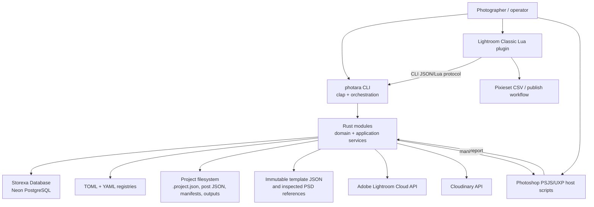
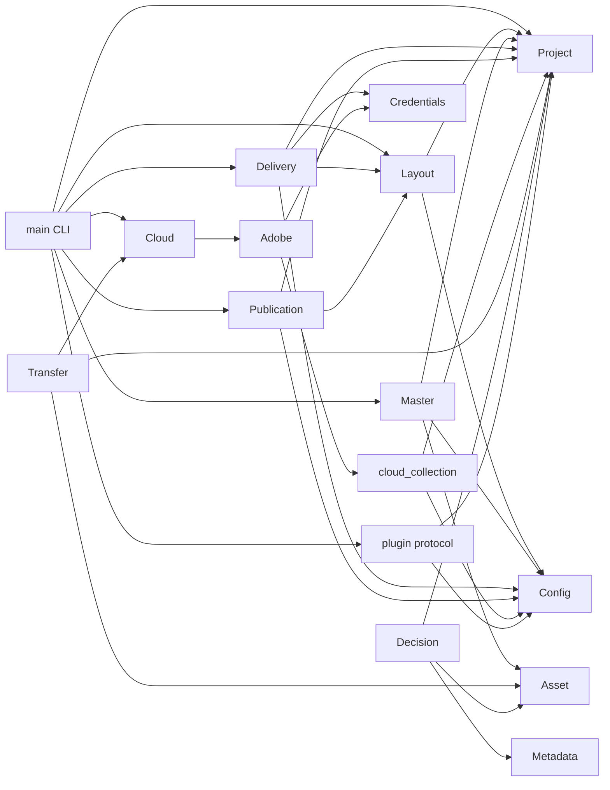
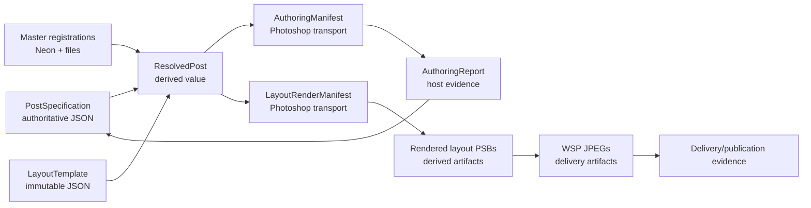

# Current Photara v0.1 architecture

## Scope and evidence

This map is derived from the released Rust modules, 19 SQL migrations,
versioned template JSON, Lightroom Lua adapter, Photoshop scripts, the Red
Meridian regression fixture, and the Sylvan operator evidence. The repository
is a single Cargo package exposing a library and a 2,472-line CLI binary. The
library contains 19,003 lines of Rust; `layout.rs` alone contains 5,289.

## Runtime map

There is no separate application-service layer. Public module functions often
load files, query SQL, validate domain rules, generate a protocol document, and
write it to disk in one call. The CLI mostly wires arguments to those functions
but also owns connection setup, project lookup, progress rendering, and output
serialization.

The principal compile-time dependencies visible in `use crate::...` and public
function signatures are:

There is also a small provider-layer cycle in concepts: `cloud.rs` consumes
`AdobeInventory`, while `adobe.rs` imports the Adobe provider constant and
cloud-collection plan types. This is a sign that provider-neutral inventory
values and provider adapters should be separated before nodes consume them.

## Authority map

| State | Current authority | Notes |
| --- | --- | --- |
| Project identity and membership | Neon `projects`, `project_people`, `project_assets` | `.project.json` is a guarded filesystem projection/snapshot. |
| People, location, scene definitions | YAML registries | Project rows retain JSON snapshots. |
| Asset identity and representation lineage | Neon `assets`, `asset_files`, `asset_file_origins` | SHA-256 plus portable logical location; one current authority per representation. |
| Photographer Final and history | Neon decision tables | Current state plus append-only event history. |
| Layered and flattened master state | Neon master tables plus verified files | Files are authoritative representations; DB records identity, contract, fingerprint, and workflow state. |
| Editorial order and placement transforms | Project `posts/<platform>/<name>.json` | `PostSpecification`; platform is embedded in identity and path. |
| Reusable layout geometry | Immutable versioned template JSON | Installed cache is verified byte-for-byte. Reference PSDs are separately fingerprinted. |
| Lightroom catalog projection | Lightroom catalog | Rust produces plans; Lua performs supported catalog mutations. Photara DB/files remain authoritative for workflow truth. |
| Provider presence and receipts | Neon evidence/inventory/transfer/publication/delivery tables | Provider observations are snapshot evidence, not inferred from filenames. |
| Host handoffs | Generated manifests and reports | Derived transport documents; reports are revalidated by Rust before state transitions. |
| WSP JPEG originals | Project exports until backed up; Cloudinary exact-original copy | Delivery manifest binds source bytes to provider identity. |

## Rust module responsibility classification

| Module | Primary responsibilities | Classification | Mixing / seam |
| --- | --- | --- | --- |
| `asset.rs` | Camera identity, original registration, representation naming | domain, persistence, validation | Domain identity and SQL are coupled. |
| `config.rs` | Environment roots, TOML settings, YAML registries, registry writes | configuration, persistence, validation | File storage and registry domain share one module. |
| `credentials.rs` | Provider/account-scoped secret IDs and macOS keychain adapter | infrastructure, credentials | Trait is a useful seam; concrete system store is selected directly by providers. |
| `error.rs` | Shared error taxonomy and filesystem context | domain support, diagnostics | Human strings lack stable diagnostic codes/context paths needed by node UI. |
| `lib.rs` | Module export surface and shared result/error exports | package facade | Exposes storage/provider-heavy modules directly rather than a narrow application facade. |
| `project.rs` | Project validation, SQL records, directory tree, `.project.json` recovery | domain, orchestration, persistence | Strong application-service seam; DB and NAS transaction are coordinated manually. |
| `metadata.rs` | Lightroom metadata and collection reconciliation plan | domain, protocol | Good mostly-pure planning seam. |
| `selection.rs` | Pixieset CSV parsing, evidence persistence, selection plan | provider, domain, persistence | Provider parsing and selection domain are combined. |
| `decision.rs` | Photographer Final mutations/history and invalidation | domain, persistence, orchestration | Candidate command service once repositories exist. |
| `cloud.rs` | Legacy evidence import, Adobe inventory reconciliation, presence status | provider, persistence, orchestration | Knows Adobe payload shape and SQL ledger. |
| `cloud_collection.rs` | Semantic collection projection and sync evidence | domain planning, persistence | `CloudCollectionPlan` is a useful plan/value seam. |
| `transfer.rs` | DNG plan, reservation, export protocol, upload state, verification, cleanup | orchestration, protocol, persistence, filesystem | Large state machine coupled directly to SQL and staging paths. |
| `withdrawal.rs` | Manual/provider withdrawal state machine | orchestration, persistence, provider state | Useful explicit plan/execute/verify pattern. |
| `adobe.rs` | OAuth, credentials, HTTP API, inventory/upload/album execution | provider integration, credentials, local callback host | Provider client and command-oriented reports are mixed. |
| `master.rs` | Master planning, Photoshop handoffs, file inspection, promotion, catalog plan, flattening, refresh | domain, orchestration, protocol, persistence, host integration, filesystem | Major future boundary; file-format readers and workflow state machine sit together. |
| `layout.rs` | Templates, post editing, transforms, DB resolution, authoring, image metadata parsing, rendering protocol, file I/O | domain, orchestration, protocol, persistence, host integration, validation | Largest coupling concentration and first extraction target. |
| `delivery.rs` | Delivery resolution, JPEG parsing, Cloudinary auth/API, manifests, SQL evidence | provider, orchestration, protocol, persistence | Generic delivery concepts are coupled to Cloudinary and `PostPlatform`. |
| `publication.rs` | Manual publication validation and evidence | domain, persistence | Small, coherent, but platform identity is hard-coded. |
| `plugin.rs` | Lightroom context projection and JSON-to-Lua serialization | protocol, host integration | Serialization can be a shared adapter; context query is application logic. |
| `persistence.rs` | Development DB connection and migrations | infrastructure | Small clean seam, but only a development connection policy exists. |
| `main.rs` | CLI schema, service wiring, DB lifetime, progress, serialization | CLI, orchestration | Too much repeated setup/project lookup; no reusable facade for a GUI. |

## Layout subsystem: actual responsibilities

`layout.rs` contains at least eight separable concerns:

1. **Template model and installation** — `LayoutTemplate`, `TemplateSlot`,
   immutable embedded JSON, reference-document verification.
2. **Editorial source model** — `PostSpecification`, `PostItem`,
   `PostPlacement`, `PlacementTransform`, `FocalPoint`.
3. **Draft editing commands** — initialize, add item kinds, set fit/transform,
   reorder, schema upgrade, guarded atomic writes.
4. **Asset/master repository queries** — resolve a placement to camera RAW,
   layered PSB, HDR TIFF, and SDR TIFF from Neon.
5. **Resolution and validation** — template selection, normalized-to-pixel
   geometry, source dimensions, readiness, frame count, crop validation.
6. **Human authoring protocol** — Photoshop authoring manifests/reports,
   dual-platform sessions, fingerprints, apply semantics.
7. **Photoshop materialization protocol** — `LayoutRenderManifest`, comparison
   contracts, edit-source handoffs, report locations, script installation.
8. **Low-level I/O** — TIFF/PSB metadata inspection, EXIF extraction, hashing,
   path resolution, canonical JSON, atomic writes.

These responsibilities explain the size better than “layout code is complex.”
They also provide the extraction order: model, repositories, resolver, then
host protocols.

## Current layout value lineage

### Type classification

| Type | Current role | Future disposition |
| --- | --- | --- |
| `LayoutTemplate`, `TemplateSlot`, `NormalizedRect` | Reusable geometry and host contract | Keep concept; split geometry from Photoshop/WSP materialization metadata. |
| `PostSpecification` | Authoritative platform-owned editorial document | Preserve v1 adapter; evolve concept into a platform-neutral Layout node authored document. |
| `PostItem`, `PostPlacement` | Ordered composition and asset assignment | Keep concepts under generic layout vocabulary. |
| `PlacementTransform`, `FocalPoint` | Normalized authored framing | Keep as fundamental SDK/core value; transforms remain node-instance scoped. |
| `PlatformProfile` | Hard-coded canvas and frame limits | Replace with `CanvasProfile` plus downstream destination policy. |
| `ResolvedPost` / `Resolved*` | Joined, validated, pixel-resolved derived plan | Becomes a versioned `ResolvedLayoutPlan` node value. |
| `AuthoringManifest` / `AuthoringReport` | Photoshop-based creative crop transport | Retain only as v0.1 compatibility adapter; disappear from the normal GUI workflow. |
| `LayoutRenderManifest` / placement | Photoshop execution transport | Evolve into host-neutral materialization request plus Photoshop protocol adapter. |
| `EditSourceManifest` / reports | Lightroom-specific preparation protocol | Remain provider/host protocol, referenced by advanced template capabilities. |
| `PanoramaCropHandoff` / report | Specialized Photoshop authoring protocol | Eventually absorbed by Layout inspector; retain compatibility until panorama authoring is supported. |

## Platform coupling inventory

`PostPlatform` currently controls more than destination naming:

- post filesystem directory and serialized identity;
- hard-coded 4500×6000 versus 4500×8000 canvas;
- generic render readiness and frame-count limits;
- default `grid-four` template choice;
- dual-platform authoring shape and labels;
- edit-comparison preparation selection;
- delivery export path and filename parsing;
- Cloudinary batch identity/foldering; and
- manual publication provider identity.

Only the last four concerns are inherently downstream. Canvas and template
choice belong to layout configuration. A frame maximum belongs to a publishing
destination policy. Filesystem layout is a compatibility/storage concern.

## Host integrations

### Lightroom Classic

The Lua plug-in invokes the CLI through `/bin/zsh`, asks it for Lua-serialized
plans, and performs catalog operations that only Lightroom can perform. It
contains substantial host-specific orchestration: dialogs, project selection,
keyword/collection creation, smart-collection rules, plugin metadata,
catalog-wide lookup, DNG export, temporary Develop changes, and restoration.
Core still owns the important plans and verification gates, but progress and
workflow sequencing are duplicated in Lua.

The desired policy is already mostly visible: Rust says *what* membership or
export is valid; Lua says *how* to mutate Lightroom. Future work should replace
shell-string protocol and duplicated lifecycle handling with a versioned host
bridge, not move Lightroom catalog APIs into Core.

### Photoshop

The scripts consume JSON manifests and emit JSON reports. Core verifies source
hashes, dimensions, bit depth, profiles, item identity, and report ownership.
The scripts nevertheless contain nontrivial rendering behavior: fill/contain,
crop/rotation application, layer placement, comparison-template editing,
document contract validation, and saving.

That is acceptable host implementation logic when driven by a complete Core
plan. Creative crop selection is the exception: Author/Capture scripts make
Photoshop a human-authoring surface. The first node GUI should move that choice
into the Layout inspector while leaving deterministic Photoshop operations in
the host adapter.

## Existing architectural seams worth preserving

- Stable asset UUID plus representation file UUID, logical location, SHA-256,
  and byte size already form semantic references richer than paths.
- Plan/manifest/report workflows separate intent from irreversible host work.
- Source/specification fingerprints reject stale or cross-session reports.
- Immutable template versions and reference hashes are already content
  addressed in practice.
- Current/removed authority constraints and append-only events preserve
  lineage rather than overwriting history.
- Provider inventories are explicit snapshots and transfers are state machines.
- Core validates host output instead of trusting script success.
- The CLI serializes structured output and can remain a durable client.

## Biggest coupling problems

1. `layout.rs` combines model, persistence, image inspection, application
   services, and two Photoshop protocols.
2. `PostPlatform` conflates layout canvas, preset, delivery rules, storage
   namespace, and publication destination.
3. Public module functions accept `Database`, `PhotaraConfig`, filesystem paths,
   and host assumptions directly, preventing a GUI from using a narrow stable
   application API.
4. The current `LayoutTemplate` embeds a `WspContract`, so reusable geometry is
   not independent of one materialization/export pipeline.
5. Node-like plans exist but lack common identity, port typing, lifecycle,
   cache semantics, and diagnostics.
6. Host protocols use project-root file discovery and fixed filenames; this is
   safe enough for v0.1 but awkward for concurrent node executions.
7. Repeated hashing is correct but not represented as reusable evaluation
   evidence, so expensive verification can recur even when inputs are stable.
8. `main.rs` is a second orchestration layer rather than a thin client of an
   application facade.
