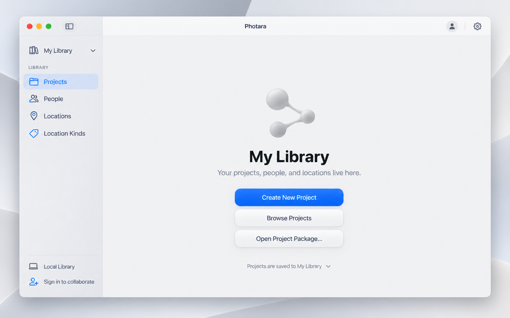

# CXT4 onboarding, opening Library shell, and first Account

Approved direction recorded 2026-09-13. This is the bounded sequence from the
empty Generation Two Neon schema to the first real Photara Cloud Account. It
supersedes any plan to insert a developer Account or Library seed manually.

The objective is not merely to make Google sign-in return a token. The acceptance
result is a native first-launch experience that proves exact identity, local/cloud
Library reconciliation, security boundaries, retries, and returning-user behavior.

## Current starting point

- CXT3b opens a real local SQLite database and has already created one local
  `My Library` plus a stable local device/controller identity.
- CXT3c implements the Storexa-backed PostgreSQL service controllers, checked
  migrations, RLS, and fake identity/media/sync boundaries. `FakeAuth0` is test
  infrastructure, not a production verifier or login implementation.
- CXT3d installed the empty Generation Two schema and non-login capability roles
  on Neon `main`. No Account, Identity, Device, Library, or Project is present.
- There is no deployed network service, runtime LOGIN credential, approved
  service-host secret store, production Auth0 verifier, or native PKCE flow.

## CXT4a — onboarding and security contract

**Recommended owner:** Astra High, because this crosses authentication, service
deployment, PostgreSQL authorization, local/cloud reconciliation, and native app
security. Stop for user review before implementation.

1. Audit Chordrift's Auth0/Google implementation as read-only reference. Record
   reusable patterns and rejected assumptions; never copy credentials, identifiers,
   product-specific claims, or legacy persistence blindly.
2. Freeze the Auth0 native application contract: tenant/issuer, audience, native
   callback, Authorization Code + PKCE, browser session, token refresh, logout,
   Keychain ownership, cancellation, expiry, and account-switch behavior.
3. Freeze the service trust boundary and hosting requirements. The macOS app may
   hold user tokens but never a Neon connection string or privileged database
   credential. Runtime LOGIN roles and provider secrets exist only in approved
   service-host secret storage.
4. Freeze one idempotent bootstrap protocol for verified `(issuer, subject)` →
   Account, Identity, Device, Library ownership/membership, contract state, and
   empty scoped stream. Email and display name are profile attributes, never
   identity keys.
5. Specify exact replay, collision, unknown-outcome, disabled identity/device,
   returning-user, logout, and provider/network failure semantics.
6. Specify reconciliation for the existing CXT3b local `My Library`. A successful
   cloud bootstrap binds or claims it without creating a second local Library;
   partial local/cloud success must be recoverable and idempotent.
7. Define local-only first launch. It must remain fully usable without Auth0 and
   must offer later cloud enrollment without changing Project/Library identity.

**Gate:** user approves the threat model, endpoint/DTO state machine, identity
coordinates, hosting/secret boundary, reconciliation algorithm, and test matrix.

## CXT4b — minimal cloud service

1. Provision three separate runtime LOGIN identities behind the existing
   `photara_api`, `photara_control`, and `photara_auth_read` capability roles.
   They must not inherit the migration owner, one another, superuser, CREATEROLE,
   or BYPASSRLS.
2. Store runtime database and Auth0 configuration only in the selected service
   host's encrypted secret storage. Keep migration-owner credentials offline from
   runtime configuration.
3. Deploy the smallest service boundary needed for onboarding: health/schema
   compatibility, verified identity resolution, bootstrap/recovery, logout/device
   state as approved, and no generic SQL or broad CRUD surface.
4. Replace the test fake at the deployed boundary with signature-verified Auth0
   claims and exact issuer/audience/subject/expiry checks.
5. Prove unauthorized, wrong-audience, expired, replayed, duplicate, partial,
   concurrent, and lost-response cases against disposable infrastructure before
   the one controlled Neon smoke test.

**Gate:** an authenticated service test can create and recover the exact bootstrap
aggregate without exposing Neon credentials to a client. Do not create Suhail's
real Account through a developer seed or command-line shortcut.

## CXT4c — native opening Library shell

Implement the approved opening hierarchy before embedding the real login flow.
This slice uses fake onboarding states only and must not contact Auth0 or Neon.

### System-owned macOS presentation

- Use `NavigationSplitView` for the window hierarchy.
- Use a native `List` with `.listStyle(.sidebar)` for Library navigation.
- Use system titlebar/toolbar APIs and the unified toolbar style.
- Use native sidebar visibility, View → Show/Hide Sidebar commands, resize and
  collapse behavior, SF Symbols, accessibility, and the user's system accent.
- Let macOS own sidebar material, vibrancy, blur, selection shape, row height,
  icon sizing, toolbar control material, and OS-version transitions. Do not draw
  a Tahoe-looking sidebar or freeze it into Photara theme tokens.

This is why a future macOS appearance change should flow into Photara through the
platform controls. Compatibility fixes may still be required, but the sidebar is
not a custom surface that Photara redesigns for each release.

### Photara-owned information and surfaces

- Center `Photara` in the unified titlebar; expose native account and settings
  destinations without replacing system control presentation.
- The Library selector shows `My Library`, supports loading another accessible
  Library, and communicates whether the current Library is local or cloud-backed.
- The sidebar destinations are `Projects`, `People`, `Locations`, and
  `Location Kinds`. Do not repeat these as unrelated titlebar buttons.
- The empty Projects destination offers `Create New Project`, `Browse Projects`,
  and `Open Project Package…`, and states that projects are saved to the current
  Library.
- Collaboration belongs to Library scope. Local state offers `Sign in to
  collaborate`; cloud state offers the approved invite/manage-access action.
- Avoid critical actions only at the bottom edge; every such action must also be
  available through a native menu, toolbar, or contextual destination.

### Neutral hierarchy ladder

1. macOS window, toolbar, and sidebar: system owned and not theme-authored.
2. Library content: Photara's first neutral surface token.
3. Project/Graph surfaces: the next neutral token.
4. Node-owned Work Surfaces and their composed Browsers: contextual neutral token.
5. Photograph reference surfaces: reset to a color-neutral viewing environment so
   accumulated hierarchy tint never biases image judgment.

In Light appearance, Photara-authored levels proceed from brighter to subtly darker
neutral grays; Dark appearance reverses the luminance direction. Hierarchy uses
tonal steps, spacing, material, and restrained elevation—not persistent divider
or gutter lines. Accent color is reserved for system selection, actions, status,
and meaningful icons.

The Shell Lab may author content ordering, labels, behavior, default/minimum/maximum
sidebar width, Photara-owned neutral tokens, and opening-state copy. It must not
offer custom sidebar background, blur, shadow, row-height, selection-shape, icon-
size, or toolbar-material controls.

### UI approval and verification

Before production edits, render and approve Light and Dark states for:

- local-only empty `My Library`;
- cloud sign-in offered;
- authenticating/bootstrap progress;
- cancelled or offline continuation;
- recoverable Auth0/service failure;
- signed-in empty cloud Library;
- returning user; and
- sidebar shown, collapsed, and narrow-window behavior.

The current Light image is a hierarchy concept, not a pixel specification for the
system sidebar:

**Gate:** approved state mockups; production and Shell Lab use the same opening
sources; native behavior, keyboard/menu access, accessibility, persistence, and
Light/Dark snapshots pass.

## CXT4d — native Auth0 onboarding integration

1. Add explicit `Local` and `Photara Cloud` paths to the opening state without
   turning local use into a second-class or blocked experience.
2. Implement the approved native Authorization Code + PKCE browser flow and
   callback handling; keep tokens in Keychain, never preferences or logs.
3. Call the minimal service bootstrap and reconcile the returned Account, Device,
   and Library coordinates with the existing local `My Library` transactionally.
4. Drive the exact opening-shell states for progress, cancellation, offline
   continuation, retry, account switch, logout, and returning users.
5. Preserve the system-owned sidebar and toolbar appearance across all states.

**Gate:** a real sign-in reaches a stable cloud-backed `My Library`, restart and
retry are idempotent, and local-only operation remains usable.

## CXT4e — first-Account acceptance

Perform the first real product-path signup/sign-in through Photara, then verify:

1. exactly one active Account and exact Auth0 Identity mapping;
2. exactly one registered Device for this installation;
3. exactly one cloud `My Library`, owner membership, contract state, and empty
   scoped stream linked to the existing local Library;
4. no Project until the user chooses `Create New Project`;
5. restart and repeated sign-in create no duplicates;
6. logout, offline launch, cancellation, and recoverable failure behave as approved;
7. database/RLS checks pass without using a privileged credential from the app.

Stop after the empty Library is visible and verified. Creating the first Project
is the next separately authorized product slice.
