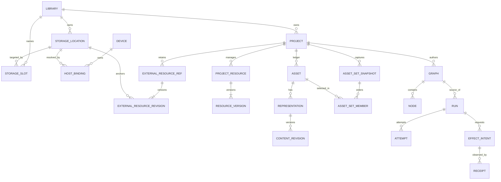

# D19 accepted contract freeze — CXT0/CXT2

Status: **R2–R8 accepted; R1 physical naming superseded by Suhail on 2026-09-12.**
This document and [the static schema delta](D19_STATIC_SCHEMA_DELTA.md) are the
accepted exact contract. CXT2 produced [separated inert DDL and inventory](proposals/d19-cxt2/README.md).
“Must” specifies accepted design, not permission to start implementation.
[CXT1a pure Rust contracts](CXT1A_CONTRACTS.md) were separately selected and completed
on 2026-09-12. Subsequently selected [CXT1b](CXT1B_CONTEXT_CONTRACTS.md) is also
complete. CXT3a is verified; the separately authorized clean Library rebaseline
precedes CXT3b/c and the future Project vertical slice.

Precedence: recorded approvals in [S7](SCHEMA_REVIEW.md), then approved
[D19](LIBRARY_AND_NODE_WORK_SURFACES.md), then this accepted exact freeze for detailed
contracts. [D18](TYPED_CONTEXT_AND_EXPRESSIONS.md) supplies the expression grammar
and policies except the explicit refinements here. S2–S6 SQL/JSON examples and
L1/L2 sources and S2–S6 fixtures have a separately verified Library naming
rebaseline. Their earlier preservation claims describe historical slice boundaries,
not a requirement to retain unshipped naming.

## Decisions and approval boundary

| ID | Accepted decision — all R1–R8, 2026-09-12 | Implementation gate |
| --- | --- | --- |
| R1 — superseded naming | Use LibraryId/libraries/library_id throughout the unshipped Generation Two baseline; no rename migration, runtime naming adapter, alias, shadow column or dual write. Preserve explicit one-Library association and package reader floors. Historical v0.1.3 import is optional and non-gating. | Clean rebaseline before separately selected CXT3b; no live database rewrite |
| R2 | Restricted by default; explicit Project grants with independent edit/run actions; library-visible role masks; explicit deny on Project revocation; no Library-admin content bypass; invitation and offline rules below | CXT1 permission model; CXT3 local/service conformance |
| R3 | Distinct stable slot, logical location, external reference, host binding and lease identities; pinned slot captures; verified rebind; managed artifact root only via publisher | CXT1 resource contracts; CXT3 fake host/codec adapters |
| R4 | AssetSet v2 immutable snapshots and bounded pages; no AssetSet, live handle or workflow-output variable, including nested values; explicit metadata/group dependencies | CXT1 values/cache; CXT3 package closure |
| R5 | Adopt D18 one-CAS variables, ID-bound AST, limits, privacy/refresh and post-success single-authority apply, with refinements below | Revised CXT1 then CXT3; package apply waits for L3 |
| R6 | NodeSDK manifest v2 with mandatory Inspector, independent execution/capability/cache/presentation/version axes; exact fallback and explicit migrations | CXT1 validation; CXT3 DTO/codec tests |
| R7 | Additive physical inventory and sync v2 scoped channels, permission predicates and media/receipt rules in the companion; preserve v1 sealed history and reject unsafe downgrade | CXT2 acceptance, then separately authorized CXT3 |
| R8 | Approve the bounded implementation slices and verification gates in the companion; approval of this design alone starts no code or migrations | Separate scope selection after review |

Already approved: one Library per Project, local My Library without sign-in,
package/workflow authority versus Library/catalog/access/sync authority, explicit
ports, host-only secrets/paths, ordinary Node packages, required Inspector and
optional Work Surface, no implicit asset union, immutable effect evidence,
single-writer package publication, no cross-store atomicity. Deferred: Library
transfer, remote execution, grant leases, inter-Graph execution, node commerce,
provider implementations, platform UI, large unbounded queries and export runtime.

## Identity, cardinality and lifecycle

All new semantic IDs are distinct nonnil UUID types, lowercase hyphenated on
wire. ID reuse across kinds is not a coercion. Content digests never replace
entity IDs. Immutable owned coordinates cannot change on ordinary update.
Library aggregates use positive i64 local revisions and opaque `sr1:` server
revisions; package revisions retain canonical u64 decimal strings. These domains
are never compared. Mutable roots use CAS, creation time and update time;
retirement retains identity. No automatic hard delete, name reuse or GC.

| Entity | Owner and cardinality | Lifecycle and invariant |
| --- | --- | --- |
| LibraryId | One Library; zero or more Projects, locations, slots, variables; zero Accounts for local-only | active → tombstoned; rename/claim preserves UUID; join uses the other Library's UUID |
| ProjectId | Exactly one owning Library once associated; one package authority, zero or more catalog observations | active/archived is package lifecycle; access registration and availability are separate; transfer deferred |
| StorageLocationId | Exactly one Library; zero or more slots and referenced resources | active → tombstoned; immutable storage kind/provider coordinate; changing backend identity creates a new location |
| StorageSlotId | Exactly one Library; one active target StorageLocationId in that Library | active → tombstoned; target change is explicit CAS; names including old names reserved forever in v1 |
| HostBindingId | One device and one logical location; zero or more candidates per device/location | candidate → verified → retired; verification can become stale/denied/unavailable without deletion; at most one selected candidate |
| ExternalResourceRefId | Exactly one Project; zero or more immutable ExternalResourceRevisionIds | Current selection changes only by authored command; historical revisions retained; not a device binding ID |
| ExternalResourceRevisionId | One ExternalResourceRefId; exactly one logical location + filesystem components OR provider object coordinate | Immutable coordinate and version evidence; relocate resource within a root creates a new reference revision, not new AssetId |
| ProjectResourceId | One Project; one or more immutable ResourceVersionIds | Package-managed bytes; each version names exactly one blob ObjectRef; removal retires current usage only |
| MaterializedHandleId | One host operation/attempt and one resolved resource revision | Live lease → released/revoked/expired; cannot serialize, sync, persist in variables or authorize another operation |
| AssetId | One Project's private ledger; zero or more representations | Identity independent of paths/content; ledger retirement cannot remove retained dependencies |
| AssetRepresentationId | Exactly one Asset; zero or more immutable content revisions | Captured content revision mandatory for use; unresolved import can have none |
| AssetSetSnapshotId | One Project and one immutable ordered membership snapshot | No mutation; any changed membership/order/selected revision/metadata projection creates a new snapshot |
| VariableId / VariableValueId | One immutable Library, Project, Graph or Node ScopeRef; zero or one current value per definition | Definition/default/value are one CAS aggregate; value replacement retains value ID; tombstone keeps claims |
| ContextSnapshotId / RunOverrideId | One Project capture; zero or more Runs may reference it; explicit owner and source facts | Immutable; capture is disclosure of bounded facts, not a live read grant |
| OperationId | One authority boundary and immutable intended request | Request/idempotency bytes fixed before execution; no terminal “unknown means failed” shortcut |
| ReceiptId | Exactly one OperationId; zero or more observations per operation, optionally observing AttemptId | Immutable; reconciliation appends a new receipt; contradictions yield disputed knowledge |

A locator remains a candidate location for a **package**, separate from a resource
reference within a workflow. Several locators can point to the same ProjectId;
one nominated writable copy is selected only after identity/lineage verification.
Foreign Library snapshots remain historical facts with their original source
LibraryId. They never establish another owning Library or a query grant.

The diagram omits unions: a content revision binds exactly one managed resource
version or external resource revision; a materialized handle is device state,
not a package edge. Empty AssetSets and empty Graphs are valid.

## Authority and disclosure matrix

| State | Canonical authority | Package | Local SQLite | Service/sync/export |
| --- | --- | --- | --- | --- |
| Library records, logical locations/slots/Library variables | Local-only Library, or accepted service base plus local pending intent | Only explicit bounded captures | Durable typed roots | Authorized typed records; export omits access state |
| Project owner association | Package authored root, reconciled with unique Library access registration | Required LibraryId in new schema | Registration/verified projection | Access registration is authorization authority; cannot edit package owner |
| Project policy/grants/invitations | Local controller for local-only; service for cloud | Never executable authority; no grant list/token | Local authority or bounded cached service result, explicitly tagged | Current authorization/control, not ordinary shared Library data |
| Project/Graph/Node variables, ledger, explicit saved inputs | Verified package authored commit | Authoritative | Only commit-qualified projections | No editable SQL mirror or ordinary Library sync |
| Run snapshots, metadata evidence, intents/receipts | Verified package history; pending device recovery until publication | Immutable history | Durable recovery copy or disposable index | No default history upload; service acceptance receipt is a different fact |
| Host bindings, paths, bookmarks, secrets | Device and secure provider/OS stores | Excluded | Paths/opaque secure refs in device-only tables; secret bytes excluded | Excluded, including exports and error payloads |
| Materialized handles, TEMP leases, proxy files | Host operation/cache | Excluded unless deliberately promoted as managed bytes | Private transient state | Excluded |

No automatic package transfer is implied by changing a catalog row. A disagreement
between embedded owner and registration is `association-conflict`, blocks writes,
and preserves both observations. Project-only clients may hold a minimal Library
header for their Project scope; it is not membership or a synchronized directory.

## Library and Project authorization

Action bits for `photara.access-actions.v1` are: discover=1, read=2, edit=4,
run=8, invite=16, manage-storage=32, manage-context=64, manage-access=128.
An action mask is an integer 0..255. `read` requires discover; every other
Project action requires both discover and read. `manage-access` additionally
requires invite. No action implies run merely because it permits editing.

The Library matrix governs Library-wide operations. “Conditional” means apply
the Project matrix, never traverse a membership bypass.

| Library role | Library discover/read | Edit Library records | Run Project | Invite Library members | Manage Library storage | Manage Library context | Project discover/read/edit/invite |
| --- | --- | --- | --- | --- | --- | --- | --- |
| owner | Yes | Yes | Conditional | All roles, preserve active owner | Yes | Yes, including restricted variables | Conditional |
| admin | Yes | Yes | Conditional | Non-owner roles | Yes | Yes, including restricted variables | Conditional |
| editor | Yes | Yes | Conditional | No | No | Ordinary/personal definitions and values | Conditional |
| viewer | Yes | No | Conditional | No | No | Read ordinary/permitted personal captures only | Conditional |
| no membership | No directory/catalog enumeration | No | Conditional | No | No | No Library resolution | Explicit Project grant only |

Local-only controller has owner-equivalent Library actions without manufacturing
an Account or Membership. It creates the initial Project manager record as a
local-principal grant; cloud claim explicitly maps that principal to the claimant
in a reviewed claim command. An arbitrary copied DeviceId is not a principal.

Project presets are conveniences for exact masks; persisted grants use the mask,
not a role name that could silently acquire future rights.

| Project preset | Discover | Read | Edit | Run | Invite | Manage storage | Manage context | Manage access | Mask |
| --- | --- | --- | --- | --- | --- | --- | --- | --- | --- |
| discoverer | Yes | No | No | No | No | No | No | No | 1 |
| reader | Yes | Yes | No | No | No | No | No | No | 3 |
| author | Yes | Yes | Yes | No | No | No | Yes | No | 71 |
| runner | Yes | Yes | No | Yes | No | No | No | No | 11 |
| author-runner | Yes | Yes | Yes | Yes | No | No | Yes | No | 79 |
| manager | Yes | Yes | Yes | Yes | Yes | Yes | Yes | Yes | 255 |

Discover exposes only ProjectId, owning Library header and availability of a
request-access action. Title, cover, counts, parties, locations, Graph names,
locators and receipts require read. Project edit permits metadata/Graph commands;
variable definitions, captures and assignments additionally require manage-context.
Manage storage concerns that Project's portable locator/publication intentions;
it cannot edit a Library Storage Location or another user's host binding. Host
binding selection always also requires current device permission. Run permits
execution and its evidence publication, not authored Graph/default-variable edits.
A variable apply needs manage-context and edit in the target scope. Effect run
also requires its separate host/provider grants and declared operation bounds.

New Projects default to **restricted**, with an explicit manager grant to their
creator in the registration transaction. At least one active manager principal
must remain for an active registration. A Library administrator can administer
Library membership/billing but cannot read, grant themselves access to, or silently
recover a restricted Project. An orphan manager requires a separately reviewed
recovery/closure process; there is no hidden superuser product action.

For **library-visible**, the manager explicitly saves four masks, one for each
Library role. Recommended initial masks are 3 for all four roles. Each may be
0, 1, 3, 71, 11 or 79, never invite/manage-storage/manage-access. Choosing this
policy is an explicit publication of member access; membership alone chooses
nothing. Restricted requires all four masks=0.

Effective access, evaluated under current authority:

1. Disabled Account/identity, closed Library/Project registration, or explicit
   revoked Project grant denies every protected action.
2. Otherwise union the active explicit grant mask and, only for library-visible,
   the mask for an active Library membership. Check action prerequisites.
3. Restrict by current operation-specific context/privacy and host grants. Node
   declarations can narrow this intersection, never enlarge it.

Exactly one retained grant per `(LibraryId, ProjectId, principal)`; explicit
revocation is a deny overriding inherited access. Regrant is an explicit CAS
transition of that same row to active, with a new revision and audit record.
“Remove override and inherit” is a separate manager command setting active mask=0;
it is not Revocation. Library membership revocation removes inherited rights;
independent explicit Project grants remain. A distinct **remove all access**
controller command enumerates and revokes all explicit grants too. Its impact
preview must make this distinction visible. Library owner/account disable
invariants apply to Project managers as well; no command silently orphans them.

Invitations: InvitationId, Project/Library, inviter, exact target AccountId,
proposed mask, policy revision, expiry, and `pending → accepted | declined |
revoked | expired`. Pending invitations grant nothing. Target must already have
an authenticated Account; email-only invitations/account creation are deferred.
The controller issues a one-time opaque token, stores only its verifier in private
service state, and never places it in packages/shared feeds. Expiry is seven days
maximum (may be shorter). Acceptance locks current actor and inviter identities,
Library and Project access state, verifies target/token/expiry, current inviter
invite authority and mask containment, then changes grant + invitation + audit
atomically. Only manage-access can invite a manager or override an explicit deny;
invite alone may offer only a subset of its current rights, excluding
manage-access. Repeat acceptance by the same target/request is idempotent;
changed token/request/actor cannot disclose the earlier result. Library invitations
reuse the controller pattern with the Library role ceiling above; they are not
Project invitations or Library mutation commands. No invitation is sent by this task.

### Author, runner, service and offline truth

Library invitations use the same identity/role ceiling only in a separately
selected controller slice; CXT3 does not implement Library invitation delivery.
Project invitation contracts above are the concrete scoped schema in this packet.

The author may browse only current authorized Library facts. Capturing selected
fields is a Project command after an independently successful Library edit; one
can succeed while the other fails. Project-only collaborators can reuse bounded
saved assignments and captures; a typed ID never unlocks the source directory.

A runner executes an exact graph/source snapshot. The host preflights current
Project run rights and each declared context selector/resource/effect. The Node
receives only ports and its frozen permitted subset. It cannot inherit the
original author's broader membership. Service identity/control authority is
not node execution authority; remote runners and delegated service execution
remain deferred. The service validates stored ASTs as data, never evaluates them.

Local-only work remains offline. For cloud-associated Projects, cached access is
**last observed**, not current remote authority. Offline read of possessed bytes,
draft edits and pure preview/replay using already permitted captures are allowed
and labeled offline/local; no new live Library refresh, shared package publication,
protected normal Run start or external effect is authorized from a stale cache.
No offline authorization lease is introduced in v1. Reconnect rechecks access
and revisions before publishing drafts, refreshing or starting protected work.
Pure replay does not create a falsely service-authorized Run; its record identifies
`local-replay` and the captured source. Previously shared files cannot be recalled
by revocation; application restrictions are not filesystem DRM.

Revocation stops new protected reads, refreshes, effects, retries and shared-cache
reuse when observed. A previously dispatched effect may already have happened;
retain/reconcile its receipt without claiming cancellation undid it. Service
transactions serialize access decisions with revocation. No SQL transaction spans
provider I/O, so absolute atomic revocation of an in-flight provider call is not
claimed. No signed media URL is durable authority; any temporary capability has
an explicit expiry and residual-access window.

## Storage resolution, slots and retention

A StorageLocation has `kind = filesystem | provider`, `provider_id` null for
filesystem and an exact namespaced adapter ID for provider, bounded display name,
purpose label, declared supported rights and active/tombstoned state. Declared
rights are supported operations, never grants. Provider tenant credentials,
endpoint URLs, shares and mount details stay host state. Stable nonsecret object
coordinates live in resource references, not credentials disguised as paths.

Slots use lowercase `[a-z][a-z0-9_]{0,63}` names and separate Unicode labels.
All current and old spellings are reserved per Library across tombstones. A slot
is not a VariableId and not keyed by StorageLocation.label_key. Several slots
may target one location. Rename retains StorageSlotId and old aliases. Changing
a slot target does not retarget previously compiled/captured expressions:
AST binds SlotId; capture pins slot revision **and** StorageLocationId. Explicit
Refresh Context shows the change and captures the new target. A new Run may
request a fresh capture explicitly; no mid-run refresh. Tombstoned slots/locations
cannot be newly captured; retained descriptors remain intelligible offline.

External resource revisions contain ProjectId, resource reference ID, source
LibraryId, StorageLocationId and exactly one `filesystem {components}` or
`provider {provider_id, namespace, object_id, revision?}` coordinate. Filesystem
components retain exact UTF-8 spelling; validate, never normalize existing bytes
on read. Reject empty/dot/parent, slash/backslash, absolute/drive/UNC/URI forms,
NUL/control, colon/alternate streams, trailing dot/space and portable reserved
names. Per-host case/Unicode alias collisions are `ambiguous` or `unsupported`,
never silent casefold/name substitution. Provider object IDs are opaque, bounded,
case-sensitive adapter coordinates, not strings passed to a filesystem or fetched
as arbitrary URLs. A provider revision is evidence, not a SHA proof.

Host resolution is `resolve(descriptor, expected_content, rights, operation)`.
It checks current context permission, selected verified binding, secure-store
access, operation bounds and containment, then returns an opaque live handle.
Exactly one selected verified candidate is required. No candidate gives
`not-bound`; unavailable volume gives `unavailable`; revoked OS grant `denied`;
changed root or content `stale`; competing candidates `ambiguous`; unsupported
host/provider feature `unsupported`. These are not deletion.

Rebind uses an explicit plan with old binding generation, target descriptor,
root identity/sentinel evidence and representative content verification. If
root identity cannot be established, mark unverified and require explicit user
acceptance of that limitation; each materialization still verifies its exact
expected content. Incompatible verified evidence blocks selection. Commit the
binding and selection with CAS, advance generation, revoke prior live leases,
and preserve prior verification facts. Rebind never changes Graph/Asset/Project
identity or stored content fingerprints; affected device cache keys change.

| Host | Required adapter behavior; not a claim of implemented support |
| --- | --- |
| macOS | Resolve security-scoped bookmarks or authorized roots; hold scope for lease; descriptor-relative no-follow containment and file identity checks; mount names are observations |
| Windows | Resolve Known Folders and authorized native directory handles; validate drive/UNC and reparse-point policy, case aliases and replacement races beneath the handle; no POSIX-path translation |
| Linux | Resolve configured user directories through a host adapter and authorized directory descriptors; account-home service and explicit user-directory configuration, never expression environment lookup; enforce symlink/mount containment and identity checks |

All hosts implement the same closed HOME/DOWNLOADS/DESKTOP/DOCUMENTS/PICTURES/TEMP
symbols. Unconfigured user directories return unavailable; do not guess localized
folder names. TEMP is a run-bound lease. Linux/Windows runtime implementation is
deferred, but contract fakes must cover them before claiming portability.

`$project.root` is a read-capable logical package root descriptor; `path.join`
cannot turn it into arbitrary package write access. **Reserve `$project.artifacts`**
as a logical managed-artifact namespace. It resolves to a publisher request target,
not a writable `objects/` directory. A producing node stages output through a
scoped handle and asks the package publisher to verify/promote bytes and allocate
resource versions. HEAD, commits, manifests, locks and object paths are never
node output destinations. External export uses an explicit external destination
and effect receipt. Default collision policy is fail-if-present; replacement
requires declared support, expected target revision and explicit operation intent.

Storage class is explicit on each resource/artifact declaration:
`external-source | managed-project | external-output | transient-cache`.
Collect into Package creates a managed resource/version and new selected content
binding, retaining source provenance without deleting source bytes. Essential
artifacts/evidence must be promoted before a terminal record promises durability.
Transfer resume journals that prevent duplicate effects are **durable device
recovery**, not disposable cache; only regenerable transfer chunks are cache.

## AssetSet, metadata and variables

`photara.asset-set` value version **2** names AssetSetSnapshotId, ProjectId,
member count and semantic content digest. Snapshot members have explicit ordinal,
AssetId and a sorted duplicate-free selection of `(RepresentationId,
ContentRevisionId, descriptor ObjectRef)`, plus exact metadata observation/patch
refs where consumed. An AssetId occurs once per snapshot; representations belong
to it. A member can have no usable representation and retain a structured missing
fact. AssetSet order is semantic. A live provider listing is only a draft until
bounded complete membership and dependency closure have been captured.

The canonical semantic digest includes ProjectId, ordered members and their exact
selected content/metadata facts, but excludes SnapshotId/capture timestamp and
transport page boundaries. New snapshots may share a digest without sharing
authorization. Paging uses immutable manifest/page ObjectRefs, contiguous ordinals,
no duplicate/missing members and bounded pages (maximum 500 members). Freeze a
v1 ceiling of 10,000 members per snapshot for this implementation slice; larger
snapshots return limit-exceeded. Paging is not permission to truncate. Digest
checking streams the canonical semantic sequence under the unchanged S2 codec.
Historical package inventory is closure/retention, never membership discovery.

MetadataSet contains observations keyed to Project/Asset/Representation/content
revision and namespaced schema/field, provenance and sensitivity. MetadataPatch
has PatchId, exact input SnapshotId/digest, authored target
`asset | subset | all-input | group`, and sorted operations
`add | replace | remove` with typed values and expected observations/content.
Subset captures explicit AssetIds; group captures an upstream GroupSet snapshot
and group ID, not a UI filter. For each target/field, conflicting operations fail;
patching a member absent from the captured input fails. Enrichment preserves
source observation refs, adds assertion/patch provenance and emits a new enriched
snapshot. It never changes original bytes. EXIF/IPTC/XMP namespaces and typed
Person/Location assertions remain distinct schemas. D18's missing/ambiguous/
conflicting metadata semantics apply without first-value or majority fallback.

The type system supports port values that **variables cannot hold**. Variable
schemas recursively prohibit AssetSet/MetadataSet/Patch/ArtifactSet/GroupSet,
EffectReceipt, materialized handles, SecretRefs and workflow-output references.
Library/Project/Graph variables hold only validated scalar/bounded configuration,
typed Library refs and portable resource descriptors. Node variables are
schema-declared configuration fields in that NodeInstance, not an ambient second
store. An expression may derive `assets.count($input.assets)` for a current node
field; its dependency remains that explicit port. Saving its result as a variable
requires a deliberate post-run literal proposal, never an implicit live link.

D18 definitions keep namespace/name/label/schema/default/allowed override scopes,
sensitivity, portability and provenance. Scope is `Library(LibraryId) |
Project(ProjectId) | Graph(ProjectId,GraphId) | Node(ProjectId,GraphId,NodeId)`.
No cross-scope shadow search. Library definitions may reference same-Library
variables/slots only. Project defaults may reference permitted captured Library
facts or same-Project variables; Graph defaults may also reference same-Graph
variables; Node fields may additionally reference their own fields and declared
ports. No reverse reference to child/sibling scopes, no inter-Graph variable
coupling. `$asset` requires an explicitly input-bound AssetId. Dependency cycles
across defaults/values fail before a Run. Overrides are literals only, preserve
type/sensitivity and need the definition's explicit permission.

Retain D18's exact source/AST versions, backtick opt-in, numeric typing, no
process environment, no I/O interpreter and limits (16 KiB source, 1,024 AST
nodes/depth 32, 256 direct/10,000 expanded dependencies, 64 KiB value,
1 MiB ContextSnapshot, 100,000 operations). Initial CXT1 rejects triple-fenced
containers as typed unsupported; multiline execution is deferred. Metadata
queries remain bounded by 10,000 assets and snapshot byte limits independently.
A live ResourceHandle becomes a portable **ResourceDescriptor** in persisted
schemas; no serializer for a live handle is provided. This resolves D18's earlier
use of ResourceHandle for both portable description and runtime authority.

Context captures freeze exact scope/IDs/revisions/field projections, effective
source, AST/query versions, positive and negative facts, resource descriptors and
input dependencies. Sensitivity is monotone `ordinary < personal < restricted`;
portability is independently `portable | capture-consent-required | host-only`.
No declassification; host-only values cannot be durably captured. Restricted
Library variables require owner/admin to read and explicit capture permission.
Project read grants expose permitted included bytes, not the source record.
Context consent covers exact projection and Project audience; widening that
audience requires a disclosure review or blocks publication. Unknown audience
policy cannot authorize a restricted capture. No credentials or their hashes.

Portable context digest excludes IDs/time used only for provenance; requested
clock facts are hashed values. DeviceContextSnapshot stays device-only and hashes
binding identity/generation/availability, never paths/secrets. Node cache v2 keys
include exact pins/implementation, config/authored state, ordered typed inputs,
node-specific complete context closure, declared device digest and evaluator
versions. Device binding changes can invalidate local results without changing
Graph digest. Unrelated Library edits do not invalidate undeclared dependencies.
Cache lookup additionally enforces current authorization and sensitivity; a digest
match alone does not permit cross-Project/Account reuse.

## Effects and proposal application

An EffectIntent freezes OperationId, Project/Run/Attempt (or explicit command
origin), exact definition pin, target descriptor, operation kind, expected target
revision/content, canonical portable request payload and digest, idempotency key, input/context digests
and retention policy. Reusing an ID with changed bytes is an error. Retry creates
a new AttemptId linked to the same intent only for that identical operation.
No mutable attempt pointer is added to the immutable intent.

Receipt observations use `succeeded | rejected | failed | unknown`; receipt also
records observer, time, evidence refs and provider receipt identity when present.
Unknown is not a retry instruction. Later observations link prior ReceiptIds;
contradictory verified outcomes are `disputed` in the derived summary and require
reconciliation. A Run/Attempt terminal status is independent of operation
knowledge. Successful effect followed by cancelled Run remains an observed effect.
Intent is durable before dispatch; result bytes are durable before claiming
managed availability; publication-pending receipts stay in durable device recovery.

VariableChangeProposal is a value with ProposalId, target VariableId/scope,
expected aggregate/owner revisions, validated literal, exact producing Run/
Attempt/snapshot/output digest and OperationId. Successful Run is a prerequisite
for explicit Apply (or previously authorized exact-target automation), not proof
of application. Apply rechecks declaration, current access, sensitivity and CAS.
One command affects one Library transaction OR one Project package commit;
Project/Graph/Node defaults may share that package command. Duplicate target writes
fail. Failed/cancelled/interrupted Runs cannot auto-apply. Local applied and server
accepted remain separate receipts. Current Run reads never change. Conflict keeps
the proposal; rebase creates a new proposal/operation, never edits sealed intent.

## NodeSDK exact contract axes

Manifest schema **2** is a new validated envelope, not an optional v1 extension.
Keep v1 registrations and pins unchanged. Each v2 definition contains the
following required records (explicit empty arrays permitted where meaningful).

| Axis / field | Exact contract |
| --- | --- |
| `coordinate` | Exact package ID/release and definition ID/version; unique in manifest; namespace checked |
| `ports` | PortId/direction/exact ValueTypeRef+SchemaRef/cardinality; input 0..1 or 1 only initially, fan-in through explicit combine node; output one typed value, optionality represented in its schema |
| `configuration_schema`, `state_schema` | Exact registered schemas; state schema nullable; fields declare literal-only/expression/template and public/private authored semantics |
| `execution` | `pure | read | effect`; pure receives frozen values only; read may obtain authorized observations but cannot update external state; effect declares each operation; proposal output alone remains pure |
| `capabilities` | Structured selector/resource/place/credential requirement slots, exact action/type/field/subtree/operation bounds, required/optional; no wildcard or declaration-as-grant |
| `determinism` | `deterministic | captured | non-deterministic`; captured lists frozen external/time/model facts; platform/tool versions explicit |
| `cache` | `none | device | project`; reusable only for deterministic/captured pure outputs under current rights; read cache needs exact verified captured dependencies; effect dispatch never cache-skipped; prior receipts deduplicate effects |
| `inspector` | Required schema/version and contribution descriptor covering identity, ports, parameters, state summaries, effects and diagnostics; host renders common shell even with no custom code |
| `work_surface` | Nullable neutral contribution coordinate plus versioned host-component requests; optional; no semantic dependency on native rendering |
| `presentation` | Brand/display/icon resource, taxonomy version=1, one primary CategoryId, nonempty search terms, provider/capability tags, optional activation; native skin identifiers excluded |
| `versions` | Manifest/definition/config/state/value/context/expression/evaluation-key versions distinct; implementation digest exact |
| `migrations` | Explicit source/target coordinates and deterministic schema/ID remap contract; no implicit latest, on-open code or in-place state rewrite |

Host components are requested by neutral `component_id`, `contract_version`,
input binding, allowed action IDs and result schema. Initial IDs:
`photara.browser.assets`, `photara.picker.person`, `photara.picker.organization`,
`photara.picker.location`, `photara.picker.location-kind`. Asset browsing binds an
explicit port SnapshotId; Library pickers bind an authorized typed query or saved
assignment subset. Inline creation goes through Library commands then a separate
Project command. No component gives a node a DB handle or owns Library records.
Graph owns Inspector selection/lifetime; Work Surface absence cannot erase state.

Missing/untrusted/incompatible runtime: show host-owned identity/ports/diagnostics
and raw safe state inspection; preserve exact pins and opaque original bytes.
Do not execute node-supplied Inspector, migration or Work Surface code. Unknown
required semantics block evaluation and edits that cannot preserve closure;
lossless backup/inspection remains possible. Missing native skin alone does not
block portable evaluation with a trusted compatible runtime. A migration is an
explicit revision-checked command, retains prior bytes and changes pins/digests;
unknown ID-bearing opaque state blocks fork/remap. Installing code and trusting
it are separate from opening its manifest.

The planned metadata definition remains `photara.metadata.enrich`; candidate
package `photara.metadata@0.1.0`, definition version 1, config/state schema version
1, AssetSet v2 input/output and MetadataPatch v1 output. Candidate Gallery is
`photara.gallery@0.1.0` / `photara.gallery.inspect@1`, required AssetSet v2 input,
no semantic output. Selection/filtering variants need different definitions.
These coordinates reserve design targets, not released manifests. Existing Layout
pins remain v1; a v2-compatible Layout release must use a new exact release and
explicit migration after its state contract is reviewed, never rewrite 0.x bytes.

## Review completion

This packet resolves the conceptual choices into R1–R8 and an exact static delta.
Suhail accepted all eight decisions as proposed on 2026-09-12. Read the companion for physical
signatures, inert DDL inventory, package versions, DTOs, feeds, migration order and proof gates.
The accepted freeze and inert DDL do not change runtime/UI, applied or installed
migrations, existing service SQL or fixture bytes/hashes.
