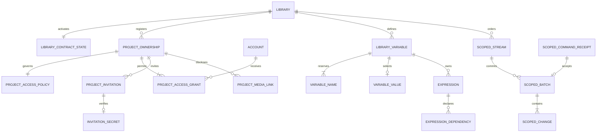

# D19 accepted static schema delta — CXT2

Status: **R2–R8 accepted; R1 physical naming superseded by Suhail on 2026-09-12.**
Read [the accepted contract freeze](D19_CONTRACT_FREEZE.md) first. The relation
signatures below remain the approved specification. Their concrete translation is
[eleven inert DDL proposals](proposals/d19-cxt2/README.md), with an
[exact SQL inventory](proposals/d19-cxt2/INVENTORY.md) and
[SQL/controller responsibility ledger](proposals/d19-cxt2/RESPONSIBILITIES.md).
No database was opened, SQL executed, runtime migration installed, service contacted
or fixture modified during CXT2. Subsequent [CXT1a pure Rust work](CXT1A_CONTRACTS.md)
is complete, with one additive golden fixture. Subsequent [CXT1b](CXT1B_CONTEXT_CONTRACTS.md)
is complete with a separate context golden addendum. CXT3a is verified. The clean Library nomenclature rebaseline precedes CXT3b.

## Compatibility mappings and activation

| Existing surface | Canonical mapping | Preserve / transition |
| --- | --- | --- |
| LibraryId, libraries.library_id and every scoped FK | Canonical Library identity throughout the clean baseline | No physical-name compatibility layer or replacement UUID |
| storage_roots.storage_root_id / StorageRootId | StorageLocationId, same UUID | Keep label_key uniqueness as legacy compatibility constraint; add specs; label_key is not a StorageSlotId or variable name |
| device_root_bindings (device, root) | Legacy single binding candidate | Explicit migration can create new HostBindingId with origin coordinate; validate before selecting; legacy rows retained and no new dual writes |
| RepresentationStorageBindingId | Legacy **external resolver identity**, not HostBindingId | Preserve source UUID in compatibility facts; explicit resolution maps it to a Project-owned ExternalResourceRefId/revision with provenance |
| RuntimeResolved without a logical root | Unresolved legacy external resource | Never invent a location from path/filename; remains unavailable until explicit map/rebind |
| ProjectAsset / ProjectAssetContext | V1 identity/inventory authority within its exact old format | Explicit conversion builds private ledger and specific source-node selection snapshots; no ambient union in v2 evaluation |
| originating_library_id, including null | Historical origin, distinct from required owning_library_id | Explicit association from chosen destination and verified package; never overwrite source provenance or treat null as current Library |
| project_catalog.visibility = visible/hidden | Discovery preference only | Does not map to restricted/library-visible or grant read; new access policy required |
| catalog_path strings / work_surface_contribution_id | Legacy presentation facts | V2 uses CategoryId and work_surface; label-to-category mapping is explicit per exact definition; old strings remain unchanged |
| photara.presentation optional Inspector field | V1 presentation record | Cannot satisfy v2 mandatory Inspector by silent mutation; host fallback is inspection only |
| v1 sync library paths/bytes/cursors | Historical protocol | New /v2/libraries and Project scopes; no redirect that re-signs/reinterprets old sealed bytes |

Owner association is a staged operation: preflight source bytes/ProjectId and
possible catalog duplicates; choose destination Library explicitly; reserve a
pending registration; publish an associated authored root; verify commit; activate
registration/projection. Cloud registration requires current Library creation
permission and creates explicit creator manager access. Local-only follows its
controller. Failure leaves pending registration and recoverable package/draft,
not false active catalog success. Same ProjectId claimed in two Libraries is an
association conflict; no automatic winner. Moving bytes is not reassociation.

An existing v1 directory package upgrades through a new successor commit containing
new schema objects and required feature/minimum-reader declarations. Its immutable
bootstrap and ancestors stay byte-identical; per-commit features prevent an old
reader following the upgraded HEAD. Fresh packages use bootstrap format **1.1**;
upgraded packages may retain bootstrap 1.0 with HEAD commit minimum reader 1.1.
V1 source nodes whose evaluator reads ProjectAssetContext cannot run under v2
by merely relabeling that context. Conversion requires an explicitly selected
exact node release/migration that captures the old selection as a snapshot and
exposes it on a typed port. If no such adapter is available, preserve the old pin
and state as unsupported in the v2 graph; do not synthesize a released manifest
or authorize ambient inventory reads. Compatibility inspection of v1 remains.
One-JSON conversion remains an explicit sibling package with original bytes
retained. New authored roots require owning_library_id even for old nullable-origin
imports; unassociated imports remain inspectable drafts, not conforming new Projects.

Local schema activation raises minimum_reader/minimum_writer to **2**, preserving
family `photara.local.g2`, epoch=1, user_version=2 and SQLx ledger. L2's floor checks
already reject !=1; verify rejection before any old writes. Service minimum_api=2
under the existing family/epoch. Activation and new guards happen in the same
migration reservation; no service worker can run halfway. No down migration.
Unknown versions remain read-only/unsupported, not lossy save-through.

## Proposed migration inventory

These reservations now have `.proposal.sql` review counterparts outside runtime
migration directories; they are not installed migrations.
The unshipped local 0001–0006 baseline is rewritten and verified before CXT3b; no deployed database exists to migrate. S4 already has an **unexecuted 0007 privileges
section**: preserve that reservation and begin service additions at 0008. Do not
use “0007” for two service migrations or pretend the service ledger is installed.

| Local migration reservation | New tables | Scope |
| --- | --- | --- |
| 0007_library_project_access.sql | 5 | Contract state, unique ownership registration, policy, grants, invitations |
| 0008_storage_locations_bindings.sql | 6 | Specs/slots/names plus device candidates/selection and legacy resolution map |
| 0009_library_context.sql | 5 | Variables/current value/name claims, expressions/dependencies |
| 0010_context_apply_recovery.sql | 3 | Device snapshots and durable local apply intent/receipt |
| 0011_scoped_sync.sql | 7 | Project media links plus six scoped local transport tables |
| 0012_d19_guards_and_floor.sql | 0 | Guards, access-qualified queries, feature activation/floors |
| **Total local addition** | **26** | **44 baseline + 26 = 70 domain/support tables** |

| Service migration reservation | New tables | Scope |
| --- | --- | --- |
| 0008_library_project_access.sql | 6 | Five common access tables plus private invitation verifier |
| 0009_storage_locations.sql | 3 | Logical specs/slots/names only |
| 0010_library_context.sql | 5 | Typed Library variables/expression data |
| 0011_scoped_sync.sql | 6 | Project media links and five private scoped transport tables |
| 0012_d19_access_guards.sql | 0 | Replace old policies/grants, guards and minimum_api floor |
| **Total service addition** | **20** | **35 baseline + 20 = 55 tables** |

These remain proposed relation counts, not installed schema counts. The
[DDL inventory](proposals/d19-cxt2/INVENTORY.md) enumerates every actual statement,
relation, explicit index, trigger, function, policy, constraint and grant change.
Supporting composite UNIQUE keys implement the approved scoped stream/batch FKs.
S3's 179 and S4's 275 statements remain unchanged baseline counts. Storexa has no
domain/schema changes. Optional search indexes, export jobs and remote-run tables
remain absent.

## Physical type and constraint notation

Every signature below enumerates columns; `?` alone means nullable. `ID` is
BLOB16 in SQLite / uuid in PostgreSQL, with typed nonnil validation. `DIGEST` is
BLOB32 / bytea length 32. `N` is nonnegative signed-64 INTEGER/bigint; `REV` is
positive checked i64 with +1 CAS. `T` is INTEGER UTC ms / timestamptz at exact
millisecond precision. `TEXT` is TEXT / text COLLATE C for machine keys. `BOOL`
is INTEGER CHECK IN(0,1) / boolean. `JSON` is TEXT checked valid object/array as
specified / jsonb with the same shape check. `BYTES` is BLOB / bytea retaining
canonical UTF-8 (never hash JSONB text). All fields are NOT NULL unless `?`.
Bounds are the S6/D18 minima; JSON typed schemas, canonical agreement and digests
are validated in Photara, not assumed from a shape CHECK.

`M` expands to `record_schema INTEGER=1, revision REV, created_at T, updated_at T`.
On SQLite the physical revision column is `local_revision`; on PostgreSQL it is
`revision`. These new names are mapped explicitly, not an ALTER of old rows.
`L` means physical `library_id ID` FK to libraries, the LibraryId adapter.
All FKs default ON DELETE RESTRICT. All ID owners/created times are immutable.
Mutable authority rows reject DELETE and ordinary resurrection; CAS changes
advance exactly once. Immutable records reject UPDATE/DELETE. Child table changes
participate in their parent's CAS and exact change post-state. Every scoped FK
includes L and, when relevant, ProjectId; no cross-Library FK by ID alone.
All child FK prefixes have indexes, supplied by PK/UNIQUE when covering.
SQLite new tables are STRICT. Namespace/schema/type fields use exact registered
coordinates, not arbitrary JSON. No runtime is invoked while validating them.

## Fourteen common relations

These relations exist on both backends; service schema is `photara` except
access grants/invitations, which are `photara_identity`. Service access tables
are controller/auth-read only. SQLite authority_mode distinguishes locally
authorized records from remote cached facts; cached rows are never writable
local authorization. New local rows use explicit repository dispatch.

### A1 — library_contract_state

`(L PK, contract_version INTEGER=1, authority_mode TEXT,
local_principal_id ID?, authorization_generation REV, M)`.
Mode is `local-only | cloud-member | project-only`. Local-only requires principal;
other modes require null. Service permits cloud-member only and null principal.
This is contract/access state, not a copy of Library display metadata. Generation
increments on access changes; M revision advances on any state change. A local
Project-only stub can have a bounded libraries header but no membership/directory
rights. No default mode inferred from Account absence.

### A2 — project_ownership

`(project_id ID PK, L, registration_state TEXT, association_commit_id ID?,
association_commit_sha256 DIGEST?, source_origin_library_id ID?,
source_format TEXT, M)`; UNIQUE(L,project_id).
State `pending | active | closed`; commit pair all-or-none, active requires pair.
Source origin nullable preserves legacy evidence. The row registers access scope,
not Project metadata/Graph authority. Activation requires verified local observation
or explicitly client-reported service association; the service cannot certify SMB.
Index `(L,registration_state,project_id)`.

### A3 — project_access_policies

`(L, project_id ID, visibility_policy TEXT, owner_mask INTEGER,
admin_mask INTEGER, editor_mask INTEGER, viewer_mask INTEGER,
authorization_generation REV, M)`; PK/FK(L,project_id) → project_ownership.
Policy restricted/library-visible; masks obey the accepted contract; restricted
requires all zero. Policy CAS bumps authorization_generation; any effective grant
change also bumps it in the same transaction. Index covered by PK.

### A4 — project_access_grants

`(grant_id ID PK, L, project_id ID, account_id ID?, local_principal_id ID?,
action_mask INTEGER, state TEXT, revoked_at T?, M)`;
UNIQUE(L,project_id,grant_id); FK(L,project_id) → ownership.
Exactly one principal field; account FK to account_cache locally/accounts on
service; local principal must equal the local-only Library controller. Service
requires account_id. Two partial UNIQUE indexes `(L,project_id,account_id)` where
account nonnull and `(L,project_id,local_principal_id)` where principal nonnull.
State active/revoked; revoked iff revoked_at nonnull; active mask may be 0 to
explicitly inherit. Revoked denies inherited rights regardless of stored mask.
Index `(account_id,state,L,project_id)`. Regrant is a dedicated audited controller
command, not generic resurrection. Last active manager/account checks at commit.

### A5 — project_invitations

`(invitation_id ID PK, L, project_id ID, inviter_account_id ID,
target_account_id ID, action_mask INTEGER, expected_policy_revision REV,
expires_at T, state TEXT, accepted_grant_id ID?, completed_at T?, M)`.
FK(L,project_id) → ownership; both Accounts FK; accepted grant scoped FK to A4.
States pending/accepted/declined/revoked/expired; pending has no completed time,
terminal has it; accepted iff grant nonnull; expiry > creation and <=7 days.
One pending invite per `(L,project_id,target_account_id)` partial UNIQUE;
index `(target_account_id,state,expires_at,invitation_id)` and inviter FK index.
Expired pending rows are finalized by the controller before replacement; wall
clock in a partial-index predicate is not assumed. Local rows are only bounded
remote projections; offline invitations are not accepted locally. Local-only
sharing without Accounts is file sharing, not fake email/account grants.
Library-member invitation delivery/provisioning remains a separate future
controller slice; R2 freezes its role ceiling, not a new shared invitation table.

### S1 — storage_location_specs

`(L, storage_root_id ID, storage_kind TEXT, provider_id TEXT?,
supported_rights_json JSON array, M)`; PK/FK(L,storage_root_id) → storage_roots.
Storage kind filesystem/provider; provider iff provider_id nonnull. Kind/provider
immutable. Parent legacy root owns display/purpose/lifecycle; a command changing
spec or root bumps both revisions and emits one composed storage-location root.
No spec auto-created from a legacy label. Existing root without spec resolves as
`legacy-unspecified` and requires explicit classification before new materialization.

### S2 — storage_slots

`(slot_id ID PK, L, current_name TEXT, display_name TEXT,
storage_root_id ID, state TEXT, retired_at T?, M)`;
UNIQUE(L,slot_id), FK(L,storage_root_id) → storage_roots,
deferred FK(L,slot_id,current_name) → storage_slot_names.
Active/tombstoned and retirement pairing. Current name matches snake_case grammar;
active slot requires active classified location. Index `(L,storage_root_id,state)`.
Target replacement/rename is explicit CAS; captures pin the old slot revision.

### S3 — storage_slot_names

`(L, name TEXT, slot_id ID, claimed_at T)`; PK(L,name),
UNIQUE(L,slot_id,name), FK(L,slot_id) → storage_slots, deferred.
Append-only forever-reserved names. First slot and claim insert in one transaction;
no SQL trigger may depend on another BEFORE trigger's ordering. Both current
and previous names resolve to the same SlotId for explicit compilation only.

### V1 — library_variables

`(variable_id ID PK, L, namespace TEXT, current_name TEXT, display_name TEXT,
description TEXT, value_type_id TEXT, value_type_version INTEGER,
schema_id TEXT, schema_version INTEGER, default_binding_json JSON object?,
allowed_overrides_json JSON array, sensitivity TEXT, portability TEXT,
provenance_json JSON object, state TEXT, retired_at T?, M)`;
UNIQUE(L,variable_id), deferred FK(L,variable_id,current_name) → library_variable_names.
State active/tombstoned; retirement pairing; exact type/schema and immutable
namespace; type-breaking change needs new ID. Binding is literal or expression
with exact expression ID and version; schema checking required, no executable SQL.
Index `(L,state,current_name,variable_id)`. Values/names/default dependencies are
one Variable CAS aggregate; no separate public child mutation API.

### V2 — library_variable_values

`(L, variable_id ID, value_id ID UNIQUE, is_present BOOL,
binding_json JSON object?, origin TEXT, source_project_id ID?, source_run_id ID?,
source_attempt_id ID?, source_operation_id ID?, updated_at T)`;
PK/FK(L,variable_id) → variables. is_present iff binding nonnull; origin
manual/command/node-proposal/imported. At most one lifetime value row; explicit
clear retains ValueId with is_present=false. Replacements retain ValueId and bump
parent revision. Source IDs are provenance, not FKs into absent package tables.
Library binding expression dependencies remain same-Library; no input port refs.

### V3 — library_variable_names

`(L, name TEXT, variable_id ID, claimed_at T)`; PK(L,name),
UNIQUE(L,variable_id,name), deferred FK(L,variable_id) → variables.
Append-only; grammar/reserved built-ins checked; uniqueness crosses namespaces.
Index covered by UNIQUE. Node and package variable names use package validation,
not these Library rows.

### V4 — library_expressions

`(expression_id ID PK, L, owner_variable_id ID, language TEXT,
container_mode TEXT, compiler_version TEXT, source_utf8 BYTES,
source_sha256 DIGEST, ast_canonical BYTES, ast_sha256 DIGEST,
result_type_id TEXT, result_type_version INTEGER, created_at T)`;
UNIQUE(L,expression_id), FK(L,owner_variable_id) → variables.
Immutable; source <=16 KiB; AST <=64 KiB, valid typed object, <=1,024 nodes/depth32;
container expression/template only initially. Source/AST correspondence is checked
by the exact compiler, service stores/validates without evaluation. Expressions
are owned by one variable and retained after it changes/tombstones.
Index `(L,owner_variable_id,expression_id)`.

### V5 — library_expression_dependencies

`(L, expression_id ID, ordinal INTEGER, dependency_kind TEXT,
variable_id ID?, slot_id ID?, expected_type_id TEXT, expected_type_version INTEGER)`;
PK(L,expression_id,ordinal), FK(L,expression_id) → expressions, scoped FKs to
variables/slots. Kind variable/storage-slot determines exactly one target column.
Unique target per expression via partial UNIQUE indexes. Ordinals contiguous,
canonical typed-coordinate sort, at most256 direct deps. Host/input/Project refs
are invalid in Library expressions. Typed compiler validates full cycle/bound
closure and reserved fields; SQL FKs do not prove expression semantics.

### P1 — project_media_links

`(L, project_id ID, sha256 DIGEST, purpose TEXT,
source_commit_id ID, source_commit_sha256 DIGEST, consent_projection_sha256 DIGEST,
state TEXT, retired_at T?, M)`;
PK(L,project_id,sha256,purpose), FK(L,project_id) → ownership,
FK(L,sha256) → library_media. Purpose `cover | assigned-snapshot`; state active/
tombstoned with retirement pairing. Index `(L,sha256,state,project_id)`.
This is an explicit access projection for approved cloud preview bytes; no blanket
Project entitlement to Library media with matching digest. Local link may precede
local byte availability; service link requires separately verified bytes. Changing
source commit/consent requires explicit replacement CAS. Imported links never
reactivate access; export omits them as authorization state.

## Twelve additional local-only relations

Local tables below never sync/export as ordinary Library records.

### H1 — host_bindings

`(binding_id ID PK, device_id ID, L, storage_root_id ID, host_kind TEXT,
binding_kind TEXT, host_path TEXT?, secure_handle_ref ID?, state TEXT,
generation REV, availability TEXT, verification_json JSON object?,
verified_at T?, diagnostic_code TEXT?, M)`.
UNIQUE(device_id,L,storage_root_id,binding_id); FKs device→local_device,
(L,root)→storage_roots. Host macos/windows/linux; binding path/bookmark/provider;
path requires host_path only, bookmark/provider secure ref only. State candidate/
verified/retired; verified requires verification/time. Availability unknown/
available/unavailable/denied/stale/ambiguous/unsupported. Available requires
verified and nonnull checked evidence; it remains historical observation.
Index `(device_id,L,storage_root_id,state)`. Rebind increments generation and
revision; observation refresh increments revision, generation only if effective
resolution/availability changed. Bookmark/secret bytes never stored.

### H2 — host_binding_selections

`(device_id ID, L, storage_root_id ID, binding_id ID, selection_revision REV,
updated_at T)`; PK(device_id,L,storage_root_id); composite FK to H1's UNIQUE.
Selected binding must be verified and nonretired; unavailable may remain selected
without resolution success. Selection CAS and candidate validation are atomic.
Retiring selected candidate requires explicit deselect/reselect first.

### H3 — legacy_external_resource_resolutions

`(device_id ID, project_id ID, legacy_binding_id ID, source_object_sha256 DIGEST,
external_ref_id ID, external_revision_id ID, mapping_commit_id ID,
mapping_commit_sha256 DIGEST, created_at T)`;
PK(device_id,project_id,legacy_binding_id,source_object_sha256), device FK.
Append-only verified compatibility map to package-owned objects; no FK to
rebuildable catalog and no host path in this map. Same source coordinate cannot
silently point to different IDs. Fork needs new map; backup copies no grants.

### H4 — device_context_snapshots

`(snapshot_id ID PK, device_id ID, project_id ID, run_id ID,
context_canonical BYTES, context_sha256 DIGEST, content_digest DIGEST,
created_at T)`; device FK; UNIQUE(device_id,project_id,run_id,snapshot_id).
Immutable <=1 MiB typed snapshot of nonsecret binding IDs/generations/availability
and HostPlace leases; never paths/tokens/bookmarks. Index `(project_id,run_id)`.
Portable Run stores only digest and replayability marker, never SnapshotId mapping
that could recover private host state. Retention follows durable Run dependency
policy, distinct from an evictable runtime cache.

### O1 — context_apply_intents

`(operation_id ID PK, L, target_project_id ID?, proposal_id ID,
request_canonical BYTES, request_sha256 DIGEST, source_run_id ID,
source_attempt_id ID, target_authority TEXT, expected_commit_id ID?,
expected_commit_sha256 DIGEST?, state TEXT, M)`;
UNIQUE(L,operation_id). Authority library/project; project iff ProjectId and
expected commit pair present. State prepared/awaiting-publication/settled/unknown.
Request/proposal/target/source immutable; <=1 MiB canonical typed request.
Index `(L,state,operation_id)`. Library applies one SQL transaction; Project
publisher uses this durable journal without making it package authority.

### O2 — context_apply_receipts

`(receipt_id ID PK, L, operation_id ID, observation_kind TEXT,
result_canonical BYTES, result_sha256 DIGEST, package_commit_id ID?,
package_commit_sha256 DIGEST?, observed_at T)`;
FK(L,operation_id) → apply intents. Immutable; <=4 MiB canonical typed receipt.
Kinds local-applied/package-published/rejected/conflict/unknown. Package-published
requires verified commit pair; local-applied has none. Partial UNIQUE(operation_id)
for final applied/rejected/conflict rows (unknown observations may precede one).
Index `(L,operation_id,observed_at,receipt_id)`. Server acceptance is a separate
sync receipt, not overwritten into this local result.

### Q1 — scoped_sync_channels

`(channel_id ID PK, L, account_id ID, environment_id TEXT, scope_kind TEXT,
project_id ID?, authorization_generation REV, epoch ID, applied_cursor TEXT?,
state TEXT, local_revision REV, updated_at T)`; Library and Account cache FKs;
project scope iff ProjectId nonnull and scoped FK to ownership.
Scope library/project; state active/paused/access-lost/snapshot-required.
Partial UNIQUE(L,account_id,environment_id) for library and
UNIQUE(L,project_id,account_id,environment_id) for project. No opaque cursor orders
records or authenticates the caller. Access mode restricts usable channels.

### Q2 — scoped_sync_operations

`(operation_id ID PK, channel_id ID, command_kind TEXT, local_intent_canonical BYTES,
local_intent_sha256 DIGEST, sealed_request BYTES?, request_sha256 DIGEST?,
receipt_canonical BYTES?, receipt_sha256 DIGEST?, state TEXT,
replacement_operation_id ID?, created_at T, updated_at T)`; channel FK;
UNIQUE(channel_id,operation_id); replacement self FK.
State queued/sealed/acknowledged/rejected/conflict/unknown/superseded/discarded;
sealed and receipt pairs all-or-none; acknowledged requires accepted receipt.
Intent immutable; sealed bytes never change; final receipt immutable. Supersede
only unsealed or definitively rejected/conflicting work; never unknown/accepted.
Source local poststates live in the immutable intent envelope; no overwrite of
legacy mutations/local_changes. Index `(channel_id,state,created_at,operation_id)`.

### Q3 — scoped_sync_operation_roots

`(channel_id ID, operation_id ID, entity_kind TEXT, entity_id ID,
expected_server_revision TEXT?, predecessor_operation_id ID?,
local_poststate BYTES, local_poststate_sha256 DIGEST, local_revision REV)`;
PK(operation_id,entity_kind,entity_id), composite FK to Q2; same-channel
predecessor composite FK to Q2. Expected revision/predecessor exclusive; both
null is absent baseline. Typed poststate <=1 MiB; exact root set and acyclic
predecessors checked. Index `(channel_id,entity_kind,entity_id,operation_id)`.

### Q4 — scoped_sync_base

`(channel_id ID, entity_kind TEXT, entity_id ID, server_revision TEXT,
poststate_canonical BYTES, poststate_sha256 DIGEST, observed_local_revision REV)`;
PK(channel_id,entity_kind,entity_id), channel FK. <=1 MiB typed base, replaces
only through ordered inbox/snapshot CAS; never replaces pending working overlays.
No base row authorizes access or becomes an editable package record.

### Q5 — scoped_sync_inbox

`(inbox_id ID PK, channel_id ID, authorization_generation REV, epoch ID,
batch_sequence N, cursor_before TEXT, cursor_after TEXT, batch_canonical BYTES,
batch_sha256 DIGEST, state TEXT, received_at T, applied_at T?)`;
channel FK; UNIQUE(channel_id,authorization_generation,epoch,batch_sequence).
Sequence positive; <=4 MiB; state received/applied/conflict/unsupported/access-lost;
applied iff applied time. Payload immutable. Partial UNIQUE(channel_id) where
state in received/conflict/unsupported. Access-lost items are quarantined evidence,
not a pending page that a later grant can replay automatically.

### Q6 — scoped_sync_snapshot_installs

`(installation_id ID PK, channel_id ID, snapshot_id ID,
authorization_generation REV, epoch ID, expected_cursor TEXT?, high_water_cursor TEXT,
payload_canonical BYTES, payload_sha256 DIGEST, state TEXT,
created_at T, installed_at T?)`; channel FK; UNIQUE(channel_id,snapshot_id).
<=16 MiB/10,000 roots; state staged/installed/conflict/unsupported/superseded;
installed iff timestamp. Partial UNIQUE(channel_id) for staged/conflict/unsupported.
Payload immutable; installation CAS preserves overlays/recovery/device state.
Revoked/omitted access-scoped projections are withheld, not domain tombstoned.

## Six additional service-only relations

All are under `photara_private`, with no direct desktop/node access. RLS is forced
on scoped tables; access helpers and command handlers use fixed trusted scope.

### C1 — project_invitation_secrets

`(invitation_id ID PK FK→project_invitations, token_verifier DIGEST,
verifier_version INTEGER=1, consumed_at T?)`.
Controller-only; token never included in sync/export/logs. Verifier immutable;
consumed_at may transition once. A fresh invitation gets new random token and ID;
no reuse of expired verifier. Token issue/acceptance rate limits are controller
policy; no delivery provider is chosen.

### F1 — scoped_streams

`(stream_id ID PK, L, scope_kind TEXT, project_id ID?, epoch ID,
last_sequence N, created_at T)`; Library FK and optional scoped ownership FK.
Scope library/project; same partial UNIQUE patterns as channels without Account.
UNIQUE(stream_id,epoch). Increment exactly once per accepted command while holding
Library write lock; no automatic epoch reset/pruning. Project access generation
is separate from content-stream epoch.

### F2 — scoped_change_batches

`(stream_id ID, epoch ID, sequence N, L, project_id ID?, operation_id ID,
change_count INTEGER, batch_canonical BYTES, batch_sha256 DIGEST, committed_at T)`;
PK(stream_id,epoch,sequence); scoped stream FK; UNIQUE(L,operation_id);
deferred FK(L,operation_id) → scoped_command_receipts.
Sequence positive; count1..1000; bytes<=3 MiB. Immutable; exact scope equals stream;
no cross-scope batch. Deferred guards verify contiguous children, receipt and
stream advancement. No dynamic per-user filtering of these canonical bytes.

### F3 — scoped_changes

`(stream_id ID, epoch ID, sequence N, ordinal INTEGER, L, project_id ID?,
entity_kind TEXT, entity_id ID, entity_revision REV, change_kind TEXT,
record_schema INTEGER, post_state JSON object, post_state_canonical BYTES,
post_state_sha256 DIGEST)`; PK(stream_id,epoch,sequence,ordinal);
FK to batch; UNIQUE(stream_id,entity_kind,entity_id,entity_revision).
<=1 MiB poststate; ordinal0..count-1; scope agrees with batch. Immutable.
Index `(stream_id,entity_kind,entity_id,entity_revision)` covered by UNIQUE.

### F4 — scoped_command_receipts

`(L, operation_id ID, actor_account_id ID, device_id ID, scope_kind TEXT,
project_id ID?, command_kind TEXT, request_canonical BYTES, request_sha256 DIGEST,
outcome TEXT, response_canonical BYTES, response_sha256 DIGEST,
accepted_stream_id ID?, accepted_epoch ID?, accepted_sequence N?, completed_at T)`;
PK(L,operation_id); actor/device composite FK to devices; project scoped ownership FK.
Outcome accepted/control-accepted/rejected/conflict; accepted iff complete stream/epoch/positive
sequence tuple; deferred FK tuple to F2. Requests<=1 MiB; responses<=4 MiB;
immutable and actor-bound. Controller access commands use scope_kind=control and null accepted tuple;
they return control-accepted/rejected/conflict. Control-accepted is explicitly
outside the accepted-feed equivalence. Control rows still name the exact Project
when Project-scoped; Library controls have null ProjectId.
Their response stores exact resulting access revisions/audit ID, never enters
content stream. Index `(actor_account_id,L,project_id,completed_at,operation_id)`.
Library variable Apply carries the same OperationId/request in this protocol;
state + receipt + complete Library batch commit together. No package-effect receipt
is fabricated by this table.

### F5 — scoped_sync_clients

`(stream_id ID, account_id ID, device_id ID, authorization_generation REV,
epoch ID, acknowledged_sequence N, last_seen_at T)`;
PK(stream_id,account_id,device_id); stream/epoch FK; Account/device FK.
Ack monotone within current access generation/epoch and <=stream high-water.
New generation requires snapshot bootstrap, not blind cursor reuse. Ack is not
permission to prune. Index `(account_id,device_id,stream_id)`.

## Access and context relationship overview

The grant count is qualified: active registration requires an active manager;
pending/closed registrations may have none. Account ownership is the service
case; local-only grants instead target the explicit local controller principal.
One Project has at most one Project stream; one Library has exactly one Library
stream after cloud activation and zero before. A control receipt has no batch.

## Existing tables and guards affected on later activation

No baseline table is renamed/dropped. New authority records use typed commands
and new local journal Q2/Q3; existing immutable v1 local_changes/mutations and
sealed outbox requests remain exactly encoded. New repositories must not put
unknown entity kinds through their old CHECK lists. On D19 activation the old
write APIs for access-affected catalog/roots require the v2 command facade; the
old L2 binary refuses the new floor. Existing People/Kind commands may retain
old payload encoding locally, but v2 delivery uses explicit new command IDs and
conversion only while unsealed. There is one active transport generation per
Library, never simultaneous v1 and v2 workers writing the same base.

Activation preflight inventories sealed v1 operations. Settle them under their
unchanged compatible protocol before switching; unresolved or lost outcomes
block activation and remain quarantined. No rewrite of mutation bytes, receipt
hashes or SQLx checksums is a migration strategy. Because service runtime is
unimplemented, this is a rollout requirement, not a live transition performed now.

The service 0011 also adds nullable columns to the existing
`photara_private.media_upload_sessions`: `project_id uuid`,
`actor_account_id uuid`, `project_media_purpose text`,
`authorization_generation bigint`. Composite FK(library_id,project_id) targets
A2; actor FK targets accounts. ProjectId/purpose/generation/actor must all be
present for a Project upload; purpose cover/assigned-snapshot and generation>0.
Library uploads retain null ProjectId/purpose and carry actor/generation on new
v2 requests. Old sessions with all four null are historical and cannot be resumed
through v2. Index `(library_id,project_id,actor_account_id,state,expires_at)`.
Project upload/finalize rechecks the recorded actor, current generation and
Project edit/consent before exposing staging state; its media descriptor is visible
to that actor only through the bounded upload route until an active P1 link exists.
Project upload URLs cannot overwrite final media. This is the only proposed ALTER
adding data columns to a baseline table; all other extensions use the new relations
or the existing metadata floors. No ALTER is executed here.

Additional guards in 0012 (each must receive negative and concurrency fixtures):

- A2 global Project uniqueness and immutable owner; A3/A4 same-Project scope,
  mask prerequisites, last-manager and Account-disable checks; control role ceiling,
  invitation state/expiry/acceptance and generation changes in one transaction.
- S1 spec identity/revision plus parent CAS; active slot/root restrictions; S3 and
  V3 append-only name claims and required current-name closure; slot/root retirement
  blocks live slots/locators, preserves historical external captures.
- V1–V5 immutable coordinates/types, same-Library targets, child/default/value
  agreement, revision changes and typed direct-dependency closure. Cycle and
  sensitivity validation stays in Core/repository; do not pretend FK checks prove it.
- H1/H2 selected verification, generation/selection CAS and device ownership;
  O1/O2 immutable operation request, deduplication and exact publication linkage.
- Q/F immutable sealed payloads, exact typed scope/root set, whole-batch and
  snapshot CAS, predecessors, generation isolation, no echo, no cursor skip,
  receipt/stream linkage and rollback.
- Baseline project_catalog, project_locators, package/project_observations and
  child projections must join **active owner registration and current read action**
  before returning title/count/locator/assignment data. Hidden is a preference;
  it cannot replace authorization. Legacy observations' asset_count retains its
  old meaning; new observation schema=2 adds `ledger_asset_count` in a typed v2
  attachment rather than renaming old stored counts into input counts.
- Existing recovery operation_kind CHECKs remain unchanged. New apply operations
  use O1/O2. Durable external-effect queues use existing publish-evidence recovery
  only within its declared contract; do not mislabel variable apply as save-package.

All new authority roots and control mutations acquire Account/Identity locks
first (sorted for multiple actors), then Library lock, then Project policy/grants,
then target rows in stable typed-ID order. Local writes use BEGIN IMMEDIATE.
Last-owner/manager, invitations and account disable share this lock order.
No host/provider I/O is done while holding a database transaction.

## PostgreSQL authorization, RLS and API changes

The old 25 `library_scope` policies check tenant scope only. They are **not
sufficient** for D19. The reviewed 0012 migration replaces their predicates and
revokes incompatible v1 route/table grants before minimum_api=2 activation.
Do not stack another permissive policy beside an old broad policy (their OR can
retain the bypass). Keep fixed search_path, fully qualified SQL, no PUBLIC function
execution, no owner/BYPASSRLS runtime credentials and transaction-local context.

Required helpers: `authorize_library(L,action)`,
`authorize_project(L,ProjectId,action)`, `can_read_library(L,sensitivity)`,
`can_project(L,ProjectId,action)`, `can_project_media(L,ProjectId,digest,purpose)`.
The first two validate/lock current Account/identity and scope. Predicates use
trusted transaction context and exact A3/A4 policy rules, never a caller-supplied
mask or ID as proof. Helper owner reads narrowly restricted access tables to avoid
recursive membership RLS; it gains no unrestricted Project data query endpoint.

| Table/query class | SELECT requirement | Mutation requirement |
| --- | --- | --- |
| libraries/Library header | Current membership for full row; Project-only gets separate bounded header DTO | Library controller |
| People/Organizations/relationships/kinds/locations/social profiles and children | Current Library read | Current Library edit; child changes under parent CAS |
| storage_roots/specs/slots/names | Current Library read; Project-only sees captured descriptor subset via package | Library manage-storage |
| Library variables/value/name/expression/dependency rows | Current Library read plus restricted-policy predicate inherited from owning variable | Library manage-context; no service AST execution |
| project_catalog/locators/observations and projections | Current Project read; discovery endpoint separately emits the minimal identity DTO | Project edit; locator changes additionally manage-storage; run evidence report needs run and exact permitted attachment |
| library_media/media_objects/uploads | Library permission OR exact active P1 Project link plus Project read on the dedicated Project route | Library edit for Library media; Project edit and explicit consent for P1 projection, current upload/finalize rights |
| A2–A5 and private verifier | Bounded access response for self; manager can list Project grants/invitations; auth-read/control internally | Authorized controller only; ordinary API no direct write |
| F1–F5 and existing v1 streams/receipts | No raw client SELECT; typed handler enforces current scope/actor and response contract | Trusted command handler, full scope preflight and transaction |
| billing/security/global identity | Existing controller/auth-read restrictions retained | Existing explicitly authorized controller; no new content bypass |

Library queries must not JOIN Project-sensitive titles/parties/counts without
Project read. Project-only lookup of a PersonId, media digest, invitation ID or
receipt must not disclose other records, existence, FK diagnostics, aggregate
counts or timing-dependent result distinctions. Use not-found-or-forbidden for
unknown inaccessible identities; detailed denied reasons only for known scoped
objects. This applies to search, facets, totals, previews and receipt conflicts.

Proposed paths (all relative, no live hostname):

| Route | Meaning |
| --- | --- |
| GET /v2/capabilities | Exact protocol/features/limits and supported contracts |
| POST /v2/libraries/claim | Explicit local claim preserving LibraryId; controller identity mapping |
| GET /v2/libraries/{L}/access | Current Library actions, authority generation; no Project list implied |
| GET /v2/projects/{P}/access | Owning Library header, current Project mask/generation; bounded Project-only entry |
| GET /v2/libraries/{L}/projects | Permission-filtered discover results; title/count only per-row read permission |
| POST /v2/libraries/{L}/commands | One sealed Library-scope command and receipt |
| POST /v2/projects/{P}/commands | One Project-scope catalog/locator/media-projection command; never Graph editing |
| POST /v2/projects/{P}/access-commands | Policy/grant/invitation controller commands with CAS/idempotency |
| POST /v2/project-invitations/{I}/accept | Target identity/token/current inviter validation; no email identity inference |
| GET /v2/libraries/{L}/operations/{O} or /v2/projects/{P}/operations/{O} | Actor-bound receipt; current target permission rechecked, even on retry |
| GET /v2/libraries/{L}/changes or /v2/projects/{P}/changes | Opaque cursor; one complete scope-specific batch or 204 |
| POST corresponding /snapshots and /acknowledgements | Bounded exact authorized scope, generation-bound bootstrap and durable cursor acknowledgement |
| POST corresponding /media/uploads and /media/uploads/{U}/complete | Separate staging and immutable finalize; Project route enforces explicit P1 projection |
| GET /v2/projects/{P}/media/{digest}/download | Project read plus active approved media link; no digest-only Library bypass |

## Sync v2 and export

Envelope `photara.sync.v2` / media type version=2 retains canonical-json.v1.
Exact fields: `protocol, codec, library_id, scope {kind,project_id?}, stream_epoch,
authorization_generation, operation_id, device_id, created_at, required_features,
preconditions[], command, attachments, extensions`. Authentication actor is
service-derived. Preconditions are sorted exact root `(kind,id)` absent or sr1
revision. No predecessor IDs on wire. Limits and immutable sealing/idempotency
rules remain S5. Receipt identity is `(LibraryId,OperationId)` plus same actor and
exact request bytes. Dedup never bypasses current authorization.

Library stream contains Library metadata, typed records, logical storage/slots
and permitted variables only. **No Project catalog, locator or rich Project
attachment appears in it.** Project stream contains one Project's authorized
catalog/locator/projection data, never live Library roots or grant directories.
A command cannot atomically span these scopes; split explicit user intents with
separate receipts. All members authorized for a Library stream must be allowed
its complete batch: restricted variable payloads therefore use controller-only
commands and **do not enter the shared Library stream**. Restricted variables
are captured via authorized bounded owner/admin reads; no normal sync of their
payload until a separate restricted stream protocol is approved. Local restricted
variables remain supported. This is a deliberate privacy/feature limitation,
not silent omission in a claimed complete snapshot.

Consequently cloud-synchronized Library variables initially permit ordinary or
personal+portable fields only; restricted/host-only creation or promotion into
sync returns unsupported-privacy-scope, before commit. A pre-existing local
restricted variable requires explicit omission/unresolved capture policy during
cloud claim; claim cannot pretend the remote Library is a full backup. Typed
omission inventory identifies withheld local IDs only to that local owner.

Feed wrapper contains protocol/codec, exact scope, authorization generation,
epoch, cursor_before/after and one immutable batch. Cursor signs Account, scope,
generation, epoch, position and signing-key version. Cross-Project/Account or old
generation cursor fails. No hidden batch is removed from a signed whole-Library
body. Policy/grant/membership change increments A1 authorization_generation under
the same Library lock (all Library/Project channels use this conservative global
access generation; A3 also advances its own Project policy generation) and requires a fresh bounded scope snapshot. Revocation returns
access-lost; newly granted access starts from current scoped snapshot, not an
unauthorized historical scan. Manager downgrade cannot expose old invitation
payloads because those never entered shared content batches.

A library-visible policy widening requires explicit consent review for any rich
Project projection before activation. Its control command contains
`disclosure_ack {reported_commit_id, reported_commit_sha256,
projection_sha256, proposed_policy_sha256, confirmed_by_account_id}`; the actor
must be the current manager, and the exact acknowledgement is retained in the
immutable control receipt/audit. The host verifies its pinned package commit and
capture audience before issuing that command. The service verifies actor, current
policy CAS and acknowledgement coordinates but cannot certify remote package
contents or a later unpublished edit. New publication must separately recheck
current audience; no cross-store atomic privacy verification is claimed. Access snapshots contain exact permitted
Library data OR one Project's catalog/locator/media references plus bounded saved
snapshot projections. `completeness` names that precise scope and projection
version; it never claims “all Library” for a Project-only client. Data withheld by
access loss is not a tombstone or lost-history conflict. Retain protected pending
work separately and stop using excluded cache/base rows; do not delete package
bytes or local drafts. Restored access needs new snapshot/CAS, never stale cursor
resume. Per-channel inbox quarantine and receipt-before-feed rules remain S5.

D17 export remains a logical bundle with source revisions as provenance. Add
portable specs/slots/name reservations/allowed variables and AST/source objects
with exact references. Exclude A3–A5/P1 authority, memberships/invitation verifier,
all H/O/Q/F state, secure refs, absolute paths and runtime leases. Owner association
and catalog hints may be exported as **unverified discovery provenance**, not
active access registration. Omitted required dependencies get typed unresolved
placeholders; no broken live expression accepted. An import plan remaps typed
owned IDs and AST refs explicitly, updates digests, validates collisions/closure
and never restores access grants. Project backups remain separate. Encryption,
export jobs and import runtime remain non-gating deferred work.

## Package object delta and closure

S6 fixtures were explicitly rebaselined to Library naming. Package 1.1 required features:
`photara.library-project.v1`, `photara.resources.v2`, `photara.asset-set.v2`,
`photara.context.v1`, `photara.node-contract.v2` as applicable to actual content.
The first feature is required on every new associated authored root; other features
are required when their records/types occur, including history. Features accumulate
across retained closure. Commit minimum_reader=1.1 for any of these features;
bootstrap/HEAD/commit/inventory wire schemas and canonical codec stay v1.

All rows below are exact schema IDs. New objects include `schema`, `project_id`
and optional namespaced `extensions` unless specified. `Ref` means S2 ObjectRef,
not an arbitrary URI. Every named Ref below is a schema-selected closure edge;
array references sorted by semantic ID unless order is explicitly semantic.
Source code strings and arbitrary JSON must never be searched for Ref-like shapes.

| Schema and version | Required field change/shape |
| --- | --- |
| photara.project.authored v2 | Retain v1 metadata/revisions/assignments/graphs; replace originating_library_id with owning_library_id (required) and origin {library_id?, source_format, source_object?}; replace asset_inventory/resource_inventory with asset_ledger Ref/resource_ledger Ref; add context Ref |
| photara.project.saved-graph v2 | Retain wrapper metadata and exact package pins; retain graph payload under its own version; add context Ref and node_contracts [{node_id,manifest Ref?,contract_digest}]; array exactly matches nodes |
| photara.project.library-snapshot v2 | Retain snapshot/time/display/payload; source uses library_id, typed record ID and explicitly tagged local/server revision; add projection_schema, fields[], sensitivity, portability, consent_projection_digest? |
| photara.project.representation-content v2 | Retain asset/representation/content IDs, fingerprints/media/lineage; binding is managed {resource_id,version_id,version Ref} OR external {external_ref_id,revision_id,revision Ref}; no device binding |
| photara.project.history v2 | Retain runs/evidence/operations; add snapshots[], metadata_observations[], proposals[], apply_receipts[], artifacts[] as immutable Refs |
| photara.history.run-start v2 | Retain source/targets/implementations/start facts; add owning_library_id, context_snapshot Ref, input_snapshots [{node_id,port_id,snapshot Ref}], authorization_observation {mode,actions,generation?}, device_dependency_digest?, replayability |
| photara.history.attempt-start v2 | Retain start fields; add node_context_digest, input_snapshot_refs[], execution_contract_digest, operation_refs[], replayability; no live grant/handle |
| photara.history.effect-intent v2 | Retain OperationId/origin/time; exact definition pin, operation_kind, target ResourceDescriptor, expected_target, request_digest, idempotency_key, input/context digests, retention, request (typed portable payload using credential requirement slots only); no mutable attempt backlink |
| photara.history.receipt v2 | Retain receipt/operation/observing attempt/provider/time/evidence; observation succeeded/rejected/failed/unknown, prior_receipt_ids[], request_digest; no invented success from Run state |
| photara.project.asset-ledger v1 | assets[] with retained AssetIds, representation identities/current content Refs, retirement/provenance; ledger_membership is not a port; retained refs close over immutable descriptors |
| photara.project.resource-ledger v1 | managed_resources[] Ref, external_resources[] Ref, artifacts[] Ref; only encountered/retained subset |
| photara.project.managed-resource v1 | resource_id, version_id, blob Ref, media descriptor, retention=managed-project, original_name?, provenance; one object per immutable version |
| photara.project.external-resource v1 | external_ref_id, revision_id, source_library_id, storage_location_id, coordinate tagged filesystem/provider, content_evidence, storage_class external-source/external-output, provenance; one object per immutable revision |
| photara.value.asset-set-snapshot v1 | snapshot_id, member_count, content_digest, pages[] {start_ordinal,count,page Ref}, provenance; AssetSet value type v2 references this schema v1 |
| photara.value.asset-set-page v1 | snapshot_id, start_ordinal, members[] ordered {asset_id, representations[] {representation_id,content_revision_id,descriptor Ref}, metadata_refs[] Ref, missing_facts[]}; <=500 members |
| photara.context.authored v1 | scope, variables[] Ref, expressions[] Ref, captures[] Ref, metadata_selections[] Ref, node_contexts[] {node_id,context Ref}; node_contexts nonempty only for Graph scope and exact owned Nodes; empty collections allowed |
| photara.context.variable v1 | definition identity/scope/schema/default/override/sensitivity/portability/provenance and aggregate revision/times/state; names[] reserved; current_value {value_id,binding,origin,provenance}?; expression bindings contain Ref |
| photara.context.expression v1 | expression_id, owner ScopeRef, language/container/compiler versions, source_utf8, source_sha256, ast (typed), ast_digest, bound_dependencies[]; source exact, execution AST authoritative; only declared capture/object Ref fields are closure edges |
| photara.context.snapshot v1 | snapshot_id, owning_library_id, source scopes, versions, entries[] exact effective definitions/values and AST/capture Refs, query membership/negative facts, content_digest, capture time; no device state |
| photara.metadata.observation v1 | observation_id, Asset/Representation/content IDs+fingerprint, field SchemaRef/key, typed value, provenance/extractor/version/digest, capture time, sensitivity/portability |
| photara.metadata.patch v1 | patch_id, input_snapshot Ref/digest, target tagged asset/subset/all-input/group, operations[] with field SchemaRef/add-replace-remove/value/preconditions, provenance; group target includes group_snapshot Ref |
| photara.context.change-proposal v1 | proposal_id, OperationId, target VariableId/scope, expected owner/aggregate revisions, literal, producing Run/Attempt/snapshot Ref/output digest |
| photara.context.apply-receipt v1 | receipt_id, OperationId, request_digest, outcome applied/rejected/conflict/unknown, authority, resulting revisions, prior receipts[], observed time, evidence Refs; containing commit is external publication provenance |
| photara.history.artifact v1 | artifact_id, operation_id, storage_class, descriptor Ref, retention, observed availability/evidence Refs; source byte durability explicitly stated |
| photara.value.group-set v1 | group_snapshot_id, input_snapshot Ref/digest, groups[] {group_id,label,member_asset_ids[]}; explicit members must belong to input; no live query or implicit selection |

Content/resource versions remain immutable. `managed-resource` and
`external-resource` objects are version records; ledger entries group versions
by stable resource ID and designate current version. No extra mutable resource
file is implied. Immutable snapshots reference page refs, pages do not backlink
their manifest checksum, so there is no digest cycle. Context capture entries may
refer to resource descriptors, never a live handle. Library captures use versioned
snapshot objects; variable captures use typed entries in context.snapshot.

New closure validates scope/ownership, same-Asset representation membership,
all selected content revisions and metadata preconditions, ordinal closure and
semantic digest, AST source/binding correspondence, type/variable eligibility,
required features and privacy. History dependencies preserve source authored roots
without changing current authored digests. Missing external bytes are unavailable;
missing managed bytes are incomplete-package. Unknown required object schemas
prevent evaluation/save; unchanged opaque data retains original bytes and inventory.

Typed non-object value registry additions at version1: MetadataSet (observation
Refs keyed to exact content), MetadataPatch (patch Ref), PersonRef/OrganizationRef/
LocationRef (scoped ID + snapshot Ref), their Set variants (sorted unique refs),
ProjectContext/ShootContext (bounded assignments/schedule refs), ArtifactSet
(ordered unique artifact Refs), SourceDescriptor (portable coordinate + explicit
selection/query schema and requirements), ImportReport (observed/imported/missing/
rejected/ambiguous typed entries and scan completeness), EffectReceipt (receipt
Ref). No automatic coercions, raw row dumps or hidden network resolution. Registered
schema/type IDs use `photara.` plus kebab-case family name, e.g.
`photara.person-ref`, exact version1; `photara.asset-set` remains version2 here.

Library Project association and context are package semantics; **no ACL list,
invitation, host path, credential, provider connection or active SQL file** becomes
a package object. An apply receipt cannot include its containing commit's checksum
inside that same hashed closure; linkage is verified from the containing commit
and local publication receipt, avoiding a self-reference cycle.

## DTO and manifest delta

Add a version2 facade entry point; keep current v1 DTOs/methods exact. Every response
has `request_id, scope, base_revision/commit, authorization_generation?, state,
diagnostics`; discard superseded previews. Scope is explicit Library/Project/
Graph/Node, never selected UI window inferred inside a command. State union:
loading/ready/stale/unavailable/forbidden/unsupported/conflict/failed.

| DTO | Required payload |
| --- | --- |
| LibraryScopeDescriptor | LibraryId, label, authority mode, observed actions/time, bounded Project-only marker |
| ProjectAccessDescriptor | ProjectId/LibraryId, effective mask, policy/generation, current-vs-last-observed; manager-only grant/invitation list separate |
| StorageLocationDescriptor / StorageSlotDescriptor | Logical IDs, kind/provider, lifecycle/revision, slot target/revision and claimed names; no host coordinates |
| HostBindingStatus | Device-local opaque candidate ID/generation, verification/availability, allowed connect/locate/rebind actions; no secret/absolute path in portable DTO |
| ResourceResolution / MaterializedResourceLease | Request/descriptor/expected-content/rights plus status or opaque live lease; no serializable lease payload |
| AssetSetSnapshotDescriptor / AssetSetPage | Project/SnapshotId/digest/count, bounded page token; exact ordered member descriptors and missing facts; page token bound to scope and digest |
| VariableDescriptor / EffectiveValuePreview | Scope/VariableId/type/schema/revision, effective-source/sensitivity/portability, typed permitted/redacted value, live/captured/run source |
| DependencySummary / ExpressionDiagnostic | Exact scoped coordinates, port IDs and revisions, code, UTF-8 half-open span, derived line/column, expected type; redacted data |
| ContextSnapshotSummary | SnapshotId/content digest/versions/projection/completeness/replayability, no device or secret bytes |
| ChangeProposalStatus / EffectStatus | Operation/proposal/receipt IDs, request digest, separate Run outcome/application knowledge/publication state, safe recovery actions |
| NodeContractDescriptor | Exact pin/digest, port schemas, execution/effect/capability/determinism/cache, mandatory Inspector and optional Work Surface, trust/runtime/skin availability |

Commands add explicit Define/Edit/Tombstone/Clear Variable, Validate/Preview
Expression, Capture/Refresh Context, Prepare Run Overrides, Apply/Reject Proposal,
Prepare/Commit Rebind and Grant/Revoke/Invite/Accept operations, all scoped and CAS.
A preparation token is not approval; commit revalidates generation/revisions.
None exposes SQL or lets a native client evaluate AST or mutate package JSON.
No UI layout or pixel appearance is specified/implemented by DTO approval.

Manifest v2 fields and constraints are in the
[NodeSDK axes](D19_CONTRACT_FREEZE.md#nodesdk-exact-contract-axes).
`manifest_schema_version=2`; required `contract_version=1` and exact supported
features. Existing `definitions` become v2 definition envelopes containing their
exact Core semantic definition plus required execution/context/presentation records.
Existing `ports`/config/state schemas keep their own exact versions. No required
contract is placed in the optional `photara.presentation` v1 extension. State
migration descriptors specify from/to schema and definition pin, migration ID/
implementation digest, deterministic=true, ID-remap support and diagnostics;
execution requires separately installed trusted migration runtime and explicit
command, never on-open migration. Old manifests remain inspectable/registrable
under v1; they receive no v2 context rights automatically.

## Fixture delta, implementation slices and gates

S6/D18 JSON and L2 migration checksums were regenerated in the authorized Library
rebaseline. Earlier no-rewrite statements describe their historical slices.
[CXT1a](CXT1A_CONTRACTS.md) generated only `d19-contracts.json`, containing the
pure contract vectors and a complete manifest v2. The separately selected CXT1b
adds `d19-context.json` for Rust-generated source/AST/snapshot/cache vectors; no prior
fixture is rewritten. Separate future addenda remain
**proposed filenames**, not generated fixtures: `d19-package-specimen.json`,
`d19-sync-v2.json`, `d19-compatibility.json`, `d19-node-manifests.json`. Use a distinct synthetic UUID
namespace `62000000-0000-4000-8000-…`; never modify the 600/610 baseline vectors.

| Family | Exact required cases before acceptance |
| --- | --- |
| D19-ID | Same UUID adapters, legacy unspecified root, external binding vs host ID, null origin explicit association, duplicate Project owner and active-copy conflicts |
| D19-ACCESS | Every matrix cell and mask prerequisite; restricted admin denied; inherited masks; deny/regrant/inherit distinction; project-only search/count/media/receipt/feed denial; independent Library removal vs remove-all |
| D19-INVITE | Wrong target/token, expiry, inviter downgrade/revocation, duplicate accept, changed-request idempotency, pending invite grants nothing, manager grant ceiling and last-manager races |
| D19-STORAGE | Slot rename/name reservation/target refresh, tombstone, one selected candidate, rebind CAS, unavailable vs deleted, stale content, wrong root/provider, macOS/Windows/Linux fakes and path/reparse/symlink/alias rejection |
| D19-SET | Empty/max/max+1, duplicate/member-order/content change digests, page gaps/reorder/tamper, missing representations, explicit group/subset membership, no inventory fallback and no nested port-family variable |
| D19-CONTEXT | Scope/type/schema/rename/tombstone/clear/CAS, transitive cycle, branch deps, backticks literal vs expression, fenced unsupported, privacy inheritance, capture refresh/audience widening, source/AST mismatch and numeric limits |
| D19-NODE | Every axis required/independent, missing Inspector, optional skin absence, untrusted UI/migration denied, old pins unchanged, no automatic port coercion or v1 rights, explicit state/fork migration |
| D19-EFFECT | Intent-before-dispatch, duplicate operation/changed bytes, unknown vs failed, disputed receipts, cancellation after success, publication pending, post-success apply CAS and cross-authority rejection |
| D19-SYNC | Scope separation, no partial filtered batches, current access on replay, generation reset on policy/member/grant change, fresh-grant snapshot, no lost-history tombstones on access loss, sealed-v1 activation hold, receipt/feed ordering and overlays |
| D19-EXPORT | No access grants/host state/secrets, allowed variables/AST/name closure, omissions explicit, remap hashes, imported owner provenance unverified and no cloud-authority restoration |

These are scenario families, not claims of a fixed case count or tests passed.
Each fixture must enumerate cases with setup/expected bytes or typed result,
error, affected authority and failure boundary. Actual Rust canonical encoder
must generate/verify new golden bytes; Python/JSONB serialization cannot certify
codec conformance. Existing vectors remain independently pinned.

| Slice | Exact authorized work only after separate scope selection | Acceptance gate |
| --- | --- | --- |
| CXT2 acceptance — complete | R1–R8 accepted as proposed 2026-09-12; separated inert DDL authored from signatures with exact inventory | Static signature/FK/index/guard and lexical checks recorded; grammar parser unavailable; no DB execution |
| CXT1a — complete, separately selected 2026-09-12 | Pure IDs, access masks, portable resources, AssetSet v2 and complete manifest v2 schema validation | [58 new integration tests, two compile-fail tests and 39 retained tests](CXT1A_CONTRACTS.md#verification); old APIs/keys unchanged |
| CXT1b — complete, separately selected 2026-09-12 | D18 bounded parser/AST/types/dependencies/snapshots/cache v2/proposals | [57 new integration tests and three compile-fail tests](CXT1B_CONTEXT_CONTRACTS.md#bounds-and-evidence); 159-test regression passed; no DB/host I/O/UI |
| CXT3a — verified complete | Package 1.1 reader/closure and explicit compatibility mapping DTOs in disposable roots | Old 33-file specimen unchanged, all new closure/reference/type/unsupported cases; no publisher |
| CXT3b | New local migrations/repos, fake host resolution and local apply journal, facade DTOs | Fresh and 0006→new temporary DB migrations, checksums/floor refusal, rollback/FK/integrity, binding/permission/CAS tests |
| CXT3c | Disposable PostgreSQL and fake service/Auth0/media transport for scoped sync/control | Real unprivileged RLS/grant/concurrency tests for every access cell, pooled-context cleanup, no live Neon/Auth0/CloudKit |
| L3 | Separately authorized package creation/publication and package-target apply | Exact one-Library staged recovery, writer readiness, HEAD/catalog and receipt crash windows; explicit roots; SMB needs its own scope |

L3 waits for accepted CXT1/CXT3 contracts and required conformance; no prose or
parser check substitutes for service security or filesystem durability. L2b Kind
merge remains unexposed and independently gated. No CXT slice authorizes UI,
source renames, new provider connections, production resources, staging, commits,
pushes or release. CloudKit and Library export runtime remain deferred.

## Static evidence for CXT2 acceptance

The [proposal inventory](proposals/d19-cxt2/INVENTORY.md) records exact statement
counts, relation/signature and FK/index checks, lexical SQL checks, unchanged
baseline hashes and verification limits. The active handoff lists changed files
and Markdown/git checks. SQL grammar parsers were not installed in the checked
local Python environments; no parser package was fetched. No database was opened
for parsing or execution. Actual SQL engine semantics, RLS/grant behavior,
FK/trigger/concurrency, codecs and new fixture outcomes remain CXT3 proof gates.
