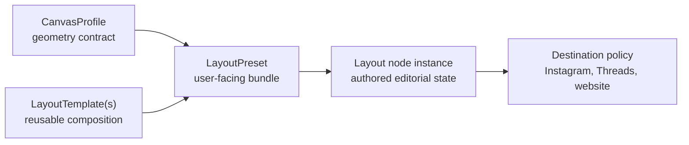

# Platform-neutral layout profile and preset model

## Recommendation: two abstractions, not one overloaded profile

Use `CanvasProfile` for the stable geometry contract and `LayoutPreset` for the
photographer-facing bundle.

- A **CanvasProfile** answers “what coordinate space and output surface is
  this layout authored against?”
- A **LayoutPreset** answers “which named starting configuration, templates,
  defaults, hints, and safe areas should the UI offer?”

This avoids making an aspect ratio responsible for a template catalog while
also avoiding publication-owned layout types.



## CanvasProfile

Proposed fields:

```rust
struct CanvasProfile {
    schema_version: u32,
    id: ProfileId,
    version: u32,
    display_name: String,
    width_px: u32,
    height_px: u32,
    pixel_aspect: Rational,
    orientation: Option<OrientationHint>,
    safe_areas: Vec<SafeArea>,
    color_contract: Option<ColorContractHint>,
}
```

Width and height are canonical authoring coordinates, not merely an aspect
string. Aspect is derived and stored canonically as a reduced rational for
compatibility checks. Safe areas are named normalized rectangles/polygons with
semantic purpose; they are not hard-coded social-platform rules.

Color contract is optional because current layout PSBs require 32-bit Display
P3 Linear, but geometry should not become Photoshop-specific. It can be a
materialization requirement/hint resolved by the downstream node.

## LayoutPreset

Proposed fields:

```rust
struct LayoutPreset {
    schema_version: u32,
    id: PresetId,
    version: u32,
    display_name: String,
    canvas: CanvasProfileRef,
    template_catalog: Vec<TemplateAvailability>,
    default_template: TemplateRef,
    placement_defaults: PlacementDefaults,
    decoration_defaults: DecorationDefaults,
    output_naming_hints: Option<OutputNamingHints>,
    downstream_hints: BTreeMap<String, VersionedValue>,
}
```

Hints are non-normative. A publishing node validates its own hard constraints.
For example, an Instagram destination can recommend the Instagram Portrait
preset but cannot mutate the Layout instance or make Instagram the owner of
3:4 geometry.

## LayoutTemplate responsibilities

A template owns:

- stable name/version and display metadata;
- kind/capabilities;
- normalized slots and slot semantic types;
- decoration/annotation structure;
- canvas compatibility constraints;
- optional materialization assets such as a fingerprinted reference document.

A template does not own:

- publication account or destination;
- frame-count maximum;
- project, post, or node instance;
- assigned assets or their crops;
- Cloudinary/WSP delivery behavior.

The current `WspContract` should eventually move out of `LayoutTemplate` into a
materialization recipe or Photoshop adapter capability. `reference`,
comparison, and edit-comparison fields may remain template extensions but
should use versioned capability payloads rather than expanding one core struct
for every template family.

## Template compatibility and reuse

Templates using normalized geometry can often work with multiple profiles.
Declare compatibility explicitly:

```rust
enum CanvasCompatibility {
    Any,
    ExactProfile(Vec<CanvasProfileRef>),
    AspectRange { min: Rational, max: Rational },
    Predicate(CapabilityPredicate),
}
```

`full-frame`, `stacked-two`, `stacked-three`, and the normalized `grid-four`
geometry are reusable across 3:4 and 9:16. The two current grid JSON files have
identical normalized slots; their different pixel cells come from the canvas.
They should converge to one future template without rewriting existing
versions.

Dynamic Range Comparison and Edit Comparison currently have separate inspected
geometries for 3:4 and 9:16. They may remain separate template versions or
become variants selected by an explicit compatibility table. The important
change is that the variant is selected by canvas compatibility, not by
`PostPlatform::Threads`.

Continuous panorama uses source-crop sizing rather than profile sizing. Model
that as a template canvas policy/capability. It can output a multi-frame
surface description without making the Layout profile a social destination.

## Layout node instance responsibilities

The instance owns:

- selected preset and a resolved profile snapshot;
- ordered editorial items;
- template choice per item;
- asset/rendition assignment per slot;
- `fill`, `contain`, or authored `crop`;
- focal point and exact quarter-turn rotation;
- normalized crop transforms;
- item labels/output-name intent;
- authored revision and undo history.

The instance does not own provider credentials, publication receipt, or host
installation status. Two instances can share the same preset and remain fully
independent.

## Bundled presets

Suggested bundled records:

```text
CanvasProfile: photara.canvas.3x4-portrait@1
  4500 × 6000

LayoutPreset: photara.preset.instagram-portrait@1
  label: Instagram Portrait
  canvas: photara.canvas.3x4-portrait@1
  templates: full-frame, stacked-two, grid-four, comparison variants...
  downstream hint: instagram-compatible

CanvasProfile: photara.canvas.9x16-vertical@1
  4500 × 8000

LayoutPreset: photara.preset.threads-portrait@1
  label: Threads Portrait
  canvas: photara.canvas.9x16-vertical@1
  templates: full-frame, stacked-three, grid-four, comparison variants...
  downstream hint: threads-compatible
```

The labels can remain familiar while identifiers express that they are
presets, not fundamental node types.

## Custom user profiles and presets

Users may create a CanvasProfile with validated positive dimensions, rational
aspect, and optional safe areas, then create a LayoutPreset choosing compatible
templates and defaults. User records need stable UUID-backed IDs, schema
version, content digest, and origin (`bundled`, `user`, `plugin`). Updating a
preset creates a new version or changes only future defaults; existing Layout
instances retain their resolved snapshot.

Plugins may contribute profiles/presets through registration. Core validates
them before exposure. A plugin cannot shadow a bundled ID/version.

## Publication compatibility

A destination declares requirements downstream:

```rust
struct LayoutAcceptance {
    accepted_aspects: Vec<RationalOrRange>,
    min_frames: u32,
    max_frames: Option<u32>,
    accepted_color_outputs: Vec<ColorOutputContract>,
    naming_policy: NamingPolicy,
}
```

It consumes a `LayoutPlan` or materialized artifact set and produces validation
diagnostics. It may recommend a preset ID. It does not own the profile or
rewrite layout state.

Instagram's current 1–20 frame constraint moves here. Threads publication
identity and filename compatibility move here/delivery. Neither belongs in
`CanvasProfile`.

## Mapping current PlatformProfile

| Current field/behavior | Future home |
| --- | --- |
| `name` (`instagram-portrait`, `threads-portrait`) | Bundled `LayoutPreset` ID/display metadata |
| `width`, `height` | `CanvasProfile` |
| minimum/maximum delivery frames | Destination `LayoutAcceptance` policy |
| `grid-four` default switch | Preset template catalog/defaults; eventually one normalized template |
| post path under platform | Compatibility projection/storage namespace |
| edit-comparison platform versions | Template compatibility/variant resolution |
| delivery/publication provider | Destination node configuration |

## Conditionals to remove from layout core over time

- `PostPlatform::profile()`;
- platform switch in `add_grid_four`;
- dual-platform-specific authoring structures;
- “both Instagram and Threads” loops for edit-source preparation;
- platform directory choice in generic post/layout storage;
- delivery-frame validation in layout resolution;
- platform identity in generic Layout manifests.

Compatibility adapters may retain these while v0.1 commands exist. Removing
them from new core types must precede deleting them from legacy adapters.
