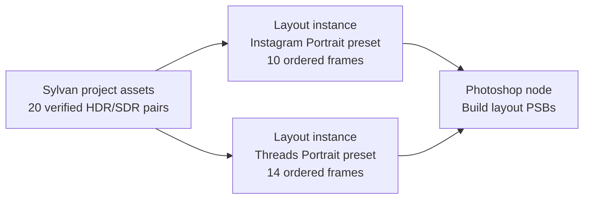

# First usable Layout UI vertical slice

## User outcome

The photographer opens a Photara project, sees verified flattened masters,
builds independent 3:4 and 9:16 editorial layouts visually, authors every crop
in Photara, and asks Photoshop to materialize the resulting PSBs. They no
longer need to assemble a CLI worksheet or use Photoshop selections to decide
framing. Released CLI and Photoshop paths remain available for recovery and
debugging.

## Reference graph: Sylvan

The exact source count is read from current project state; the diagram uses the
known Sylvan proof conceptually. The authoritative numbered publication order
remains evidence, not a universal layout constraint.

## UI structure

### Graph workspace

- node canvas with explicit typed connections;
- selection highlights one node and opens its inspector;
- status badge and concise diagnostic count on every node;
- run-to-node and inspect-value actions;
- no requirement to expose every workflow as a node.

### Disk node inspector

- project picker and mounted/unmounted status;
- count of current verified flattened HDR/SDR pairs;
- search/filter and compact proxy grid;
- source fingerprint and proxy-generation status on demand;
- recheck action that distinguishes unavailable storage from changed bytes.

### Layout rich inspector

Three coordinated panes:

1. **Assets** — searchable thumbnail grid from the upstream `AssetSet`.
2. **Editorial sequence** — ordered item cards with template name, slots,
   diagnostics, duplicate/reorder controls, and target frame count.
3. **Canvas** — actual composition at profile aspect with safe areas, slot
   outlines, fit policy, and direct crop/rotation interaction.

The inspector docks normally and expands into a large/full authoring workspace.
The same semantic commands and undo stack operate in either presentation.

### Photoshop inspector

- Photoshop detected and supported version;
- bridge/plugin installed and protocol version;
- local device/host status;
- output root and reuse policy;
- pending/reused/dirty item counts;
- run, cancel, retry failed, install/update, and recheck actions;
- link from each receipt/artifact to reveal/open it.

## Editing workflow

1. Add Disk node and choose Sylvan.
2. Add two Layout instances and connect Disk output to both.
3. Choose bundled Instagram Portrait and Threads Portrait presets.
4. Add items from a template gallery (`full-frame`, stacks, `grid-four` in the
   initial implementation).
5. Drag asset proxies into slots; repeated asset use is allowed.
6. Choose `fill`, `contain`, or `crop` per placement.
7. For `fill`, drag focal point if needed; for `contain`, preview background;
   for `crop`, manipulate the normalized frame directly.
8. Apply exact 90-degree rotations before crop resolution.
9. Reorder items visually. Order remains authored state and is included in the
   LayoutPlan digest.
10. Connect both Layout outputs to Photoshop, inspect readiness, and run.
11. Core resolves pixel geometry, emits the compatibility render request,
   verifies Photoshop receipts/files, and presents artifacts.

Every edit is a Core command. Saving the native document persists authored
state. Photoshop is not opened until materialization.

## Initial feature boundary

Must support:

- verified flattened paired masters;
- thumbnails and larger authoring previews;
- arbitrary positive item count at the layout level;
- multiple independent Layout instances;
- full-frame, stacked-two, stacked-three, and grid-four;
- slot assignment, reorder, fill/contain/crop, focal point, quarter turns;
- exact normalized crop editing and target preview;
- current PSJS-backed Photoshop materialization and verification;
- import of existing v0.1 post specifications;
- CLI inspection/validation of graph/node values.

May follow after the first usable slice:

- continuous panorama seam UI;
- Dynamic Range and Edit Comparison rich controls/reference editing;
- custom annotated template authoring;
- publication, WSP, Lightroom, proofing, or Cloudinary nodes;
- remote proxy providers;
- third-party plugins;
- collaborative/multi-machine graph editing.

The resolver architecture must account for advanced templates even if their
authoring UI initially opens them read-only or routes them through the legacy
workflow.

## Mapping current commands

| v0.1 command | Layout UI/Core operation |
| --- | --- |
| `posts init` | Create Layout node instance/authored document |
| `posts add-full-frame` | Add item with Full Frame template and assign asset |
| `posts add-stacked-two/three` | Add item from stack template and fill slots |
| `posts add-grid-four` | Add Grid Four item and fill slots |
| `posts set-fit` | Set placement fit command |
| `posts set-transform` | Set rotation/crop command |
| `posts reorder` | Drag reorder / ordered command |
| `posts prepare-authoring` | Replaced by in-app crop session and proxies |
| `posts apply-authoring` | Replaced by saving validated authored state |
| `posts resolve` | Live/explicit Layout validation and resolve |
| `posts prepare-render` | Photoshop node plan/materialization request |

The CLI commands stay. Compatibility adapters allow them to inspect or project
the same state during migration.

## Preview pipeline spike

Before building the rich editor, test representative HDR/SDR flattened TIFFs:

- embedded preview availability and quality;
- decode latency and memory at thumbnail/authoring sizes;
- 32-bit Display P3 Linear to HDR display mapping;
- SDR fallback appearance;
- portrait, landscape, unusually tall/wide, and rotated sources;
- source-change invalidation and NAS-unavailable behavior.

Choose a codec/ColorSync strategy only after measurements. The abstraction is
`VisualProxyService`; Layout code should not know whether ImageIO, another
local decoder, Lightroom, or a remote provider produced the proxy.

## Photoshop migration

### First implementation

Reuse `Build Photara Layouts.psjs` behind a new Photoshop node adapter. Convert
`ResolvedLayoutPlan` into the current `LayoutRenderManifest`, install/check the
script, dispatch through the current host workflow, and validate the report and
artifacts as today. Crop data now comes from Layout state.

The existing Author/Capture placement scripts remain installed for legacy
projects/recovery but are not used by the normal graph.

### Target implementation

Move dispatch and status into a persistent UXP panel/bridge with unique
execution IDs and no fixed project-root manifest names. Preserve the same
host-neutral request/receipt boundary. The UXP plugin performs Photoshop-only
operations and reports exact results; Core remains authoritative.

## Undo, recovery, and concurrency

- Every authored edit is an undoable command against a graph revision.
- Long-running proxy/render work never holds an authored-state lock.
- Evaluation captures an input revision/digest and cannot commit as current if
  the node changed during execution.
- Cancellation leaves prior successful outputs current and marks the new
  evaluation cancelled/incomplete.
- A stale receipt can be retained as history but never applied to a newer
  LayoutPlan.
- Concurrent GUI/CLI edits require optimistic revision checks; conflict policy
  remains a design decision before multi-client editing.

## Acceptance tests

1. Import Red Meridian Instagram and reproduce 18 items/20 frames and the
   existing resolved fixture hashes/geometry.
2. Import its independent Threads layout without copying transforms.
3. Import Sylvan's 10- and 14-frame actual publication orders.
4. Make one 3:4 crop change; only that Layout instance and affected Photoshop
   item become dirty.
5. Change the corresponding 9:16 crop; the 3:4 instance stays clean.
6. Unmount NAS; status becomes unavailable, not source-changed.
7. Remount unchanged; cached proxies and plan return to valid state.
8. Change one flattened rendition intentionally; only dependent placements
   invalidate and authored normalized crops remain reviewable.
9. Materialize through the legacy PSJS adapter and reproduce the current PSB
   contract.
10. Validate the same graph from CLI and GUI with identical diagnostics.
