# Library Lifecycle — LL0 contract and native review checkpoint

Status: **accepted by Suhail, including the revised upward Library/account menu**.
Base: remote `main` verified 2026-09-15 at `913f3526f51eaa1aaf34ef83ead2860869465e85`,
the documentation child of accepted/published UI1 `b0c2ba7`.
This checkpoint authors lab fixtures and this contract only. It does not enable a
production lifecycle command. No migration number is reserved and no DDL is executed.

## 1. Scope and reconciliation

UI1 is accepted and published, including the Compact Create Project sheet, native
Opening, transactional project creation/recovery and final Graph gate (19,093
assertions, zero failures). Older “uncommitted”/“wiring pending” text in the roadmap
history describes earlier checkpoints, not current status. See
[UI1 checkpoint](UI1_INTEGRATION_CHECKPOINT.md) and
[UI authoring sequence](UI_LADDER_AND_AUTHORING_SEQUENCE.md).

LL0 precedes production Library Lifecycle. UI2 project browsing/recovery, UI3 Graph
integration, CXT4e second-Mac acceptance, COV0/COV1 and Gallery remain separate.
COV0 has one previously recorded `ROADMAP.md` merge conflict; retain both roadmap
entries when that proposal is separately reconciled. This task imports none of it.

“Remove Library” means delete its database aggregate, including catalog records
and references, transactionally. It is neither “leave membership,” “hide this Mac’s
Library,” account deletion, nor a project/package lifecycle command.

## 2. Exact invariants

1. Library identity is an immutable UUID. A name is presentation, never an identity,
   path, credential, authorization proof or default selector. Renames preserve IDs.
2. A cloud-member Library’s service is authoritative. SQLite is an offline projection;
   cached membership cannot authorize cloud create, rename or removal. Local-only
   Libraries use the explicit verified database/local-principal controller, never
   inferred ownership from a path. No automatic mode conversion or account merge.
3. Create, rename and remove each have one immutable operation ID and canonical
   request hash, generated and durably recorded before dispatch. Same principal +
   operation + bytes returns the same terminal outcome. Different bytes under the
   same ID is a conflict. Retries never mint replacement IDs automatically.
4. Removing a Library atomically deletes all owned domain rows and live references,
   including tombstoned domain rows. No retained Library tombstone or catalog stub
   substitutes for cleanup. Referential integrity remains enabled. No orphan rows,
   partially visible aggregate or post-removal writable stream is permitted.
5. **Files remain on disk. Project packages (.photara), source photographs, archives,
   and NAS or cloud objects are not deleted.** No package open, rename, unlink,
   traversal, garbage collection, source scan or object-store delete is part of
   removal. Remove database paths/bookmarks without resolving them. Even owned
   cache files remain in this slice; separate explicit cache maintenance may follow.
   Legacy databases/files, other Libraries and shared media bytes remain untouched.
6. Historical package Library IDs remain historical. Removing a project catalog
   reference removes neither its package nor its authored Graph/snapshots. A later
   package-open/reassociation slice must explicitly handle an absent owning Library;
   opening a retained package must never recreate the deleted Library or grant access.
7. Cloud removal requires current active account/device and **owner** membership at
   both impact preparation and transactional commit. Admin/editor/viewer and project
   grants alone cannot rename/remove a Library in this slice. Local removal requires
   the current local controller. Re-check authority after every awaited boundary.
8. There are two deliberate gates: exact Library-name retyping against the reviewed
   revision, then a native final destructive confirmation. Enter in the text field
   is not final consent. Cancellation before dispatch has no catalog effects.
9. Removal audit/receipt and a terminal anti-resurrection marker survive outside the
   deleted aggregate. Their IDs are historical scalar evidence, not dangling foreign
   keys or usable catalog references. This exception retains no project contents,
   package paths, bookmarks, tokens, membership rows or stream payloads.
10. No disk/package action is used to compensate for an uncertain cloud outcome.
    Cloud commit and local cleanup are separate atomic transactions; the UI reports
    “removed in cloud, local cleanup pending” until the second completes.

## 3. Names, defaults, selection and creation

Names: trim leading/trailing Unicode whitespace once when creating/renaming; require
1–128 UTF-8 bytes after trimming, no control characters. Preserve case and Unicode
sequence. Duplicate display names are allowed; selectors additionally show authority,
account context and a short stable ID when ambiguous. Removal compares UTF-8 bytes
with the authoritative displayed name, without trim, case-fold or normalization.
A canonically equivalent but byte-different entry is not confirmation. Offer a clear
mismatch message and selectable reference text; no prefilled confirmation value.

**Default/last policy for this bounded release:** do not remove any Library that is
an account default for any account, or the bootstrap local default, or the last
active owned Library in its authority domain. The service checks every affected
account, not only the requesting owner. Rename is allowed. Switching does not change
defaults. Default reassignment, removing the last Library and account deletion need
a later accepted contract; do not silently choose/recreate a replacement. A member
with no remaining accessible Libraries sees an empty selector and explicit Create/
Sign In actions; membership is not invented. This is a deliberate review decision.

Create Library is distinct from onboarding/bootstrap and UI1 Create Project. An
already authenticated account may explicitly create an additional empty cloud
Library: Library row + contract state + owner membership + empty library stream +
receipt commit together. No project, Graph, package or storage binding is created.
Online account/device and create entitlement must be checked by the service. A local
creation commits Library + explicit controller + receipt in SQLite. It can run offline.
An offline cloud draft is editable but cannot be dispatched or silently become local.
Neither operation changes default or current selection until creation is confirmed
and local projection succeeds. “Open Library” then selects the new ID explicitly.

Selection is per device/session, scoped to account (or local principal), separate
from the account default. A switch resolves unsaved work only when a project actually has unsaved changes,
using existing project save/close/cancel behavior; save failure leaves the old selection intact. It changes no
project ownership. Atomically persist the selected ID only after target projection
is readable and access is valid; dispose old Library observers, pickers, in-flight
responses and project context. All async responses carry the selection generation;
old responses cannot populate the new Library. Offline selection allows previously
validated cached cloud Libraries under existing offline read policy, visibly marked
“Offline”; no lifecycle write is enabled. Missing/unhydrated targets need connectivity.
A stale removed/revoked selection is cleared on reconciliation; show the reason and
return to an accessible default if valid, otherwise the selector. No automatic create.

Rename uses owner/local-controller authorization, expected Library revision, canonical
new name and operation ID. Service serializes with other Library mutations, updates
name/revision and lifecycle feed/receipt atomically. No last-write-wins overwrite:
revision conflict reloads the new name and asks for a new review. Cloud offline rename
is draft-only. Renaming does not rename packages, paths, projects or default identity.

## 4. Removal request and operation state machines

Prepare response contains: Library ID/name/revision, authority mode, authorization
generation, actor/device, expiry (five minutes), aggregate mutation generation,
impact digest and category counts, default/last flags and known pending blockers.
The digest includes per-table row counts and affected project/membership IDs in
canonical order internally; UI shows categories without leaking hidden project data.
Count all rows including revoked/tombstoned ones, and label active vs total where
useful. Show projects, members, invitations, typed records, grants, streams, storage
references, media links, local bindings and known pending operations. Never claim
other Macs’ unsent work is known. The service never accepts caller-supplied counts.

Final canonical request includes operation ID, Library ID, reviewed name/revision,
authorization and aggregate generations, impact token/digest, exact typed bytes and
explicit final-consent version. Token binds actor/device and cannot be reused for a
different Library or operation. Save the accepted consent/request before dispatch.
Expired token, concurrent rename, membership/default change or aggregate mutation
invalidates review: fetch fresh impact, clear typing and obtain both gates again
with a new operation after the old one is conclusively rejected. Do not auto-confirm.

| Operation | State machine |
| --- | --- |
| Create | draft → validating → prepared → dispatching → committed → projecting → ready; validation/cancel before dispatch → cancelled; uncertain reply → checking same ID; definitive rejection → editable new draft |
| Select | current → menu target → unsaved-project resolution only if needed → checking target → loading projection → automatically persisted selection; cancel/error → original selection; stale async results discarded |
| Rename | draft → validated/revision checked → prepared → dispatching → committed → projecting → ready; CAS conflict → fresh draft; lost reply → checking same ID |
| Remove | idle → preparing impact → blocked OR reviewing → exact name matched → final dialog → prepared durable intent → dispatching → committed receipt → local reconciliation → removed |
| Removal cancellation | review/final/prepared before dispatch → cancelled (no write); once dispatching, Close only dismisses UI and recovery continues, not cancellation |
| Removal failure | definitive denied/conflict/expired/blocker → no mutation, discard confirmation; transport timeout/process death → outcome unknown, query same operation; local failure after receipt → reconciliation pending |

At commit the service takes a Library-wide mutation lock (also used by every writer,
project registration, membership/invitation acceptance and stream producer), then
checks current account/device/ownership, default/last policy, snapshot generation,
name/expiry and known pending work inside the same serializable transaction. Lock
ordering must be uniform for affected accounts and Libraries; serialization failure
can retry internally only if the same reviewed snapshot is still valid. Old runtime
writers must be excluded by a service/API floor before this lock protocol is enabled.

Check durable receipt before expiry validation on a retry, but only after verifying
current actor identity/device. An accepted receipt is retrievable by its initiating
account even though its former membership is gone; other accounts cannot query it.
A retry cannot require the deleted membership to exist. It never executes the command
again. Receipt lookup returning “not found” alone is not proof of failure: retry the
same exact request through the unique operation key, serialized against a possibly
still-running request. Revoked devices cannot recover via their revoked credential;
a freshly authenticated device for the initiating account can retrieve the result.

## 5. Aggregate cleanup and retention decisions

Both databases require an enumerated dependency closure, including indirect FKs,
non-FK UUIDs and canonical payload references. The implementation must classify every
table, not merely tables containing a `library_id` column. These are required outcomes:

| Family | Removal disposition |
| --- | --- |
| Library and contract/controller | Delete after all dependencies; keep only detached terminal identity evidence |
| Project catalog, ownership, policies, locators, observations, catalog projections | Delete all owned project records and database references, including pending/closed records; never visit or alter packages |
| People, organizations, roles/labels/relationships, locations/kinds/term claims, social profiles | Delete entire owned typed aggregate, including aliases, claims and tombstones |
| Variables, values, expressions, dependencies, context projections/plans | Delete owned database state; package snapshots remain byte-identical |
| Memberships, project grants and invitations | Delete active/revoked/accepted/expired rows; delete invitation verifiers first; outstanding tokens become unusable immediately |
| Scoped and older library streams, batches, changes, sync clients, operation/base queues | Delete owned streams and payloads; remove receipt/batch cycles together under deferred constraints or approved replacement design; no ghost stream retained |
| Media links, library media, upload sessions | Delete owned database references/session authority; no remote object cancellation/delete call; shared media objects outside the aggregate remain. Prevent cleanup-triggered object GC |
| Storage roots/specs/slots/names, locators, host bindings/bookmarks, device observations | Delete owned rows, including private local paths, without opening/resolving bookmarks or touching volumes |
| Accounts, identities, devices/credentials, account-wide grants, onboarding session | Retain; device identity belongs to the account/Mac, not to the removed Library. No Auth0/Keychain operation |
| Defaults | Protected policy blocks deletion; do not mutate immutable account defaults |
| Billing/subscriptions/entitlements | Active billing obligation blocks removal pending separate billing resolution; historical Library-owned links need detached audit disposition, never an external billing side effect |
| Old claim/mutation/scoped receipts and security audit | Replace live Library references with detached historical evidence through an approved schema/retention boundary; preserve immutable original bytes when required for authentication/replay, but never treat embedded IDs as live authority |
| Local onboarding intents/receipts/dispositions/bindings, completed UI1 creation intents | Detach necessary replay evidence from the aggregate; remove live bindings and path-bearing creation records after converting to minimal terminal operation evidence. Historical authentication receipt bytes remain account-scoped and cannot rehydrate a removed ID |
| Local pending operations | Block user removal until known unresolved package creation/context application is settled through its owning workflow. Removal itself never rolls back a package |

For remote removal while another device has offline work: mark the Library fenced
before exposing any projection, stop dispatch and invalidate cached access. In one
local transaction replace pending commands with minimal detached “Library removed”
terminal dispositions (operation ID/hash/result; no package paths or command payload),
delete queues and owned projection, clear selection and apply terminal marker. Retained
packages contain authored state; no automatic re-registration, replay, export or
migration to another Library. Unresolved UI1 package staging stays untouched and is
reported as recovery requiring its own workflow. In-memory unsaved work is retained
for an explicit recovery choice; switching does not silently discard it.

## 6. Receipt, reconciliation and multi-device protocol

The detached terminal marker contains Library ID, removal operation ID and terminal
sequence/version. It survives for the lifetime of this database/service epoch and
permanently rejects reuse of that ID. Durable receipt contains initiating account/
local principal, device, operation/request digest, committed timestamp, reviewed
revision, impact counts and terminal result. Audit is append-only, account/private
scoped, with minimal historical IDs. No secrets, paths or names in routine logs.
No time-based receipt expiry in this slice; later retention design must preserve
anti-replay and lost-response recovery. Historical embedded Library UUIDs are evidence,
not orphan domain rows, and must have explicit type/reader semantics.

An account-level lifecycle inventory/reconciliation channel must outlive Library
streams. Commit removal, detached receipt/marker, and affected-account invalidations
in the same cloud transaction. Returning devices reconcile inventory before replaying
Library commands. Pagination has a consistent watermark; interrupted inventory must
not infer deletion from absence. An explicit removed/revoked result or authoritative
complete inventory fences access. Removed IDs remain nonreusable after reconnect,
restore from an old SQLite backup, or replay of an old onboarding response. Old clients
must fail closed through negotiated floors, not recreate default/removed aggregates.

Current members learn “Library removed” through their account invalidation; revoked
or unrelated users get no new catalog details. A removed Library’s deleted feed is
not the only notification route. Offline Macs cannot be synchronously erased: disclose
that their cached catalog may remain until reconnection. Once observed, reconciliation
is mandatory before access. No promise of immediate deletion from an offline device.

## 7. Schema finding — changes required, design gated

Baseline is 15 SQLite migrations / floors 5/5 and 14 PostgreSQL migrations / API floor
3. No existing migration is edited here. Existing `put_library` tombstoning is not
this operation. Current startup `ensure_default_library` and cloud `default_library`
assume bootstrap/default identity; selection and lifecycle must not reuse them to
create an additional Library or resurrect a removed one.

Read-only source evidence:

- SQLite `0013_onboarding.sql` retains immutable intents/receipts and nondeletable
  cloud bindings pointing to Libraries; `0014_onboarding_dispositions.sql` retains
  their disposition chain. `0015_project_creation.sql` retains nondeletable intents
  with Library FK and destination/stage data. Hard deletion cannot pass those guards.
- PostgreSQL `0001_identity_library.sql` claim receipts and `0005_mutations_feed.sql`
  security audit reference Libraries. `0011_scoped_sync.sql` has a deferred receipt/
  batch cycle; receipts are Library-scoped and cannot survive aggregate deletion.
- PostgreSQL `0014_onboarding.sql` makes defaults immutable and requires active owner
  coordinates. Session/bootstrap currently projects that default, not an arbitrary
  selected Library. Protecting defaults avoids broadening this behavior here.
- Existing membership/project-access commands do not constitute Library removal
  authorization. Their receipt/retry pattern is useful, but scope/retention changes
  are essential. Neither database provides the detached lifecycle terminal ledger
  plus account inventory protocol required above.

**Conclusion:** schema changes are needed for complete removal and durable lifecycle
recovery; plain create/name storage itself fits current Library columns. Selection
needs a distinct durable account/device selection design. When separately authorized, LL1 must
specify unnumbered schema signatures for detached ledger/dispositions/inventory and
narrow guarded retirement of old Library-bound recovery rows. Do not disable FK/
immutable guards globally, quietly use extensions JSON, reserve a migration ordinal,
execute DDL or claim deletion works today. Preserve authentication receipt validity
and existing UI1 recovery before allowing any destructive command.

## 8. Accepted native switcher checkpoint

Suhail approved this interaction hierarchy after the first LL0 review. It supersedes
the first proposal’s all-Libraries sidebar and ordinary Switch Library button.
The revised native presentation is accepted. Lifecycle persistence remains gated.

- A persistent bottom-left native **menu** preserves the accepted avatar + user display
  name identity row. The active Library name stays at the top of the sidebar; it is
  not duplicated in the closed trigger. Local/signed-out state shows a native generic
  identity labeled On This Mac. Ordinary activation is a left click. The sidebar `List` holds
  only Projects, People, Locations and Location Kinds for that active Library.
- Menu uses native sections and menu items: current context, signed-in account
  identifier and its cloud Libraries, then **On This Mac** for true local-only Libraries.
  The selected item supplies the native current checkmark. A cloud Library’s offline
  projection never becomes a second local-only entry.
- New Library… and Library Settings… are separated from Account Settings… and Sign
  Out. Signed-out/unsigned-build fixtures show On This Mac and Sign in with Google instead of
  inaccessible cloud choices. The Google action requests the existing supported authentication
  flow; the lab records that intent only. It does not implement or change authentication.
- No Add Account command until multi-account authentication exists. The typed choice
  keeps account identity separate from Library identity so future grouping is possible;
  this release presents only the signed-in account. The open menu, not its closed
  trigger, displays active Library/context and account identifier. Account Settings is an account-flow
  entry point, never another Library or a new authentication implementation.
- Duplicate names within the same authority group receive a short stable ID suffix
  only when necessary. Account group headings already disambiguate cross-account
  names. Current identity is keyed by ID, not by display name or row index.
- There is **no general Library Save**. Successful access/projection validation commits
  device selection automatically. Save and Switch is exclusively a resolution action
  for an unsaved Project and saves that Project through its existing owner. Clean
  switching has no confirmation sheet. Cancel or failed validation keeps the old
  Library, its content context and its selection unchanged.
- Offline cloud context remains labeled Cloud · Offline. Downloaded projections remain
  selectable under the offline policy; unavailable projections are disabled. Selection
  must still handle races: an inaccessible/removed target produces a recovery message
  without replacing the current Library. A removed target is evicted after authoritative
  removal; simple denial is not misreported as deletion.
- Library Settings hosts rename/removal/impact/recovery/receipt views. Ordinary switching
  is exclusively in the persistent menu; the earlier management Switch button is gone.
  Create and Rename retain explicit transactional sheet actions.

```mermaid
stateDiagram-v2
    [*] --> CurrentLibrary
    CurrentLibrary --> NativeMenu: Activate bottom-left switcher
    NativeMenu --> CurrentLibrary: Escape / current item
    NativeMenu --> CheckTarget: Choose target, no unsaved project
    NativeMenu --> ResolveProject: Choose target, unsaved project
    ResolveProject --> CurrentLibrary: Cancel / save failure
    ResolveProject --> CheckTarget: Existing project resolution succeeds
    CheckTarget --> CurrentLibrary: Denied / removed / uncached offline
    CheckTarget --> LoadProjection: Access valid
    LoadProjection --> CurrentLibrary: Load failure; retain old selection
    LoadProjection --> PersistSelection: Projection ready
    PersistSelection --> CurrentLibrary: New Library, new selection generation
    NativeMenu --> LibrarySettings: Library Settings
    LibrarySettings --> CurrentLibrary: Return to active content
```

Selection requests are tagged with an increasing request generation before any async
access or projection load. Only the latest requested target may commit; switching A→B→C
cannot let a late B result overwrite C. The committed selection generation invalidates
old observers after success. Cancellation invalidates the request generation without
changing the committed selection. The synchronous fixture does not simulate network
races; these remain mandatory persistence/adapter furnaces.

Presentation uses native SwiftUI NavigationSplitView/List and AppKit NSButton/NSMenu
with system font, accent, materials and checkmarks. The menu opens **above** the
identity row using `NSMenu.popUp(positioning:at:in:)`, anchored to the button with
its native menu height. SwiftUI Menu and NSPopUpButton preferred-edge placement did
not honor that requirement on the tested macOS build. The external probe asserts
the menu bottom is at or above the trigger top in every tested context. No authored sidebar colors,
row sizing, blur/shadow or custom menu panel. No Notion visual assets or styling.
Unsigned builds expose the existing Google action as unavailable with native explanatory
text directing the user to signed Photara; they never pretend cloud access exists.
A signed-out supported build exposes the enabled action. Neither fixture signs in.

Lab-only source has no Core, database, credential or package dependencies. Local
fixture Sign In/Account Settings callbacks report intent and never launch a real flow.

## 9. Acceptance furnaces (future implementation gates)

| Gate | Required independent evidence |
| --- | --- |
| Local-only | Additional create/select/rename/remove in disposable SQLite; wrong controller denied; restart; default/last protected; no cloud dependency |
| Cloud | Disposable service/PG and two isolated SQLite devices; owner success; admin/editor/viewer/project-only denied; active billing blocker; no production credentials |
| Confirmation | Empty/case/space/Unicode byte mismatch rejected by UI and service; exact match alone cannot dispatch; explicit final click required; cancel/Escape clears gates |
| Concurrency | Two owners remove once; create/rename/grant/invite/default races invalidate impact; all writers share lock; serializable abort has no partial state |
| Retries | Drop reply before/after commit; crash at each durable boundary; same ID replay; altered bytes rejected; not-found versus in-flight; expired token after commit still recovers |
| Cancellation | Cancel review/final/pre-dispatch writes nothing; cancel dispatch is unavailable; closing/restarting preserves unknown outcome |
| Multi-device | Offline edits then remote removal; inventory before upload; page interruption; stale backup; stale onboarding receipt; no resurrection or payload replay |
| Integrity | Populated fixtures exercise every table including revoked/tombstoned rows and cyclic references; independently enumerate FK and logical edges; zero owned rows; no dangling references; SQLite integrity/FK checks and PG integrity queries; unrelated rows equal before/after |
| Files | Canary packages, symlinks, source/archive files, NAS/object-store fakes and shared caches have byte/name/metadata manifests unchanged; filesystem capability spy records zero package/source write/delete/open requests from removal; object API delete count zero |
| Pending work | Known UI1/context operations block; remote removal fences another Mac’s staged operation without package compensation; historical receipt remains readable but not applicable |
| Native | Light/Dark/narrow, keyboard/VoiceOver order, readable warning and counts, disabled continue, native final dialog, stale/denied/recovery states; accepted Opening/Compact/Graph regression |
| Upgrade | Explicit floor negotiation; old writer refuses new contract; migrated authentication/UI1 receipts recover; default bootstrap remains stable; no production DDL before release approval |

## 10. Accepted checkpoint and next distinct slice

Suhail accepted LL0 semantics and the revised native switcher. The reviewed contract,
lab fixtures, captures and evidence may be committed and pushed as one normal
fast-forward checkpoint. This does not authorize installation or production wiring.

The next distinct slice is **Project Session and Graph Durability PS0**, starting
from the clean published LL0 commit. PS0 is not begun by this checkpoint.
**LL1: Library Lifecycle typed contracts and unnumbered schema delta review** remains
separately gated. It still defines command/receipt/inventory types, the per-table
disposition matrix, guarded retention transitions and independent protocol fakes;
PS0 does not silently start or replace it. LL1 does not expose a production Remove
action or execute migration DDL. Later Library Lifecycle gates remain schema
acceptance → disposable persistence/service furnaces → approved shared views wired
to native adapter → regression checkpoint → separately authorized rollout.

## Current identity-menu review images and evidence

**Accepted LL0 artifacts.**

The closed trigger preserves the user avatar/display name; no Library name appears
there. These supersede the first LL0 navigation screenshots. They use synthetic
Suhail / suhail@example.com, never a fetched profile or live account.

| Current state | Light | Dark |
| --- | --- | --- |
| Closed identity trigger, narrow | [Light](mockups/library-lifecycle-switcher/switcher-cloud-light.png) | [Dark](mockups/library-lifecycle-switcher/switcher-cloud-dark.png) |
| Open native menu | [Light](mockups/library-lifecycle-switcher/menu-cloud-light.png) | [Dark](mockups/library-lifecycle-switcher/menu-cloud-dark.png) |
| Duplicate names | [Light](mockups/library-lifecycle-switcher/menu-duplicateNames-light.png) | [Dark](mockups/library-lifecycle-switcher/menu-duplicateNames-dark.png) |
| Offline cloud | [Light](mockups/library-lifecycle-switcher/menu-offline-light.png) | [Dark](mockups/library-lifecycle-switcher/menu-offline-dark.png) |
| Signed out / local | [Light](mockups/library-lifecycle-switcher/menu-signedOut-light.png) | [Dark](mockups/library-lifecycle-switcher/menu-signedOut-dark.png) |
| Unsigned build | [Light](mockups/library-lifecycle-switcher/menu-unsigned-light.png) | [Dark](mockups/library-lifecycle-switcher/menu-unsigned-dark.png) |
| Unsaved project | [Light](mockups/library-lifecycle-switcher/recovery-unsaved-light.png) | [Dark](mockups/library-lifecycle-switcher/recovery-unsaved-dark.png) |
| Removed target recovery | [Light](mockups/library-lifecycle-switcher/recovery-removedTarget-light.png) | [Dark](mockups/library-lifecycle-switcher/recovery-removedTarget-dark.png) |

The dedicated verifier exercises 81 context transitions and the local fixture rules,
then external accessibility on nine contexts in Light/Dark. Native checks inspect the
identity label, grouped items, exact current checkmark, absent Save/Add Account, and
native menu windows. Foreground-guarded HID left-button events open the menu; focused
Space/Down/Return changes the active Library; Escape dismisses it. Native menu actions
reach the Sign in with Google and Library Settings fixture callbacks. No authentication
is performed. Human VoiceOver speech, physical hardware feel, and asynchronous
production access/projection races remain future/manual acceptance checks.

The native compositor captures the real menu/window group, including system materials
and transparency. It is not a custom-rendered menu or a photographic mockup. The host
logs actual window geometry; the narrow window is 760 × 560 points. Captures are
unchanged native PNGs. The initial Library-name-trigger variants were discarded on
Suhail’s clarification; none is included in this current review set.

[Machine-readable current report](verification/library-lifecycle-switcher.json)
records hashes, gate results and retained failure history. Keyboard probes originally
mistook stale AX children and an unsettled menu window for dismissal evidence. The
final check uses explicit native dismissal behavior, native window settling, and an
independent bound-selection assertion. A later visual check found the unsaved sheet
changed the underlying destination; its shared fixture transition now preserves the
old content and asserts that Cancel does too. None of these tests relaxes the contract.

The upward-menu revision passed 22 native placement/action checks and the shared
UI regression (119 captures, 256 transitions, 50 contrast pairs). Shell Lab builds;
273 protected production paths match the baseline audit. See
[verification report](verification/library-lifecycle-switcher.json).

## Management-state captures and evidence scope

The same accepted capture set also contains the management states below. These are
lab-only synthetic lifecycle presentations, distinct from the Library/account menu.
Superseded navigation captures and redundant diagnostic logs were removed before
publication; no old Library-name trigger is part of the accepted inventory.

| Management state | Light | Dark |
| --- | --- | --- |
| Create | [Light](mockups/library-lifecycle-switcher/create-light.png) | [Dark](mockups/library-lifecycle-switcher/create-dark.png) |
| Rename | [Light](mockups/library-lifecycle-switcher/rename-light.png) | [Dark](mockups/library-lifecycle-switcher/rename-dark.png) |
| Removal attached sheet, narrow | [Light](mockups/library-lifecycle-switcher/attached-removal-light.png) | [Dark](mockups/library-lifecycle-switcher/attached-removal-dark.png) |
| Final native confirmation | [Light](mockups/library-lifecycle-switcher/final-dialog-light.png) | [Dark](mockups/library-lifecycle-switcher/final-dialog-dark.png) |
| Lost response | [Light](mockups/library-lifecycle-switcher/unknown-light.png) | [Dark](mockups/library-lifecycle-switcher/unknown-dark.png) |
| Receipt | [Light](mockups/library-lifecycle-switcher/receipt-light.png) | [Dark](mockups/library-lifecycle-switcher/receipt-dark.png) |

Build/run instructions are in the
[Shell Lab README](../../platform/macos/photara-shell-lab/README.md#library-lifecycle--ll0-review).
The [source audit](verification/library-lifecycle-source-audit.json) inventories 273
protected paths, including symlink targets and all 29 migrations, compared with the
verified parent. No database was opened or DDL executed. The ownership guard checks
40 Graph paths. Production Rust/PG/SQLite and full Graph furnaces are not rerun for
this lab/documentation checkpoint; their source inputs remain unchanged.

Fixture checks cover nonexact typing, separate final consent, cancellation, blocked
states and name validation. Native compositor captures include the real final dialog.
The fixture does not establish persistence, authorization or distributed correctness.
Human VoiceOver speech/navigation and management-sheet hardware interaction remain
manual acceptance checks; automated menu accessibility and mouse/keyboard results
must not be presented as spoken VoiceOver testing. Earlier capture/activation failures
are summarized in the current report; redundant raw diagnostics are not published.
