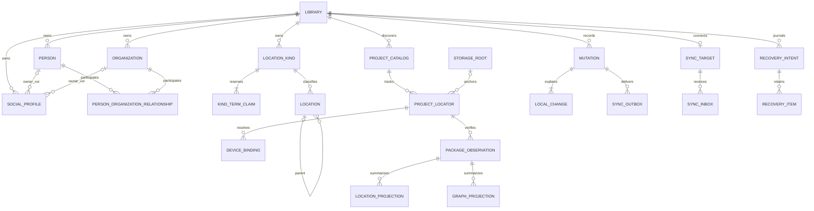

# Local SQLite schema

**Current baseline — 2026-09-12:** the user superseded D19 R1 physical-name
preservation because Generation Two is unshipped. Domain, package and SQL names
below use Library consistently. This is a clean baseline rewrite, with no rename
migration, alias, shadow column or live database change. See the
[rebaseline authority and evidence](LIBRARY_NOMENCLATURE_REBASELINE.md) and
[current execution order](../ROADMAP_0_2_EXECUTION.md). CXT3a is complete; local
D19 execution/app initialization and PostgreSQL/RLS remain separate CXT3b/c gates.

## D18 amendment — logical requirements only, DDL deferred

[D18](TYPED_CONTEXT_AND_EXPRESSIONS.md) reserves typed Library variable
definition/value, reserved-name and AST/dependency persistence under one aggregate
CAS revision. CXT2 must specify additive migration DDL, exact type/schema checks,
same-Library FKs, one-current-value, lifecycle/name-reservation guards, local
changes/idempotency and future sync shape. No generic untyped key/value table and
no editable Project/Graph variables in SQLite. Optional asset-metadata indexes
are rebuildable commit/checksum/fingerprint-qualified package projections only.
SecretRefs, host bindings and restricted data cannot leak into mutation payloads.
The new application receipt/retry protocol is not implemented by L2's history log.

No concrete DDL is added here: **44 tables, 179 statements, 95 triggers** and
L2 migrations 0001–0006/checksums have a separately verified Library rebaseline. D18 concept approval does not
authorize executing migrations or retroactively changing applied files. CXT2
must review schema floors, tests and counts before CXT3 disposable implementation.

Status: S3 design approved at S7; bounded L2 implemented and tested on fresh
temporary databases, 2026-09-11. The six ordered migrations install this 44-table
schema. See [actual API, tests and exclusions](LOCAL_LIBRARY_IMPLEMENTATION.md).
Sync/recovery tables and merge guards do not imply implemented workers/commands.
S4 remains an unexecuted service proposal; no live database is authorized here.

S5 reconciliation adds explicit Kind claim transfer/provenance and durable
receipt, inbox-position, supersession and snapshot state. See the
[synchronization contract](SYNCHRONIZATION_CONTRACT.md); the local tables are now
installed by L2, while service/protocol execution remains deferred.

Inputs: [accepted logical model](LOGICAL_DATA_MODEL.md),
[package schema proposal](PROJECT_PACKAGE_SCHEMA.md), and
[Storexa 0.2 integration](STOREXA_INTEGRATION.md). Existing
[`photara-library`](../../crates/photara-library/src/lib.rs) currently has an
inline schema-v1 migration, generic record JSON and `rusqlite` immediate
transactions. This proposal deliberately gives generation two a new schema
family and filename; it is not an in-place interpretation of that database.

## Scope and storage

Proposed local database:
`~/Library/Application Support/Photara/State/photara-local-v2.sqlite`.
The host creates/protects its parent and verifies it is local storage. Library
media and durable recovery objects live in sibling managed directories. Device
proxy caches remain outside this durable State directory. Do not put this file,
its WAL/SHM, or raw bookmarks in a `.photara` package or on SMB.

| Class | Authority and retention |
| --- | --- |
| Library records | Typed local working records, media references and pending edits are durable |
| Account/membership cache | Service projections only; cannot confer remote authority |
| Catalog/observation indexes | Derived from verified package commits; removable/rebuildable |
| Catalog visibility, logical roots/locators | User discovery preferences/metadata; not Project contents |
| Device bindings | Local paths and opaque secure-store references; never synced |
| Mutation/change log and outbox/inbox | Durable local edits and delivery evidence; never disposable cache |
| Recovery intents/items | Durable pending cross-store work until package publication is verified |
| Projects, graphs, assets, runs, receipts | Package authority; only summary projections or pending recovery copies here |

There is no authoritative SQL `projects`, `graphs`, `assets`, `runs` or node
state table. A category/node store is also outside S3. Earlier-generation Neon
data and import tools are optional later salvage work and are not schema or
release gates.

## Engine and physical conventions

Use SQLx's bundled SQLite through published Storexa 0.2.0. Require SQLite 3.38+
with JSON functions and STRICT tables; verify the actual runtime version and
features at startup. Use `foreign_keys=ON`, `recursive_triggers=ON`, a bounded
busy/acquisition timeout, local WAL and FULL synchronous policy. Configure every
connection, not just the migration connection. Migration exclusivity is a host
responsibility: SQLx SQLite migration locking does not supply a cross-process
migration lease. See [STRICT tables](https://www.sqlite.org/stricttables.html)
and [foreign-key rules](https://www.sqlite.org/foreignkeys.html).

IDs are 16-byte BLOBs converted through typed UUIDs; checksums are 32-byte
SHA-256 BLOBs. Empty/nil UUIDs and invalid names are rejected by Rust. `*_ms`
are UTC Unix milliseconds. Local revisions are positive signed-64-bit integers;
overflow rejects an edit. Package revisions are canonical unsigned decimal TEXT,
never converted to SQLite floating point. Server revisions/cursors are opaque
TEXT and compared only for equality until S4/S5 define their encoding.

JSON columns have named, typed roles: aliases, extensions, transport envelopes
or recovery objects. They are not a generic mutable Library entity store.
Rust validates element types, namespaced extensions, UUIDs, normalized keys,
canonical bytes/digests and size bounds. SQL checks enforce storage types, JSON
shape, identity scope, FKs and cardinality where expressible.

All authority writes pass through typed repositories. SQLite cannot natively
reproduce a pinned Unicode/semantic alias policy with NOCASE. No custom SQL
function or unimplemented Storexa extension is assumed. Both local repository
and service must recompute normalization keys from source terms before writing;
the SQL unique claims then arbitrate concurrent canonical/alias creation.
Direct arbitrary SQL is not a supported domain API.

## Migration organization and ledger

L2 installs Photara-owned files in
[`crates/photara-library/migrations/generation_two`](../../crates/photara-library/migrations/generation_two/0001_local_identity.sql),
`0001_local_identity.sql` through `0006_invariant_guards.sql`, matching these six
ordered sections. These blocks remain the design reference; the migration files
are the runtime source. Each migration is immutable after release.
Migrations run under startup writer reservation, before any
feature repository or sync worker serves requests. No runtime schema changes.

SQLx owns `_sqlx_migrations` (version, description, installed_on, success,
checksum, execution_time); do not duplicate, fabricate, or manually seed its
checksum ledger. Photara's `schema_metadata` records compatibility semantics,
not a second applied-migration list. `PRAGMA application_id = 0x50485432`
identifies the new family; `user_version` is a coarse family compatibility
marker only and never decides which SQLx migrations to replay. Startup rejects
a foreign application ID or incompatible schema family, even if user_version
happens to match.

The host creates the one metadata row, device row and approved normalization
policy from its verified release constants in the first initialization
transaction. Its database UUID is new for a new store; restoring a backup on
another device requires a documented device-rebind step. The DDL intentionally
does not invent production UUIDs, user Libraries or sign-in identities.

## 0001 — local identity and media

```sql
PRAGMA application_id = 0x50485432;
PRAGMA user_version = 2;

CREATE TABLE schema_metadata (
    singleton INTEGER PRIMARY KEY CHECK (singleton = 1),
    schema_family TEXT NOT NULL CHECK (schema_family = 'photara.local.g2'),
    database_id BLOB NOT NULL CHECK (length(database_id) = 16),
    schema_epoch INTEGER NOT NULL CHECK (schema_epoch = 1),
    minimum_reader INTEGER NOT NULL CHECK (minimum_reader >= 1),
    minimum_writer INTEGER NOT NULL CHECK (minimum_writer >= 1),
    canonical_codec TEXT NOT NULL CHECK (canonical_codec = 'photara.canonical-json.v1'),
    created_at_ms INTEGER NOT NULL
) STRICT;

CREATE TABLE normalization_policies (
    policy_version INTEGER PRIMARY KEY CHECK (policy_version >= 1),
    unicode_version TEXT NOT NULL,
    rules_sha256 BLOB NOT NULL CHECK (length(rules_sha256) = 32),
    description TEXT NOT NULL
) STRICT;

CREATE TABLE local_device (
    singleton INTEGER PRIMARY KEY CHECK (singleton = 1),
    device_id BLOB NOT NULL UNIQUE CHECK (length(device_id) = 16),
    display_name TEXT NOT NULL CHECK (length(trim(display_name)) > 0),
    created_at_ms INTEGER NOT NULL
) STRICT;

CREATE TABLE libraries (
    library_id BLOB PRIMARY KEY CHECK (length(library_id) = 16),
    display_name TEXT NOT NULL CHECK (length(trim(display_name)) > 0),
    state TEXT NOT NULL CHECK (state IN ('active', 'tombstoned')),
    local_revision INTEGER NOT NULL CHECK (local_revision >= 1),
    created_at_ms INTEGER NOT NULL,
    updated_at_ms INTEGER NOT NULL,
    retired_at_ms INTEGER,
    term_policy_version INTEGER NOT NULL,
    extensions_json TEXT NOT NULL DEFAULT '{}' CHECK (json_valid(extensions_json) AND json_type(extensions_json) = 'object'),
    CHECK ((state = 'active' AND retired_at_ms IS NULL) OR (state = 'tombstoned' AND retired_at_ms IS NOT NULL)),
    FOREIGN KEY (term_policy_version) REFERENCES normalization_policies(policy_version) ON DELETE RESTRICT
) STRICT;

CREATE TABLE account_cache (
    account_id BLOB PRIMARY KEY CHECK (length(account_id) = 16),
    display_name TEXT NOT NULL,
    state TEXT NOT NULL CHECK (state IN ('active', 'disabled', 'deleted')),
    server_revision TEXT NOT NULL CHECK (length(server_revision) > 0),
    observed_at_ms INTEGER NOT NULL
) STRICT;

CREATE TABLE membership_cache (
    library_id BLOB NOT NULL,
    account_id BLOB NOT NULL,
    membership_id BLOB NOT NULL CHECK (length(membership_id) = 16),
    role TEXT NOT NULL CHECK (role IN ('owner', 'admin', 'editor', 'viewer')),
    state TEXT NOT NULL CHECK (state IN ('active', 'revoked')),
    server_revision TEXT NOT NULL CHECK (length(server_revision) > 0),
    observed_at_ms INTEGER NOT NULL,
    PRIMARY KEY (library_id, account_id),
    UNIQUE (membership_id),
    FOREIGN KEY (library_id) REFERENCES libraries(library_id) ON DELETE RESTRICT,
    FOREIGN KEY (account_id) REFERENCES account_cache(account_id) ON DELETE RESTRICT
) STRICT;

CREATE TABLE library_media (
    library_id BLOB NOT NULL,
    sha256 BLOB NOT NULL CHECK (length(sha256) = 32),
    media_type TEXT NOT NULL CHECK (length(media_type) > 0),
    byte_length INTEGER NOT NULL CHECK (byte_length >= 0),
    width INTEGER CHECK (width > 0),
    height INTEGER CHECK (height > 0),
    created_at_ms INTEGER NOT NULL,
    PRIMARY KEY (library_id, sha256),
    FOREIGN KEY (library_id) REFERENCES libraries(library_id) ON DELETE RESTRICT
) STRICT;

CREATE TABLE media_local_state (
    library_id BLOB NOT NULL,
    sha256 BLOB NOT NULL,
    state TEXT NOT NULL CHECK (state IN ('pending', 'available', 'missing', 'corrupt')),
    verified_at_ms INTEGER,
    PRIMARY KEY (library_id, sha256),
    FOREIGN KEY (library_id, sha256) REFERENCES library_media(library_id, sha256) ON DELETE RESTRICT
) STRICT;
```

Authentication subjects/tokens are not duplicated here. The service owns
AccountIdentity and membership policy; a local-only Library has neither a
fake Account nor fake membership. Sign-out pauses delivery; it does not delete
local-only Library records or pending changes. Local access to already stored
bytes is not proof of current remote permission.

Library media bytes use a host-managed digest path. A synchronized descriptor
can exist before bytes arrive; only verified bytes become `available`.
Supplied thumbnails are durable Library media, unlike regenerable display
caches. No automatic media reclamation is specified for this initial version.

## Social profile and portable export refinement

The requested [D16/D17 addition](SOCIAL_PROFILES_AND_LIBRARY_EXPORT.md) adds one
typed `social_profiles` root table in 0002 and its guards in 0006. Local change
root vocabulary includes `social-profile`; profile edits use the same CAS/outbox
transaction as other roots. Library-wide scoped subject uniqueness prevents
one bound subject attaching to two owners; it does not identify People or reserve
mutable handles. Bound subjects remain reserved on tombstones. Provider/owner coordinates are immutable;
previously unknown subject coordinates may be adopted once. Parent retirement
requires profiles to be retired explicitly. Bound subjects cannot be cloned onto
the merge target; reattachment needs a separately approved transfer policy. Manual
unbound successors may have new IDs/provenance. Table records contain no tokens.

Safe URLs, provenance schema/size, consent/rights, provider-subject namespace and
expiry are typed Rust validations. Cache-only avatar bytes/URLs are not persisted
as durable media; only an explicitly permitted promotion references library_media.
Expired/disallowed media must not display/export merely because a descriptor exists.
Manual profiles need no provider access. Refresh is a normal revision-checked edit,
not a hidden write bypass. No automatic provider adapter is implemented here.

Future Library export reads a consistent **logical** snapshot, not this live DB/WAL.
The schema already exposes stable Library/StorageRoot/Project IDs and
media descriptors. Export/import jobs, encryption and activation bookkeeping can
use later additive migrations; no export-specific runtime tables are introduced.
Exclude device IDs/locators/bookmarks, account/auth caches, SQL migration ledger,
queues/cursors/leases and recovery state. Preserve safe relative discovery hints,
then explicitly rebind roots and verify packages after an isolated/dry-run restore.
No source revision or old server token overrides current destination state.

## 0002 — typed Library records

Shared revision/lifecycle columns are repeated deliberately in typed tables.
Child roles/labels belong to their parent aggregate: one semantic edit replaces
the relevant children and advances the parent revision once in one transaction.
They do not independently sync as unrelated records.

```sql
CREATE TABLE people (
    person_id BLOB PRIMARY KEY CHECK (length(person_id) = 16),
    library_id BLOB NOT NULL,
    record_schema INTEGER NOT NULL CHECK (record_schema = 1),
    local_revision INTEGER NOT NULL CHECK (local_revision >= 1),
    created_at_ms INTEGER NOT NULL,
    updated_at_ms INTEGER NOT NULL,
    state TEXT NOT NULL CHECK (state IN ('active', 'tombstoned', 'merged')),
    retired_at_ms INTEGER,
    merged_into_id BLOB CHECK (length(merged_into_id) = 16),
    display_name TEXT NOT NULL CHECK (length(trim(display_name)) > 0),
    sort_key TEXT NOT NULL CHECK (length(sort_key) > 0),
    description TEXT NOT NULL DEFAULT '',
    aliases_json TEXT NOT NULL DEFAULT '[]' CHECK (json_valid(aliases_json) AND json_type(aliases_json) = 'array'),
    thumbnail_sha256 BLOB,
    extensions_json TEXT NOT NULL DEFAULT '{}' CHECK (json_valid(extensions_json) AND json_type(extensions_json) = 'object'),
    UNIQUE (library_id, person_id),
    CHECK ((state = 'active' AND retired_at_ms IS NULL AND merged_into_id IS NULL)
        OR (state = 'tombstoned' AND retired_at_ms IS NOT NULL AND merged_into_id IS NULL)
        OR (state = 'merged' AND retired_at_ms IS NOT NULL AND merged_into_id IS NOT NULL)),
    CHECK (merged_into_id IS NULL OR merged_into_id <> person_id),
    FOREIGN KEY (library_id) REFERENCES libraries(library_id) ON DELETE RESTRICT,
    FOREIGN KEY (library_id, merged_into_id) REFERENCES people(library_id, person_id) ON DELETE RESTRICT,
    FOREIGN KEY (library_id, thumbnail_sha256) REFERENCES library_media(library_id, sha256) ON DELETE RESTRICT
) STRICT;

CREATE INDEX people_browse ON people(library_id, sort_key, person_id) WHERE state = 'active';
CREATE INDEX people_merge_target ON people(library_id, merged_into_id) WHERE merged_into_id IS NOT NULL;

CREATE TABLE organizations (
    organization_id BLOB PRIMARY KEY CHECK (length(organization_id) = 16),
    library_id BLOB NOT NULL,
    record_schema INTEGER NOT NULL CHECK (record_schema = 1),
    local_revision INTEGER NOT NULL CHECK (local_revision >= 1),
    created_at_ms INTEGER NOT NULL,
    updated_at_ms INTEGER NOT NULL,
    state TEXT NOT NULL CHECK (state IN ('active', 'tombstoned', 'merged')),
    retired_at_ms INTEGER,
    merged_into_id BLOB CHECK (length(merged_into_id) = 16),
    display_name TEXT NOT NULL CHECK (length(trim(display_name)) > 0),
    sort_key TEXT NOT NULL CHECK (length(sort_key) > 0),
    description TEXT NOT NULL DEFAULT '',
    aliases_json TEXT NOT NULL DEFAULT '[]' CHECK (json_valid(aliases_json) AND json_type(aliases_json) = 'array'),
    thumbnail_sha256 BLOB,
    extensions_json TEXT NOT NULL DEFAULT '{}' CHECK (json_valid(extensions_json) AND json_type(extensions_json) = 'object'),
    UNIQUE (library_id, organization_id),
    CHECK ((state = 'active' AND retired_at_ms IS NULL AND merged_into_id IS NULL)
        OR (state = 'tombstoned' AND retired_at_ms IS NOT NULL AND merged_into_id IS NULL)
        OR (state = 'merged' AND retired_at_ms IS NOT NULL AND merged_into_id IS NOT NULL)),
    CHECK (merged_into_id IS NULL OR merged_into_id <> organization_id),
    FOREIGN KEY (library_id) REFERENCES libraries(library_id) ON DELETE RESTRICT,
    FOREIGN KEY (library_id, merged_into_id) REFERENCES organizations(library_id, organization_id) ON DELETE RESTRICT,
    FOREIGN KEY (library_id, thumbnail_sha256) REFERENCES library_media(library_id, sha256) ON DELETE RESTRICT
) STRICT;

CREATE INDEX organizations_browse ON organizations(library_id, sort_key, organization_id) WHERE state = 'active';
CREATE INDEX organizations_merge_target ON organizations(library_id, merged_into_id) WHERE merged_into_id IS NOT NULL;


CREATE TABLE social_profiles (
    social_profile_id BLOB PRIMARY KEY CHECK (length(social_profile_id) = 16),
    library_id BLOB NOT NULL,
    person_id BLOB,
    organization_id BLOB,
    provider_id TEXT NOT NULL CHECK (length(provider_id) > 0),
    subject_namespace TEXT,
    provider_subject_id TEXT,
    handle TEXT CHECK (handle IS NULL OR length(handle) > 0),
    display_name TEXT NOT NULL DEFAULT '',
    profile_url TEXT CHECK (profile_url IS NULL OR length(profile_url) > 0),
    account_kind TEXT NOT NULL CHECK (account_kind IN ('unknown','personal','creator','business','organization','service','other')),
    provider_account_kind TEXT,
    verification_kind TEXT NOT NULL CHECK (verification_kind IN ('unverified','user-asserted','provider-authorized')),
    verified_at_ms INTEGER,
    provenance_json TEXT NOT NULL CHECK (json_valid(provenance_json) AND json_type(provenance_json) = 'object'),
    fetched_at_ms INTEGER,
    refreshed_at_ms INTEGER,
    next_refresh_after_ms INTEGER,
    fetch_state TEXT NOT NULL CHECK (fetch_state IN ('never','available','unavailable','revoked','expired','error')),
    avatar_policy TEXT NOT NULL CHECK (avatar_policy IN ('none','cache-only','durable-consented')),
    avatar_consent_at_ms INTEGER,
    avatar_expires_at_ms INTEGER,
    avatar_media_sha256 BLOB,
    record_schema INTEGER NOT NULL CHECK (record_schema = 1),
    local_revision INTEGER NOT NULL CHECK (local_revision >= 1),
    created_at_ms INTEGER NOT NULL,
    updated_at_ms INTEGER NOT NULL,
    state TEXT NOT NULL CHECK (state IN ('active','tombstoned')),
    retired_at_ms INTEGER,
    extensions_json TEXT NOT NULL DEFAULT '{}' CHECK (json_valid(extensions_json) AND json_type(extensions_json) = 'object'),
    UNIQUE (library_id, social_profile_id),
    CHECK ((person_id IS NOT NULL) <> (organization_id IS NOT NULL)),
    CHECK ((subject_namespace IS NULL AND provider_subject_id IS NULL)
        OR (length(subject_namespace) > 0 AND length(provider_subject_id) > 0
            AND subject_namespace IS NOT NULL AND provider_subject_id IS NOT NULL)),
    CHECK (provider_subject_id IS NOT NULL OR handle IS NOT NULL OR profile_url IS NOT NULL),
    CHECK ((verification_kind = 'unverified' AND verified_at_ms IS NULL)
        OR (verification_kind <> 'unverified' AND verified_at_ms IS NOT NULL)),
    CHECK (avatar_policy = 'none' OR avatar_consent_at_ms IS NOT NULL),
    CHECK (avatar_policy <> 'cache-only' OR avatar_expires_at_ms IS NOT NULL),
    CHECK (avatar_media_sha256 IS NULL OR avatar_policy = 'durable-consented'),
    CHECK ((state = 'active' AND retired_at_ms IS NULL) OR (state = 'tombstoned' AND retired_at_ms IS NOT NULL)),
    FOREIGN KEY (library_id) REFERENCES libraries(library_id) ON DELETE RESTRICT,
    FOREIGN KEY (library_id, person_id) REFERENCES people(library_id, person_id) ON DELETE RESTRICT,
    FOREIGN KEY (library_id, organization_id) REFERENCES organizations(library_id, organization_id) ON DELETE RESTRICT,
    FOREIGN KEY (library_id, avatar_media_sha256) REFERENCES library_media(library_id, sha256) ON DELETE RESTRICT
) STRICT;
CREATE UNIQUE INDEX social_library_subject ON social_profiles(library_id,provider_id,subject_namespace,provider_subject_id)
    WHERE provider_subject_id IS NOT NULL;
CREATE INDEX social_profiles_person ON social_profiles(library_id,person_id,social_profile_id) WHERE state = 'active';
CREATE INDEX social_profiles_organization ON social_profiles(library_id,organization_id,social_profile_id) WHERE state = 'active';

CREATE TABLE person_capabilities (
    library_id BLOB NOT NULL,
    person_id BLOB NOT NULL,
    capability_id TEXT NOT NULL CHECK (length(capability_id) > 0),
    PRIMARY KEY (library_id, person_id, capability_id),
    FOREIGN KEY (library_id, person_id) REFERENCES people(library_id, person_id) ON DELETE RESTRICT
) STRICT;
CREATE INDEX people_by_capability ON person_capabilities(library_id, capability_id, person_id);

CREATE TABLE person_labels (
    library_id BLOB NOT NULL,
    person_id BLOB NOT NULL,
    label_key TEXT NOT NULL CHECK (length(label_key) > 0),
    display_label TEXT NOT NULL CHECK (length(trim(display_label)) > 0),
    PRIMARY KEY (library_id, person_id, label_key),
    FOREIGN KEY (library_id, person_id) REFERENCES people(library_id, person_id) ON DELETE RESTRICT
) STRICT;
CREATE INDEX people_by_label ON person_labels(library_id, label_key, person_id);

CREATE TABLE organization_labels (
    library_id BLOB NOT NULL,
    organization_id BLOB NOT NULL,
    label_key TEXT NOT NULL CHECK (length(label_key) > 0),
    display_label TEXT NOT NULL CHECK (length(trim(display_label)) > 0),
    PRIMARY KEY (library_id, organization_id, label_key),
    FOREIGN KEY (library_id, organization_id) REFERENCES organizations(library_id, organization_id) ON DELETE RESTRICT
) STRICT;

CREATE TABLE person_organization_relationships (
    relationship_id BLOB PRIMARY KEY CHECK (length(relationship_id) = 16),
    library_id BLOB NOT NULL,
    person_id BLOB NOT NULL,
    organization_id BLOB NOT NULL,
    relationship_type TEXT NOT NULL CHECK (length(relationship_type) > 0),
    valid_from_ms INTEGER,
    valid_until_ms INTEGER,
    notes TEXT NOT NULL DEFAULT '',
    labels_json TEXT NOT NULL DEFAULT '[]' CHECK (json_valid(labels_json) AND json_type(labels_json) = 'array'),
    record_schema INTEGER NOT NULL CHECK (record_schema = 1),
    local_revision INTEGER NOT NULL CHECK (local_revision >= 1),
    created_at_ms INTEGER NOT NULL,
    updated_at_ms INTEGER NOT NULL,
    state TEXT NOT NULL CHECK (state IN ('active', 'tombstoned')),
    retired_at_ms INTEGER,
    extensions_json TEXT NOT NULL DEFAULT '{}' CHECK (json_valid(extensions_json) AND json_type(extensions_json) = 'object'),
    CHECK (valid_from_ms IS NULL OR valid_until_ms IS NULL OR valid_until_ms > valid_from_ms),
    CHECK ((state = 'active' AND retired_at_ms IS NULL) OR (state = 'tombstoned' AND retired_at_ms IS NOT NULL)),
    FOREIGN KEY (library_id, person_id) REFERENCES people(library_id, person_id) ON DELETE RESTRICT,
    FOREIGN KEY (library_id, organization_id) REFERENCES organizations(library_id, organization_id) ON DELETE RESTRICT
) STRICT;
CREATE INDEX relationships_pair_role ON person_organization_relationships(
    library_id, person_id, organization_id, relationship_type
) WHERE state = 'active';
CREATE INDEX relationships_by_organization ON person_organization_relationships(
    library_id, organization_id, person_id
) WHERE state = 'active';

CREATE TABLE location_kinds (
    location_kind_id BLOB PRIMARY KEY CHECK (length(location_kind_id) = 16),
    library_id BLOB NOT NULL,
    canonical_key TEXT NOT NULL CHECK (length(canonical_key) > 0),
    canonical_display TEXT NOT NULL CHECK (length(trim(canonical_display)) > 0),
    description TEXT NOT NULL DEFAULT '',
    thumbnail_sha256 BLOB,
    record_schema INTEGER NOT NULL CHECK (record_schema = 1),
    local_revision INTEGER NOT NULL CHECK (local_revision >= 1),
    created_at_ms INTEGER NOT NULL,
    updated_at_ms INTEGER NOT NULL,
    state TEXT NOT NULL CHECK (state IN ('active', 'tombstoned', 'merged')),
    retired_at_ms INTEGER,
    merged_into_id BLOB CHECK (length(merged_into_id) = 16),
    extensions_json TEXT NOT NULL DEFAULT '{}' CHECK (json_valid(extensions_json) AND json_type(extensions_json) = 'object'),
    claim_owner_id BLOB GENERATED ALWAYS AS (CASE WHEN state <> 'merged' THEN location_kind_id END) STORED,
    required_canonical_key TEXT GENERATED ALWAYS AS (CASE WHEN state <> 'merged' THEN canonical_key END) STORED,
    retirement_terms_json TEXT CHECK (retirement_terms_json IS NULL OR (json_valid(retirement_terms_json) AND json_type(retirement_terms_json) = 'array')),
    UNIQUE (library_id, location_kind_id),
    UNIQUE (library_id, claim_owner_id),
    CHECK ((state = 'active') = (retirement_terms_json IS NULL)),
    CHECK ((state = 'active' AND retired_at_ms IS NULL AND merged_into_id IS NULL)
        OR (state = 'tombstoned' AND retired_at_ms IS NOT NULL AND merged_into_id IS NULL)
        OR (state = 'merged' AND retired_at_ms IS NOT NULL AND merged_into_id IS NOT NULL)),
    CHECK (merged_into_id IS NULL OR merged_into_id <> location_kind_id),
    FOREIGN KEY (library_id) REFERENCES libraries(library_id) ON DELETE RESTRICT,
    FOREIGN KEY (library_id, merged_into_id) REFERENCES location_kinds(library_id, location_kind_id) ON DELETE RESTRICT,
    FOREIGN KEY (library_id, thumbnail_sha256) REFERENCES library_media(library_id, sha256) ON DELETE RESTRICT,
    FOREIGN KEY (library_id, location_kind_id, required_canonical_key)
        REFERENCES location_kind_terms(library_id, location_kind_id, term_key)
        DEFERRABLE INITIALLY DEFERRED
) STRICT;

CREATE TABLE location_kind_terms (
    library_id BLOB NOT NULL,
    term_key TEXT NOT NULL CHECK (length(term_key) > 0),
    location_kind_id BLOB NOT NULL,
    policy_version INTEGER NOT NULL,
    spellings_json TEXT NOT NULL CHECK (json_valid(spellings_json) AND json_type(spellings_json) = 'array' AND json_array_length(spellings_json) > 0),
    PRIMARY KEY (library_id, term_key),
    UNIQUE (library_id, location_kind_id, term_key),
    FOREIGN KEY (library_id, location_kind_id)
        REFERENCES location_kinds(library_id, claim_owner_id)
        DEFERRABLE INITIALLY DEFERRED,
    FOREIGN KEY (policy_version) REFERENCES normalization_policies(policy_version) ON DELETE RESTRICT
) STRICT;
CREATE INDEX kinds_browse ON location_kinds(library_id, canonical_key, location_kind_id) WHERE state = 'active';
CREATE INDEX kinds_merge_target ON location_kinds(library_id, merged_into_id) WHERE merged_into_id IS NOT NULL;

CREATE TABLE locations (
    location_id BLOB PRIMARY KEY CHECK (length(location_id) = 16),
    library_id BLOB NOT NULL,
    location_kind_id BLOB NOT NULL,
    parent_location_id BLOB CHECK (length(parent_location_id) = 16),
    display_name TEXT NOT NULL CHECK (length(trim(display_name)) > 0),
    sort_key TEXT NOT NULL CHECK (length(sort_key) > 0),
    description TEXT NOT NULL DEFAULT '',
    aliases_json TEXT NOT NULL DEFAULT '[]' CHECK (json_valid(aliases_json) AND json_type(aliases_json) = 'array'),
    address_json TEXT NOT NULL DEFAULT '{}' CHECK (json_valid(address_json) AND json_type(address_json) = 'object'),
    latitude REAL CHECK (latitude BETWEEN -90.0 AND 90.0),
    longitude REAL CHECK (longitude BETWEEN -180.0 AND 180.0),
    thumbnail_sha256 BLOB,
    record_schema INTEGER NOT NULL CHECK (record_schema = 1),
    local_revision INTEGER NOT NULL CHECK (local_revision >= 1),
    created_at_ms INTEGER NOT NULL,
    updated_at_ms INTEGER NOT NULL,
    state TEXT NOT NULL CHECK (state IN ('active', 'tombstoned', 'merged')),
    retired_at_ms INTEGER,
    merged_into_id BLOB CHECK (length(merged_into_id) = 16),
    extensions_json TEXT NOT NULL DEFAULT '{}' CHECK (json_valid(extensions_json) AND json_type(extensions_json) = 'object'),
    UNIQUE (library_id, location_id),
    CHECK ((latitude IS NULL) = (longitude IS NULL)),
    CHECK (parent_location_id IS NULL OR parent_location_id <> location_id),
    CHECK (merged_into_id IS NULL OR merged_into_id <> location_id),
    CHECK ((state = 'active' AND retired_at_ms IS NULL AND merged_into_id IS NULL)
        OR (state = 'tombstoned' AND retired_at_ms IS NOT NULL AND merged_into_id IS NULL)
        OR (state = 'merged' AND retired_at_ms IS NOT NULL AND merged_into_id IS NOT NULL)),
    FOREIGN KEY (library_id) REFERENCES libraries(library_id) ON DELETE RESTRICT,
    FOREIGN KEY (library_id, location_kind_id) REFERENCES location_kinds(library_id, location_kind_id) ON DELETE RESTRICT,
    FOREIGN KEY (library_id, parent_location_id) REFERENCES locations(library_id, location_id) ON DELETE RESTRICT,
    FOREIGN KEY (library_id, merged_into_id) REFERENCES locations(library_id, location_id) ON DELETE RESTRICT,
    FOREIGN KEY (library_id, thumbnail_sha256) REFERENCES library_media(library_id, sha256) ON DELETE RESTRICT
) STRICT;
CREATE INDEX locations_browse ON locations(library_id, sort_key, location_id) WHERE state = 'active';
CREATE INDEX locations_by_kind ON locations(library_id, location_kind_id, location_id) WHERE state = 'active';
CREATE INDEX locations_children ON locations(library_id, parent_location_id) WHERE state = 'active';
CREATE INDEX locations_merge_target ON locations(library_id, merged_into_id) WHERE merged_into_id IS NOT NULL;
```

### Canonical/alias uniqueness and merge behavior

`location_kind_terms` owns all current claims: canonical terms and aliases are
never indexed in separate uniqueness domains. The deferred circular FK requires
each active/tombstoned kind's canonical key to be claimed by that same kind at
commit. A merged kind has no eligible claim owner/canonical-reference key and
retains immutable retirement terms instead. Every
Location requires a same-Library kind; live-reference/cycle guards below
strengthen simple FK existence.

The approved S6/L2 Rust policy maps Beach to text key `beach` and beaches to text
key `beaches`, then claims both keys for either input. It does not stem both into
one key. Equivalent spellings share a claim's typed spelling list; explicit
aliases recompute this same bidirectional closure. Creating a competing
kind fails even if the competing name was supplied as an alias or plural first.
Policy version is NOT part of the unique key: concurrent versions cannot create
two claims for the same concept key. A Library uses one installed policy; a
policy upgrade precomputes all keys, reports collisions, and migrates the whole
Library transactionally. No runtime auto-upgrade or unrestricted stemmer.

Rename adds/claims a new key, updates the canonical FK and retains old claims.
Terms remain reserved after tombstone. The S5 v1 recommendation captures source
retirement terms, adds a same-kind redirect and transfers all source claims to
the active target atomically. Generated eligible-owner keys prohibit a merged
source retaining current claims at commit, while preserving its historical
canonical descriptor. The target may promote a transferred term as canonical.
No term key is duplicated or freed. Transfer is allowed only from the old owner's
direct merge redirect to its active target; arbitrary reassignment/deletion is
unsupported. Merge commands rebind live dependents explicitly. See
[S5 merge/collision semantics](SYNCHRONIZATION_CONTRACT.md).

## 0003 — catalog projections and device locations

Catalog entries hold visibility and pointers, not editable project metadata.
An observation is one immutable indexed view of a verified package commit from
one locator. Selected observation and active locator are explicit; duplicate
ProjectIds never resolve by maximum timestamp/revision. Library references in
projections deliberately have no FK to local Library tables: saved historical
snapshots remain intelligible across deletion, offline access and Libraries.

```sql
CREATE TABLE storage_roots (
    storage_root_id BLOB PRIMARY KEY CHECK (length(storage_root_id) = 16),
    library_id BLOB NOT NULL,
    display_name TEXT NOT NULL CHECK (length(trim(display_name)) > 0),
    label_key TEXT NOT NULL CHECK (length(label_key) > 0),
    purpose TEXT NOT NULL CHECK (length(purpose) > 0),
    local_revision INTEGER NOT NULL CHECK (local_revision >= 1),
    created_at_ms INTEGER NOT NULL,
    updated_at_ms INTEGER NOT NULL,
    state TEXT NOT NULL CHECK (state IN ('active', 'tombstoned')),
    retired_at_ms INTEGER,
    UNIQUE (library_id, storage_root_id),
    UNIQUE (library_id, label_key),
    CHECK ((state = 'active' AND retired_at_ms IS NULL) OR (state = 'tombstoned' AND retired_at_ms IS NOT NULL)),
    FOREIGN KEY (library_id) REFERENCES libraries(library_id) ON DELETE RESTRICT
) STRICT;

CREATE TABLE project_catalog (
    library_id BLOB NOT NULL,
    project_id BLOB NOT NULL CHECK (length(project_id) = 16),
    visibility TEXT NOT NULL CHECK (visibility IN ('visible', 'hidden')),
    local_revision INTEGER NOT NULL CHECK (local_revision >= 1),
    created_at_ms INTEGER NOT NULL,
    updated_at_ms INTEGER NOT NULL,
    active_locator_id BLOB,
    selected_observation_id BLOB,
    PRIMARY KEY (library_id, project_id),
    CHECK (selected_observation_id IS NULL OR active_locator_id IS NOT NULL),
    FOREIGN KEY (library_id) REFERENCES libraries(library_id) ON DELETE RESTRICT,
    FOREIGN KEY (library_id, project_id, active_locator_id)
        REFERENCES project_locators(library_id, project_id, locator_id)
        DEFERRABLE INITIALLY DEFERRED,
    FOREIGN KEY (library_id, project_id, selected_observation_id, active_locator_id)
        REFERENCES project_observations(library_id, project_id, observation_id, locator_id)
        DEFERRABLE INITIALLY DEFERRED
) STRICT;

CREATE TABLE project_locators (
    locator_id BLOB PRIMARY KEY CHECK (length(locator_id) = 16),
    library_id BLOB NOT NULL,
    project_id BLOB NOT NULL,
    storage_root_id BLOB,
    relative_path TEXT,
    local_revision INTEGER NOT NULL CHECK (local_revision >= 1),
    created_at_ms INTEGER NOT NULL,
    updated_at_ms INTEGER NOT NULL,
    state TEXT NOT NULL CHECK (state IN ('active', 'retired')),
    retired_at_ms INTEGER,
    UNIQUE (library_id, project_id, locator_id),
    CHECK ((storage_root_id IS NULL) = (relative_path IS NULL)),
    CHECK (relative_path IS NULL OR (length(relative_path) > 0
        AND substr(relative_path, 1, 1) <> '/'
        AND instr(relative_path, char(92)) = 0 AND instr(relative_path, ':') = 0
        AND instr(relative_path, char(0)) = 0 AND instr(relative_path, '//') = 0
        AND instr('/' || relative_path || '/', '/../') = 0
        AND instr('/' || relative_path || '/', '/./') = 0)),
    CHECK ((state = 'active' AND retired_at_ms IS NULL) OR (state = 'retired' AND retired_at_ms IS NOT NULL)),
    FOREIGN KEY (library_id, project_id) REFERENCES project_catalog(library_id, project_id) ON DELETE RESTRICT,
    FOREIGN KEY (library_id, storage_root_id) REFERENCES storage_roots(library_id, storage_root_id) ON DELETE RESTRICT
) STRICT;
CREATE UNIQUE INDEX rooted_locator_path ON project_locators(library_id, storage_root_id, relative_path)
    WHERE storage_root_id IS NOT NULL AND state = 'active';
CREATE INDEX locators_by_project ON project_locators(library_id, project_id, state);

CREATE TABLE device_root_bindings (
    device_id BLOB NOT NULL,
    library_id BLOB NOT NULL,
    storage_root_id BLOB NOT NULL,
    binding_kind TEXT NOT NULL CHECK (binding_kind IN ('path', 'bookmark', 'provider')),
    host_path TEXT,
    secure_handle_ref BLOB CHECK (length(secure_handle_ref) = 16),
    local_revision INTEGER NOT NULL CHECK (local_revision >= 1),
    updated_at_ms INTEGER NOT NULL,
    CHECK ((binding_kind = 'path' AND host_path IS NOT NULL AND secure_handle_ref IS NULL)
        OR (binding_kind IN ('bookmark', 'provider') AND host_path IS NULL AND secure_handle_ref IS NOT NULL)),
    PRIMARY KEY (device_id, storage_root_id),
    FOREIGN KEY (device_id) REFERENCES local_device(device_id) ON DELETE RESTRICT,
    FOREIGN KEY (library_id, storage_root_id) REFERENCES storage_roots(library_id, storage_root_id) ON DELETE RESTRICT
) STRICT;

CREATE TABLE device_project_bindings (
    device_id BLOB NOT NULL,
    library_id BLOB NOT NULL,
    project_id BLOB NOT NULL,
    locator_id BLOB NOT NULL,
    direct_host_path TEXT,
    secure_bookmark_ref BLOB CHECK (length(secure_bookmark_ref) = 16),
    availability TEXT NOT NULL CHECK (availability IN ('unknown', 'available', 'unavailable', 'denied', 'ambiguous')),
    verified_project_id BLOB CHECK (length(verified_project_id) = 16),
    last_commit_id BLOB CHECK (length(last_commit_id) = 16),
    last_commit_sha256 BLOB CHECK (length(last_commit_sha256) = 32),
    checked_at_ms INTEGER,
    diagnostic_code TEXT,
    PRIMARY KEY (device_id, locator_id),
    CHECK (direct_host_path IS NULL OR secure_bookmark_ref IS NULL),
    CHECK ((last_commit_id IS NULL) = (last_commit_sha256 IS NULL)),
    CHECK (availability <> 'available' OR (verified_project_id IS NOT NULL AND verified_project_id = project_id AND checked_at_ms IS NOT NULL)),
    FOREIGN KEY (device_id) REFERENCES local_device(device_id) ON DELETE RESTRICT,
    FOREIGN KEY (library_id, project_id, locator_id)
        REFERENCES project_locators(library_id, project_id, locator_id) ON DELETE RESTRICT
) STRICT;

CREATE TABLE project_observations (
    observation_id BLOB PRIMARY KEY CHECK (length(observation_id) = 16),
    library_id BLOB NOT NULL,
    project_id BLOB NOT NULL,
    locator_id BLOB NOT NULL,
    commit_id BLOB NOT NULL CHECK (length(commit_id) = 16),
    commit_sha256 BLOB NOT NULL CHECK (length(commit_sha256) = 32),
    package_revision TEXT NOT NULL CHECK (length(package_revision) BETWEEN 1 AND 20
        AND package_revision NOT GLOB '*[^0-9]*' AND substr(package_revision, 1, 1) <> '0'
        AND (length(package_revision) < 20 OR package_revision <= '18446744073709551615')),
    title TEXT NOT NULL,
    project_lifecycle TEXT NOT NULL CHECK (project_lifecycle IN ('active', 'archived')),
    asset_count INTEGER NOT NULL CHECK (asset_count >= 0),
    graph_count INTEGER NOT NULL CHECK (graph_count >= 0),
    observed_at_ms INTEGER NOT NULL,
    index_schema INTEGER NOT NULL CHECK (index_schema = 1),
    UNIQUE (library_id, project_id, observation_id, locator_id),
    UNIQUE (locator_id, commit_id, commit_sha256, index_schema),
    FOREIGN KEY (library_id, project_id, locator_id)
        REFERENCES project_locators(library_id, project_id, locator_id) ON DELETE RESTRICT
) STRICT;
CREATE INDEX observation_commit ON project_observations(library_id, project_id, commit_id, commit_sha256);

CREATE TABLE project_party_projection (
    observation_id BLOB NOT NULL,
    assignment_id BLOB NOT NULL CHECK (length(assignment_id) = 16),
    source_library_id BLOB NOT NULL CHECK (length(source_library_id) = 16),
    source_kind TEXT NOT NULL CHECK (source_kind IN ('person', 'organization')),
    source_record_id BLOB NOT NULL CHECK (length(source_record_id) = 16),
    source_revision TEXT NOT NULL,
    display_name_snapshot TEXT NOT NULL,
    roles_json TEXT NOT NULL CHECK (json_valid(roles_json) AND json_type(roles_json) = 'array'),
    PRIMARY KEY (observation_id, assignment_id),
    FOREIGN KEY (observation_id) REFERENCES project_observations(observation_id) ON DELETE CASCADE
) STRICT;
CREATE INDEX projects_by_party ON project_party_projection(source_library_id, source_kind, source_record_id, observation_id);

CREATE TABLE project_location_projection (
    observation_id BLOB NOT NULL,
    assignment_id BLOB NOT NULL CHECK (length(assignment_id) = 16),
    source_library_id BLOB NOT NULL CHECK (length(source_library_id) = 16),
    location_id BLOB NOT NULL CHECK (length(location_id) = 16),
    location_kind_id BLOB NOT NULL CHECK (length(location_kind_id) = 16),
    location_name_snapshot TEXT NOT NULL,
    kind_name_snapshot TEXT NOT NULL,
    schedule_json TEXT CHECK (schedule_json IS NULL OR (json_valid(schedule_json) AND json_type(schedule_json) = 'object')),
    PRIMARY KEY (observation_id, assignment_id),
    FOREIGN KEY (observation_id) REFERENCES project_observations(observation_id) ON DELETE CASCADE
) STRICT;
CREATE INDEX projects_by_location ON project_location_projection(source_library_id, location_id, observation_id);
CREATE INDEX projects_by_kind ON project_location_projection(source_library_id, location_kind_id, observation_id);

CREATE TABLE project_graph_projection (
    observation_id BLOB NOT NULL,
    graph_id BLOB NOT NULL CHECK (length(graph_id) = 16),
    graph_name TEXT NOT NULL,
    graph_digest BLOB NOT NULL CHECK (length(graph_digest) = 32),
    graph_revision TEXT NOT NULL,
    latest_run_id BLOB CHECK (length(latest_run_id) = 16),
    latest_run_status TEXT CHECK (latest_run_status IN ('queued', 'running', 'succeeded', 'failed', 'cancelled', 'interrupted')),
    latest_run_source_graph_digest BLOB CHECK (length(latest_run_source_graph_digest) = 32),
    latest_run_ended_at_ms INTEGER,
    PRIMARY KEY (observation_id, graph_id),
    CHECK ((latest_run_id IS NULL AND latest_run_status IS NULL AND latest_run_source_graph_digest IS NULL AND latest_run_ended_at_ms IS NULL)
        OR (latest_run_id IS NOT NULL AND latest_run_status IS NOT NULL AND latest_run_source_graph_digest IS NOT NULL)),
    FOREIGN KEY (observation_id) REFERENCES project_observations(observation_id) ON DELETE CASCADE
) STRICT;
```

Only a complete verified observation is selected. Indexing builds observation and
its child projections in one transaction, then changes the catalog pointer.
A failure rolls back the index, never the package. A checksum mismatch or
duplicate-ID ambiguity is a device diagnostic; it must not publish unverified
metadata as a valid observation. Retaining observations from different locators
makes divergence inspectable. Projection pruning first clears/repoints catalog
references; cascade is allowed only for these derived children.

Rooted locators may sync as logical metadata; absolute paths, host availability,
selected observation, active device choice and secure handles do not. An unrooted
locator requires an authorized direct device binding before opening. Rust applies
the full S2 relative-path policy and verifies package identity; SQL checks alone
do not defeat filesystem symlinks or volume case aliases. Available status means
a recent observation, not guaranteed continuing access. Logical root removal
must retire active locators and clear selected references explicitly; no package
or disk file is deleted by a SQL cascade.

## 0004 — mutations and synchronization support

Synchronization tables are transport bookkeeping, not an alternate untyped
Library API. Typed repositories own each command's validation and resulting
typed rows. Local-only libraries have no sync target. Signing out pauses sync;
it does not remove the local Library. A future library claim must preserve its
LibraryId; joining another library is an explicit operation, not an ID alias.

```sql
CREATE TABLE sync_targets (
  target_id BLOB PRIMARY KEY CHECK(length(target_id)=16),
  library_id BLOB NOT NULL UNIQUE,
  account_id BLOB NOT NULL,
  backend TEXT NOT NULL CHECK(backend='photara-cloud'),
  environment_id TEXT NOT NULL CHECK(length(environment_id)>0),
  state TEXT NOT NULL CHECK(state IN ('enabled','paused','auth-required')),
  created_at_ms INTEGER NOT NULL,
  updated_at_ms INTEGER NOT NULL,
  UNIQUE(library_id,target_id),
  FOREIGN KEY(library_id) REFERENCES libraries(library_id) ON DELETE RESTRICT,
  FOREIGN KEY(account_id) REFERENCES account_cache(account_id) ON DELETE RESTRICT
) STRICT;

CREATE TABLE mutations (
  mutation_id BLOB PRIMARY KEY CHECK(length(mutation_id)=16),
  library_id BLOB NOT NULL,
  source_device_id BLOB NOT NULL CHECK(length(source_device_id)=16),
  origin TEXT NOT NULL CHECK(origin IN ('local','remote')),
  command_schema INTEGER NOT NULL CHECK(command_schema>=1),
  primary_entity_kind TEXT NOT NULL CHECK(primary_entity_kind IN
    ('library','person','organization','social-profile','person-organization-relationship',
     'location-kind','location','storage-root','project-catalog','project-locator')),
  primary_entity_id BLOB NOT NULL CHECK(length(primary_entity_id)=16),
  created_at_ms INTEGER NOT NULL,
  envelope_json TEXT NOT NULL CHECK(json_valid(envelope_json) AND json_type(envelope_json)='object'),
  envelope_sha256 BLOB NOT NULL CHECK(length(envelope_sha256)=32),
  UNIQUE(library_id,mutation_id),
  FOREIGN KEY(library_id) REFERENCES libraries(library_id) ON DELETE RESTRICT
) STRICT;

CREATE TABLE local_changes (
  sequence INTEGER PRIMARY KEY AUTOINCREMENT,
  library_id BLOB NOT NULL,
  mutation_id BLOB NOT NULL,
  entity_kind TEXT NOT NULL CHECK(entity_kind IN
    ('library','person','organization','social-profile','person-organization-relationship',
     'location-kind','location','storage-root','project-catalog','project-locator')),
  entity_id BLOB NOT NULL CHECK(length(entity_id)=16),
  local_revision INTEGER NOT NULL CHECK(local_revision>=1),
  change_kind TEXT NOT NULL CHECK(change_kind IN ('create','update','tombstone','merge')),
  changed_at_ms INTEGER NOT NULL,
  post_state_json TEXT NOT NULL CHECK(json_valid(post_state_json) AND json_type(post_state_json)='object'),
  post_state_sha256 BLOB NOT NULL CHECK(length(post_state_sha256)=32),
  UNIQUE(library_id,entity_kind,entity_id,local_revision),
  FOREIGN KEY(library_id,mutation_id) REFERENCES mutations(library_id,mutation_id) ON DELETE RESTRICT
) STRICT;
CREATE INDEX local_changes_library_sequence ON local_changes(library_id,sequence);
CREATE INDEX local_changes_mutation ON local_changes(mutation_id,sequence);

CREATE TABLE mutation_baselines (
  library_id BLOB NOT NULL,
  mutation_id BLOB NOT NULL,
  entity_kind TEXT NOT NULL,
  entity_id BLOB NOT NULL CHECK(length(entity_id)=16),
  expected_server_revision TEXT,
  predecessor_mutation_id BLOB,
  PRIMARY KEY(mutation_id,entity_kind,entity_id),
  CHECK(expected_server_revision IS NULL OR length(expected_server_revision)>0),
  CHECK(expected_server_revision IS NULL OR predecessor_mutation_id IS NULL),
  CHECK(predecessor_mutation_id IS NULL OR predecessor_mutation_id<>mutation_id),
  FOREIGN KEY(library_id,mutation_id) REFERENCES mutations(library_id,mutation_id) ON DELETE RESTRICT,
  FOREIGN KEY(library_id,predecessor_mutation_id) REFERENCES mutations(library_id,mutation_id) ON DELETE RESTRICT
) STRICT;

CREATE TABLE sync_object_state (
  target_id BLOB NOT NULL,
  library_id BLOB NOT NULL,
  entity_kind TEXT NOT NULL,
  entity_id BLOB NOT NULL CHECK(length(entity_id)=16),
  server_revision TEXT NOT NULL CHECK(length(server_revision)>0),
  synced_local_revision INTEGER NOT NULL CHECK(synced_local_revision>=1),
  base_snapshot_json TEXT NOT NULL CHECK(json_valid(base_snapshot_json) AND json_type(base_snapshot_json)='object'),
  base_snapshot_sha256 BLOB NOT NULL CHECK(length(base_snapshot_sha256)=32),
  PRIMARY KEY(target_id,entity_kind,entity_id),
  FOREIGN KEY(library_id,target_id) REFERENCES sync_targets(library_id,target_id) ON DELETE RESTRICT
) STRICT;

CREATE TABLE sync_outbox (
  sequence INTEGER PRIMARY KEY AUTOINCREMENT,
  target_id BLOB NOT NULL,
  library_id BLOB NOT NULL,
  mutation_id BLOB NOT NULL,
  state TEXT NOT NULL CHECK(state IN ('queued','sending','acknowledged','rejected','conflict','superseded','discarded')),
  attempt_count INTEGER NOT NULL DEFAULT 0 CHECK(attempt_count>=0),
  not_before_ms INTEGER NOT NULL,
  claimed_session_id BLOB CHECK(claimed_session_id IS NULL OR length(claimed_session_id)=16),
  request_json TEXT CHECK(request_json IS NULL OR (json_valid(request_json) AND json_type(request_json)='object')),
  request_sha256 BLOB CHECK(request_sha256 IS NULL OR length(request_sha256)=32),
  acknowledged_at_ms INTEGER,
  last_error_code TEXT,
  UNIQUE(target_id,mutation_id),
  UNIQUE(library_id,target_id,sequence),
  CHECK((request_json IS NULL)=(request_sha256 IS NULL)),
  CHECK(state NOT IN ('sending','acknowledged') OR request_json IS NOT NULL),
  CHECK((state='acknowledged')=(acknowledged_at_ms IS NOT NULL)),
  FOREIGN KEY(library_id,target_id) REFERENCES sync_targets(library_id,target_id) ON DELETE RESTRICT,
  FOREIGN KEY(library_id,mutation_id) REFERENCES mutations(library_id,mutation_id) ON DELETE RESTRICT
) STRICT;
CREATE INDEX sync_outbox_ready ON sync_outbox(target_id,not_before_ms,sequence)
  WHERE state='queued';

CREATE TABLE sync_inbox (
  batch_id BLOB PRIMARY KEY CHECK(length(batch_id)=16),
  target_id BLOB NOT NULL,
  library_id BLOB NOT NULL,
  stream_epoch BLOB NOT NULL CHECK(length(stream_epoch)=16),
  batch_sequence TEXT NOT NULL CHECK(length(batch_sequence) BETWEEN 1 AND 19 AND batch_sequence NOT GLOB '*[^0-9]*' AND substr(batch_sequence,1,1)<>'0' AND (length(batch_sequence)<19 OR batch_sequence<='9223372036854775807')),
  cursor_before TEXT,
  cursor_after TEXT NOT NULL CHECK(length(cursor_after)>0),
  payload_json TEXT NOT NULL CHECK(json_valid(payload_json) AND json_type(payload_json)='object'),
  payload_sha256 BLOB NOT NULL CHECK(length(payload_sha256)=32),
  received_at_ms INTEGER NOT NULL,
  state TEXT NOT NULL CHECK(state IN ('received','applied','conflict','unsupported')),
  applied_at_ms INTEGER,
  last_error_code TEXT,
  UNIQUE(target_id,cursor_after),
  UNIQUE(target_id,stream_epoch,batch_sequence),
  UNIQUE(library_id,target_id,batch_id),
  CHECK((state='applied')=(applied_at_ms IS NOT NULL)),
  FOREIGN KEY(library_id,target_id) REFERENCES sync_targets(library_id,target_id) ON DELETE RESTRICT
) STRICT;
CREATE UNIQUE INDEX sync_inbox_one_pending_page ON sync_inbox(target_id)
  WHERE state<>'applied';

CREATE TABLE sync_cursors (
  target_id BLOB PRIMARY KEY,
  library_id BLOB NOT NULL,
  applied_cursor TEXT,
  local_revision INTEGER NOT NULL CHECK(local_revision>=1),
  updated_at_ms INTEGER NOT NULL,
  FOREIGN KEY(library_id,target_id) REFERENCES sync_targets(library_id,target_id) ON DELETE RESTRICT
) STRICT;

CREATE TABLE sync_conflicts (
  conflict_id BLOB PRIMARY KEY CHECK(length(conflict_id)=16),
  target_id BLOB NOT NULL,
  library_id BLOB NOT NULL,
  batch_id BLOB,
  outbox_sequence INTEGER,
  entity_kind TEXT NOT NULL,
  entity_id BLOB NOT NULL CHECK(length(entity_id)=16),
  base_json TEXT CHECK(base_json IS NULL OR (json_valid(base_json) AND json_type(base_json)='object')),
  local_json TEXT NOT NULL CHECK(json_valid(local_json) AND json_type(local_json)='object'),
  remote_json TEXT NOT NULL CHECK(json_valid(remote_json) AND json_type(remote_json)='object'),
  state TEXT NOT NULL CHECK(state IN ('open','resolved')),
  resolution_mutation_id BLOB,
  created_at_ms INTEGER NOT NULL,
  resolved_at_ms INTEGER,
  CHECK((batch_id IS NULL)<>(outbox_sequence IS NULL)),
  CHECK((state='resolved')=(resolved_at_ms IS NOT NULL)),
  FOREIGN KEY(library_id,target_id) REFERENCES sync_targets(library_id,target_id) ON DELETE RESTRICT,
  FOREIGN KEY(library_id,target_id,batch_id) REFERENCES sync_inbox(library_id,target_id,batch_id) ON DELETE RESTRICT,
  FOREIGN KEY(library_id,target_id,outbox_sequence) REFERENCES sync_outbox(library_id,target_id,sequence) ON DELETE RESTRICT,
  FOREIGN KEY(library_id,resolution_mutation_id) REFERENCES mutations(library_id,mutation_id) ON DELETE RESTRICT
) STRICT;
CREATE INDEX sync_conflicts_open ON sync_conflicts(library_id,created_at_ms)
  WHERE state='open';

CREATE TABLE media_transfers (
  target_id BLOB NOT NULL,
  library_id BLOB NOT NULL,
  sha256 BLOB NOT NULL,
  direction TEXT NOT NULL CHECK(direction IN ('upload','download')),
  state TEXT NOT NULL CHECK(state IN ('queued','transferring','complete','failed')),
  attempt_count INTEGER NOT NULL DEFAULT 0 CHECK(attempt_count>=0),
  updated_at_ms INTEGER NOT NULL,
  last_error_code TEXT,
  PRIMARY KEY(target_id,sha256,direction),
  FOREIGN KEY(library_id,target_id) REFERENCES sync_targets(library_id,target_id) ON DELETE RESTRICT,
  FOREIGN KEY(library_id,sha256) REFERENCES library_media(library_id,sha256) ON DELETE RESTRICT
) STRICT;
CREATE TABLE remote_mutation_receipts (
  target_id BLOB NOT NULL,
  library_id BLOB NOT NULL,
  mutation_id BLOB NOT NULL,
  request_sha256 BLOB NOT NULL CHECK(length(request_sha256)=32),
  outcome TEXT NOT NULL CHECK(outcome IN ('accepted','rejected','conflict')),
  response_json TEXT NOT NULL CHECK(json_valid(response_json) AND json_type(response_json)='object' AND length(CAST(response_json AS BLOB))<=4194304),
  response_sha256 BLOB NOT NULL CHECK(length(response_sha256)=32),
  accepted_epoch BLOB CHECK(accepted_epoch IS NULL OR length(accepted_epoch)=16),
  accepted_sequence TEXT CHECK(accepted_sequence IS NULL OR (length(accepted_sequence) BETWEEN 1 AND 19 AND accepted_sequence NOT GLOB '*[^0-9]*' AND substr(accepted_sequence,1,1)<>'0' AND (length(accepted_sequence)<19 OR accepted_sequence<='9223372036854775807'))),
  received_at_ms INTEGER NOT NULL,
  PRIMARY KEY(target_id,mutation_id),
  CHECK((outcome='accepted')=(accepted_epoch IS NOT NULL)),
  CHECK((outcome='accepted')=(accepted_sequence IS NOT NULL)),
  FOREIGN KEY(library_id,target_id) REFERENCES sync_targets(library_id,target_id) ON DELETE RESTRICT,
  FOREIGN KEY(target_id,mutation_id) REFERENCES sync_outbox(target_id,mutation_id) ON DELETE RESTRICT
) STRICT;

CREATE TABLE local_mutation_dispositions (
  library_id BLOB NOT NULL,
  mutation_id BLOB NOT NULL,
  disposition TEXT NOT NULL CHECK(disposition IN ('superseded','discarded')),
  replacement_mutation_id BLOB,
  reason_code TEXT NOT NULL CHECK(length(reason_code)>0),
  created_at_ms INTEGER NOT NULL,
  PRIMARY KEY(library_id,mutation_id),
  CHECK(replacement_mutation_id IS NULL OR replacement_mutation_id<>mutation_id),
  CHECK((disposition='superseded')=(replacement_mutation_id IS NOT NULL)),
  FOREIGN KEY(library_id,mutation_id) REFERENCES mutations(library_id,mutation_id) ON DELETE RESTRICT,
  FOREIGN KEY(library_id,replacement_mutation_id) REFERENCES mutations(library_id,mutation_id) ON DELETE RESTRICT
) STRICT;

CREATE TABLE sync_snapshot_installs (
  installation_id BLOB PRIMARY KEY CHECK(length(installation_id)=16),
  target_id BLOB NOT NULL,
  library_id BLOB NOT NULL,
  server_snapshot_id BLOB NOT NULL CHECK(length(server_snapshot_id)=16),
  stream_epoch BLOB NOT NULL CHECK(length(stream_epoch)=16),
  high_water_cursor TEXT NOT NULL CHECK(length(high_water_cursor)>0),
  expected_local_cursor TEXT,
  payload_json TEXT NOT NULL CHECK(json_valid(payload_json) AND json_type(payload_json)='object' AND length(CAST(payload_json AS BLOB))<=16777216),
  payload_sha256 BLOB NOT NULL CHECK(length(payload_sha256)=32),
  state TEXT NOT NULL CHECK(state IN ('staged','installed','conflict','unsupported','superseded')),
  created_at_ms INTEGER NOT NULL,
  installed_at_ms INTEGER,
  UNIQUE(target_id,server_snapshot_id),
  CHECK((state='installed')=(installed_at_ms IS NOT NULL)),
  FOREIGN KEY(library_id,target_id) REFERENCES sync_targets(library_id,target_id) ON DELETE RESTRICT
) STRICT;
CREATE UNIQUE INDEX snapshot_one_pending ON sync_snapshot_installs(target_id)
  WHERE state IN ('staged','conflict','unsupported');
```

The mutation envelope is a versioned, canonical, typed command—not arbitrary
row replication. local_changes preserves the exact revision's state; joining a
change ID to today's mutable row is insufficient. Polymorphic entity keys here
identify transport envelopes only and are checked by typed dispatch; they do not
replace People, Organizations or Locations tables.

An offline command records either its known server baseline or its preceding
pending command for that entity. A command touching several roots has several
baselines. No baseline means a new server entity. The repository rejects
dependency cycles and only seals a request after predecessor receipts are known
and their ordered feed batches have advanced the server base. Acknowledgement
stores remote_mutation_receipts and delivery state; it never skips the feed
cursor or overwrites later local working edits. Feed application updates
sync_object_state. Never treat a local revision as a server version.
The outbound request's bytes/hash and mutation id are immutable after sealing,
including retry after an unknown network outcome. Server idempotency is required;
exactly-once execution is not claimed. Remote changes that alter working state
create local ingest mutations/changes but never echo into the outbound queue.
Own-command echoes correlate with existing intent and preserve pending overlays.

V1 inbox pages contain one complete batch and are durably received before application. One unapplied
page per target intentionally blocks cursor advancement on conflict or unknown
schema. Apply a whole page atomically: validate typed records, preserve pending
local edits, write changes/base state, mark applied and advance the cursor from
its exact cursor_before. Unsupported envelopes remain intact. A repeated
(target,epoch,batch sequence) must have the same canonical batch digest or becomes
a protocol error; cursor strings are not semantic batch IDs. S5 defines stable
single-batch wrappers and 204/no-change behavior.
Conflict resolution is an explicit typed command/reconciliation, not last-write-
wins; replay the quarantined page only after all its conflicts are resolved.

Root/catalog/locator sync payloads use an explicit whitelist. Device paths,
bookmarks, availability, observation selections, recovery records and credentials
must never enter a mutation envelope. The package itself is not replicated via
this outbox. Library media uploads finish and verify before a command advertises
a remotely available digest; downloads may remain pending while metadata is
usable. Transfer credentials and presigned URLs are transient, not table values.
S4/S7 must settle server preconditions, cursor protocol and media transport before
these queues are enabled. No cloud service is required for local-only operation.

## 0005 — durable local recovery

Intents precede filesystem effects. They are a local recovery journal, not proof
that an external effect occurred and not package run authority. Recovery payloads
survive cache eviction and application restart. ProjectId here deliberately has
no FK to the disposable catalog: creating or repairing a package may precede its
catalog row.

```sql
CREATE TABLE operation_intents (
  operation_id BLOB PRIMARY KEY CHECK(length(operation_id)=16),
  library_id BLOB NOT NULL,
  project_id BLOB CHECK(project_id IS NULL OR length(project_id)=16),
  operation_kind TEXT NOT NULL CHECK(operation_kind IN
    ('create-package','save-package','move-package','rebind-package',
     'collect-resources','publish-evidence','fork-package')),
  idempotency_key TEXT NOT NULL CHECK(length(idempotency_key)>0),
  request_json TEXT NOT NULL CHECK(json_valid(request_json) AND json_type(request_json)='object'),
  request_sha256 BLOB NOT NULL CHECK(length(request_sha256)=32),
  base_commit_id BLOB CHECK(base_commit_id IS NULL OR length(base_commit_id)=16),
  base_commit_sha256 BLOB CHECK(base_commit_sha256 IS NULL OR length(base_commit_sha256)=32),
  proposed_commit_id BLOB CHECK(proposed_commit_id IS NULL OR length(proposed_commit_id)=16),
  proposed_commit_sha256 BLOB CHECK(proposed_commit_sha256 IS NULL OR length(proposed_commit_sha256)=32),
  state TEXT NOT NULL CHECK(state IN
    ('prepared','executing','awaiting-package','committed','needs-recovery','failed','cancelled')),
  local_revision INTEGER NOT NULL CHECK(local_revision>=1),
  created_at_ms INTEGER NOT NULL,
  updated_at_ms INTEGER NOT NULL,
  last_error_code TEXT,
  UNIQUE(library_id,idempotency_key),
  CHECK((base_commit_id IS NULL)=(base_commit_sha256 IS NULL)),
  CHECK((proposed_commit_id IS NULL)=(proposed_commit_sha256 IS NULL)),
  FOREIGN KEY(library_id) REFERENCES libraries(library_id) ON DELETE RESTRICT
) STRICT;
CREATE INDEX operation_intents_pending ON operation_intents(library_id,updated_at_ms)
  WHERE state IN ('prepared','executing','awaiting-package','needs-recovery');

CREATE TABLE operation_events (
  sequence INTEGER PRIMARY KEY AUTOINCREMENT,
  operation_id BLOB NOT NULL,
  phase TEXT NOT NULL CHECK(length(phase)>0),
  occurred_at_ms INTEGER NOT NULL,
  details_json TEXT NOT NULL CHECK(json_valid(details_json) AND json_type(details_json)='object'),
  FOREIGN KEY(operation_id) REFERENCES operation_intents(operation_id) ON DELETE RESTRICT
) STRICT;

CREATE TABLE recovery_items (
  recovery_item_id BLOB PRIMARY KEY CHECK(length(recovery_item_id)=16),
  operation_id BLOB NOT NULL,
  record_schema TEXT NOT NULL CHECK(length(record_schema)>0),
  payload_json TEXT NOT NULL CHECK(json_valid(payload_json) AND json_type(payload_json)='object'),
  payload_sha256 BLOB NOT NULL CHECK(length(payload_sha256)=32),
  durable_relative_path TEXT,
  blob_sha256 BLOB CHECK(blob_sha256 IS NULL OR length(blob_sha256)=32),
  byte_length INTEGER CHECK(byte_length IS NULL OR byte_length>=0),
  created_at_ms INTEGER NOT NULL,
  CHECK((durable_relative_path IS NULL)=(blob_sha256 IS NULL)),
  CHECK((durable_relative_path IS NULL)=(byte_length IS NULL)),
  CHECK(durable_relative_path IS NULL OR
    (length(durable_relative_path)>0 AND substr(durable_relative_path,1,1)<>'/'
     AND instr(durable_relative_path,char(92))=0
     AND instr(durable_relative_path,':')=0 AND instr(durable_relative_path,char(0))=0
     AND instr(durable_relative_path,'//')=0
     AND instr('/'||durable_relative_path||'/','/../')=0
     AND instr('/'||durable_relative_path||'/','/./')=0)),
  FOREIGN KEY(operation_id) REFERENCES operation_intents(operation_id) ON DELETE RESTRICT
) STRICT;

CREATE TABLE recovery_publications (
  recovery_item_id BLOB PRIMARY KEY,
  project_id BLOB NOT NULL CHECK(length(project_id)=16),
  commit_id BLOB NOT NULL CHECK(length(commit_id)=16),
  commit_sha256 BLOB NOT NULL CHECK(length(commit_sha256)=32),
  verified_at_ms INTEGER NOT NULL,
  FOREIGN KEY(recovery_item_id) REFERENCES recovery_items(recovery_item_id) ON DELETE RESTRICT
) STRICT;
```

Durable relative paths are resolved only beneath the dedicated recovery root
using the S2 no-symlink/traversal checks. Blob bytes are staged, hashed, flushed
and published before the SQL descriptor commits. Orphan staged bytes are
recoverable; SQL must never claim durability for unflushed bytes. Raw bookmark
bytes, authorization tokens and provider credentials stay in platform secure
storage, not request_json or event diagnostics. Allowed local recovery requests
may contain device locators; they are sensitive local-only data, never portable.

After package publication, verify HEAD and the exact committed closure before
writing recovery_publications and committed intent state. A publication row
means that precise item was verified in that commit—not that the NAS remains
available. A crash after HEAD replacement but before SQL completion is repaired
by reading the package, not repeating external effects. An unknown provider
outcome requires reconciliation against its idempotency key/receipt; it must not
be marked failed merely because a transport disconnected. Cleanup/retention is
an explicit later policy; v1 does not silently delete recovery history.

## 0006 — invariant guards

These guards supplement constraints and typed command validation. They are
explicit SQL rather than hidden ORM callbacks. A trigger does not create a
mutation, infer merge policy or normalize a word. Repository transactions must
write the matching mutation/change records and bump each changed aggregate once.
Child label/capability/term edits count as a parent edit. Projection-only pointer
refreshes bump the catalog's local concurrency token but do not generate cloud
commands. Local change sequences need not be gapless and catalog revisions may
include local-only changes.

Every mutable authority root starts at revision 1 and uses compare-and-swap
updates with exactly one increment. Created timestamps and identity are immutable;
updated timestamps are informational and may reflect a clock correction. Roots
are tombstoned/merged/hidden, not deleted. Resurrection and merge reversal are
not ordinary edits; S7 must approve a dedicated restoration command before use.

```sql
CREATE TRIGGER libraries_revision_insert BEFORE INSERT ON libraries
WHEN NEW.local_revision<>1
BEGIN SELECT RAISE(ABORT,'revision_must_start_at_one'); END;
CREATE TRIGGER libraries_revision_update BEFORE UPDATE ON libraries
WHEN NEW.library_id IS NOT OLD.library_id OR NEW.library_id IS NOT OLD.library_id
  OR NEW.created_at_ms<>OLD.created_at_ms OR NEW.local_revision<>OLD.local_revision+1
BEGIN SELECT RAISE(ABORT,'identity_or_revision_conflict'); END;
CREATE TRIGGER libraries_no_delete BEFORE DELETE ON libraries
BEGIN SELECT RAISE(ABORT,'hard_delete_not_supported'); END;
CREATE TRIGGER social_profiles_revision_insert BEFORE INSERT ON social_profiles
WHEN NEW.local_revision<>1
BEGIN SELECT RAISE(ABORT,'revision_must_start_at_one'); END;
CREATE TRIGGER social_profiles_revision_update BEFORE UPDATE ON social_profiles
WHEN NEW.social_profile_id IS NOT OLD.social_profile_id OR NEW.library_id IS NOT OLD.library_id
 OR NEW.person_id IS NOT OLD.person_id OR NEW.organization_id IS NOT OLD.organization_id
 OR NEW.provider_id<>OLD.provider_id OR NEW.created_at_ms<>OLD.created_at_ms
 OR NEW.local_revision<>OLD.local_revision+1
 OR (OLD.provider_subject_id IS NOT NULL AND
     (NEW.provider_subject_id IS NOT OLD.provider_subject_id OR NEW.subject_namespace IS NOT OLD.subject_namespace))
 OR (OLD.state='tombstoned' AND NEW.state<>'tombstoned')
BEGIN SELECT RAISE(ABORT,'social_identity_or_revision_conflict'); END;
CREATE TRIGGER social_profiles_no_delete BEFORE DELETE ON social_profiles
BEGIN SELECT RAISE(ABORT,'hard_delete_not_supported'); END;
CREATE TRIGGER social_profiles_owner_insert BEFORE INSERT ON social_profiles
WHEN NEW.state='active'
BEGIN
 SELECT RAISE(ABORT,'social_owner_not_active') WHERE
  (NEW.person_id IS NOT NULL AND NOT EXISTS (SELECT 1 FROM people WHERE library_id=NEW.library_id AND person_id=NEW.person_id AND state='active'))
  OR (NEW.organization_id IS NOT NULL AND NOT EXISTS (SELECT 1 FROM organizations WHERE library_id=NEW.library_id AND organization_id=NEW.organization_id AND state='active'));
END;
CREATE TRIGGER social_profiles_owner_update BEFORE UPDATE ON social_profiles
WHEN NEW.state='active'
BEGIN
 SELECT RAISE(ABORT,'social_owner_not_active') WHERE
  (NEW.person_id IS NOT NULL AND NOT EXISTS (SELECT 1 FROM people WHERE library_id=NEW.library_id AND person_id=NEW.person_id AND state='active'))
  OR (NEW.organization_id IS NOT NULL AND NOT EXISTS (SELECT 1 FROM organizations WHERE library_id=NEW.library_id AND organization_id=NEW.organization_id AND state='active'));
END;
CREATE TRIGGER people_live_social_profiles BEFORE UPDATE OF state ON people
WHEN NEW.state<>'active' AND EXISTS (SELECT 1 FROM social_profiles
 WHERE library_id=OLD.library_id AND person_id=OLD.person_id AND state='active')
BEGIN SELECT RAISE(ABORT,'party_has_live_social_profiles'); END;
CREATE TRIGGER organizations_live_social_profiles BEFORE UPDATE OF state ON organizations
WHEN NEW.state<>'active' AND EXISTS (SELECT 1 FROM social_profiles
 WHERE library_id=OLD.library_id AND organization_id=OLD.organization_id AND state='active')
BEGIN SELECT RAISE(ABORT,'party_has_live_social_profiles'); END;

CREATE TRIGGER people_revision_insert BEFORE INSERT ON people
WHEN NEW.local_revision<>1
BEGIN SELECT RAISE(ABORT,'revision_must_start_at_one'); END;
CREATE TRIGGER people_revision_update BEFORE UPDATE ON people
WHEN NEW.person_id IS NOT OLD.person_id OR NEW.library_id IS NOT OLD.library_id
  OR NEW.created_at_ms<>OLD.created_at_ms OR NEW.local_revision<>OLD.local_revision+1
BEGIN SELECT RAISE(ABORT,'identity_or_revision_conflict'); END;
CREATE TRIGGER people_no_delete BEFORE DELETE ON people
BEGIN SELECT RAISE(ABORT,'hard_delete_not_supported'); END;
CREATE TRIGGER organizations_revision_insert BEFORE INSERT ON organizations
WHEN NEW.local_revision<>1
BEGIN SELECT RAISE(ABORT,'revision_must_start_at_one'); END;
CREATE TRIGGER organizations_revision_update BEFORE UPDATE ON organizations
WHEN NEW.organization_id IS NOT OLD.organization_id OR NEW.library_id IS NOT OLD.library_id
  OR NEW.created_at_ms<>OLD.created_at_ms OR NEW.local_revision<>OLD.local_revision+1
BEGIN SELECT RAISE(ABORT,'identity_or_revision_conflict'); END;
CREATE TRIGGER organizations_no_delete BEFORE DELETE ON organizations
BEGIN SELECT RAISE(ABORT,'hard_delete_not_supported'); END;
CREATE TRIGGER location_kinds_revision_insert BEFORE INSERT ON location_kinds
WHEN NEW.local_revision<>1
BEGIN SELECT RAISE(ABORT,'revision_must_start_at_one'); END;
CREATE TRIGGER location_kinds_revision_update BEFORE UPDATE ON location_kinds
WHEN NEW.location_kind_id IS NOT OLD.location_kind_id OR NEW.library_id IS NOT OLD.library_id
  OR NEW.created_at_ms<>OLD.created_at_ms OR NEW.local_revision<>OLD.local_revision+1
BEGIN SELECT RAISE(ABORT,'identity_or_revision_conflict'); END;
CREATE TRIGGER location_kinds_no_delete BEFORE DELETE ON location_kinds
BEGIN SELECT RAISE(ABORT,'hard_delete_not_supported'); END;
CREATE TRIGGER locations_revision_insert BEFORE INSERT ON locations
WHEN NEW.local_revision<>1
BEGIN SELECT RAISE(ABORT,'revision_must_start_at_one'); END;
CREATE TRIGGER locations_revision_update BEFORE UPDATE ON locations
WHEN NEW.location_id IS NOT OLD.location_id OR NEW.library_id IS NOT OLD.library_id
  OR NEW.created_at_ms<>OLD.created_at_ms OR NEW.local_revision<>OLD.local_revision+1
BEGIN SELECT RAISE(ABORT,'identity_or_revision_conflict'); END;
CREATE TRIGGER locations_no_delete BEFORE DELETE ON locations
BEGIN SELECT RAISE(ABORT,'hard_delete_not_supported'); END;
CREATE TRIGGER person_organization_relationships_revision_insert BEFORE INSERT ON person_organization_relationships
WHEN NEW.local_revision<>1
BEGIN SELECT RAISE(ABORT,'revision_must_start_at_one'); END;
CREATE TRIGGER person_organization_relationships_revision_update BEFORE UPDATE ON person_organization_relationships
WHEN NEW.relationship_id IS NOT OLD.relationship_id OR NEW.library_id IS NOT OLD.library_id
  OR NEW.created_at_ms<>OLD.created_at_ms OR NEW.local_revision<>OLD.local_revision+1
BEGIN SELECT RAISE(ABORT,'identity_or_revision_conflict'); END;
CREATE TRIGGER person_organization_relationships_no_delete BEFORE DELETE ON person_organization_relationships
BEGIN SELECT RAISE(ABORT,'hard_delete_not_supported'); END;
CREATE TRIGGER storage_roots_revision_insert BEFORE INSERT ON storage_roots
WHEN NEW.local_revision<>1
BEGIN SELECT RAISE(ABORT,'revision_must_start_at_one'); END;
CREATE TRIGGER storage_roots_revision_update BEFORE UPDATE ON storage_roots
WHEN NEW.storage_root_id IS NOT OLD.storage_root_id OR NEW.library_id IS NOT OLD.library_id
  OR NEW.created_at_ms<>OLD.created_at_ms OR NEW.local_revision<>OLD.local_revision+1
BEGIN SELECT RAISE(ABORT,'identity_or_revision_conflict'); END;
CREATE TRIGGER storage_roots_no_delete BEFORE DELETE ON storage_roots
BEGIN SELECT RAISE(ABORT,'hard_delete_not_supported'); END;
CREATE TRIGGER project_catalog_revision_insert BEFORE INSERT ON project_catalog
WHEN NEW.local_revision<>1
BEGIN SELECT RAISE(ABORT,'revision_must_start_at_one'); END;
CREATE TRIGGER project_catalog_revision_update BEFORE UPDATE ON project_catalog
WHEN NEW.project_id IS NOT OLD.project_id OR NEW.library_id IS NOT OLD.library_id
  OR NEW.created_at_ms<>OLD.created_at_ms OR NEW.local_revision<>OLD.local_revision+1
BEGIN SELECT RAISE(ABORT,'identity_or_revision_conflict'); END;
CREATE TRIGGER project_catalog_no_delete BEFORE DELETE ON project_catalog
BEGIN SELECT RAISE(ABORT,'hard_delete_not_supported'); END;
CREATE TRIGGER project_locators_revision_insert BEFORE INSERT ON project_locators
WHEN NEW.local_revision<>1
BEGIN SELECT RAISE(ABORT,'revision_must_start_at_one'); END;
CREATE TRIGGER project_locators_revision_update BEFORE UPDATE ON project_locators
WHEN NEW.locator_id IS NOT OLD.locator_id OR NEW.library_id IS NOT OLD.library_id
  OR NEW.created_at_ms<>OLD.created_at_ms OR NEW.local_revision<>OLD.local_revision+1
BEGIN SELECT RAISE(ABORT,'identity_or_revision_conflict'); END;
CREATE TRIGGER project_locators_no_delete BEFORE DELETE ON project_locators
BEGIN SELECT RAISE(ABORT,'hard_delete_not_supported'); END;
CREATE TRIGGER operation_intents_revision_insert BEFORE INSERT ON operation_intents
WHEN NEW.local_revision<>1
BEGIN SELECT RAISE(ABORT,'revision_must_start_at_one'); END;
CREATE TRIGGER operation_intents_revision_update BEFORE UPDATE ON operation_intents
WHEN NEW.operation_id IS NOT OLD.operation_id OR NEW.library_id IS NOT OLD.library_id
  OR NEW.created_at_ms<>OLD.created_at_ms OR NEW.local_revision<>OLD.local_revision+1
BEGIN SELECT RAISE(ABORT,'identity_or_revision_conflict'); END;
CREATE TRIGGER operation_intents_no_delete BEFORE DELETE ON operation_intents
BEGIN SELECT RAISE(ABORT,'hard_delete_not_supported'); END;
CREATE TRIGGER people_merge_guard BEFORE UPDATE OF merged_into_id,state ON people
WHEN NEW.merged_into_id IS NOT NULL AND NEW.merged_into_id IS NOT OLD.merged_into_id
BEGIN
  SELECT RAISE(ABORT,'merge_target_not_active') WHERE NOT EXISTS
    (SELECT 1 FROM people WHERE library_id=NEW.library_id
     AND person_id=NEW.merged_into_id AND state='active');
  SELECT RAISE(ABORT,'merge_cycle') WHERE EXISTS (
    WITH RECURSIVE chain(id) AS (
      SELECT NEW.merged_into_id
      UNION
      SELECT t.merged_into_id FROM people t JOIN chain c ON t.person_id=c.id
      WHERE t.library_id=NEW.library_id AND t.merged_into_id IS NOT NULL
    ) SELECT 1 FROM chain WHERE id=NEW.person_id
  );
END;
CREATE TRIGGER people_terminal_identity BEFORE UPDATE ON people
WHEN (OLD.state='merged' AND
      (NEW.state<>'merged' OR NEW.merged_into_id IS NOT OLD.merged_into_id))
  OR (OLD.state='tombstoned' AND NEW.state<>'tombstoned')
BEGIN SELECT RAISE(ABORT,'retired_identity_requires_explicit_restore'); END;
CREATE TRIGGER organizations_merge_guard BEFORE UPDATE OF merged_into_id,state ON organizations
WHEN NEW.merged_into_id IS NOT NULL AND NEW.merged_into_id IS NOT OLD.merged_into_id
BEGIN
  SELECT RAISE(ABORT,'merge_target_not_active') WHERE NOT EXISTS
    (SELECT 1 FROM organizations WHERE library_id=NEW.library_id
     AND organization_id=NEW.merged_into_id AND state='active');
  SELECT RAISE(ABORT,'merge_cycle') WHERE EXISTS (
    WITH RECURSIVE chain(id) AS (
      SELECT NEW.merged_into_id
      UNION
      SELECT t.merged_into_id FROM organizations t JOIN chain c ON t.organization_id=c.id
      WHERE t.library_id=NEW.library_id AND t.merged_into_id IS NOT NULL
    ) SELECT 1 FROM chain WHERE id=NEW.organization_id
  );
END;
CREATE TRIGGER organizations_terminal_identity BEFORE UPDATE ON organizations
WHEN (OLD.state='merged' AND
      (NEW.state<>'merged' OR NEW.merged_into_id IS NOT OLD.merged_into_id))
  OR (OLD.state='tombstoned' AND NEW.state<>'tombstoned')
BEGIN SELECT RAISE(ABORT,'retired_identity_requires_explicit_restore'); END;
CREATE TRIGGER location_kinds_merge_guard BEFORE UPDATE OF merged_into_id,state ON location_kinds
WHEN NEW.merged_into_id IS NOT NULL AND NEW.merged_into_id IS NOT OLD.merged_into_id
BEGIN
  SELECT RAISE(ABORT,'merge_target_not_active') WHERE NOT EXISTS
    (SELECT 1 FROM location_kinds WHERE library_id=NEW.library_id
     AND location_kind_id=NEW.merged_into_id AND state='active');
  SELECT RAISE(ABORT,'merge_cycle') WHERE EXISTS (
    WITH RECURSIVE chain(id) AS (
      SELECT NEW.merged_into_id
      UNION
      SELECT t.merged_into_id FROM location_kinds t JOIN chain c ON t.location_kind_id=c.id
      WHERE t.library_id=NEW.library_id AND t.merged_into_id IS NOT NULL
    ) SELECT 1 FROM chain WHERE id=NEW.location_kind_id
  );
END;
CREATE TRIGGER location_kinds_terminal_identity BEFORE UPDATE ON location_kinds
WHEN (OLD.state='merged' AND
      (NEW.state<>'merged' OR NEW.merged_into_id IS NOT OLD.merged_into_id))
  OR (OLD.state='tombstoned' AND NEW.state<>'tombstoned')
BEGIN SELECT RAISE(ABORT,'retired_identity_requires_explicit_restore'); END;
CREATE TRIGGER locations_merge_guard BEFORE UPDATE OF merged_into_id,state ON locations
WHEN NEW.merged_into_id IS NOT NULL AND NEW.merged_into_id IS NOT OLD.merged_into_id
BEGIN
  SELECT RAISE(ABORT,'merge_target_not_active') WHERE NOT EXISTS
    (SELECT 1 FROM locations WHERE library_id=NEW.library_id
     AND location_id=NEW.merged_into_id AND state='active');
  SELECT RAISE(ABORT,'merge_cycle') WHERE EXISTS (
    WITH RECURSIVE chain(id) AS (
      SELECT NEW.merged_into_id
      UNION
      SELECT t.merged_into_id FROM locations t JOIN chain c ON t.location_id=c.id
      WHERE t.library_id=NEW.library_id AND t.merged_into_id IS NOT NULL
    ) SELECT 1 FROM chain WHERE id=NEW.location_id
  );
END;
CREATE TRIGGER locations_terminal_identity BEFORE UPDATE ON locations
WHEN (OLD.state='merged' AND
      (NEW.state<>'merged' OR NEW.merged_into_id IS NOT OLD.merged_into_id))
  OR (OLD.state='tombstoned' AND NEW.state<>'tombstoned')
BEGIN SELECT RAISE(ABORT,'retired_identity_requires_explicit_restore'); END;
CREATE TRIGGER location_kind_terms_policy_insert BEFORE INSERT ON location_kind_terms
WHEN NOT EXISTS (SELECT 1 FROM libraries WHERE library_id=NEW.library_id
  AND term_policy_version=NEW.policy_version)
BEGIN SELECT RAISE(ABORT,'term_policy_mismatch'); END;
CREATE TRIGGER location_kind_terms_update_guard BEFORE UPDATE ON location_kind_terms
WHEN NEW.library_id IS NOT OLD.library_id OR NEW.term_key<>OLD.term_key
  OR NEW.policy_version<>OLD.policy_version
BEGIN SELECT RAISE(ABORT,'term_claim_identity_is_immutable'); END;
CREATE TRIGGER location_kind_terms_transfer_guard BEFORE UPDATE OF location_kind_id ON location_kind_terms
WHEN NEW.location_kind_id IS NOT OLD.location_kind_id AND NOT EXISTS
 (SELECT 1 FROM location_kinds source JOIN location_kinds target
   ON target.library_id=source.library_id AND target.location_kind_id=NEW.location_kind_id
  WHERE source.library_id=OLD.library_id AND source.location_kind_id=OLD.location_kind_id
    AND source.state='merged' AND source.merged_into_id=NEW.location_kind_id AND target.state='active')
BEGIN SELECT RAISE(ABORT,'term_transfer_requires_merge'); END;
CREATE TRIGGER location_kinds_retirement_history BEFORE UPDATE ON location_kinds
WHEN OLD.state<>'active' AND
 (NEW.retirement_terms_json IS NOT OLD.retirement_terms_json
  OR NEW.canonical_key<>OLD.canonical_key OR NEW.canonical_display<>OLD.canonical_display)
BEGIN SELECT RAISE(ABORT,'retirement_provenance_is_immutable'); END;
CREATE TRIGGER location_kind_terms_no_delete BEFORE DELETE ON location_kind_terms
BEGIN SELECT RAISE(ABORT,'term_claim_is_reserved'); END;

CREATE TRIGGER location_kinds_live_locations BEFORE UPDATE OF state ON location_kinds
WHEN NEW.state<>'active' AND EXISTS
 (SELECT 1 FROM locations WHERE library_id=OLD.library_id
  AND location_kind_id=OLD.location_kind_id AND state='active')
BEGIN SELECT RAISE(ABORT,'kind_has_live_locations'); END;
CREATE TRIGGER locations_live_children BEFORE UPDATE OF state ON locations
WHEN NEW.state<>'active' AND EXISTS
 (SELECT 1 FROM locations WHERE library_id=OLD.library_id
  AND parent_location_id=OLD.location_id AND state='active')
BEGIN SELECT RAISE(ABORT,'location_has_live_children'); END;
CREATE TRIGGER locations_active_targets_insert BEFORE INSERT ON locations
WHEN NEW.state='active'
BEGIN
  SELECT RAISE(ABORT,'location_kind_not_active') WHERE NOT EXISTS
    (SELECT 1 FROM location_kinds WHERE library_id=NEW.library_id
     AND location_kind_id=NEW.location_kind_id AND state='active');
  SELECT RAISE(ABORT,'location_parent_not_active') WHERE NEW.parent_location_id IS NOT NULL
    AND NOT EXISTS (SELECT 1 FROM locations WHERE library_id=NEW.library_id
     AND location_id=NEW.parent_location_id AND state='active');
END;
CREATE TRIGGER locations_parent_cycle_insert BEFORE INSERT ON locations
WHEN NEW.parent_location_id IS NOT NULL
BEGIN
  SELECT RAISE(ABORT,'location_parent_cycle') WHERE EXISTS (
    WITH RECURSIVE ancestors(id) AS (
      SELECT NEW.parent_location_id
      UNION
      SELECT l.parent_location_id FROM locations l JOIN ancestors a ON l.location_id=a.id
      WHERE l.library_id=NEW.library_id AND l.parent_location_id IS NOT NULL
    ) SELECT 1 FROM ancestors WHERE id=NEW.location_id
  );
END;

CREATE TRIGGER relationships_valid_insert BEFORE INSERT ON person_organization_relationships
WHEN NEW.state='active'
BEGIN
  SELECT RAISE(ABORT,'relationship_party_not_active') WHERE NOT EXISTS
    (SELECT 1 FROM people WHERE library_id=NEW.library_id AND person_id=NEW.person_id AND state='active')
    OR NOT EXISTS
    (SELECT 1 FROM organizations WHERE library_id=NEW.library_id AND organization_id=NEW.organization_id AND state='active');
  SELECT RAISE(ABORT,'relationship_interval_overlap') WHERE EXISTS
    (SELECT 1 FROM person_organization_relationships r
     WHERE r.library_id=NEW.library_id AND r.person_id=NEW.person_id
       AND r.organization_id=NEW.organization_id AND r.relationship_type=NEW.relationship_type
       AND r.relationship_id<>NEW.relationship_id AND r.state='active'
       AND (r.valid_until_ms IS NULL OR NEW.valid_from_ms IS NULL OR r.valid_until_ms>NEW.valid_from_ms)
       AND (NEW.valid_until_ms IS NULL OR r.valid_from_ms IS NULL OR NEW.valid_until_ms>r.valid_from_ms));
END;
CREATE TRIGGER locations_active_targets_update BEFORE UPDATE ON locations
WHEN NEW.state='active'
BEGIN
  SELECT RAISE(ABORT,'location_kind_not_active') WHERE NOT EXISTS
    (SELECT 1 FROM location_kinds WHERE library_id=NEW.library_id
     AND location_kind_id=NEW.location_kind_id AND state='active');
  SELECT RAISE(ABORT,'location_parent_not_active') WHERE NEW.parent_location_id IS NOT NULL
    AND NOT EXISTS (SELECT 1 FROM locations WHERE library_id=NEW.library_id
     AND location_id=NEW.parent_location_id AND state='active');
END;
CREATE TRIGGER locations_parent_cycle_update BEFORE UPDATE ON locations
WHEN NEW.parent_location_id IS NOT NULL
BEGIN
  SELECT RAISE(ABORT,'location_parent_cycle') WHERE EXISTS (
    WITH RECURSIVE ancestors(id) AS (
      SELECT NEW.parent_location_id
      UNION
      SELECT l.parent_location_id FROM locations l JOIN ancestors a ON l.location_id=a.id
      WHERE l.library_id=NEW.library_id AND l.parent_location_id IS NOT NULL
    ) SELECT 1 FROM ancestors WHERE id=NEW.location_id
  );
END;

CREATE TRIGGER relationships_valid_update BEFORE UPDATE ON person_organization_relationships
WHEN NEW.state='active'
BEGIN
  SELECT RAISE(ABORT,'relationship_party_not_active') WHERE NOT EXISTS
    (SELECT 1 FROM people WHERE library_id=NEW.library_id AND person_id=NEW.person_id AND state='active')
    OR NOT EXISTS
    (SELECT 1 FROM organizations WHERE library_id=NEW.library_id AND organization_id=NEW.organization_id AND state='active');
  SELECT RAISE(ABORT,'relationship_interval_overlap') WHERE EXISTS
    (SELECT 1 FROM person_organization_relationships r
     WHERE r.library_id=NEW.library_id AND r.person_id=NEW.person_id
       AND r.organization_id=NEW.organization_id AND r.relationship_type=NEW.relationship_type
       AND r.relationship_id<>NEW.relationship_id AND r.state='active'
       AND (r.valid_until_ms IS NULL OR NEW.valid_from_ms IS NULL OR r.valid_until_ms>NEW.valid_from_ms)
       AND (NEW.valid_until_ms IS NULL OR r.valid_from_ms IS NULL OR NEW.valid_until_ms>r.valid_from_ms));
END;
CREATE TRIGGER people_live_relationships BEFORE UPDATE OF state ON people
WHEN NEW.state<>'active' AND EXISTS
 (SELECT 1 FROM person_organization_relationships WHERE library_id=OLD.library_id
  AND person_id=OLD.person_id AND state='active')
BEGIN SELECT RAISE(ABORT,'party_has_live_relationships'); END;
CREATE TRIGGER organizations_live_relationships BEFORE UPDATE OF state ON organizations
WHEN NEW.state<>'active' AND EXISTS
 (SELECT 1 FROM person_organization_relationships WHERE library_id=OLD.library_id
  AND organization_id=OLD.organization_id AND state='active')
BEGIN SELECT RAISE(ABORT,'party_has_live_relationships'); END;
CREATE TRIGGER storage_roots_live_locators BEFORE UPDATE OF state ON storage_roots
WHEN NEW.state<>'active' AND EXISTS
 (SELECT 1 FROM project_locators WHERE library_id=OLD.library_id
  AND storage_root_id=OLD.storage_root_id AND state='active')
BEGIN SELECT RAISE(ABORT,'root_has_live_locators'); END;
CREATE TRIGGER project_locators_root_insert BEFORE INSERT ON project_locators
WHEN NEW.state='active' AND NEW.storage_root_id IS NOT NULL AND NOT EXISTS
 (SELECT 1 FROM storage_roots WHERE library_id=NEW.library_id
  AND storage_root_id=NEW.storage_root_id AND state='active')
BEGIN SELECT RAISE(ABORT,'locator_root_not_active'); END;
CREATE TRIGGER project_catalog_selection_insert BEFORE INSERT ON project_catalog
WHEN NEW.active_locator_id IS NOT NULL AND NOT EXISTS
 (SELECT 1 FROM project_locators WHERE library_id=NEW.library_id
  AND project_id=NEW.project_id AND locator_id=NEW.active_locator_id AND state='active')
BEGIN SELECT RAISE(ABORT,'catalog_locator_not_active'); END;
CREATE TRIGGER project_locators_root_update BEFORE UPDATE ON project_locators
WHEN NEW.state='active' AND NEW.storage_root_id IS NOT NULL AND NOT EXISTS
 (SELECT 1 FROM storage_roots WHERE library_id=NEW.library_id
  AND storage_root_id=NEW.storage_root_id AND state='active')
BEGIN SELECT RAISE(ABORT,'locator_root_not_active'); END;
CREATE TRIGGER project_catalog_selection_update BEFORE UPDATE ON project_catalog
WHEN NEW.active_locator_id IS NOT NULL AND NOT EXISTS
 (SELECT 1 FROM project_locators WHERE library_id=NEW.library_id
  AND project_id=NEW.project_id AND locator_id=NEW.active_locator_id AND state='active')
BEGIN SELECT RAISE(ABORT,'catalog_locator_not_active'); END;
CREATE TRIGGER project_locators_selected_retirement BEFORE UPDATE OF state ON project_locators
WHEN NEW.state='retired' AND EXISTS
 (SELECT 1 FROM project_catalog WHERE library_id=OLD.library_id
  AND project_id=OLD.project_id AND active_locator_id=OLD.locator_id)
BEGIN SELECT RAISE(ABORT,'clear_catalog_selection_first'); END;

CREATE TRIGGER remote_receipt_request BEFORE INSERT ON remote_mutation_receipts
WHEN NOT EXISTS (SELECT 1 FROM sync_outbox WHERE target_id=NEW.target_id
  AND library_id=NEW.library_id AND mutation_id=NEW.mutation_id AND request_sha256=NEW.request_sha256)
BEGIN SELECT RAISE(ABORT,'receipt_request_mismatch'); END;
CREATE TRIGGER remote_receipt_no_update BEFORE UPDATE ON remote_mutation_receipts
BEGIN SELECT RAISE(ABORT,'append_only_receipt'); END;
CREATE TRIGGER remote_receipt_no_delete BEFORE DELETE ON remote_mutation_receipts
BEGIN SELECT RAISE(ABORT,'append_only_receipt'); END;
CREATE TRIGGER disposition_sealed_guard BEFORE INSERT ON local_mutation_dispositions
WHEN EXISTS (SELECT 1 FROM sync_outbox o WHERE o.library_id=NEW.library_id
  AND o.mutation_id=NEW.mutation_id AND o.request_json IS NOT NULL AND NOT EXISTS
    (SELECT 1 FROM remote_mutation_receipts r WHERE r.target_id=o.target_id
     AND r.mutation_id=o.mutation_id AND r.outcome IN ('rejected','conflict')))
BEGIN SELECT RAISE(ABORT,'settle_sealed_request_before_disposition'); END;
CREATE TRIGGER disposition_no_update BEFORE UPDATE ON local_mutation_dispositions
BEGIN SELECT RAISE(ABORT,'append_only_disposition'); END;
CREATE TRIGGER disposition_no_delete BEFORE DELETE ON local_mutation_dispositions
BEGIN SELECT RAISE(ABORT,'append_only_disposition'); END;
CREATE TRIGGER snapshot_payload_immutable BEFORE UPDATE ON sync_snapshot_installs
WHEN NEW.installation_id IS NOT OLD.installation_id OR NEW.target_id IS NOT OLD.target_id
 OR NEW.library_id IS NOT OLD.library_id OR NEW.server_snapshot_id IS NOT OLD.server_snapshot_id
 OR NEW.stream_epoch IS NOT OLD.stream_epoch OR NEW.high_water_cursor<>OLD.high_water_cursor
 OR NEW.payload_json<>OLD.payload_json
 OR NEW.payload_sha256 IS NOT OLD.payload_sha256 OR NEW.created_at_ms<>OLD.created_at_ms
 OR (OLD.state='installed' AND (NEW.state<>'installed'
   OR NEW.expected_local_cursor IS NOT OLD.expected_local_cursor OR NEW.installed_at_ms IS NOT OLD.installed_at_ms))
BEGIN SELECT RAISE(ABORT,'snapshot_payload_is_immutable'); END;
CREATE TRIGGER sync_outbox_request_immutable BEFORE UPDATE ON sync_outbox
WHEN NEW.target_id IS NOT OLD.target_id OR NEW.library_id IS NOT OLD.library_id
 OR NEW.mutation_id IS NOT OLD.mutation_id OR NEW.sequence<>OLD.sequence
 OR (OLD.request_json IS NOT NULL AND
    (NEW.request_json IS NOT OLD.request_json OR NEW.request_sha256 IS NOT OLD.request_sha256))
 OR (OLD.state='acknowledged' AND NEW.state<>'acknowledged')
 OR (NEW.state IN ('superseded','discarded') AND NEW.request_json IS NOT NULL)
 OR (OLD.state IN ('superseded','discarded') AND NEW.state<>OLD.state)
BEGIN SELECT RAISE(ABORT,'sealed_request_is_immutable'); END;

CREATE TRIGGER sync_inbox_payload_immutable BEFORE UPDATE ON sync_inbox
WHEN NEW.batch_id IS NOT OLD.batch_id OR NEW.target_id IS NOT OLD.target_id
 OR NEW.library_id IS NOT OLD.library_id OR NEW.cursor_before IS NOT OLD.cursor_before
 OR NEW.stream_epoch IS NOT OLD.stream_epoch OR NEW.batch_sequence<>OLD.batch_sequence
 OR NEW.cursor_after<>OLD.cursor_after OR NEW.payload_json<>OLD.payload_json
 OR NEW.payload_sha256 IS NOT OLD.payload_sha256 OR NEW.received_at_ms<>OLD.received_at_ms
 OR (OLD.state='applied' AND NEW.state<>'applied')
BEGIN SELECT RAISE(ABORT,'received_page_is_immutable'); END;

CREATE TRIGGER operation_intents_request_immutable BEFORE UPDATE ON operation_intents
WHEN NEW.operation_kind<>OLD.operation_kind OR NEW.idempotency_key<>OLD.idempotency_key
 OR NEW.project_id IS NOT OLD.project_id OR NEW.request_json<>OLD.request_json
 OR NEW.request_sha256 IS NOT OLD.request_sha256 OR NEW.base_commit_id IS NOT OLD.base_commit_id
 OR NEW.base_commit_sha256 IS NOT OLD.base_commit_sha256
 OR (OLD.proposed_commit_id IS NOT NULL AND
    (NEW.proposed_commit_id IS NOT OLD.proposed_commit_id
     OR NEW.proposed_commit_sha256 IS NOT OLD.proposed_commit_sha256))
 OR (OLD.state='committed' AND NEW.state<>'committed')
BEGIN SELECT RAISE(ABORT,'recovery_request_is_immutable'); END;
CREATE TRIGGER normalization_policies_immutable_update BEFORE UPDATE ON normalization_policies
BEGIN SELECT RAISE(ABORT,'append_only_record'); END;
CREATE TRIGGER normalization_policies_immutable_delete BEFORE DELETE ON normalization_policies
BEGIN SELECT RAISE(ABORT,'append_only_record'); END;
CREATE TRIGGER mutations_immutable_update BEFORE UPDATE ON mutations
BEGIN SELECT RAISE(ABORT,'append_only_record'); END;
CREATE TRIGGER mutations_immutable_delete BEFORE DELETE ON mutations
BEGIN SELECT RAISE(ABORT,'append_only_record'); END;
CREATE TRIGGER mutation_baselines_immutable_update BEFORE UPDATE ON mutation_baselines
BEGIN SELECT RAISE(ABORT,'append_only_record'); END;
CREATE TRIGGER mutation_baselines_immutable_delete BEFORE DELETE ON mutation_baselines
BEGIN SELECT RAISE(ABORT,'append_only_record'); END;
CREATE TRIGGER local_changes_immutable_update BEFORE UPDATE ON local_changes
BEGIN SELECT RAISE(ABORT,'append_only_record'); END;
CREATE TRIGGER local_changes_immutable_delete BEFORE DELETE ON local_changes
BEGIN SELECT RAISE(ABORT,'append_only_record'); END;
CREATE TRIGGER operation_events_immutable_update BEFORE UPDATE ON operation_events
BEGIN SELECT RAISE(ABORT,'append_only_record'); END;
CREATE TRIGGER operation_events_immutable_delete BEFORE DELETE ON operation_events
BEGIN SELECT RAISE(ABORT,'append_only_record'); END;
CREATE TRIGGER recovery_items_immutable_update BEFORE UPDATE ON recovery_items
BEGIN SELECT RAISE(ABORT,'append_only_record'); END;
CREATE TRIGGER recovery_items_immutable_delete BEFORE DELETE ON recovery_items
BEGIN SELECT RAISE(ABORT,'append_only_record'); END;
CREATE TRIGGER recovery_publications_immutable_update BEFORE UPDATE ON recovery_publications
BEGIN SELECT RAISE(ABORT,'append_only_record'); END;
CREATE TRIGGER recovery_publications_immutable_delete BEFORE DELETE ON recovery_publications
BEGIN SELECT RAISE(ABORT,'append_only_record'); END;
CREATE TRIGGER project_observations_immutable_update BEFORE UPDATE ON project_observations
BEGIN SELECT RAISE(ABORT,'replace_observation_not_contents'); END;
CREATE TRIGGER people_merge_insert BEFORE INSERT ON people
WHEN NEW.merged_into_id IS NOT NULL
BEGIN
  SELECT RAISE(ABORT,'merge_target_not_active') WHERE NOT EXISTS
    (SELECT 1 FROM people WHERE library_id=NEW.library_id
     AND person_id=NEW.merged_into_id AND state='active');
END;
CREATE TRIGGER organizations_merge_insert BEFORE INSERT ON organizations
WHEN NEW.merged_into_id IS NOT NULL
BEGIN
  SELECT RAISE(ABORT,'merge_target_not_active') WHERE NOT EXISTS
    (SELECT 1 FROM organizations WHERE library_id=NEW.library_id
     AND organization_id=NEW.merged_into_id AND state='active');
END;
CREATE TRIGGER location_kinds_merge_insert BEFORE INSERT ON location_kinds
WHEN NEW.merged_into_id IS NOT NULL
BEGIN
  SELECT RAISE(ABORT,'merge_target_not_active') WHERE NOT EXISTS
    (SELECT 1 FROM location_kinds WHERE library_id=NEW.library_id
     AND location_kind_id=NEW.merged_into_id AND state='active');
END;
CREATE TRIGGER locations_merge_insert BEFORE INSERT ON locations
WHEN NEW.merged_into_id IS NOT NULL
BEGIN
  SELECT RAISE(ABORT,'merge_target_not_active') WHERE NOT EXISTS
    (SELECT 1 FROM locations WHERE library_id=NEW.library_id
     AND location_id=NEW.merged_into_id AND state='active');
END;
```

Trigger ordering is not a contract. Every guard must be correct regardless of
the order SQLite invokes other BEFORE triggers. The active-target checks are
immediate even for deferred FKs: create an empty catalog entry, create its locator,
then select it; create a kind and its canonical claim in the same transaction.
For merges, reassign active dependent Locations/relationships/children first,
then retire the source and set the redirect. Historical references remain.
Half-open relationship intervals permit adjacent periods but not overlap;
different relationship types can overlap for the same person/organization.

A fresh remote tombstone/redirect is validated by the typed remote apply command;
ordinary create commands only create active entities. The insert guards require
a currently active merge target, so a remote redirect chain is resolved to its
effective live target before initial insertion. S5 must preserve original remote
provenance in the immutable envelope while reconciling this materialized form.
Add remote fixture coverage before S7; triggers do not replace typed validation.

Normalization policy changes are **schema/data migrations**, not a library
preference toggle. Existing claims and their immutable policy cannot be silently
re-keyed. A future upgrade precomputes all collisions, obtains explicit conflict
resolutions, and replaces claims atomically under a versioned migration. Until
then libraries keep their initially assigned supported policy. Term spelling
arrays and labels are typed sets validated in Rust; SQL JSON arrays alone cannot
enforce semantic element uniqueness.

No account/membership cache entry grants access. Cache state may update from an
authenticated service response; local sign-in state and token handling remain
outside these tables. The single-device database model is intentional: do not
copy the SQLite/WAL bundle between active Macs to achieve synchronization.

## Storexa integration and transaction boundaries

Photara owns migrations, typed records, repository SQL, normalization, identity
checks, package codecs, application authorization and reconciliation. Storexa
0.2.0 supplies SqliteDatabaseConfig, SqliteDatabase, SqliteTransaction, typed
pool/acquire access, lifecycle, health/version/stats and redacted errors. It does
not become a Library repository, ORM, sync engine or package publisher.

Preserve the public Rust domain behavior and extract repository contracts before
replacing the current rusqlite implementation behind them. Use explicit local
SQLite types; retain the existing PostgreSQL capability for service work. No
Any-driver abstraction and no SQL connection handed to a node. Startup config
and diagnostics must not expose path credentials, bookmark bytes, SQL bound
values or full sync/recovery payloads. Logs use opaque IDs, error codes and
counts; a database file remains sensitive even with redacted logs.

Storexa 0.2 SqliteDatabase::begin() starts a deferred transaction. Do not describe
it as BEGIN IMMEDIATE. Photara's short, read-before-write CAS commands should use
SQLx 0.9's concrete pool begin_with("BEGIN IMMEDIATE") through the exposed SQLite
pool, keeping the transaction in the repository. Convert errors at Photara's
boundary; do not invent a Storexa transaction-mode API. Ordinary read snapshots
may use the existing deferred API. Migrations use Photara-owned SQLx Migrator
execution; Storexa pool shutdown waits for/rejects new work according to the
host's shutdown policy.

| Operation | One local transaction | Outside that transaction |
| --- | --- | --- |
| Library command | Read expected revisions; typed validation; root/children CAS; immutable mutation + exact changes; outbox insertion when enabled | Media staging and network |
| Kind creation | Kind + canonical/alias claims, policy check, mutation/change; deferred FK validation at commit | Normalization preparation uses pinned policy |
| Merge | Validate redirect/interval policy; transfer live references; capture retirement terms; transfer claims to target; bump affected roots; enqueue one multi-root command | Package snapshots are never refreshed implicitly |
| Observe package | Verified observation + all derived children + selection CAS | Read/validate package closure first; recheck HEAD after scan |
| Rebind/move/create | Durable intent before effect; later binding/catalog CAS + recovery completion | Package/OS operation, writer claim, security-scoped access |
| Send mutation | Claim queued row, resolve dependencies, seal immutable request; later record response/base state | HTTP, auth refresh, media upload; no held SQLite write transaction |
| Receive page | Persist raw bounded page; separate atomic typed apply + changes + base state + inbox applied + cursor CAS | HTTP fetch, media downloads |
| Evidence recovery | Intent/item descriptor; later verified publication linkage | Flush recovery blob, publish immutable package record, verify commit |

CAS updates include identity/library and expected local_revision in WHERE;
zero affected rows is a domain conflict, not an upsert. The guard requires
expected+1, not a server version. Short writer transactions serialize on the one
local file. Bounded busy errors retry the **whole idempotent command**, never only
half its SQL statements. Do not await the NAS, network, UI or a node while holding
a write transaction.

A host-level local process owner coordinates migrations and workers. Separate
SQLite connections still use transactions/CAS and database constraints; process
ownership is not a substitute for them. Sync worker claims are local scheduling
state, not a distributed lease. On a verified host restart a sending row may be
requeued with the identical sealed request; query server outcome/idempotency
rather than minting a replacement mutation. Never steal the S2 package writer
claim using the database's local busy timeout.

Package and SQLite publication are not a distributed transaction. After an
ambiguous save/move, compare ProjectId, intended CommitId/checksum and actual HEAD.
Repair a stale projection from the package. A missing package leaves a durable
intent and unavailable binding; it does not tombstone the Project or Library.
A duplicated ProjectId at two accessible locators becomes ambiguous until an
explicit move/rebind/backup/fork decision. The catalog selects at most one
locator/observation but may retain all discoveries. A commit-id collision with
different bytes is corruption/divergence evidence, never a silent replacement.

## Representative repository queries

Parameters are bound values; examples are SQL shape, not runnable user data.
Use typed decoding and explicit selected columns in implementation.

```sql
-- Keyset People browser. Bind a normalized sort key and 16-byte last ID.
SELECT person_id,display_name,local_revision,thumbnail_sha256
FROM people
WHERE library_id=:library AND state='active'
  AND (sort_key,person_id)>(:after_sort,:after_id)
ORDER BY sort_key,person_id LIMIT :page_size;

-- Capabilities are a many-to-many filter, not one Person.role enum.
SELECT p.person_id,p.display_name
FROM people p JOIN person_capabilities c
  ON c.library_id=p.library_id AND c.person_id=p.person_id
WHERE p.library_id=:library AND p.state='active'
  AND c.capability_id=:capability
ORDER BY p.sort_key,p.person_id LIMIT :page_size;

-- Canonical and alias input have already gone through the pinned normalizer.
-- Current term ownership is unique; historical IDs resolve through redirects.
WITH RECURSIVE resolved(id) AS (
  SELECT location_kind_id FROM location_kind_terms
  WHERE library_id=:library AND term_key=:concept_key
  UNION
  SELECT k.merged_into_id FROM location_kinds k JOIN resolved r ON k.location_kind_id=r.id
  WHERE k.library_id=:library AND k.merged_into_id IS NOT NULL
)
SELECT k.location_kind_id,k.canonical_display,k.state
FROM location_kinds k JOIN resolved r ON r.id=k.location_kind_id
WHERE k.library_id=:library AND k.merged_into_id IS NULL;

-- Catalog remains useful offline; observation provenance stays visible.
SELECT c.project_id,o.title,o.commit_id,o.commit_sha256,o.observed_at_ms,
       b.availability,b.checked_at_ms
FROM project_catalog c
LEFT JOIN project_observations o ON o.observation_id=c.selected_observation_id
LEFT JOIN device_project_bindings b ON b.locator_id=c.active_locator_id AND b.device_id=:device
WHERE c.library_id=:library AND c.visibility='visible'
ORDER BY o.title,c.project_id;

-- Cross-project Location filtering uses the explicitly saved package snapshot.
SELECT c.project_id,o.title,x.location_name_snapshot,x.kind_name_snapshot,o.commit_sha256
FROM project_catalog c
JOIN project_observations o ON o.observation_id=c.selected_observation_id
JOIN project_location_projection x ON x.observation_id=o.observation_id
WHERE c.library_id=:library AND c.visibility='visible'
  AND x.source_library_id=:source_library AND x.location_id=:location;

-- Change feed is exact historical state, not a join to latest mutable rows.
SELECT sequence,mutation_id,entity_kind,entity_id,local_revision,
       change_kind,post_state_json,post_state_sha256
FROM local_changes WHERE library_id=:library AND sequence>:after_sequence
ORDER BY sequence LIMIT :page_size;

-- Claim/transition occurs in the surrounding immediate transaction.
SELECT sequence,mutation_id,request_json,request_sha256
FROM sync_outbox WHERE target_id=:target AND state='queued' AND not_before_ms<=:now
ORDER BY sequence LIMIT 1;

SELECT operation_id,project_id,operation_kind,state,base_commit_id,proposed_commit_id
FROM operation_intents
WHERE library_id=:library
  AND state IN ('prepared','executing','awaiting-package','needs-recovery')
ORDER BY updated_at_ms,operation_id;
```

Sort keys are deterministic repository output, not OS locale state. A separate
display-locale ordering can be layered later with explicit pagination semantics.
FTS is not required for this first schema. Add a rebuildable FTS index only when
search fixtures justify its tokenizer/diacritics behavior; do not make it the
authority for canonical concept uniqueness.

## Relationship overview

Only the important relationships are shown; this is not a second schema.



## Compatibility and migration safety

This is a new generation-two local schema, not a set of ALTERs inferred from
v0.1.3/Neon. The current generic Library database and direct rusqlite API must
remain readable until a deliberate compatibility path is approved and verified.
Never point the new SQLx migrator at the existing schema-v1 file or mark its
user_version as an applied migration. A differently named new store is created
only after S7; preflight detects an existing current store and asks whether to
start separately or perform an explicitly approved non-destructive conversion.

If that current Library conversion is implemented, it uses a consistent backup,
typed export/report and side-by-side new store, preserving source IDs/revisions
as provenance. Existing Client/person organization flags and Scene records cannot
be silently copied into target entities: ambiguous Client splitting,
LocationKind normalization collisions and Locations without a required kind need
a reviewed mapping/report. Validate counts, relationships, tombstones, media and
round trips before switching the local pointer. Never delete the source database
or rewrite its ledger. Fresh generation-two setup is independently supported.
This compatibility concern does not make generation-one import a release gate.

Current one-JSON generation-two Project compatibility belongs to S2; its staged
package conversion never relies on SQL being Project authority. Storexa adoption
can be separately tested against existing behavior before selecting a new store.
Legacy v0.1.3 and live Neon sources are read-only design/salvage references;
no reset, import, deployment or data conversion is authorized by this proposal.

Before any future released local migration: stop writers/workers, confirm family
and ledger checksums, take a consistent SQLite backup (not a live bare-file copy
ignoring WAL), retain the original, run on a copy, validate integrity/FKs/counts,
then open the migrated store only with a compatible reader/writer. Failed
migrations leave the old store usable; forward-only migrations are never
automatically "rolled back" with destructive down scripts. Unknown newer schema
or normalization policy opens diagnostic/read-only mode where safe or refuses
open; an old writer must never drop unknown columns/JSON extensions to save.

## Verification plan and present limits

S3 validation is static only. Extract every SQL block, parse with the SQLite
grammar, check local documentation links and run git diff --check. This does not
open a database, run migrations, prove foreign-key resolution or exercise
triggers. Parser success is not a runtime schema proof.

S6 must implement, after appropriate approval for executable fixture work:

1. Fresh in-memory/local temporary database migration through Storexa/SQLx;
   ledger checksums, application ID/family/version preflight, reopen, each release
   upgrade and refusal of a newer/foreign schema. Check foreign_key_check and
   integrity_check after fixtures; do not run these against user stores.
2. Every FK target/unique-parent pairing and deferred circular kind claim;
   nil/wrong-length IDs, malformed JSON/types, invalid lifecycle/null combinations,
   orphan cross-library refs and invalid revisions must fail.
3. Beach/beach/beaches in either canonical/alias creation order and two competing
   writers; one semantic concept wins. Test punctuation, diacritics, Unicode,
   singular/plural exceptions, policy mismatch, retained rename claims, redirect
   lookup and a policy-upgrade collision report. Rust and service share fixtures.
4. Multiple person capabilities/labels/organizations; client Organization vs
   Person identity; adjacent/overlapping/unbounded relationship periods, merge
   collisions, live-reference retirement, same-library and redirect cycles.
5. Required kind, parent hierarchy cycles/reparenting, child/parent/kind deletion
   guards, tombstones, and snapshots that remain unchanged after Library edits.
6. Every CAS/append-only/sealed-envelope guard and its full rollback behavior;
   concurrent edits, busy timeout, retry identity, revision overflow and signed
   timestamp edge cases. Update JSON child sets only with parent revision/change.
7. Verified observations with same/different commits, stale HEAD during scan,
   retired roots/locators, missing/denied/ambiguous packages, cross-device paths,
   case aliases, symlinks, traversal/NUL, direct/bookmark binding variants and
   catalog rebind CAS. Projection pruning must never delete package objects.
8. Offline mutation chains, multi-root command preconditions, no remote echo,
   disconnect before/after server acceptance, same id/different bytes rejection,
   sealed request replay, conflict/unsupported page quarantine, atomic whole-page
   cursor advancement, media pending/failure and user sign-out.
9. Fault injection before/after each recovery blob flush, SQL commit, package HEAD
   replacement and catalog refresh; unavailable SMB and unknown provider outcome.
   A successful run history record exists only in a verified package commit.
10. Local-only defaults, unavailable CloudKit/Neon, secure references but no
    credentials/bookmark bytes in package or sync payloads, log/debug redaction,
    backup/restore device identity and clean shutdown.
11. Typed repository conformance before/after Storexa adoption: not-found, CAS
    conflicts, deletion behavior, pagination, exact change history, data preservation
    and existing graph/package tests. No ambient SQL in Core/node capabilities.

## Decisions for S7

These are proposed defaults, not user approval:

- One local database per macOS user/device, multiple libraries; local WAL/FULL
  and short immediate commands; single-device identity on backup restore.
- UUID BLOBs, signed local revisions, decimal package revisions; JSON canonical
  codec, concrete bounds, versioned Unicode/semantic normalizer and policy upgrade
  procedure. The exact normalization dictionary/rules must be frozen with S6.
- Kind term claims stay reserved through tombstone and transfer atomically on
  merge with immutable retirement provenance under S5; no automatic unmerge,
  resurrection or hard-delete in v1. Define any
  future retention/erasure workflow without dangling package snapshots.
- Relationship vocabulary, half-open validity periods and collision handling in
  multi-root merges. Labels/capabilities remain multi-valued and independently typed.
- New schema family/file with safe side-by-side current Library compatibility,
  not automatic legacy import. Decide mapping policy before enabling conversion.
- One Photara Cloud sync target per library; canonical library ID preservation,
  sealed idempotent commands, server CAS baselines, whole-page quarantine and
  explicit conflict resolution. S4/S5 must finalize API/Auth0 authorization,
  membership revocation, cursor/reset semantics and transport envelope versions.
- Local Library media/recovery filesystem layout, backup consistency, disk-space
  limits, privacy/retention and verified cleanup policy. No automatic irreversible
  deletion is authorized here.
- Catalog rooted locator whitelist vs local-only selection and paths; duplicate
  ProjectId decisions; precise stale-observation UX. Projection rebuild must not
  erase unsynced discovery preferences or pending operations.
- Full S2 package publication and identity decisions remain pending alongside
  this proposal. No cross-store ACID, automatic SMB lock expiry or silent fork.

## S3 acceptance checklist

- [x] Concrete ordered SQLite DDL, constraints/indexes/selected invariant guards.
- [x] Typed Library authority and canonical/alias uniqueness boundary.
- [x] Package-commit-qualified derived catalog, per-device bindings and recovery.
- [x] Mutation, delivery, cursor, conflict and migration-ledger responsibilities.
- [x] Storexa 0.2 boundary, transaction/concurrency and compatibility proposal.
- [x] Representative queries and bounded S6 runtime verification plan.
- [x] L2 migration/FK/integrity and selected typed CRUD/trigger/concurrency fixtures pass.
- [x] S4/S5 design reconciliation and S7 D1–D17 approval recorded.
- [ ] Full merge, sync/recovery, service and package-publication runtime families pass.

Next: [D19 consistency and contract/static review](../ROADMAP_0_2_EXECUTION.md); L3 is
paused. L2b merge remains unexposed. This document authorizes no live DB action.
