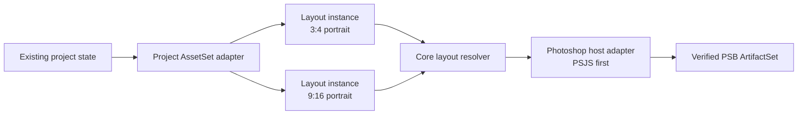

# Next implementation roadmap: v0.1.0 to the native Layout application

This document converts the accepted post-v0.1.0 architecture study into the
implementation sequence for Photara. It is the planning authority for the
node-based migration. The released v0.1.0 workflow remains the behavioral
baseline; this roadmap does not authorize a flag-day rewrite.

`0.2.0` is the next planned feature milestone. This documentation commit is not
a release and does not create a tag. If implementation benefits from smaller,
independently verified checkpoints before the complete `0.2.0` gate, versions
`0.1.1` through `0.1.9` may be used for those stabilization or refactoring
slices. They do not change the dependency order or absorb an unmet `0.2.0`
requirement. Later version numbers below are planning boundaries and may also be
split into smaller reversible releases.

## 1. Accepted architecture principles

1. The Rust Core remains authoritative for identity, validation, workflow
   policy, graph rules, layout resolution, evidence, and compatibility.
2. The CLI, native application, Lightroom Classic integration, Photoshop
   integration, and future SDK are clients or adapters around the same
   application services. UI code never becomes a second domain implementation.
3. The graph is an application model over Photara's authoritative domain. It
   does not replace asset, project, master, delivery, or publication evidence.
4. Node ports carry typed, versioned semantic values rather than paths or
   arbitrary JSON.
5. Layout is platform-neutral. `CanvasProfile` defines geometry;
   `LayoutPreset` bundles photographer-facing defaults. Instagram, Threads,
   website, and future destinations consume compatible output downstream.
6. Each Layout instance owns its item order, template assignments, placements,
   fit policy, rotation, focal point, and authored crop. Assets remain neutral.
7. Photoshop materializes a `ResolvedLayoutPlan`; it does not own layout intent.
8. Existing PSJS automation remains a supported backend until a persistent UXP
   bridge provides measurable value and passes the same execution contract.
9. Authoritative authored state, derived cache, disposable proxies, durable
   artifacts, and execution evidence are distinct classes of data.
10. Existing Red Meridian and Sylvan state is immutable regression evidence.
    Adoption is additive and must not rewrite published specifications.
11. Local disks, NAS volumes, and future providers are infrastructure details.
    Layout consumes capabilities and logical representation references.
12. Built-in nodes exercise SDK-shaped contracts internally before Photara
    promises third-party binary or schema stability.

## 2. Target and critical path

The first production-usable native workflow is intentionally narrow:



The dependency order is:

1. characterize v0.1.0 behavior;
2. extract application and layout seams without behavior changes;
3. introduce graph storage/revision boundary and minimal typed values;
4. build a provider-neutral project-asset compatibility adapter;
5. extract platform-neutral Layout authored state and deterministic resolver;
6. add proxies and a native graph shell;
7. add the rich Layout inspector and crop authoring;
8. adapt resolved plans to the existing Photoshop PSJS materializer;
9. harden the vertical slice on real projects;
10. only then expand host, provider, SDK, and productization scope.

### Required before the vertical slice

- one shared application facade used by CLI and native UI;
- repository boundaries for project assets, templates, and graph documents;
- graph documents with optimistic revisions and atomic persistence;
- typed `ProjectRef`, `AssetSet`, `LayoutPlan`, `ResolvedLayoutPlan`,
  `VisualProxyRef`, `ArtifactSet`, `HostStatus`, and
  `HostExecutionReceipt` values;
- a compatibility adapter over current project/master state;
- platform-neutral profiles, presets, templates, layout commands, validation,
  and resolution;
- a color-managed proxy contract sufficient for crop decisions;
- a stable host-execution request/receipt contract;
- exact compatibility projection to the existing Photoshop manifest.

### Useful but deferrable

- a polished general Source node;
- HDR-native thumbnails if a tested SDR authoring proxy is initially adequate;
- persistent UXP dispatch;
- panorama and comparison rich editors;
- delivery, Cloudinary, publication, Lightroom, and WSP nodes;
- multi-machine graph synchronization;
- generalized background scheduling.

### Must wait until after the vertical slice

- generalized cloud provider implementations and OAuth;
- third-party node loading or a stable public SDK;
- arbitrary cycles, distributed evaluation, or remote execution;
- replacing all existing workflows with nodes;
- permanent product licensing, marketplace, or extension-isolation promises.

## 3. Immediate post-v0.1.0 refactor: 0.2.0

### Objective

Make the released layout workflow callable through stable internal application
boundaries while producing the same files, JSON, diagnostics, ordering, and
database effects. This is a structural release, not a UI release.

### Responsibilities to extract

Refactor inside the current crate first:

- move command orchestration out of `main.rs` into application services;
- divide the current layout subsystem into model, template repository,
  authored-post repository, asset/master query adapter, resolver, authoring
  compatibility, render-manifest builder, and report verifier;
- isolate filesystem path resolution from semantic layout values;
- give Storexa/database operations explicit repository adapters;
- centralize stable diagnostics and guarded side-effect boundaries;
- introduce test fakes at repository and host boundaries, not around every
  function.

The initial facade should expose use cases, not CLI verbs. Candidate operations
include querying project assets, loading authored post state, resolving a
layout, preparing authoring, preparing rendering, and verifying a render.

### Characterization gate

Before moving behavior, capture:

- canonical CLI JSON and error output for layout commands;
- post schema v1 parse/canonical-write behavior, including unknown fields;
- legacy crop-to-transform behavior;
- template discovery, validation, compatibility, and hashes;
- render-manifest and Photoshop report fixtures;
- database transaction/idempotency behavior;
- unavailable NAS, changed rendition, stale report, and retry behavior;
- Red Meridian Instagram 18-item/20-frame and Threads 17-frame resolution;
- Sylvan Instagram 10-frame and Threads 14-frame actual publication order.

### Compatibility constraints

- every released CLI command and option remains available;
- `.project.json`, post JSON v1, migrations 0001–0019, installed scripts,
  logical paths, and current JSON output remain supported;
- no published specification is rewritten;
- transaction and confirmation gates remain at least as strict;
- PSJS, Lua, Lightroom, Cloudinary, publication, and WSP contracts are
  byte-semantically unchanged unless a characterized bug requires a separately
  approved correction.

### Explicit non-goals

- no graph runtime or graph persistence;
- no native UI;
- no schema migration;
- no crate/workspace split merely for aesthetics;
- no UXP rewrite;
- no provider abstraction beyond the seam needed to remove paths from layout
  policy;
- no changes to photographer workflow.

### Definition of done

- CLI behavior passes golden and real-project fixtures through the new facade;
- layout logic no longer depends on CLI parsing or direct process output;
- pure resolver tests run without Storexa, Photoshop, Lightroom, or a mounted
  NAS;
- repository fakes can reproduce success, unavailable storage, stale data, and
  conflict cases;
- the full v0.1.0 regression suite and current workflows still pass.

## 4. Graph authority and repository boundary

Graph persistence must not be coupled to either a specific JSON directory or
Neon tables. Define this boundary before implementing graph documents in 0.3.0:

```rust
trait GraphRepository {
    async fn load(&self, id: GraphId) -> Result<GraphSnapshot>;
    async fn create(&self, draft: NewGraphDocument) -> Result<GraphSnapshot>;
    async fn commit(
        &self,
        id: GraphId,
        expected: GraphRevision,
        commands: Vec<GraphCommand>,
    ) -> Result<GraphSnapshot>;
    async fn revisions(&self, id: GraphId, after: Option<GraphRevision>)
        -> Result<Vec<GraphRevisionRecord>>;
}
```

`GraphSnapshot` contains document identity, schema version, revision, node
instances, typed connections, authored node state, and migration metadata. It
does not contain cache entries or large artifacts. `commit` is atomic and uses
optimistic concurrency. Core validates commands and computes the next snapshot;
the repository persists it.

Separate ports remain responsible for:

- `EvaluationCacheRepository` — derived values keyed by evaluation digest;
- `ArtifactRepository` — durable file identity and materialization evidence;
- `VisualProxyStore` — disposable proxy bytes and metadata;
- existing domain repositories — projects, assets, masters, delivery, and
  publication authority.

### Decide before graph implementation

- canonical graph document and revision envelope;
- identity rules for graph, node instance, connection, item, and placement;
- optimistic conflict semantics and atomic commit guarantee;
- graph schema migration API and unknown-field preservation;
- authority rule: authored node state is authoritative; compatibility JSON is
  generated, linked evidence after opt-in.

### Safe to defer

- whether the durable backend is local JSON, SQLite, Neon, or a hybrid;
- multi-machine synchronization and merge UI;
- permanent command-log versus snapshot compaction policy;
- cloud backup of graphs.

The first backend may be a local atomic document store behind this interface.
It must support revision conflicts, crash-safe replacement, and fixtures. That
choice is an implementation detail, not the public graph contract.

## 5. Version-by-version implementation roadmap

### 0.2.0 — application seams and behavior characterization

**Objective:** complete the refactor in section 3.

**User-visible value:** no intentional workflow change; clearer stable errors
may be exposed only when backed by characterization tests.

**Primary components:** `main.rs`, current layout module, Storexa adapters,
template loading, post repositories, render/report orchestration.

**New contracts:** internal application facade, `ProjectAssetRepository`,
`LayoutTemplateRepository`, current-post repository, resolver and host/report
adapter boundaries, stable diagnostic codes.

**Acceptance:** section 3 definition of done.

**Prerequisite for 0.3.0:** CLI is a thin client and layout resolution is
testable without external hosts.

### 0.3.0 — graph repository, typed values, and project-state adapter

**Objective:** introduce the smallest persistent graph model and feed it from
existing Photara projects without building generalized Source providers.

**User-visible value:** diagnostic CLI commands can inspect and validate a
read-only project graph; production editing remains unchanged.

**Architectural changes:**

- implement `GraphRepository` and a local atomic backend;
- add definition/instance separation, typed ports, acyclic connections,
  diagnostics, revisions, and deterministic evaluation keys;
- implement `ExistingProjectSourceAdapter` that queries current domain
  repositories and emits `ProjectRef/v1` and `AssetSet/v1`;
- introduce logical representation locators and an explicit local
  materialization service;
- keep graph experiments in additive state separate from post JSON.

**Primary components:** new graph model/application modules, project and master
repositories, graph repository adapter, CLI graph inspect/validate commands.

**New contracts:** `GraphDocument/v1`, `GraphRevision`, `NodeDefinition`,
`NodeInstance`, `Connection`, `ProjectRef/v1`, `AssetSet/v1`, `AssetCapability`,
`RepresentationRef/v1`, and evaluation diagnostics.

**Compatibility constraints:** graph reads current authority; it does not
rewrite project, master, or post state. Asset identity and registered rendition
fingerprints remain unchanged.

**Tests/acceptance:**

- atomic create/commit, stale-revision conflict, crash/interruption recovery,
  schema migration, and unknown-field round trips;
- stable AssetSet digest across mount roots;
- changed digest after an authorized rendition replacement;
- unavailable versus missing versus changed representation diagnostics;
- deterministic order and identity for Red Meridian and Sylvan;
- graph inspection works with the NAS unavailable and recovers after remount.

**Non-goals:** native UI, editable Layout, cloud providers, remote graph sync,
general scheduler, public SDK.

**Prerequisite for 0.4.0:** the resolver can consume `AssetSet` without raw
filesystem paths and graph authored state has a tested revision boundary.

### 0.4.0 — platform-neutral Layout engine and compatibility projection

**Objective:** make Layout a deterministic, UI-independent domain capability.

**User-visible value:** current posts can be imported, resolved, compared, and
projected through the new engine from diagnostic commands; no required workflow
change yet.

**Architectural changes:**

- add versioned `CanvasProfile`, `LayoutPreset`, template capabilities,
  `LayoutDocument`, and Core layout commands;
- support ordered items, repeated assets, template assignments, `fill`,
  `contain`, and `crop`, normalized transforms, focal point, and quarter turns;
- distinguish authored `LayoutPlan/v1` from derived
  `ResolvedLayoutPlan/v1`;
- implement `PostSpecificationV1Adapter` and guarded `PostProjectionV1`;
- implement `LayoutRenderManifestV1Adapter` without executing Photoshop;
- add item-level resolution keys and cache metadata;
- implement a proxy-service spike and select the initial preview contract.

**Primary components:** layout model/resolver, template catalog, compatibility
adapters, graph evaluator, proxy service/cache.

**New contracts:** `CanvasProfile/v1`, `LayoutPreset/v1`, `LayoutPlan/v1`,
`ResolvedLayoutPlan/v1`, layout command/diagnostic vocabulary,
`VisualProxyRef/v1`.

**Compatibility constraints:** importing then canonically projecting a v0.1
post preserves its semantic content and reproduces current resolution. Existing
published JSON remains read-only.

**Tests/acceptance:**

- exact mapping for bundled 3:4 and 9:16 presets;
- normalized transform and legacy crop round trips;
- property tests for fill/contain/crop, rotation, slot geometry, and unusual
  source aspects;
- exact Red Meridian and Sylvan item order, assignments, and pixel bounds;
- independent 3:4 and 9:16 Layout instances over the same assets;
- proxy fingerprint, color metadata, fallback, and invalidation tests;
- compatibility manifest equals current Photoshop input semantically.

**Non-goals:** native editing, Photoshop dispatch, panorama/comparison rich
authoring, destinations, generalized Sources.

**Prerequisite for 0.5.0:** all layout mutations are Core commands, resolution
is deterministic, and an authoring proxy is trustworthy enough to judge crops.

### 0.5.0 — native graph shell and visual Layout authoring

**Objective:** deliver the first useful native editor without giving UI code
domain authority.

**User-visible value:** a photographer can open an existing project, create
independent 3:4 and 9:16 Layout instances, choose templates, assign and reorder
images, select fill/contain/crop, and visually author crops with undo/recovery.

**Architectural changes:**

- build the native graph canvas, selection model, properties area, diagnostics,
  and save/conflict shell;
- use the application facade for every query and command;
- add a rich Layout inspector over Core commands and proxy references;
- implement persistent undoable revisions and unsaved/conflict recovery;
- save graph-authored drafts and generate guarded v0.1 compatibility
  projections for existing downstream tools.

**Primary components:** native app shell, Core application client/bridge,
standard property renderer, rich Layout inspector, proxy renderer.

**New contracts:** UI-facing application API, `InspectorSchema/v1`, layout
command results, revision/conflict response, proxy display metadata.

**Compatibility constraints:** CLI can inspect and edit the same graph through
the same Core commands. Projection never overwrites published specifications;
stale graph revisions and stale projections are rejected.

**Tests/acceptance:**

- GUI command results equal direct application-service results;
- keyboard and pointer crop changes resolve to the same normalized transform;
- undo/redo survives save/reopen; conflict does not lose authored work;
- a source asset can feed both Layout nodes with independent transforms;
- min/max package sizes are schema/policy driven, not hard-coded to 20;
- Sylvan can be recreated visually and Red Meridian imports without drift;
- accessibility, focus, selection, and error recovery have automated coverage.

**Non-goals:** Photoshop execution from the graph, UXP, generalized Source UI,
delivery/publishing nodes, third-party nodes.

**Prerequisite for 0.6.0:** the user can produce a validated
`ResolvedLayoutPlan` for both profiles and reopen it without loss.

### 0.6.0 — Photoshop execution and first production-usable vertical slice

**Objective:** complete `Layout authoring -> resolved plan -> Photoshop -> PSB`
using the proven materializer.

**User-visible value:** the native app prepares verified PSB layout documents
from both Layout instances, reuses unchanged results, rebuilds only stale
items, and reports actionable progress and recovery. This is the first release
expected to remove substantial worksheet, CLI, and manual placement time.

**Architectural changes:**

- add the Photoshop execution node/application service;
- define `HostExecutionRequest/v1`, `HostStatus/v1`, `ArtifactSet/v1`, and
  `HostExecutionReceipt/v1`;
- adapt a resolved plan to the current render manifest and PSJS script;
- validate request identity, materializer version, result report, file
  fingerprint, and safe destination before recording success;
- implement item-level reuse, progress, cancellation, retry, and stale receipt
  rejection;
- preserve manual script launch where automation is unreliable.

**Primary components:** host bridge, manifest adapter, PSJS installation and
invocation adapter, artifact/evidence repository, native execution UI.

**Compatibility constraints:** existing `prepare-render`, installed PSJS, PSB
contract, verification, WSP export, delivery, and publication commands continue
to work. Crop intent is never edited by Photoshop.

**Tests/acceptance:**

- end-to-end Sylvan 3:4 and 9:16 plans materialize expected PSBs;
- Red Meridian resolution and rendered-plan comparison remains exact;
- unchanged items reuse artifacts; one changed placement rebuilds only its
  dependent item;
- cancel/retry, Photoshop unavailable, plugin mismatch, stale report, disk
  full, destination collision, NAS disconnect/remount, and app restart recover;
- receipts bind graph revision, resolved-plan digest, request, host/materializer
  version, artifact identity, and verification result;
- current CLI/PSJS path remains a supported fallback.

**Non-goals:** UXP rewrite, all template families, WSP automation, delivery or
publication nodes, cloud Sources.

**Prerequisite for 0.7.0:** real projects demonstrate that the stable host
contract is correct and the PSJS backend is the remaining UX limitation.

### 0.7.0 — production hardening, advanced Layout, and staged UXP bridge

**Objective:** generalize the proven vertical slice and replace only the host
transport that benefits from persistence.

**User-visible value:** richer template authoring plus a persistent Photoshop
panel with readiness, progress, cancellation, reconnect, and recovery.

**Architectural changes:**

- add panorama and comparison capabilities based on existing templates;
- generalize rich-inspector extensions without exposing a public SDK;
- implement UXP as a second `HostBridge` backend using the same execution
  request/receipt contract;
- run PSJS and UXP conformance tests before making UXP preferred;
- retain PSJS fallback through at least one production cycle.

**Primary components:** Layout inspector/resolver extensions, UXP panel and
transport, host capability negotiation, installer/update checks.

**New contracts:** versioned UXP transport envelope, execution IDs, progress
events, cancellation acknowledgment, bridge capability/version negotiation.

**Compatibility constraints:** Core request, resolved-plan, artifact, and
receipt semantics are backend-neutral. UXP cannot bypass Core validation or
write graph authored state directly.

**Tests/acceptance:** current panorama seam and comparison fixtures;
PSJS-versus-UXP conformance; reconnect/restart; duplicate request idempotency;
host update/mismatch; legacy fallback; real-project production cycle.

**Non-goals:** removing PSJS immediately, arbitrary Photoshop actions,
third-party UXP extensions, provider nodes.

**Prerequisite for 0.8.0:** at least three materially different built-in node
types and both standard/rich inspectors have exercised shared contracts.

### 0.8.0 — internal SDK and selective workflow expansion

**Objective:** make built-in definitions prove an SDK-shaped contract without
promising external stability.

**User-visible value:** consistent node discovery, properties, status,
diagnostics, migrations, and actions; additional nodes ship only where real
projects show workflow savings.

**Architectural changes:**

- register built-in Project Source, Layout, and Photoshop nodes through the
  same internal definition registry;
- formalize standard inspector schema, rich-inspector lifecycle, typed
  capabilities, state migration, and diagnostics;
- prototype one out-of-tree experimental node and one failure-isolation model;
- consider WSP/delivery or publication validation next, rather than converting
  every old command automatically.

**Primary components:** internal SDK crate/module, registry, inspector host,
capability broker, migration harness, optional experimental extension.

**New contracts:** internal node package manifest, definition metadata,
inspector/action schemas, capability requests, migration reports.

**Compatibility constraints:** all built-ins retain Core-owned validation;
experimental extensions cannot receive credentials or broad filesystem access
without explicit capability grants.

**Tests/acceptance:** built-in registration parity; old state migrations;
unknown-field preservation; capability denial; deterministic evaluation;
extension crash isolation; accessibility and inspector lifecycle.

**Non-goals:** public SDK compatibility promise, unrestricted native code,
marketplace, all providers.

**Prerequisite for 0.9.0:** evidence identifies which internal contracts are
stable and which still change when adding real nodes.

### 0.9.0 — product stabilization and 1.0 contract selection

**Objective:** make the proven native workflow installable, recoverable, and
supportable, then choose the exact 1.0 stability boundary.

**User-visible value:** guided installation/onboarding, reliable updates,
project recovery, diagnostics, and a production-ready personal/operator app.

**Architectural changes:** harden graph migrations, backup/recovery, cache
eviction, host updates, background progress, signing/packaging, and diagnostics.
Add only provider or workflow nodes justified by production evidence.

**Primary components:** installer, application packaging, graph/cache stores,
bridge updater, diagnostics bundle, selective adapters.

**New contracts:** install/health model, backup/export format, support
diagnostics, final compatibility policy candidates.

**Compatibility constraints:** clean upgrade from v0.1 projects and every
intermediate graph schema; no silent loss of authored or publication evidence.

**Tests/acceptance:** clean-machine install; upgrade and rollback; interrupted
save/evaluation/update; disk full; corrupt cache; NAS remount; host update;
multiple projects/accounts; export and restore; beta production cycles.

**Non-goals:** adding features solely to fill a node catalog; requiring every
provider; declaring SDK stability without evidence.

**Prerequisite for 1.0.0:** supported platform, storage, host, migration,
recovery, SDK, licensing, and distribution promises are written and tested.

### 1.0.0 — stable node foundation

Minimum 1.0 outcome:

- Core owns domain, graph, validation, and compatibility policy;
- CLI and native app use the same application API;
- Existing Project State -> Layout -> Photoshop is a supported production
  workflow;
- Layout profiles, presets, templates, and values are platform-neutral;
- authored state, caches, artifacts, and receipts have explicit authority;
- v0.1 projects and published evidence remain readable and safe;
- install, update, migration, backup, recovery, and bridge behavior is
  supported and documented;
- the public SDK is either supported under an explicit compatibility policy or
  remains clearly experimental and out of the 1.0 promise.

1.0 does not require every Lightroom, provider, proofing, publishing, website,
or AI operation to be a node.

## 6. First usable Layout vertical slice

### In scope

- open one existing Photara project through the compatibility adapter;
- show its current flattened HDR/SDR asset pairs and usable proxies;
- create one 3:4 and one 9:16 Layout instance over the same AssetSet;
- add any schema-valid number of editorial items; destination limits are not
  Layout limits;
- author full-frame, stacked-two, stacked-three, and grid-four templates;
- choose fill, contain, or authored crop per placement;
- assign, reorder, rotate by quarter turns, and author independent crops;
- validate and resolve both plans in Core;
- save/reopen/undo the graph draft;
- project to the existing render manifest;
- materialize and verify PSBs through Photoshop;
- reuse unchanged outputs and recover from host/storage interruption.

### Out of scope

- final JPEG export or WSP automation;
- delivery, Cloudinary, publication, or website ordering;
- polished upstream provider nodes;
- panorama/comparison rich editing in the first release;
- automatic social-platform policy or posting;
- public SDK.

### Workflow-time savings point

0.5.0 removes placement worksheets, repeated CLI authoring commands, and
Photoshop selection/crop capture for the common template families. 0.6.0 is the
first end-to-end savings milestone because the same authored state also creates
and verifies the PSBs. Until then, the native UI is useful but not the complete
production path.

## 7. Provider-neutral Source evolution

The first Layout node consumes an `AssetSet/v1` from
`ExistingProjectSourceAdapter`. The adapter is a compatibility application
service, not a special Layout code path. It queries current project, asset,
master, and file-registration authority and emits semantic references.

```text
v0.1 project repositories
        ↓ ExistingProjectSourceAdapter
ProjectRef/v1 + AssetSet/v1
        ↓ typed port
Layout (unchanged as Sources evolve)
```

Later, register this adapter as the first Project Source node. Future local
folder, Lightroom archive, Lightroom Cloud, provider, or remote-library nodes
must emit the same `AssetSet` contract or an explicitly versioned successor.
They may differ in discovery, credentials, availability, proxy generation, and
materialization, but Layout does not learn provider names or locator syntax.

Do not make `AssetSet` a dump of provider metadata. It contains only stable
identity, representation semantics, capabilities, ordered query result, and
fingerprints needed by downstream nodes. Provider-specific metadata remains in
the source adapter and can be surfaced through separate typed values later.

## 8. Minimum asset capability and materialization boundary

Define capabilities now so local paths do not leak into Layout:

| Capability | Meaning for the first slice |
| --- | --- |
| `metadata.available` | Dimensions, orientation, role, color description, and fingerprint are known. |
| `visual-proxy.available` | A displayable proxy exists now. |
| `visual-proxy.requestable` | A proxy service can create or fetch one. |
| `representation.identified` | A rendition has stable semantic identity and immutable fingerprint evidence. |
| `materialize.local` | Infrastructure can provide a verified local file lease for a consumer. |
| `full-resolution.available` | Full-resolution bytes are currently obtainable. |
| `rendition-pair.hdr-sdr` | Required paired roles are registered and compatible. |
| `destination.writable` | A host adapter can resolve a safe writable logical destination. |

`RepresentationRef/v1` includes stable representation ID, asset ID, role,
kind, fingerprint, dimensions/color metadata when known, capability state, and
an opaque logical locator. It does not expose a required POSIX path.

Consumers request local access through a materialization service:

```rust
trait RepresentationMaterializer {
    async fn acquire(
        &self,
        representation: &RepresentationRef,
        requirement: MaterializationRequirement,
    ) -> Result<LocalMaterializationLease>;
}
```

The lease binds the representation fingerprint, local path, verification
result, lifetime/cleanup policy, and provenance. Layout needs metadata and a
proxy; Photoshop needs verified local full-resolution leases and a writable
destination. Unmounted storage is `temporarily-unavailable`, not a changed
asset. This is sufficient for the first slice without defining OAuth, remote
listing, upload, or generalized provider sessions.

## 9. Photoshop transition: PSJS to UXP

The transition is staged:

1. **0.2–0.4:** isolate manifest creation, host probing, report verification,
   and file validation from PSJS details. No script behavior change.
2. **0.5:** Layout UI produces resolved plans and compatibility manifests;
   current manual script operation remains available.
3. **0.6:** implement Photoshop execution as a backend-neutral host service,
   initially using the proven PSJS materializer. Add request/receipt identity,
   progress where observable, retry, cancellation, and verification.
4. **0.7:** add a persistent UXP backend for reliable app/panel discovery,
   progress, cancellation, targeted execution, and reconnect. Run both backends
   against the same conformance suite.
5. **After production evidence:** make UXP preferred. Retire PSJS only after an
   announced compatibility window and proven recovery path.

Stable across both implementations:

- `ResolvedLayoutPlan` semantics;
- host capability/status requirements;
- execution request identity and idempotency;
- logical input/output representations;
- materializer/version fingerprints;
- artifact and receipt verification;
- diagnostics and recovery actions.

UXP becomes necessary when persistent two-way status, targeted dispatch,
cancellation, installer health, or reliable document association cannot be
provided by PSJS. It is not required merely to draw the Layout UI.

## 10. SDK stabilization criteria

Built-in nodes should use internal SDK-shaped contracts beginning in 0.3, but
the public SDK must wait. Before freezing it, Photara needs evidence from:

- Project Source: provider state, querying, capability declaration;
- Layout: human-authored state, rich inspector, deterministic Core evaluation;
- Photoshop: host execution, progress, cancellation, artifacts, receipts;
- at least one additional materially different built-in node;
- one out-of-tree experimental node built without private Core access;
- migrations across at least two definition/authored-state versions;
- standard and rich inspector lifecycles;
- capability denial and extension crash/isolation tests;
- real macOS packaging/update/signing behavior and a Windows strategy;
- an explicit semantic-versioning and deprecation policy.

The SDK may remain experimental at 1.0 if these gates are incomplete. Stable
Core/application behavior is more important than an early extension promise.

## 11. Blocking and deferred decisions

| Decision | Gate | Required outcome |
| --- | --- | --- |
| v0.1 compatibility baseline and immutable fixtures | Decide before refactoring | Canonical outputs, frozen Red Meridian/Sylvan evidence, allowed-difference policy. |
| Initial application-service boundaries | Decide before refactoring | Use-case facade and repository/host seams; no UI or CLI ownership. |
| Graph identity, revision, migration, and repository contract | Decide before graph implementation | Atomic optimistic commits and backend-neutral snapshots. |
| Minimal value/port versions and connection rules | Decide before graph implementation | Exact typed compatibility; no implicit JSON/path ports. |
| Initial graph backend | Decide before graph implementation | Local atomic backend is acceptable; permanent backend deferred. |
| Native Core/UI bridge | Decide before Layout UI | Prototype latency, progress, cancellation, crash isolation, signing, and upgrade behavior; select one. |
| Preview color/fallback contract | Decide before Layout UI | A proxy is visually trustworthy for crop decisions and carries explicit color metadata. |
| Undo and authored-revision semantics | Decide before Layout UI | Core commands, persistent revisions, conflict and published-freeze behavior. |
| Layout item/placement identity | Decide before Layout UI | Stable UUID plus editable label; lossless mapping of existing item IDs. |
| Host execution request/receipt protocol | Decide before Photoshop integration | Backend-neutral identity, capability, retry, artifact, and verification semantics. |
| UXP minimum capability and cutover | Decide before UXP integration | Measurable need, conformance suite, fallback and retirement policy. |
| Permanent graph backend and multi-machine sync | After first vertical slice | Choose from usage evidence; do not leak into Core contracts. |
| Generalized cloud providers/OAuth | After first vertical slice | Implement provider by provider against capability contracts. |
| Destination/profile recommendation policy | After first vertical slice | Exact preset IDs, capability predicates, or both. |
| Generated PSB retention policy | Before automated cleanup, otherwise defer | Default durable tracked artifact; never auto-delete before policy exists. |
| Windows support depth | Defer to productization, constrain schemas now | Keep Core and inspector schema portable; do not block macOS slice. |
| Plugin isolation technology | Before public SDK/1.0 | Select security tiers before granting secrets/filesystem/host access. |
| Public SDK promise | Before SDK/1.0 | Stable with policy or explicitly experimental. |
| Licensing/distribution model | Before external productization | Does not block the reusable personal/operator workflow. |

## 12. Regression strategy

### Immutable production fixtures

**Red Meridian**

- Instagram: 18 editorial items producing exactly 20 delivery frames;
- Threads: the specified 17-frame package, including three-image stacks,
  rotated placements, and comparison geometry;
- existing source, transform, order, template, render, delivery, Cloudinary,
  and publication evidence remains readable and linked.

**Sylvan**

- actual published filename order: 10 Instagram and 14 Threads frames;
- three grid-four items per platform and independent platform transforms;
- current layered/flattened masters, rendered PSBs, Cloudinary exact-original
  evidence, and manual publication records remain linked.

### Test ladder

```text
v0.1 golden behavior
    ↓
extract one boundary
    ↓
unit + property + serialization tests
    ↓
Red Meridian import/resolve/manifest comparison
    ↓
Sylvan import/resolve/manifest comparison
    ↓
synthetic failure and boundary fixtures
    ↓
host dry run or real canary when applicable
    ↓
commit before the next extraction
```

Synthetic fixtures cover empty, one, and large item counts; repeated assets;
unusual source aspects; unavailable/remounted storage; authorized source
replacement; stale graph revision; stale projection; corrupt cache; stale or
duplicate host report; plugin mismatch; destination collision; cancellation;
and disk-full recovery.

### Adoption phases

1. **Characterize:** preserve current behavior before moving it.
2. **Read:** graph adapters read v0.1 state without writes.
3. **Compare:** new resolution is compared to current outputs.
4. **Draft:** graph-authored state lives beside frozen v0.1 state.
5. **Project:** current downstream tools consume a generated compatibility
   document bound to its graph revision and digest.
6. **Opt in:** graph authored state becomes authority only for a new draft after
   proof; the projection is no longer independently editable.
7. **Preserve:** published v0.1 snapshots remain permanently readable.

Never dual-write two independently editable authorities.

## 13. Release gate summary

| Milestone | Definition of done | Unlocks |
| --- | --- | --- |
| 0.2.0 | CLI and real fixtures pass through extracted application/layout seams with no intentional behavior change. | Safe graph work. |
| 0.3.0 | Versioned graph documents persist atomically; current projects emit provider-neutral AssetSets without path leakage. | Layout engine. |
| 0.4.0 | Core imports, edits by commands, resolves, and projects 3:4/9:16 layouts exactly; proxy contract is selected. | Native authoring. |
| 0.5.0 | Photographer can author, undo, save, reopen, and independently resolve both layouts in the native UI. | Photoshop execution. |
| 0.6.0 | Both layouts materialize verified PSBs with item-level reuse and recovery through the stable host contract. | First production-usable graph. |
| 0.7.0 | Advanced layout families and UXP backend pass compatibility/conformance and a production cycle. | Broader node framework. |
| 0.8.0 | Built-ins and one experimental external node prove internal SDK, migration, inspector, and isolation shapes. | Stability selection. |
| 0.9.0 | Install, upgrade, recovery, diagnostics, and selected compatibility promises pass beta production evidence. | 1.0 release decision. |
| 1.0.0 | Supported production node foundation and its explicit compatibility scope are documented and tested. | Stable product foundation. |
