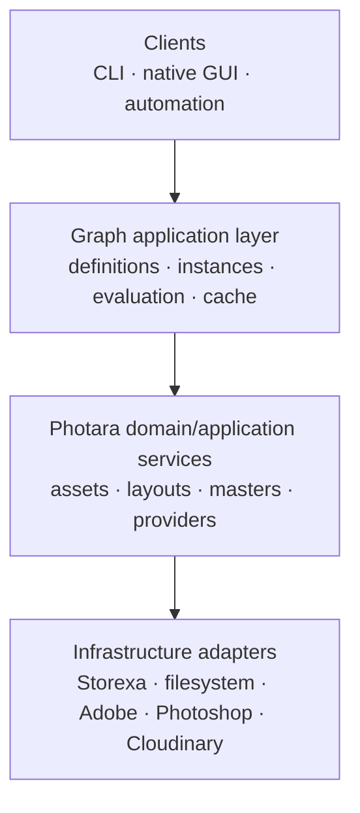
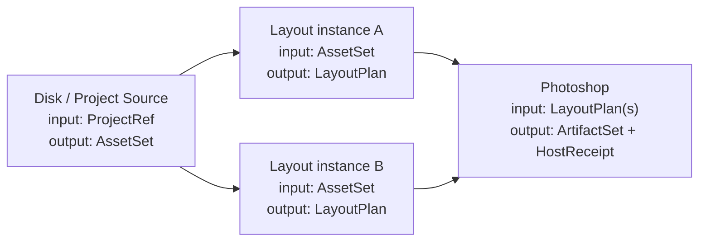

# Node architecture proposal

## Architectural position

The graph is an application model over Photara Core, not a replacement for the
domain model and not a GUI-owned workflow language. A node composes existing
application capabilities through typed semantic values. The same definition
and evaluation path must be callable from a native app, CLI, tests, or future
automation.

Three layers should remain distinct:



The first migration may call extracted application services from both the old
CLI commands and new node executors. Existing CLI commands do not need to be
rewritten as graph commands before the graph is useful.

## Definition, instance, and evaluation

- A **node definition** is versioned code and metadata: type identity, ports,
  configuration schema, execution environment, validation, capabilities, and
  executor contract.
- A **node instance** is user-owned graph state: stable UUID, definition
  reference, configuration, authored state, position/UI metadata, and port
  connections.
- An **evaluation** resolves one instance against concrete upstream values and
  environment/provider snapshots. It has an evaluation key, lifecycle,
  diagnostics, output value references, and optional execution receipt.

The same Layout definition can therefore have independent instances:

```text
layout-instagram-portrait  -> Layout node -> Instagram Portrait preset
layout-threads-portrait    -> Layout node -> Threads Portrait preset
```

Their items, ordering, fits, rotations, and normalized crops are separate even
when both refer to the same assets and templates.

## Preliminary internal contract

Rust-shaped pseudocode, intentionally not a stable public SDK:

```rust
struct NodeTypeId(String);       // e.g. "photara.builtin.layout"
struct NodeTypeVersion(u32);     // behavior/schema version
struct NodeInstanceId(Uuid);
struct PortId(String);
struct ValueTypeId(String);      // e.g. "photara.asset-set/v1"
struct Digest([u8; 32]);

struct NodeDefinition {
    type_id: NodeTypeId,
    version: NodeTypeVersion,
    display_name: String,
    category: NodeCategory,
    inputs: Vec<InputPortDefinition>,
    outputs: Vec<OutputPortDefinition>,
    config_schema: SchemaRef,
    authored_state_schema: Option<SchemaRef>,
    inspector: InspectorDescriptor,
    environment: ExecutionEnvironment,
    cache_policy: CachePolicy,
    capabilities: BTreeSet<CapabilityId>,
}

struct NodeInstance {
    id: NodeInstanceId,
    definition: NodeDefinitionRef,
    config: VersionedDocument,
    authored_state: Option<VersionedDocument>,
    connections: BTreeMap<PortId, OutputRef>,
}

trait InternalNodeExecutor {
    fn validate(
        &self,
        instance: &NodeInstance,
        inputs: &TypedInputs,
        services: &ValidationServices,
    ) -> ValidationReport;

    fn plan(
        &self,
        instance: &NodeInstance,
        inputs: &TypedInputs,
        services: &PlanningServices,
    ) -> Result<EvaluationPlan>;

    async fn execute(
        &self,
        plan: EvaluationPlan,
        context: &ExecutionContext,
    ) -> Result<EvaluationResult>;
}
```

`plan` must be deterministic and side-effect free given its explicit inputs.
`execute` may perform local, host, or provider effects allowed by its declared
environment. Pure and human-authored nodes may complete during planning without
an external execution phase.

## Execution environments

Use an enum plus declared requirements, not node-name conventions:

| Environment | Meaning | Initial example |
| --- | --- | --- |
| `CorePure` | Deterministic CPU/memory evaluation | Layout validation and normalized geometry resolution |
| `Local` | Filesystem or local codec access | Project asset discovery, proxy generation |
| `HostApplication` | Requires a registered host bridge | Photoshop materialization |
| `CloudApi` | Requires credentials, account, and provider snapshot | Later publishing/provider node |
| `HumanAuthored` | Output depends on explicit user-authored state | Layout editorial plan and crop framing |

A node can combine planning and execution environments, for example Layout is
`HumanAuthored + CorePure`; it is not “Photoshop” simply because a current
workflow used Photoshop to author crops.

## Status and diagnostics

Node status should be derived, not hand-maintained UI state:

```text
unconfigured
blocked-input
needs-authoring
ready
running
succeeded
stale
failed
cancelled
```

Diagnostics are structured values with code, severity, message, optional port,
field path, asset/item/placement context, recovery action, and causal chain.
The CLI can render them as text or JSON; the GUI can attach them to ports,
properties, or canvas badges.

## Initial graph contracts



### Disk / Project Source node

**Configuration**

- `project_id` or stable project slug resolved to ID;
- selection query, initially “current verified flattened HDR/SDR pairs”;
- optional ordering/filter controls;
- preferred proxy policy.

**Output**

- `AssetSet`, an ordered semantic collection of `AssetRef` records;
- each record contains stable asset identity, display metadata, and a
  `RenditionSetRef` naming the paired HDR/SDR current representations;
- logical provider/location plus file IDs, hashes, dimensions, profile, and
  readiness—not just paths;
- proxy availability descriptors, not embedded full preview bytes.

The node queries a repository and emits current identity. A local resolver may
turn a logical location into a path for authorized local execution. Layout
never parses TIFFs or knows the NAS root.

### Layout node

**Input:** one `AssetSet`.

**Configuration:** `LayoutPresetRef`, optional output-name seed, and behavior
defaults. Configuration chooses capabilities; it does not hold per-item
creative state.

**Authored state:** ordered editorial items, template references, slot-to-asset
assignments, fit policy, focal point, normalized crop, exact quarter-turn
rotation, and item labels. This is authoritative user intent.

**Output:** `LayoutPlan`, a validated semantic plan containing a snapshot of
canvas identity, immutable template references/hashes, asset/rendition
references, and node-instance-scoped transforms. A separately derived
`ResolvedLayoutPlan` may contain exact pixel rectangles and local execution
bindings.

Layout has no publication account, Instagram frame maximum, Threads provider,
Photoshop path, WSP layer name, or Cloudinary folder.

### Photoshop node

**Input:** one or more compatible `LayoutPlan` values. A variadic input or
explicit collection value avoids duplicating a Photoshop node merely because
two Layout instances exist.

**Configuration:** host target, materializer version, output location policy,
and replace/reuse policy.

**Output:** `ArtifactSet` of generated layout documents and a
`HostExecutionReceipt`. Each artifact binds layout-plan digest, item identity,
file fingerprint, materializer/plugin version, and logical location.

The node does not own crop authoring. It validates host readiness, builds a
materialization request, dispatches it through the host bridge, and asks Core
to verify the report and files.

## Application-service boundary

Before node implementation, extract interfaces shaped around capabilities,
not around storage:

```rust
trait ProjectAssetRepository {
    async fn flattened_pairs(&self, project: ProjectId) -> Result<Vec<AssetRenditionSet>>;
}

trait LayoutTemplateRepository {
    fn resolve(&self, reference: &TemplateRef) -> Result<ResolvedTemplateDefinition>;
}

trait LayoutResolver {
    async fn resolve(&self, authored: &LayoutDocument, assets: &AssetSet)
        -> Result<ResolvedLayoutPlan>;
}

trait VisualProxyService {
    async fn obtain(&self, source: RenditionRef, request: ProxyRequest)
        -> Result<ProxyArtifactRef>;
}

trait HostBridge {
    async fn probe(&self, requirement: HostRequirement) -> Result<HostStatus>;
    async fn execute(&self, request: HostExecutionRequest) -> Result<HostExecutionReceipt>;
}
```

Concrete Storexa, filesystem, and Photoshop implementations remain internal.
The CLI and GUI call an application facade that composes these interfaces.

## Compatibility adapters

The graph begins beside v0.1 state:

- `PostSpecificationV1Adapter` imports one post JSON as one Layout node
  instance and maps `PostPlatform` to a bundled preset.
- `PostProjectionV1` can produce the exact legacy JSON/path needed by current
  render, delivery, and publication commands.
- `LayoutRenderManifestV1Adapter` converts a resolved Layout plan to the
  existing Photoshop manifest while PSJS remains the execution backend.
- published specifications are read-only snapshots; graph adoption creates a
  new draft/instance rather than rewriting publication evidence hashes.

The adapter must preserve item order, repeated assets, legacy `crop`, structured
`transform`, template reference, fit/focal point, and source filenames. Import
followed by projection should be byte-semantically equivalent after canonical
serialization and must reproduce the Red Meridian fixture exactly.

## CLI continuity

Keep every released command. Add graph inspection only after the internal
model exists:

```text
photara graph inspect GRAPH
photara node inspect GRAPH NODE
photara node validate GRAPH NODE
photara node evaluate GRAPH NODE
photara graph run GRAPH --to NODE
```

These commands call the same application facade as the GUI. Existing `posts`
commands may initially target compatibility projections. Later they can become
focused editing/debug commands against Layout authored state, but only after
round-trip and project regression proof.

## Explicit non-goals for the first slice

- no general distributed scheduler;
- no arbitrary cycles or feedback nodes;
- no third-party native code loading;
- no global cloud proxy service;
- no attempt to turn every existing workflow step into a node;
- no replacement of Neon evidence tables;
- no immediate UXP rewrite if the current PSJS materializer remains reliable;
- no publication or WSP node requirement for the first usable graph.
