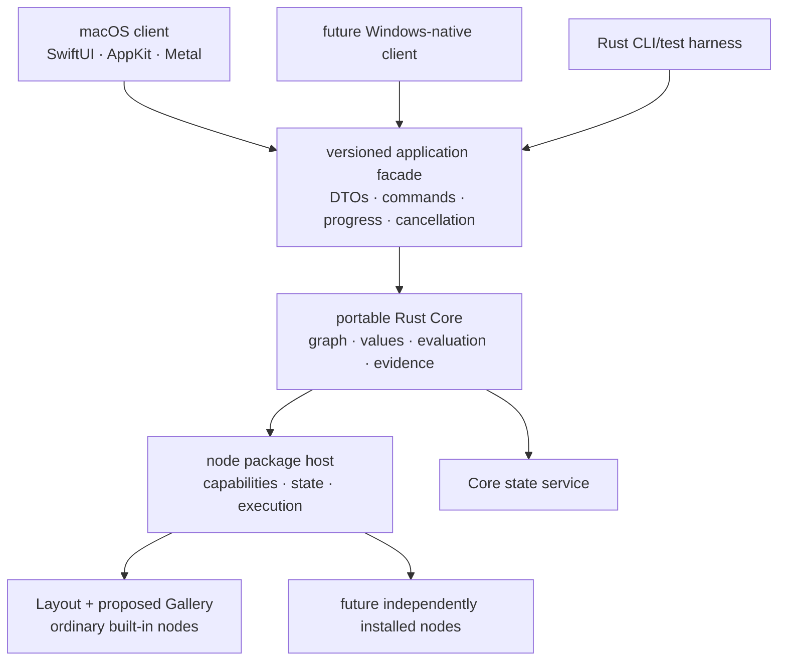

# Generation-two architecture

**Current PS2 review gate:** [Production sealed-root codec and publication
contract](PS2_PRODUCTION_CODEC_AND_PUBLICATION_CONTRACT.md) proposes stable
feature/schema IDs, a 1.2 reader boundary, managed-backing records and
recovery ordering. It is not yet an approved production format or writer; the
[experimental on-disk checkpoint](PS2_EXPERIMENTAL_SEALED_CODEC_CHECKPOINT.md)
remains disposable evidence.

**2026-09-17: resource/storage semantic boundary approved.**
[Resource storage, verification and retention](RESOURCE_STORAGE_AND_VERIFICATION_CONTRACT.md)
consolidates three storage roles, typed `$library.project_store` /
`$library.asset_store` defaults, working/captured/backing distinctions, placement,
qualified publication, separate availability/retention, finite retention policy,
verification/capacity/backup boundaries and the next positive sealed-root fixtures.
It is an additive target; current frozen wire forms and implemented reader behavior
remain explicitly identified. Storage layout, production codec/GC and provider
qualification remain deferred.

- [UI ladder and authoring sequence](UI_LADDER_AND_AUTHORING_SEQUENCE.md) — proposed
  three-step neutral token system, lab ownership and UI0–UI6 execution order.

**2026-09-13: development-cloud and replaceable-product-identity policy approved.**
The [authoritative policy](CXT4_DEVELOPMENT_CLOUD_AND_PRODUCT_IDENTITY.md) keeps
Neon `main` usable from multiple configured development Macs through a loopback
instance of the production API contract, reserves Fly.io for brief remote acceptance
and permanent production, and defines one coordinated pre-release brand cutover.

**2026-09-13: CXT4c opening-shell first visual baseline accepted.** The shared
production/Lab implementation uses the native macOS split-view/sidebar hierarchy;
minor sizing polish is non-gating. Real authentication remains CXT4d work.

**2026-09-13: CXT4b local service checkpoint verified, not deployed.**
The [checkpoint and exact remaining inputs](CXT4B_SERVICE_CHECKPOINT.md) and
[measured local PostgreSQL inventory](CXT4B_POSTGRES_INVENTORY.json) record additive
onboarding, production token verification, atomic receipts and disposable proof.
The Auth0 tuple and live Neon floor are concrete. Typed development environment/
identity wiring is next; Fly HTTPS and release signing remain remote/release gates.

**2026-09-13: CXT4a onboarding/security contract approved.**
The [contract and Chordrift reference audit](CXT4A_ONBOARDING_SECURITY_CONTRACT.md)
define the accepted contract after completed CXT3b/c/d. CXT4b implementation is
separately gated; the [CXT4 sequence](CXT4_ONBOARDING_AND_OPENING.md)
preserves the approved native opening-shell boundary.

**2026-09-12: CXT3a and clean Library rebaseline complete.**
[Package reader evidence](CXT3A_PACKAGE_READER.md) and
[Library rebaseline](LIBRARY_NOMENCLATURE_REBASELINE.md) supersede earlier
physical-name preservation and next-step labels. Library is the durable ownership
domain; Project authored workflow remains package-authoritative and editor session
preferences remain local. CXT3b/c and deployment are separate gates.

Start active work with [the active handoff](../ACTIVE_HANDOFF.md) and the
[versioned execution roadmap](../ROADMAP_0_2_EXECUTION.md). The current complete
product model is recorded in
[Generation-two product architecture](GENERATION_TWO_PRODUCT_ARCHITECTURE.md).

## Reading order

Read [D19](LIBRARY_AND_NODE_WORK_SURFACES.md) first, then
[revised D18](TYPED_CONTEXT_AND_EXPRESSIONS.md), then the canonical
[storage-location and host-binding contract](STORAGE_LOCATIONS_AND_HOST_BINDINGS.md).
Their explicit supersession notes
govern conflicts in the older physical/package/sync baseline below.

1. [Generation-two product architecture](GENERATION_TWO_PRODUCT_ARCHITECTURE.md)
2. [Storexa integration](STOREXA_INTEGRATION.md)
3. [Logical data model](LOGICAL_DATA_MODEL.md)
4. [Project package schema — S2 proposal](PROJECT_PACKAGE_SCHEMA.md)
5. [Local SQLite schema — S3 proposal](LOCAL_SQLITE_SCHEMA.md)
6. [Service PostgreSQL schema — S4 proposal](SERVICE_POSTGRESQL_SCHEMA.md)
7. [Synchronization contract — S5 proposal](SYNCHRONIZATION_CONTRACT.md)
8. [Generation-two fixtures — S6 specification](GENERATION_TWO_FIXTURES.md)
9. [Schema review — S7 approval index](SCHEMA_REVIEW.md)
10. [Social profiles and Library export — D16/D17 additions](SOCIAL_PROFILES_AND_LIBRARY_EXPORT.md)
11. [Core](CORE.md)
12. [Current portable project and node-graph documents](PROJECT_DOCUMENTS.md)
13. [Node packages](NODE_PACKAGES.md)
14. [Persistence](PERSISTENCE.md)
    [L2 local Library implementation and limits](LOCAL_LIBRARY_IMPLEMENTATION.md)
15. [Project assets and representations](ASSETS.md)
16. [Storage locations and host bindings](STORAGE_LOCATIONS_AND_HOST_BINDINGS.md)
    [Approved resource storage and verification boundary](RESOURCE_STORAGE_AND_VERIFICATION_CONTRACT.md)
17. [Project proxy infrastructure](PROXIES.md)
18. [Layout node](LAYOUT_NODE.md)
19. [Disk node](DISK_NODE.md)
20. [Native clients](NATIVE_CLIENTS.md)
21. [Native presentation themes](THEMES.md)
22. [Swift bridge spike](SWIFT_BRIDGE_SPIKE.md)
23. [CXT4 development cloud and product identity](CXT4_DEVELOPMENT_CLOUD_AND_PRODUCT_IDENTITY.md)

`docs/ROADMAP_0_2_EXECUTION.md` is authoritative for implementation order and
approval gates. `ROADMAP.md` retains the broader product rationale.

S2–S6 package, physical schema, synchronization and inert fixture designs were
approved at S7 on 2026-09-11 (D1–D17). The fixture
packet freezes actual Rust canonical bytes and expected conformance outcomes,
not passing runtime database tests. S5 reconciles Kind claim transfer and sync
durability in S3/S4's DDL. L2's six local SQLite migrations now install in fresh
temporary databases; service and sync implementations remain unexecuted.
Bounded L1 read-only package validation passes
disposable tests; see [the implementation boundary](PROJECT_PACKAGE_CODEC.md).
Further runtime work needs its selected scope; UI still requires approved raster mockups. D16/D17
additions cover typed manual-first social profiles and future non-gating portable
Library export/import. Their design approval does not authorize provider work;
no provider adapter, importer or encryption was implemented. See
[L2's precise API/runtime boundary](LOCAL_LIBRARY_IMPLEMENTATION.md), then review
the verified CXT3a and Library rebaseline records before selecting CXT3b.
The unshipped S2–S6 examples now use Library naming consistently.

## System shape

Platform clients own native presentation. Core owns semantics. Nodes own
declared behavior and namespaced state. No layer reaches around these contracts.
