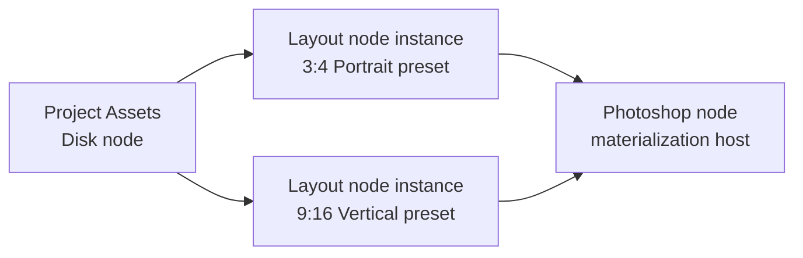

# Photara post-0.1.0 architecture study

This directory records the architecture study performed against the released
`v0.1.0` tree at commit `5b33e5981396fea5ab976bc9a3d75cdea8ccd5a0`.
It proposes an incremental evolution toward a node-based Rust core and native
authoring client. It does not change implementation, storage schemas, project
files, or `v0.1.0` behavior.

## Reading order

1. [Current v0.1 architecture](CURRENT_V0_1_ARCHITECTURE.md)
2. [Node architecture proposal](NODE_ARCHITECTURE_PROPOSAL.md)
3. [Node type system](NODE_TYPE_SYSTEM.md)
4. [Layout profile model](LAYOUT_PROFILE_MODEL.md)
5. [Cache model](CACHE_MODEL.md)
6. [SDK direction](SDK_DIRECTION.md)
7. [Layout UI vertical slice](LAYOUT_UI_VERTICAL_SLICE.md)
8. [Next implementation roadmap](MIGRATION_ROADMAP.md)

## Executive recommendation

Do not begin by splitting crates or replacing post JSON. First extract internal
boundaries inside the existing crate and introduce a small graph/value model
alongside the released workflow. The first useful graph should be:

The core geometry abstraction should be a versioned `CanvasProfile`; the
photographer-facing bundle should be a `LayoutPreset`. Instagram Portrait and
Threads Portrait become bundled presets. Publication limits, account identity,
and delivery naming remain downstream destination policy.

The first migration must be additive. Existing `PostSpecification` files are
importable compatibility documents, and published Red Meridian and Sylvan
specifications remain frozen regression evidence. A new graph must not rewrite
them merely to adopt newer architecture.

## Implementation authority

[The next implementation roadmap](MIGRATION_ROADMAP.md) converts this study
into release gates from 0.2.0 through 1.0.0. The immediate task is the 0.2.0
behavior-characterization and application-seam refactor. It explicitly excludes
graph implementation, UI work, storage-schema changes, and Photoshop/UXP
rewrites.
