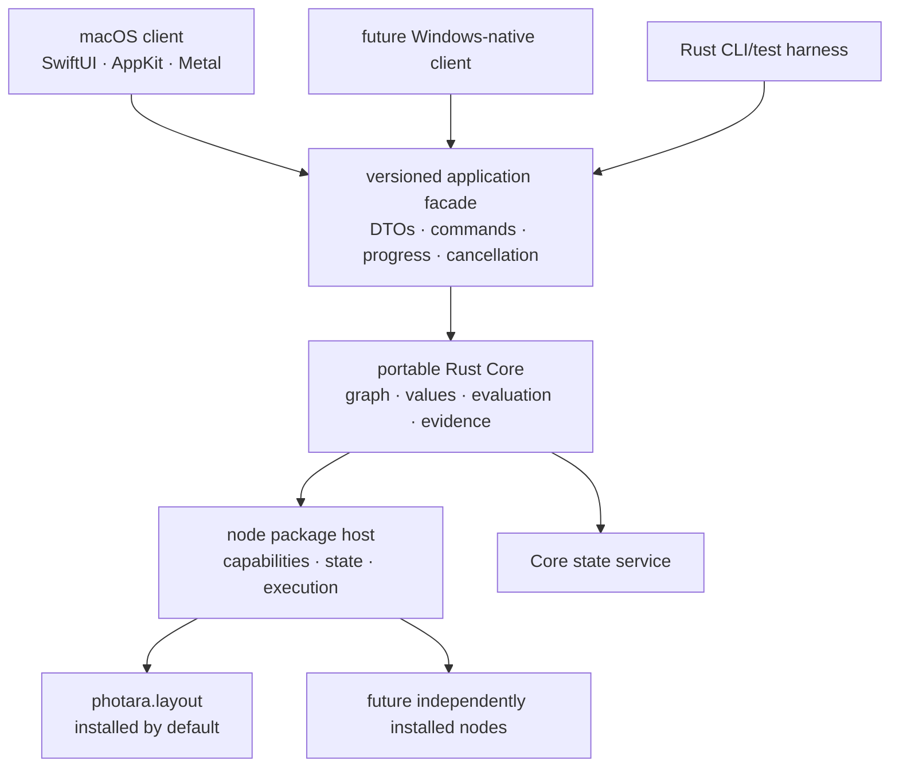

# Generation-two architecture

## Reading order

1. [Core](CORE.md)
2. [Portable project and node-graph documents](PROJECT_DOCUMENTS.md)
3. [Node packages](NODE_PACKAGES.md)
4. [Persistence](PERSISTENCE.md)
5. [Project assets and representations](ASSETS.md)
6. [Layout node](LAYOUT_NODE.md)
7. [Native clients](NATIVE_CLIENTS.md)
8. [Swift bridge spike](SWIFT_BRIDGE_SPIKE.md)

`ROADMAP.md` is authoritative for implementation order and release gates.

## System shape

Platform clients own native presentation. Core owns semantics. Nodes own
declared behavior and namespaced state. No layer reaches around these contracts.
