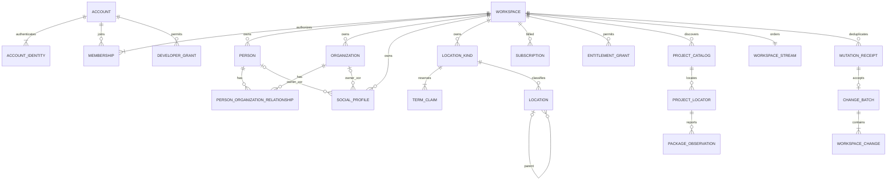

# Service PostgreSQL schema

## Current exact review packet — 2026-09-12

The [D19 physical/access delta](D19_STATIC_SCHEMA_DELTA.md#postgresql-authorization-rls-and-api-changes) now specifies 20 proposed new tables (55 total), one media-upload column extension, scoped APIs/feeds and replacement of membership-wide access predicates. Historical service 0007 is reserved for privileges, so additions start at 0008; local additions start at 0007. Baseline SQL below is unchanged and unexecuted. R1–R8 were accepted as proposed 2026-09-12; [inert proposal DDL](proposals/d19-cxt2/README.md) and its inventory are complete outside runtime migration paths. No SQL was executed; CXT3c and service implementation remain gated.

## D19 supersession notice — physical/protocol baseline retained

[D19](LIBRARY_AND_NODE_WORK_SURFACES.md) is the current conceptual authority:
Library replaces persistent Workspace; every Project belongs to exactly one
Library. Explicit ProjectAccessGrant/invitations and restricted/library-visible
policies govern Project access independently of blanket membership. Project-only
collaborators receive bounded assigned snapshots, not a full catalog, Library
feed, reset snapshot, receipt or media projection. Package/SMB authorization
remains separate device binding state.

Graphs consume explicit AssetSet ports and declared frozen context. There is no
ambient semantic project-wide Gallery, implicit asset union or `$project.assets`.
A private package graph/run identity/provenance/artifact ledger may remain.
Existing Workspace/ProjectAsset names, SQL, endpoint paths and baseline examples
below are conceptually superseded where they conflict; they remain unchanged
physical compatibility evidence pending an exact additive/rename/migration plan.

S3 remains 44 tables/179 statements; S4 35 tables/275 statements; all six applied
L2 migration files/checksums remain unchanged. Freeze logical/package/NodeSDK
contracts, then review exact static SQLite/PostgreSQL/package/sync deltas,
including LibraryId mapping, Project grants, filtered queries/feeds/snapshots/
media/receipts, RLS and compatibility. Revised CXT1/CXT3 follow that review;
L3 remains paused. This notice approves no new DDL, migration or service action.

## D18 amendment — logical requirements only, DDL deferred

[D18](TYPED_CONTEXT_AND_EXPRESSIONS.md) proposes typed Workspace variable
aggregates with reserved names, exact schemas/AST versions, one current value,
same-Workspace references, revisions/tombstones and permission-checked commands.
CXT2 will specify ordered additive DDL, RLS/service allowlists, Workspace-lock/CAS
transactions and S5 feed/receipt projection. The service validates expression
data but never executes it, resolves host SecretRefs or trusts a declared read
as authorization. Account scope remains preferences, not ambient variables.
Project/Graph/Run/asset metadata remain package authority; no default cloud asset
metadata index or unrestricted copied EXIF payload. Future summaries require an
explicit privacy projection and separately reviewed schema.

No DDL changes in this amendment: **35 tables, 275 statements, 25 RLS policies**
remain the S4 proposal counts. D18 does not inherit implementation/deployment
approval from D1–D17; CXT2 must freeze physical constraints and verification first.

Status: S4 proposal prepared for review, 2026-09-11. This is proposed SQL and
service policy, not installed migrations, an authorized deployment or a claim
that any Neon database has been inspected or changed. S5 reconciles transport
semantics; S6 proves fixtures; S7 is the user's implementation approval gate.

S5 reconciliation adds explicit Kind claim transfer/provenance, Account-scoped
claim receipts and private media staging sessions. See the
[synchronization contract](SYNCHRONIZATION_CONTRACT.md); no DDL was executed.

Inputs: [accepted logical model](LOGICAL_DATA_MODEL.md),
[S2 package proposal](PROJECT_PACKAGE_SCHEMA.md),
[S3 local SQLite proposal](LOCAL_SQLITE_SCHEMA.md), and
[Storexa 0.2 boundary](STOREXA_INTEGRATION.md).
The service is a clean generation-two authority for authenticated Accounts,
Workspace access and accepted synchronized Library revisions. Local repositories
remain the authority for pending local edits. Project content remains in its
package. Existing Neon and v0.1.3 sources are optional reference/salvage material;
no import, reset, conversion or live-data inspection is a prerequisite.

## Scope, deployment boundary and conventions

Proposed baseline is PostgreSQL 17+ with standard UUID, JSONB, BYTEA, range,
constraint-trigger and RLS features. Do not choose a live Neon branch/version
from this document. Deployment selects and verifies a supported server version,
extensions, backup policy and roles only after approval. This proposal requires
no extension and no provider-specific SQL. Schema migration uses a direct
connection; an approved pooled endpoint may serve ordinary short transactions.

| Store | Authority |
| --- | --- |
| Account/identity, membership | Service-authenticated identity and Workspace access |
| Subscription/entitlement records | Verified billing or explicit administrative grants |
| Typed Library | Accepted server revisions of Workspace-owned records |
| Logical roots/locators and catalog preference | Synchronized discovery metadata, not filesystem access |
| Catalog observations | Client-reported package-commit-qualified projections, not verified package contents |
| Mutation receipts/change batches | Durable server acceptance/deduplication and ordered synchronization history |
| Media descriptors | Authorized Workspace media metadata; bytes live in a separate protected object store |
| Local SQLite/device/package | Not owned or transactionally updated by this database |

Do not add authoritative project, asset, graph, node-attempt, receipt or package
tables. Node package/store catalogs and Apple CloudKit remain deferred contracts.
Package CommitIds/checksums are provenance; the service cannot verify an offline
SMB package from a client assertion.

Use native UUIDs (not Auth0 subjects or paths); Rust rejects nil UUIDs. Use
timestamptz for server instants and bigint positive **per-record** server
revisions. Wire revisions remain opaque tokens, initially an explicitly versioned
encoding of the integer. Do not substitute a package revision, local revision,
timestamp or feed cursor for a server revision. Package unsigned revisions use
numeric(20,0) with an unsigned-64 bound and serialize as canonical decimal strings.

Canonical keys use deterministic COLLATE "C" text and the same pinned Rust
normalizer as S3. Collation does not perform semantic normalization. JSONB is a
typed structured projection, not stable bytes: never hash jsonb::text as a wire
contract. Canonical UTF-8 request/response/change bytes are retained separately
with SHA-256. Rust validates codec, bounds, exact digest and agreement with JSONB.
No credentials, tokens, signed URLs, bookmark bytes or device paths enter
portable/synchronized JSON. SQL CHECKs validate shape, not arbitrary typed
element semantics.

## Migration organization and roles

After S7, Photara owns these separate files under migrations/postgres/:

1. 0001_identity_workspace.sql — namespaces, metadata, identities and memberships.
2. 0002_entitlements_media.sql — billing/grants and durable media descriptors.
3. 0003_typed_library.sql — People, Organizations, relationships and locations.
4. 0004_catalog.sql — logical discovery metadata and package observations.
5. 0005_mutations_feed.sql — accepted commands, revisions, batches and client cursors.
6. 0006_guards.sql — revision/lifecycle, ownership, hierarchy and feed guards.
7. 0007_privileges.sql — explicit grants and tenant-isolation RLS.

The SQL blocks below are those proposed files; no migration files are installed.
SQLx owns its standard _sqlx_migrations checksum ledger. Run migrations through
Storexa's PostgreSQL pool/Migrator boundary under one controlled migration owner;
do not fabricate ledger rows, replay SQLite migrations, or use current Neon
tables as an implicit baseline. schema_metadata is semantic compatibility
metadata, not a second migration ledger.

Role provisioning is a separately reviewed deployment precondition, not a
runtime CREATE ROLE endpoint. Proposed NOLOGIN group roles:

- photara_owner: owns schemas/tables/functions; migration login may SET ROLE.
- photara_api: ordinary service domain transactions; no ownership/BYPASSRLS,
  schema creation, membership administration or billing writes.
- photara_control: narrowly deployed identity/Workspace/billing controller;
  never reachable through arbitrary SQL or client-controlled role selection.
- photara_auth_read: read-only identity/permission lookup for the service.

Login roles inherit only their required group role; credentials remain in the
service secret manager. No role is a Neon admin, superuser or BYPASSRLS runtime
role. SQL blocks run as photara_owner. Every grant below is intentional; PUBLIC
gets no schema/table/function access. A service binary is still trusted code:
RLS is tenant-scope defense in depth, not a sandbox for arbitrary SQL or proof
that a JWT is valid.

## 0001 — identity and Workspace

Auth0 tokens are validated by the API for approved issuer/audience/signature,
expiry and required authentication policy. Only then resolve the exact
(issuer,subject) pair. Issuer is a configured canonical issuer URL; subject is
opaque and case-sensitive. Email is neither a unique key nor an account-linking
proof. Adding another identity requires explicit authenticated linking; never
merge Accounts by email or a similarly named Person.

```sql
CREATE SCHEMA photara AUTHORIZATION photara_owner;
CREATE SCHEMA photara_identity AUTHORIZATION photara_owner;
CREATE SCHEMA photara_private AUTHORIZATION photara_owner;
REVOKE ALL ON SCHEMA photara,photara_identity,photara_private FROM PUBLIC;

CREATE TABLE photara.schema_metadata (
  singleton boolean PRIMARY KEY DEFAULT true CHECK(singleton),
  schema_family text NOT NULL CHECK(schema_family='photara.service.g2'),
  schema_epoch integer NOT NULL CHECK(schema_epoch=1),
  minimum_api integer NOT NULL CHECK(minimum_api>=1),
  canonical_codec text NOT NULL CHECK(canonical_codec='photara.canonical-json.v1'),
  created_at timestamptz NOT NULL
);
CREATE TABLE photara.normalization_policies (
  policy_version integer PRIMARY KEY CHECK(policy_version>=1),
  unicode_version text NOT NULL,
  rules_sha256 bytea NOT NULL CHECK(octet_length(rules_sha256)=32),
  description text NOT NULL
);
CREATE TABLE photara_identity.accounts (
  account_id uuid PRIMARY KEY,
  display_name text NOT NULL,
  state text NOT NULL CHECK(state IN ('active','disabled','deleted')),
  revision bigint NOT NULL CHECK(revision>=1),
  created_at timestamptz NOT NULL,
  updated_at timestamptz NOT NULL,
  retired_at timestamptz,
  CHECK((state='active' AND retired_at IS NULL) OR
        (state IN ('disabled','deleted') AND retired_at IS NOT NULL))
);
CREATE TABLE photara_identity.account_identities (
  identity_id uuid PRIMARY KEY,
  account_id uuid NOT NULL REFERENCES photara_identity.accounts ON DELETE RESTRICT,
  issuer text COLLATE "C" NOT NULL CHECK(length(issuer)>0),
  subject text COLLATE "C" NOT NULL CHECK(length(subject)>0),
  state text NOT NULL CHECK(state IN ('active','revoked')),
  revision bigint NOT NULL CHECK(revision>=1),
  created_at timestamptz NOT NULL,
  updated_at timestamptz NOT NULL,
  revoked_at timestamptz,
  UNIQUE(issuer,subject),
  CHECK((state='revoked')=(revoked_at IS NOT NULL))
);
CREATE INDEX account_identities_account ON photara_identity.account_identities(account_id);

CREATE TABLE photara.workspaces (
  workspace_id uuid PRIMARY KEY,
  display_name text NOT NULL CHECK(length(btrim(display_name))>0),
  state text NOT NULL CHECK(state IN ('active','tombstoned')),
  revision bigint NOT NULL CHECK(revision>=1),
  created_at timestamptz NOT NULL,
  updated_at timestamptz NOT NULL,
  retired_at timestamptz,
  term_policy_version integer NOT NULL REFERENCES photara.normalization_policies ON DELETE RESTRICT,
  extensions jsonb NOT NULL DEFAULT '{}' CHECK(jsonb_typeof(extensions)='object'),
  CHECK((state='tombstoned')=(retired_at IS NOT NULL))
);
CREATE TABLE photara_identity.memberships (
  membership_id uuid PRIMARY KEY,
  workspace_id uuid NOT NULL REFERENCES photara.workspaces ON DELETE RESTRICT,
  account_id uuid NOT NULL REFERENCES photara_identity.accounts ON DELETE RESTRICT,
  role text NOT NULL CHECK(role IN ('owner','admin','editor','viewer')),
  state text NOT NULL CHECK(state IN ('active','revoked')),
  revision bigint NOT NULL CHECK(revision>=1),
  created_at timestamptz NOT NULL,
  updated_at timestamptz NOT NULL,
  revoked_at timestamptz,
  UNIQUE(workspace_id,account_id),
  CHECK((state='revoked')=(revoked_at IS NOT NULL))
);
CREATE INDEX memberships_account_active ON photara_identity.memberships(account_id,workspace_id)
  WHERE state='active';
CREATE INDEX memberships_workspace_role ON photara_identity.memberships(workspace_id,role)
  WHERE state='active';

CREATE TABLE photara_identity.devices (
  account_id uuid NOT NULL REFERENCES photara_identity.accounts ON DELETE RESTRICT,
  device_id uuid NOT NULL,
  display_name text NOT NULL,
  state text NOT NULL CHECK(state IN ('active','revoked')),
  registered_at timestamptz NOT NULL,
  last_seen_at timestamptz,
  PRIMARY KEY(account_id,device_id)
);
CREATE TABLE photara_private.workspace_claim_receipts (
  account_id uuid NOT NULL REFERENCES photara_identity.accounts ON DELETE RESTRICT,
  claim_id uuid NOT NULL,
  requested_workspace_id uuid NOT NULL,
  claimed_workspace_id uuid REFERENCES photara.workspaces ON DELETE RESTRICT,
  request_canonical bytea NOT NULL CHECK(octet_length(request_canonical) BETWEEN 2 AND 1048576),
  request_sha256 bytea NOT NULL CHECK(octet_length(request_sha256)=32),
  outcome text NOT NULL CHECK(outcome IN ('claimed','conflict')),
  response_canonical bytea NOT NULL CHECK(octet_length(response_canonical) BETWEEN 2 AND 4194304),
  response_sha256 bytea NOT NULL CHECK(octet_length(response_sha256)=32),
  completed_at timestamptz NOT NULL,
  PRIMARY KEY(account_id,claim_id),
  CHECK((outcome='claimed')=(claimed_workspace_id IS NOT NULL)),
  CHECK(claimed_workspace_id IS NULL OR claimed_workspace_id=requested_workspace_id)
);
```

A local-only Workspace is absent from the service until an explicit claim.
Claim verifies identity, checks UUID collision, atomically creates Workspace,
first owner membership and stream row, then uploads typed Library through the
normal mutation protocol. Collision is never an invitation to take over an
existing workspace. Joining an existing cloud workspace uses its ID and an
authorized invitation/controller flow; no local identity aliasing. Invitation
delivery/storage is outside this schema's first slice and must not be faked by
inserting membership from an email lookup.

Membership state is retained rather than deleting rows; role changes advance its
revision. Owner/admin/editor/viewer are application roles, not database roles.
Owners manage owner membership/deletion and billing; admins manage non-owner
membership and Library; editors edit Library/catalog; viewers read. An active
Workspace retains at least one owner membership; disabling/deleting that owner's
Account additionally requires an explicit ownership-transfer or Workspace-close
workflow. Last-owner handling is checked under the Workspace write lock and by
deferred invariant guards. Revoked identities remain reserved to their Account.

## 0002 — subscriptions, grants and media

Billing is Workspace-scoped; developer grants are Account-scoped. A capability
grant never creates membership or authorizes a different Workspace. Grant keys
are namespaced and versioned; exact plans/prices/quotas and the developer program
remain S7 product policy. No provider name or paid Node Store licensing is
hard-coded into the domain model.

```sql
CREATE TABLE photara_private.billing_events (
  provider text COLLATE "C" NOT NULL,
  event_id text COLLATE "C" NOT NULL,
  payload_sha256 bytea NOT NULL CHECK(octet_length(payload_sha256)=32),
  received_at timestamptz NOT NULL,
  event_kind text NOT NULL,
  payload jsonb NOT NULL CHECK(jsonb_typeof(payload)='object'),
  PRIMARY KEY(provider,event_id)
);
CREATE TABLE photara_private.workspace_subscriptions (
  subscription_id uuid PRIMARY KEY,
  workspace_id uuid NOT NULL REFERENCES photara.workspaces ON DELETE RESTRICT,
  provider text COLLATE "C" NOT NULL,
  provider_subscription_id text COLLATE "C" NOT NULL,
  plan_key text NOT NULL,
  state text NOT NULL CHECK(state IN ('trialing','active','past-due','paused','cancelled')),
  revision bigint NOT NULL CHECK(revision>=1),
  period_start timestamptz NOT NULL,
  period_end timestamptz NOT NULL CHECK(period_end>period_start),
  source_event_id text COLLATE "C" NOT NULL,
  created_at timestamptz NOT NULL,
  updated_at timestamptz NOT NULL,
  UNIQUE(provider,provider_subscription_id),
  UNIQUE(workspace_id,subscription_id),
  FOREIGN KEY(provider,source_event_id)
    REFERENCES photara_private.billing_events(provider,event_id) ON DELETE RESTRICT
);
CREATE UNIQUE INDEX subscriptions_one_current ON photara_private.workspace_subscriptions(workspace_id)
  WHERE state IN ('trialing','active','past-due','paused');

CREATE TABLE photara_private.workspace_entitlement_grants (
  grant_id uuid PRIMARY KEY,
  workspace_id uuid NOT NULL REFERENCES photara.workspaces ON DELETE RESTRICT,
  capability_key text COLLATE "C" NOT NULL CHECK(length(capability_key)>0),
  source text NOT NULL CHECK(source IN ('subscription','manual')),
  subscription_id uuid,
  enabled boolean NOT NULL,
  quota_limit bigint CHECK(quota_limit IS NULL OR quota_limit>=0),
  valid_from timestamptz NOT NULL,
  valid_until timestamptz,
  state text NOT NULL CHECK(state IN ('active','revoked')),
  revision bigint NOT NULL CHECK(revision>=1),
  created_at timestamptz NOT NULL,
  updated_at timestamptz NOT NULL,
  CHECK(valid_until IS NULL OR valid_until>valid_from),
  CHECK((source='subscription')=(subscription_id IS NOT NULL)),
  FOREIGN KEY(workspace_id,subscription_id)
    REFERENCES photara_private.workspace_subscriptions(workspace_id,subscription_id) ON DELETE RESTRICT
);
CREATE INDEX workspace_grants_lookup ON photara_private.workspace_entitlement_grants(workspace_id,capability_key,valid_from)
  WHERE state='active';

CREATE TABLE photara_private.account_developer_grants (
  grant_id uuid PRIMARY KEY,
  account_id uuid NOT NULL REFERENCES photara_identity.accounts ON DELETE RESTRICT,
  capability_key text COLLATE "C" NOT NULL CHECK(length(capability_key)>0),
  reason_code text NOT NULL,
  valid_from timestamptz NOT NULL,
  valid_until timestamptz,
  state text NOT NULL CHECK(state IN ('active','revoked')),
  revision bigint NOT NULL CHECK(revision>=1),
  created_at timestamptz NOT NULL,
  updated_at timestamptz NOT NULL,
  CHECK(valid_until IS NULL OR valid_until>valid_from)
);
CREATE INDEX developer_grants_lookup ON photara_private.account_developer_grants(account_id,capability_key,valid_from)
  WHERE state='active';

CREATE TABLE photara.library_media (
  workspace_id uuid NOT NULL REFERENCES photara.workspaces ON DELETE RESTRICT,
  sha256 bytea NOT NULL CHECK(octet_length(sha256)=32),
  media_type text NOT NULL,
  byte_length bigint NOT NULL CHECK(byte_length>=0),
  width integer CHECK(width IS NULL OR width>0),
  height integer CHECK(height IS NULL OR height>0),
  created_at timestamptz NOT NULL,
  PRIMARY KEY(workspace_id,sha256)
);
CREATE TABLE photara_private.media_objects (
  workspace_id uuid NOT NULL,
  sha256 bytea NOT NULL,
  object_key text COLLATE "C" NOT NULL UNIQUE CHECK(length(object_key)>0),
  state text NOT NULL CHECK(state IN ('pending','available','quarantined')),
  verified_at timestamptz,
  created_at timestamptz NOT NULL,
  CHECK(state<>'available' OR verified_at IS NOT NULL),
  PRIMARY KEY(workspace_id,sha256),
  FOREIGN KEY(workspace_id,sha256)
    REFERENCES photara.library_media(workspace_id,sha256) ON DELETE RESTRICT
);
CREATE TABLE photara_private.media_upload_sessions (
  upload_id uuid PRIMARY KEY,
  workspace_id uuid NOT NULL,
  sha256 bytea NOT NULL,
  staging_object_key text COLLATE "C" NOT NULL UNIQUE CHECK(length(staging_object_key)>0),
  state text NOT NULL CHECK(state IN ('pending','verifying','complete','failed','expired')),
  revision bigint NOT NULL CHECK(revision>=1),
  created_at timestamptz NOT NULL,
  updated_at timestamptz NOT NULL,
  expires_at timestamptz NOT NULL CHECK(expires_at>created_at),
  completed_at timestamptz,
  CHECK((state='complete')=(completed_at IS NOT NULL)),
  FOREIGN KEY(workspace_id,sha256)
    REFERENCES photara.library_media(workspace_id,sha256) ON DELETE RESTRICT
);
CREATE INDEX media_upload_pending ON photara_private.media_upload_sessions(workspace_id,expires_at)
  WHERE state IN ('pending','verifying');
```

Verify webhook signatures outside SQL, retain only an allowlisted event
projection/digest, and deduplicate (provider,event_id). Same ID/different digest
is a security/protocol error. Re-fetch authoritative provider state or use its
documented ordering/version rules before changing a subscription; arrival time
is not event order. Credentials, payment instrument data and full raw webhook
bodies are not stored here. An authenticated billing-controller transaction
records receipt, subscription/grant projection and an audit event together.

Proposed evaluation: an enabled, active, currently valid grant permits its exact
capability; quota grants for the same key use the maximum explicit limit, never
an accidental sum. Disabled/expired/revoked grants do not grant access. Developer
grants only permit their enumerated developer capability; they never imply admin,
billing or all paid features. Effective entitlement caching is short-lived and
server-owned. Fail closed for new gated cloud writes when verification is
unavailable, but do not erase local Library/packages or prevent local-only work.

Media descriptors are immutable once accepted; incompatible metadata for an
existing digest is an explicit conflict. Object keys and upload state are service
private. Upload targets are short-lived capabilities generated after membership,
quota and content-policy checks; finalization verifies bytes/size/hash before
availability. Content equality across Workspaces never grants access or returns
existence information. Metadata may precede media availability; downloading bytes
rechecks authorization. No object-store action runs inside a SQL transaction.

## 0003 — typed Library

The service has the same aggregate boundaries as S3. It accepts typed commands,
not arbitrary client SQL or blind row UPSERTs. Capabilities and labels belong to
their parent Person/Organization revision. A Client is a role of one of those
identities, not a separate duplicated Client table.

```sql
CREATE TABLE photara.people (
  person_id uuid PRIMARY KEY,
  workspace_id uuid NOT NULL REFERENCES photara.workspaces ON DELETE RESTRICT,
  record_schema integer NOT NULL CHECK(record_schema=1),
  revision bigint NOT NULL CHECK(revision>=1),
  created_at timestamptz NOT NULL,
  updated_at timestamptz NOT NULL,
  state text NOT NULL CHECK(state IN ('active','tombstoned','merged')),
  retired_at timestamptz,
  merged_into_id uuid,
  display_name text NOT NULL CHECK(length(btrim(display_name))>0),
  sort_key text COLLATE "C" NOT NULL CHECK(length(sort_key)>0),
  description text NOT NULL DEFAULT '',
  aliases jsonb NOT NULL DEFAULT '[]' CHECK(jsonb_typeof(aliases)='array'),
  thumbnail_sha256 bytea,
  extensions jsonb NOT NULL DEFAULT '{}' CHECK(jsonb_typeof(extensions)='object'),
  UNIQUE(workspace_id,person_id),
  CHECK((state='active' AND retired_at IS NULL AND merged_into_id IS NULL)
     OR (state='tombstoned' AND retired_at IS NOT NULL AND merged_into_id IS NULL)
     OR (state='merged' AND retired_at IS NOT NULL AND merged_into_id IS NOT NULL)),
  CHECK(merged_into_id IS NULL OR merged_into_id<>person_id),
  FOREIGN KEY(workspace_id,merged_into_id)
    REFERENCES photara.people(workspace_id,person_id) ON DELETE RESTRICT,
  FOREIGN KEY(workspace_id,thumbnail_sha256)
    REFERENCES photara.library_media(workspace_id,sha256) ON DELETE RESTRICT
);
CREATE INDEX people_browse ON photara.people(workspace_id,sort_key,person_id) WHERE state='active';
CREATE INDEX people_redirects ON photara.people(workspace_id,merged_into_id) WHERE merged_into_id IS NOT NULL;
CREATE TABLE photara.organizations (
  organization_id uuid PRIMARY KEY,
  workspace_id uuid NOT NULL REFERENCES photara.workspaces ON DELETE RESTRICT,
  record_schema integer NOT NULL CHECK(record_schema=1),
  revision bigint NOT NULL CHECK(revision>=1),
  created_at timestamptz NOT NULL,
  updated_at timestamptz NOT NULL,
  state text NOT NULL CHECK(state IN ('active','tombstoned','merged')),
  retired_at timestamptz,
  merged_into_id uuid,
  display_name text NOT NULL CHECK(length(btrim(display_name))>0),
  sort_key text COLLATE "C" NOT NULL CHECK(length(sort_key)>0),
  description text NOT NULL DEFAULT '',
  aliases jsonb NOT NULL DEFAULT '[]' CHECK(jsonb_typeof(aliases)='array'),
  thumbnail_sha256 bytea,
  extensions jsonb NOT NULL DEFAULT '{}' CHECK(jsonb_typeof(extensions)='object'),
  UNIQUE(workspace_id,organization_id),
  CHECK((state='active' AND retired_at IS NULL AND merged_into_id IS NULL)
     OR (state='tombstoned' AND retired_at IS NOT NULL AND merged_into_id IS NULL)
     OR (state='merged' AND retired_at IS NOT NULL AND merged_into_id IS NOT NULL)),
  CHECK(merged_into_id IS NULL OR merged_into_id<>organization_id),
  FOREIGN KEY(workspace_id,merged_into_id)
    REFERENCES photara.organizations(workspace_id,organization_id) ON DELETE RESTRICT,
  FOREIGN KEY(workspace_id,thumbnail_sha256)
    REFERENCES photara.library_media(workspace_id,sha256) ON DELETE RESTRICT
);
CREATE INDEX organizations_browse ON photara.organizations(workspace_id,sort_key,organization_id) WHERE state='active';
CREATE INDEX organizations_redirects ON photara.organizations(workspace_id,merged_into_id) WHERE merged_into_id IS NOT NULL;
CREATE TABLE photara.social_profiles (
  social_profile_id uuid PRIMARY KEY,
  workspace_id uuid NOT NULL REFERENCES photara.workspaces ON DELETE RESTRICT,
  person_id uuid,
  organization_id uuid,
  provider_id text COLLATE "C" NOT NULL CHECK(length(provider_id)>0),
  subject_namespace text COLLATE "C",
  provider_subject_id text COLLATE "C",
  handle text CHECK(handle IS NULL OR length(handle)>0),
  display_name text NOT NULL DEFAULT '',
  profile_url text CHECK(profile_url IS NULL OR length(profile_url)>0),
  account_kind text NOT NULL CHECK(account_kind IN ('unknown','personal','creator','business','organization','service','other')),
  provider_account_kind text,
  verification_kind text NOT NULL CHECK(verification_kind IN ('unverified','user-asserted','provider-authorized')),
  verified_at timestamptz,
  provenance jsonb NOT NULL CHECK(jsonb_typeof(provenance)='object'),
  fetched_at timestamptz,
  refreshed_at timestamptz,
  next_refresh_after timestamptz,
  fetch_state text NOT NULL CHECK(fetch_state IN ('never','available','unavailable','revoked','expired','error')),
  avatar_policy text NOT NULL CHECK(avatar_policy IN ('none','cache-only','durable-consented')),
  avatar_consent_at timestamptz,
  avatar_expires_at timestamptz,
  avatar_media_sha256 bytea,
  record_schema integer NOT NULL CHECK(record_schema=1),
  revision bigint NOT NULL CHECK(revision>=1),
  created_at timestamptz NOT NULL,
  updated_at timestamptz NOT NULL,
  state text NOT NULL CHECK(state IN ('active','tombstoned')),
  retired_at timestamptz,
  extensions jsonb NOT NULL DEFAULT '{}' CHECK(jsonb_typeof(extensions)='object'),
  UNIQUE(workspace_id,social_profile_id),
  CHECK((person_id IS NOT NULL)<>(organization_id IS NOT NULL)),
  CHECK((subject_namespace IS NULL AND provider_subject_id IS NULL)
     OR (subject_namespace IS NOT NULL AND provider_subject_id IS NOT NULL
         AND length(subject_namespace)>0 AND length(provider_subject_id)>0)),
  CHECK(provider_subject_id IS NOT NULL OR handle IS NOT NULL OR profile_url IS NOT NULL),
  CHECK((verification_kind='unverified' AND verified_at IS NULL)
     OR (verification_kind<>'unverified' AND verified_at IS NOT NULL)),
  CHECK(avatar_policy='none' OR avatar_consent_at IS NOT NULL),
  CHECK(avatar_policy<>'cache-only' OR avatar_expires_at IS NOT NULL),
  CHECK(avatar_media_sha256 IS NULL OR avatar_policy='durable-consented'),
  CHECK((state='active' AND retired_at IS NULL) OR (state='tombstoned' AND retired_at IS NOT NULL)),
  FOREIGN KEY(workspace_id,person_id) REFERENCES photara.people(workspace_id,person_id) ON DELETE RESTRICT,
  FOREIGN KEY(workspace_id,organization_id) REFERENCES photara.organizations(workspace_id,organization_id) ON DELETE RESTRICT,
  FOREIGN KEY(workspace_id,avatar_media_sha256) REFERENCES photara.library_media(workspace_id,sha256) ON DELETE RESTRICT
);
CREATE UNIQUE INDEX social_workspace_subject ON photara.social_profiles(workspace_id,provider_id,subject_namespace,provider_subject_id)
  WHERE provider_subject_id IS NOT NULL;
CREATE INDEX social_profiles_person ON photara.social_profiles(workspace_id,person_id,social_profile_id) WHERE state='active';
CREATE INDEX social_profiles_organization ON photara.social_profiles(workspace_id,organization_id,social_profile_id) WHERE state='active';

CREATE TABLE photara.person_capabilities (
  workspace_id uuid NOT NULL,
  person_id uuid NOT NULL,
  capability_id text COLLATE "C" NOT NULL CHECK(length(capability_id)>0),
  PRIMARY KEY(workspace_id,person_id,capability_id),
  FOREIGN KEY(workspace_id,person_id) REFERENCES photara.people(workspace_id,person_id) ON DELETE RESTRICT
);
CREATE INDEX person_capability_filter ON photara.person_capabilities(workspace_id,capability_id,person_id);
CREATE TABLE photara.person_labels (
  workspace_id uuid NOT NULL,
  person_id uuid NOT NULL,
  label_key text COLLATE "C" NOT NULL CHECK(length(label_key)>0),
  display_label text NOT NULL CHECK(length(display_label)>0),
  PRIMARY KEY(workspace_id,person_id,label_key),
  FOREIGN KEY(workspace_id,person_id) REFERENCES photara.people(workspace_id,person_id) ON DELETE RESTRICT
);
CREATE INDEX person_label_filter ON photara.person_labels(workspace_id,label_key,person_id);
CREATE TABLE photara.organization_labels (
  workspace_id uuid NOT NULL,
  organization_id uuid NOT NULL,
  label_key text COLLATE "C" NOT NULL CHECK(length(label_key)>0),
  display_label text NOT NULL CHECK(length(display_label)>0),
  PRIMARY KEY(workspace_id,organization_id,label_key),
  FOREIGN KEY(workspace_id,organization_id) REFERENCES photara.organizations(workspace_id,organization_id) ON DELETE RESTRICT
);
CREATE INDEX organization_label_filter ON photara.organization_labels(workspace_id,label_key,organization_id);

CREATE TABLE photara.person_organization_relationships (
  relationship_id uuid PRIMARY KEY,
  workspace_id uuid NOT NULL,
  person_id uuid NOT NULL,
  organization_id uuid NOT NULL,
  relationship_type text COLLATE "C" NOT NULL CHECK(length(relationship_type)>0),
  valid_from timestamptz,
  valid_until timestamptz,
  notes text NOT NULL DEFAULT '',
  labels jsonb NOT NULL DEFAULT '[]' CHECK(jsonb_typeof(labels)='array'),
  record_schema integer NOT NULL CHECK(record_schema=1),
  revision bigint NOT NULL CHECK(revision>=1),
  created_at timestamptz NOT NULL,
  updated_at timestamptz NOT NULL,
  state text NOT NULL CHECK(state IN ('active','tombstoned')),
  retired_at timestamptz,
  extensions jsonb NOT NULL DEFAULT '{}' CHECK(jsonb_typeof(extensions)='object'),
  CHECK(valid_from IS NULL OR valid_until IS NULL OR valid_until>valid_from),
  CHECK((state='tombstoned')=(retired_at IS NOT NULL)),
  FOREIGN KEY(workspace_id,person_id) REFERENCES photara.people(workspace_id,person_id) ON DELETE RESTRICT,
  FOREIGN KEY(workspace_id,organization_id) REFERENCES photara.organizations(workspace_id,organization_id) ON DELETE RESTRICT
);
CREATE INDEX relationships_pair_role ON photara.person_organization_relationships(
  workspace_id,person_id,organization_id,relationship_type) WHERE state='active';
CREATE INDEX relationships_organization ON photara.person_organization_relationships(
  workspace_id,organization_id,person_id) WHERE state='active';

CREATE TABLE photara.location_kinds (
  location_kind_id uuid PRIMARY KEY,
  workspace_id uuid NOT NULL REFERENCES photara.workspaces ON DELETE RESTRICT,
  canonical_key text COLLATE "C" NOT NULL CHECK(length(canonical_key)>0),
  canonical_display text NOT NULL CHECK(length(btrim(canonical_display))>0),
  description text NOT NULL DEFAULT '',
  thumbnail_sha256 bytea,
  record_schema integer NOT NULL CHECK(record_schema=1),
  revision bigint NOT NULL CHECK(revision>=1),
  created_at timestamptz NOT NULL,
  updated_at timestamptz NOT NULL,
  state text NOT NULL CHECK(state IN ('active','tombstoned','merged')),
  retired_at timestamptz,
  merged_into_id uuid,
  extensions jsonb NOT NULL DEFAULT '{}' CHECK(jsonb_typeof(extensions)='object'),
  UNIQUE(workspace_id,location_kind_id),
  claim_owner_id uuid GENERATED ALWAYS AS (CASE WHEN state<>'merged' THEN location_kind_id END) STORED,
  required_canonical_key text COLLATE "C" GENERATED ALWAYS AS (CASE WHEN state<>'merged' THEN canonical_key END) STORED,
  retirement_terms jsonb CHECK(retirement_terms IS NULL OR jsonb_typeof(retirement_terms)='array'),
  UNIQUE(workspace_id,claim_owner_id),
  CHECK((state='active')=(retirement_terms IS NULL)),
  CHECK((state='active' AND retired_at IS NULL AND merged_into_id IS NULL)
     OR (state='tombstoned' AND retired_at IS NOT NULL AND merged_into_id IS NULL)
     OR (state='merged' AND retired_at IS NOT NULL AND merged_into_id IS NOT NULL)),
  CHECK(merged_into_id IS NULL OR merged_into_id<>location_kind_id),
  FOREIGN KEY(workspace_id,merged_into_id)
    REFERENCES photara.location_kinds(workspace_id,location_kind_id) ON DELETE RESTRICT,
  FOREIGN KEY(workspace_id,thumbnail_sha256)
    REFERENCES photara.library_media(workspace_id,sha256) ON DELETE RESTRICT
);
CREATE TABLE photara.location_kind_terms (
  workspace_id uuid NOT NULL,
  term_key text COLLATE "C" NOT NULL CHECK(length(term_key)>0),
  location_kind_id uuid NOT NULL,
  policy_version integer NOT NULL REFERENCES photara.normalization_policies ON DELETE RESTRICT,
  spellings jsonb NOT NULL CHECK(jsonb_typeof(spellings)='array' AND jsonb_array_length(spellings)>0),
  PRIMARY KEY(workspace_id,term_key),
  UNIQUE(workspace_id,location_kind_id,term_key),
  FOREIGN KEY(workspace_id,location_kind_id)
    REFERENCES photara.location_kinds(workspace_id,claim_owner_id)
    DEFERRABLE INITIALLY DEFERRED
);
ALTER TABLE photara.location_kinds ADD CONSTRAINT kind_canonical_claim
  FOREIGN KEY(workspace_id,location_kind_id,required_canonical_key)
  REFERENCES photara.location_kind_terms(workspace_id,location_kind_id,term_key)
  DEFERRABLE INITIALLY DEFERRED;
CREATE INDEX kind_browse ON photara.location_kinds(workspace_id,canonical_key,location_kind_id) WHERE state='active';
CREATE INDEX kind_redirects ON photara.location_kinds(workspace_id,merged_into_id) WHERE merged_into_id IS NOT NULL;

CREATE TABLE photara.locations (
  location_id uuid PRIMARY KEY,
  workspace_id uuid NOT NULL REFERENCES photara.workspaces ON DELETE RESTRICT,
  location_kind_id uuid NOT NULL,
  parent_location_id uuid,
  display_name text NOT NULL CHECK(length(btrim(display_name))>0),
  sort_key text COLLATE "C" NOT NULL CHECK(length(sort_key)>0),
  description text NOT NULL DEFAULT '',
  aliases jsonb NOT NULL DEFAULT '[]' CHECK(jsonb_typeof(aliases)='array'),
  address jsonb NOT NULL DEFAULT '{}' CHECK(jsonb_typeof(address)='object'),
  latitude double precision CHECK(latitude BETWEEN -90 AND 90),
  longitude double precision CHECK(longitude BETWEEN -180 AND 180),
  thumbnail_sha256 bytea,
  record_schema integer NOT NULL CHECK(record_schema=1),
  revision bigint NOT NULL CHECK(revision>=1),
  created_at timestamptz NOT NULL,
  updated_at timestamptz NOT NULL,
  state text NOT NULL CHECK(state IN ('active','tombstoned','merged')),
  retired_at timestamptz,
  merged_into_id uuid,
  extensions jsonb NOT NULL DEFAULT '{}' CHECK(jsonb_typeof(extensions)='object'),
  UNIQUE(workspace_id,location_id),
  CHECK((latitude IS NULL)=(longitude IS NULL)),
  CHECK(parent_location_id IS NULL OR parent_location_id<>location_id),
  CHECK(merged_into_id IS NULL OR merged_into_id<>location_id),
  CHECK((state='active' AND retired_at IS NULL AND merged_into_id IS NULL)
     OR (state='tombstoned' AND retired_at IS NOT NULL AND merged_into_id IS NULL)
     OR (state='merged' AND retired_at IS NOT NULL AND merged_into_id IS NOT NULL)),
  FOREIGN KEY(workspace_id,location_kind_id)
    REFERENCES photara.location_kinds(workspace_id,location_kind_id) ON DELETE RESTRICT,
  FOREIGN KEY(workspace_id,parent_location_id)
    REFERENCES photara.locations(workspace_id,location_id) ON DELETE RESTRICT,
  FOREIGN KEY(workspace_id,merged_into_id)
    REFERENCES photara.locations(workspace_id,location_id) ON DELETE RESTRICT,
  FOREIGN KEY(workspace_id,thumbnail_sha256)
    REFERENCES photara.library_media(workspace_id,sha256) ON DELETE RESTRICT
);
CREATE INDEX location_browse ON photara.locations(workspace_id,sort_key,location_id) WHERE state='active';
CREATE INDEX location_kind_filter ON photara.locations(workspace_id,location_kind_id,location_id) WHERE state='active';
CREATE INDEX location_children ON photara.locations(workspace_id,parent_location_id,location_id) WHERE state='active';
CREATE INDEX location_redirects ON photara.locations(workspace_id,merged_into_id) WHERE merged_into_id IS NOT NULL;
```

### Concept uniqueness and S5 claim-transfer reconciliation

Canonical terms and aliases share PRIMARY KEY(workspace_id,term_key). Policy
version is not part of this key. Rust recomputes keys using the Workspace's
installed policy; Beach/beach/beaches claim the same key in either order. SQL
uniqueness arbitrates concurrent claims; unknown custom terms require the S1
explicit alias flow. New policy installation is not permission to re-key a
Workspace silently: collision-reporting migration is a separate approved action.

S5 recommends explicit atomic claim transfer for v1, including canonical
promotion and reconciliation after competing offline Kind creation. Both physical
proposals now separate eligible current ownership from retired provenance:
claim_owner_id is NULL for merged rows, so deferred owner FKs require all their
claims to move by commit; required_canonical_key is NULL for merged rows, so
their immutable historical canonical descriptor no longer requires a live claim.
Active/tombstoned kinds still require their canonical term under their own ID.

A transfer guard permits a changed owner only when the old owner is now merged
directly into the new active target. The Workspace/key PK never changes and no
claim is freed. retirement_terms plus the frozen source canonical descriptor
retain provenance; target canonical promotion uses a now-owned claim. Tombstoned
terms stay reserved. No arbitrary reassignment, unmerge or resurrection is added.
See [S5's exact merge/collision contract](SYNCHRONIZATION_CONTRACT.md). The proposed
mechanism still needs shared S6 fixtures and S7 approval; it is not runtime support.

## 0004 — catalog and logical locations

No server path resolver is implied. Logical roots/relative locators may sync;
per-device absolute paths, security bookmarks, provider grants, availability and
selected active location remain S3-only. A server observation is a client report
bound to ProjectId/CommitId/checksum and actor provenance. It cannot establish
package safety, grant file access or overwrite Project metadata.

```sql
CREATE TABLE photara.storage_roots (
  storage_root_id uuid PRIMARY KEY,
  workspace_id uuid NOT NULL REFERENCES photara.workspaces ON DELETE RESTRICT,
  display_name text NOT NULL CHECK(length(btrim(display_name))>0),
  label_key text COLLATE "C" NOT NULL CHECK(length(label_key)>0),
  purpose text NOT NULL CHECK(length(purpose)>0),
  revision bigint NOT NULL CHECK(revision>=1),
  state text NOT NULL CHECK(state IN ('active','tombstoned')),
  created_at timestamptz NOT NULL,
  updated_at timestamptz NOT NULL,
  retired_at timestamptz,
  UNIQUE(workspace_id,storage_root_id),
  UNIQUE(workspace_id,label_key),
  CHECK((state='tombstoned')=(retired_at IS NOT NULL))
);
CREATE TABLE photara.project_catalog (
  workspace_id uuid NOT NULL REFERENCES photara.workspaces ON DELETE RESTRICT,
  project_id uuid NOT NULL,
  visibility text NOT NULL CHECK(visibility IN ('visible','hidden')),
  revision bigint NOT NULL CHECK(revision>=1),
  created_at timestamptz NOT NULL,
  updated_at timestamptz NOT NULL,
  PRIMARY KEY(workspace_id,project_id)
);
CREATE TABLE photara.project_locators (
  locator_id uuid PRIMARY KEY,
  workspace_id uuid NOT NULL,
  project_id uuid NOT NULL,
  storage_root_id uuid,
  relative_path text COLLATE "C",
  state text NOT NULL CHECK(state IN ('active','retired')),
  revision bigint NOT NULL CHECK(revision>=1),
  created_at timestamptz NOT NULL,
  updated_at timestamptz NOT NULL,
  retired_at timestamptz,
  UNIQUE(workspace_id,project_id,locator_id),
  CHECK((storage_root_id IS NULL)=(relative_path IS NULL)),
  CHECK(relative_path IS NULL OR
    (length(relative_path)>0 AND left(relative_path,1)<>'/'
     AND strpos(relative_path,chr(92))=0 AND strpos(relative_path,':')=0
     AND strpos(relative_path,'//')=0
     AND strpos('/'||relative_path||'/','/../')=0
     AND strpos('/'||relative_path||'/','/./')=0)),
  CHECK((state='retired')=(retired_at IS NOT NULL)),
  FOREIGN KEY(workspace_id,project_id) REFERENCES photara.project_catalog(workspace_id,project_id) ON DELETE RESTRICT,
  FOREIGN KEY(workspace_id,storage_root_id) REFERENCES photara.storage_roots(workspace_id,storage_root_id) ON DELETE RESTRICT
);
CREATE UNIQUE INDEX locator_rooted_path ON photara.project_locators(workspace_id,storage_root_id,relative_path)
  WHERE state='active' AND storage_root_id IS NOT NULL;
CREATE INDEX locator_project ON photara.project_locators(workspace_id,project_id);

CREATE TABLE photara.package_observations (
  observation_id uuid PRIMARY KEY,
  workspace_id uuid NOT NULL,
  project_id uuid NOT NULL,
  locator_id uuid NOT NULL,
  commit_id uuid NOT NULL,
  commit_sha256 bytea NOT NULL CHECK(octet_length(commit_sha256)=32),
  package_revision numeric(20,0) NOT NULL CHECK(package_revision BETWEEN 1 AND 18446744073709551615),
  index_schema integer NOT NULL CHECK(index_schema=1),
  title text NOT NULL,
  project_lifecycle text NOT NULL CHECK(project_lifecycle IN ('active','archived')),
  asset_count bigint NOT NULL CHECK(asset_count>=0),
  graph_count bigint NOT NULL CHECK(graph_count>=0),
  graph_summaries jsonb NOT NULL DEFAULT '[]' CHECK(jsonb_typeof(graph_summaries)='array'),
  party_snapshots jsonb NOT NULL DEFAULT '[]' CHECK(jsonb_typeof(party_snapshots)='array'),
  location_snapshots jsonb NOT NULL DEFAULT '[]' CHECK(jsonb_typeof(location_snapshots)='array'),
  reported_by_account_id uuid NOT NULL,
  reported_by_device_id uuid NOT NULL,
  observed_at timestamptz NOT NULL,
  received_at timestamptz NOT NULL,
  projection_canonical bytea NOT NULL CHECK(octet_length(projection_canonical) BETWEEN 2 AND 1048576),
  projection_sha256 bytea NOT NULL CHECK(octet_length(projection_sha256)=32),
  UNIQUE(workspace_id,observation_id),
  UNIQUE(workspace_id,locator_id,commit_id,commit_sha256,index_schema),
  FOREIGN KEY(workspace_id,project_id,locator_id)
    REFERENCES photara.project_locators(workspace_id,project_id,locator_id) ON DELETE RESTRICT,
  FOREIGN KEY(reported_by_account_id,reported_by_device_id)
    REFERENCES photara_identity.devices(account_id,device_id) ON DELETE RESTRICT
);
CREATE INDEX observation_project ON photara.package_observations(workspace_id,project_id,received_at,observation_id);
CREATE INDEX observation_commit ON photara.package_observations(workspace_id,project_id,commit_id,commit_sha256);
```

Projection arrays have closed typed element schemas shared with S3: graph IDs,
names, authored digest/revision and optional run summary; typed party source IDs/
revisions and roles; Location/kind snapshots and assignment IDs/schedules.
These are bounded derived summaries, not editable graph/asset/run JSON. No FK
points a historical snapshot to today's Library record. Structured service
search indexes can be added after representative workload fixtures; no generic
JSON query endpoint is exposed.

The unique observation key makes repeat reporting idempotent only when the
projection digest agrees. Different projection bytes for the same package commit
and index version are a conflict, not an update. Independent observations of a
commit-id collision remain diagnosable. No automatic newest-observation selection
is stored server-side; query returns candidates, and local verified selection is
device-owned. Hide/remove catalog metadata never deletes bytes or history.
Relative-path SQL checks are a floor; Rust applies the complete S2 path policy,
Unicode/case rules and byte bounds before accepting a locator.

## 0005 — mutation receipts and ordered changes

One Workspace write lock is deliberately the first-release concurrency boundary.
It serializes accepted commands, authorization-changing membership operations and
feed allocation for that Workspace, not for the whole service. This avoids the
classic mistake of using an independently allocated sequence as a commit-order
cursor: PostgreSQL sequences do not roll back and concurrent commit order can
differ from allocation order. See [transaction semantics](https://www.postgresql.org/docs/current/transaction-iso.html).

```sql
CREATE TABLE photara_private.workspace_streams (
  workspace_id uuid PRIMARY KEY REFERENCES photara.workspaces ON DELETE RESTRICT,
  epoch uuid NOT NULL,
  last_sequence bigint NOT NULL DEFAULT 0 CHECK(last_sequence>=0),
  minimum_retained_sequence bigint NOT NULL DEFAULT 0 CHECK(minimum_retained_sequence>=0),
  UNIQUE(workspace_id,epoch),
  CHECK(minimum_retained_sequence<=last_sequence)
);
CREATE TABLE photara_private.mutation_receipts (
  workspace_id uuid NOT NULL REFERENCES photara.workspaces ON DELETE RESTRICT,
  mutation_id uuid NOT NULL,
  actor_account_id uuid NOT NULL,
  device_id uuid NOT NULL,
  command_schema integer NOT NULL CHECK(command_schema>=1),
  command_kind text NOT NULL CHECK(length(command_kind)>0),
  request_canonical bytea NOT NULL CHECK(octet_length(request_canonical) BETWEEN 2 AND 1048576),
  request_sha256 bytea NOT NULL CHECK(octet_length(request_sha256)=32),
  outcome text NOT NULL CHECK(outcome IN ('accepted','rejected','conflict')),
  response_canonical bytea NOT NULL CHECK(octet_length(response_canonical) BETWEEN 2 AND 4194304),
  response_sha256 bytea NOT NULL CHECK(octet_length(response_sha256)=32),
  error_code text,
  accepted_epoch uuid,
  accepted_sequence bigint,
  received_at timestamptz NOT NULL,
  completed_at timestamptz NOT NULL,
  PRIMARY KEY(workspace_id,mutation_id),
  CHECK((outcome='accepted')=(accepted_epoch IS NOT NULL)),
  CHECK((outcome='accepted')=(accepted_sequence IS NOT NULL)),
  CHECK(accepted_sequence IS NULL OR accepted_sequence>0),
  CHECK(outcome<>'accepted' OR error_code IS NULL),
  FOREIGN KEY(actor_account_id,device_id)
    REFERENCES photara_identity.devices(account_id,device_id) ON DELETE RESTRICT
);
CREATE TABLE photara.workspace_change_batches (
  workspace_id uuid NOT NULL,
  epoch uuid NOT NULL,
  sequence bigint NOT NULL CHECK(sequence>0),
  mutation_id uuid NOT NULL,
  committed_at timestamptz NOT NULL,
  change_count integer NOT NULL CHECK(change_count BETWEEN 1 AND 1000),
  batch_canonical bytea NOT NULL CHECK(octet_length(batch_canonical) BETWEEN 2 AND 4194304),
  batch_sha256 bytea NOT NULL CHECK(octet_length(batch_sha256)=32),
  PRIMARY KEY(workspace_id,epoch,sequence),
  UNIQUE(workspace_id,mutation_id),
  FOREIGN KEY(workspace_id,epoch)
    REFERENCES photara_private.workspace_streams(workspace_id,epoch) ON DELETE RESTRICT,
  FOREIGN KEY(workspace_id,mutation_id)
    REFERENCES photara_private.mutation_receipts(workspace_id,mutation_id)
    DEFERRABLE INITIALLY DEFERRED
);
ALTER TABLE photara_private.mutation_receipts ADD CONSTRAINT receipt_accepted_batch
  FOREIGN KEY(workspace_id,accepted_epoch,accepted_sequence)
  REFERENCES photara.workspace_change_batches(workspace_id,epoch,sequence)
  DEFERRABLE INITIALLY DEFERRED;

CREATE TABLE photara.workspace_changes (
  workspace_id uuid NOT NULL,
  epoch uuid NOT NULL,
  sequence bigint NOT NULL,
  ordinal integer NOT NULL CHECK(ordinal>=0),
  entity_kind text NOT NULL CHECK(entity_kind IN
    ('workspace','person','organization','social-profile','person-organization-relationship',
     'location-kind','location','storage-root','project-catalog','project-locator')),
  entity_id uuid NOT NULL,
  entity_revision bigint NOT NULL CHECK(entity_revision>=1),
  change_kind text NOT NULL CHECK(change_kind IN ('create','update','tombstone','merge')),
  record_schema integer NOT NULL CHECK(record_schema>=1),
  post_state jsonb NOT NULL CHECK(jsonb_typeof(post_state)='object'),
  post_state_canonical bytea NOT NULL CHECK(octet_length(post_state_canonical) BETWEEN 2 AND 1048576),
  post_state_sha256 bytea NOT NULL CHECK(octet_length(post_state_sha256)=32),
  PRIMARY KEY(workspace_id,epoch,sequence,ordinal),
  UNIQUE(workspace_id,entity_kind,entity_id,entity_revision),
  FOREIGN KEY(workspace_id,epoch,sequence)
    REFERENCES photara.workspace_change_batches(workspace_id,epoch,sequence) ON DELETE RESTRICT
);
CREATE INDEX changes_entity ON photara.workspace_changes(workspace_id,entity_kind,entity_id,entity_revision);

CREATE TABLE photara_private.sync_clients (
  workspace_id uuid NOT NULL,
  account_id uuid NOT NULL,
  device_id uuid NOT NULL,
  stream_epoch uuid NOT NULL,
  acknowledged_sequence bigint NOT NULL DEFAULT 0 CHECK(acknowledged_sequence>=0),
  last_seen_at timestamptz NOT NULL,
  PRIMARY KEY(workspace_id,account_id,device_id),
  FOREIGN KEY(workspace_id,stream_epoch)
    REFERENCES photara_private.workspace_streams(workspace_id,epoch) ON DELETE RESTRICT,
  FOREIGN KEY(account_id,device_id)
    REFERENCES photara_identity.devices(account_id,device_id) ON DELETE RESTRICT
);
CREATE TABLE photara_private.security_audit (
  audit_id uuid PRIMARY KEY,
  actor_account_id uuid REFERENCES photara_identity.accounts ON DELETE RESTRICT,
  workspace_id uuid REFERENCES photara.workspaces ON DELETE RESTRICT,
  action_code text NOT NULL,
  target_kind text NOT NULL,
  target_id uuid,
  occurred_at timestamptz NOT NULL,
  details jsonb NOT NULL DEFAULT '{}' CHECK(jsonb_typeof(details)='object')
);
CREATE INDEX security_audit_workspace ON photara_private.security_audit(workspace_id,occurred_at,audit_id);
```

A command transaction first validates current authentication/authorization, locks
the Workspace row, rechecks state/access, and looks up its receipt. Same
Workspace/MutationId, actor and exact request digest/bytes returns the existing
result. Different bytes or actor returns an idempotency conflict without exposing
the earlier payload. Unknown transport outcomes retry the same sealed request.
Authorization is rechecked even when a receipt exists; deduplication never
overrides membership revocation.

For a new command, validate all expected per-entity server revisions and typed
invariants before making changes. An accepted multi-root command updates roots,
children and immutable auxiliaries, allocates last_sequence+1 under that same
lock, and stores one receipt/batch plus ordered exact post-states atomically.
Each changed root increments its own revision once. Rejected/conflicting
commands store a final receipt without changing roots or feed sequence.
Transient DB/transport failures are not durable rejections. A corrected command
gets a new MutationId; retries do not silently adopt new preconditions.

There is no committed processing receipt. The Workspace lock prevents two
workers accepting the same MutationId concurrently; receipt uniqueness remains
a second defense. A commit acknowledgement lost in transport is resolved by
receipt lookup. Receipt retention is part of idempotency correctness: initial
release retains receipts and tombstones; any later bounded retention requires
explicit key-expiry/full-resync semantics before deletion.

Feed order is (WorkspaceId,epoch,sequence), where each sequence is one complete
transaction batch. committed_at is a server observation timestamp, not an
ordering guarantee. An opaque authenticated cursor includes protocol version,
WorkspaceId, stream epoch and last fully applied sequence. The service validates
cursor integrity and current membership; possession of a cursor is not access.
Page by whole batches with bounded count/bytes, never split a multi-root command.
Because commands hold the same Workspace lock until commit, a visible high-water
sequence cannot hide an earlier uncommitted batch.

Initial snapshots use a repeatable-read transaction: capture stream high-water
and typed current state in one snapshot, then consume batches after it. Do not
hold a SQL transaction across interactive pagination; a large snapshot needs a
bounded durable snapshot export/token protocol specified in S5. Cursor expiry,
epoch reset and retention yield an explicit snapshot-required response, not
"no changes". Client acknowledgements must be monotonic, within the current
epoch/high-water, and cannot grant deletion permission by themselves.

Catalog observation acceptance is a catalog command: bump its catalog revision
and emit a typed catalog change carrying the immutable observation attachment.
Media descriptors required by typed post-states travel as validated attachment
descriptors. These auxiliary types are not authored Project/Graph changes or
new generic mutable entities. S5 must pin this attachment envelope and S3 inbox
materialization before either side ships. Membership/account/entitlement cache
refresh uses authenticated control endpoints and their own revisions; it does
not insert sensitive control records into the shared Library change feed.

## Social profile and portable export refinement

The requested [D16/D17 addition](SOCIAL_PROFILES_AND_LIBRARY_EXPORT.md) adds the
typed `photara.social_profiles` root to Library DDL, change-kind vocabulary,
revision/Workspace/owner guards, scoped API grants and forced RLS. Profiles are
not Account/Auth0 identities. Each has one Person-or-Organization owner, immutable
provider/owner coordinates and optional adopt-once exact provider subject+namespace;
the same bound scoped subject is unique across its Workspace, including tombstones,
and cannot attach to two owners. Parent retirement explicitly retires profiles
before merge, preserving history. Bound subjects cannot be cloned onto the target;
reattachment requires a separately approved transfer policy. Whole-command CAS,
Workspace lock and one-batch semantics still apply.

Provider credentials/connections and cached avatar URLs are excluded from these
tables/feed. Only rights-permitted durable media descriptors may be referenced;
service validators enforce safe provenance, URL/SSRF policy, consent, expiry and
adapter permissions. A `provider-authorized` observation is not identity proof or
current authorization. Manual profile mutations require no provider API. No grants
allow a profile to mint Account identities or bypass Workspace membership.

Portable local export is not a database dump or service export endpoint. No new
service backup tables are warranted now. A restored local Library must not replay
exported server tokens, billing/membership or stale queues; cloud association uses
current authorization and explicit normal synchronization/conflict handling.
Project packages remain separate authority/backups. Export implementation and
retention/encryption policy are future, non-gating scoped work.

## 0006 — invariant guards

These are proposed database functions/triggers, not application implementation.
Trusted typed repositories still validate normalization, JSON schemas, canonical
digests, expected revisions, permissions and full command/change consistency.
All write paths—including controllers and child-set edits—take the same
Workspace lock. Multi-Workspace administrative work acquires locks in sorted
UUID order before mutation. Ordinary commands touch one Workspace only.

The guard functions use fully qualified relations and a fixed search_path.
Security-definer owner checking is narrowly read-only and not a public function;
the application still sets the validated Workspace transaction context. Follow
PostgreSQL's [security-definer precautions](https://www.postgresql.org/docs/current/sql-createfunction.html).

```sql
CREATE FUNCTION photara_private.lock_workspace() RETURNS trigger
LANGUAGE plpgsql SECURITY DEFINER SET search_path=pg_catalog,pg_temp AS $$
DECLARE scope_id uuid;
BEGIN
  IF TG_OP='DELETE' THEN scope_id:=OLD.workspace_id; ELSE scope_id:=NEW.workspace_id; END IF;
  PERFORM 1 FROM photara.workspaces WHERE workspace_id=scope_id FOR UPDATE;
  IF NOT FOUND THEN RAISE EXCEPTION 'workspace_unavailable' USING ERRCODE='23514'; END IF;
  IF TG_OP='DELETE' THEN RETURN OLD; END IF;
  RETURN NEW;
END;
$$;

CREATE FUNCTION photara_private.guard_revision() RETURNS trigger
LANGUAGE plpgsql SET search_path=pg_catalog,pg_temp AS $$
DECLARE field_name text;
BEGIN
  IF TG_OP='DELETE' THEN RAISE EXCEPTION 'hard_delete_not_supported' USING ERRCODE='23514'; END IF;
  IF TG_OP='INSERT' THEN
    IF NEW.revision<>1 THEN RAISE EXCEPTION 'revision_must_start_at_one' USING ERRCODE='23514'; END IF;
  ELSE
    IF NEW.revision<>OLD.revision+1 OR NEW.created_at<>OLD.created_at
      OR (to_jsonb(NEW)->'workspace_id') IS DISTINCT FROM (to_jsonb(OLD)->'workspace_id')
    THEN RAISE EXCEPTION 'revision_or_identity_conflict' USING ERRCODE='23514'; END IF;
    FOREACH field_name IN ARRAY TG_ARGV LOOP
      IF (to_jsonb(NEW)->field_name) IS DISTINCT FROM (to_jsonb(OLD)->field_name)
      THEN RAISE EXCEPTION 'immutable_identity' USING ERRCODE='23514'; END IF;
    END LOOP;
    IF (to_jsonb(OLD)->>'state') IN ('merged','tombstoned','deleted')
      AND ((to_jsonb(NEW)->>'state') IS DISTINCT FROM (to_jsonb(OLD)->>'state')
        OR (to_jsonb(NEW)->'merged_into_id') IS DISTINCT FROM (to_jsonb(OLD)->'merged_into_id'))
    THEN RAISE EXCEPTION 'restore_or_unmerge_not_supported' USING ERRCODE='23514'; END IF;
  END IF;
  RETURN NEW;
END;
$$;

CREATE FUNCTION photara_private.append_only() RETURNS trigger
LANGUAGE plpgsql SET search_path=pg_catalog,pg_temp AS $$
BEGIN
  RAISE EXCEPTION 'append_only_record' USING ERRCODE='23514';
END;
$$;

CREATE FUNCTION photara_private.guard_merge() RETURNS trigger
LANGUAGE plpgsql SET search_path=pg_catalog,pg_temp AS $$
DECLARE target_state text; cyclic boolean; own_id uuid;
BEGIN
  IF NEW.merged_into_id IS NULL THEN RETURN NEW; END IF;
  IF TG_OP='UPDATE' AND NEW.merged_into_id IS NOT DISTINCT FROM OLD.merged_into_id THEN RETURN NEW; END IF;
  own_id:=(to_jsonb(NEW)->>TG_ARGV[0])::uuid;
  EXECUTE format('SELECT state FROM %I.%I WHERE workspace_id=$1 AND %I=$2',
    TG_TABLE_SCHEMA,TG_TABLE_NAME,TG_ARGV[0])
    INTO target_state USING NEW.workspace_id,NEW.merged_into_id;
  IF target_state IS DISTINCT FROM 'active'
    THEN RAISE EXCEPTION 'merge_target_not_active' USING ERRCODE='23514'; END IF;
  EXECUTE format(
    'WITH RECURSIVE chain(id) AS
      (SELECT $1::uuid UNION SELECT t.merged_into_id FROM %I.%I t
       JOIN chain c ON t.%I=c.id WHERE t.workspace_id=$2 AND t.merged_into_id IS NOT NULL)
     SELECT EXISTS(SELECT 1 FROM chain WHERE id=$3)',
    TG_TABLE_SCHEMA,TG_TABLE_NAME,TG_ARGV[0])
    INTO cyclic USING NEW.merged_into_id,NEW.workspace_id,own_id;
  IF cyclic THEN RAISE EXCEPTION 'merge_cycle' USING ERRCODE='23514'; END IF;
  RETURN NEW;
END;
$$;

CREATE FUNCTION photara_private.guard_kind_term() RETURNS trigger
LANGUAGE plpgsql SET search_path=pg_catalog,pg_temp AS $$
BEGIN
  IF TG_OP='DELETE' THEN RAISE EXCEPTION 'term_reserved' USING ERRCODE='23514'; END IF;
  IF TG_OP='UPDATE' AND
    (NEW.workspace_id IS DISTINCT FROM OLD.workspace_id OR NEW.term_key<>OLD.term_key
     OR NEW.policy_version<>OLD.policy_version)
  THEN RAISE EXCEPTION 'claim_identity_is_immutable' USING ERRCODE='23514'; END IF;
  IF TG_OP='UPDATE' AND NEW.location_kind_id<>OLD.location_kind_id AND NOT EXISTS(
    SELECT 1 FROM photara.location_kinds source JOIN photara.location_kinds target
      ON target.workspace_id=source.workspace_id AND target.location_kind_id=NEW.location_kind_id
    WHERE source.workspace_id=OLD.workspace_id AND source.location_kind_id=OLD.location_kind_id
      AND source.state='merged' AND source.merged_into_id=NEW.location_kind_id AND target.state='active')
  THEN RAISE EXCEPTION 'term_transfer_requires_merge' USING ERRCODE='23514'; END IF;
  IF NOT EXISTS(SELECT 1 FROM photara.workspaces
    WHERE workspace_id=NEW.workspace_id AND term_policy_version=NEW.policy_version)
  THEN RAISE EXCEPTION 'normalization_policy_mismatch' USING ERRCODE='23514'; END IF;
  RETURN NEW;
END;
$$;

CREATE FUNCTION photara_private.guard_location() RETURNS trigger
LANGUAGE plpgsql SET search_path=pg_catalog,pg_temp AS $$
BEGIN
  IF NEW.state='active' THEN
    IF NOT EXISTS(SELECT 1 FROM photara.location_kinds
      WHERE workspace_id=NEW.workspace_id AND location_kind_id=NEW.location_kind_id AND state='active')
    THEN RAISE EXCEPTION 'location_kind_not_active' USING ERRCODE='23514'; END IF;
    IF NEW.parent_location_id IS NOT NULL AND NOT EXISTS(SELECT 1 FROM photara.locations
      WHERE workspace_id=NEW.workspace_id AND location_id=NEW.parent_location_id AND state='active')
    THEN RAISE EXCEPTION 'location_parent_not_active' USING ERRCODE='23514'; END IF;
  END IF;
  IF NEW.parent_location_id IS NOT NULL AND EXISTS(
    WITH RECURSIVE ancestors(id) AS (
      SELECT NEW.parent_location_id
      UNION
      SELECT l.parent_location_id FROM photara.locations l JOIN ancestors a ON l.location_id=a.id
      WHERE l.workspace_id=NEW.workspace_id AND l.parent_location_id IS NOT NULL
    ) SELECT 1 FROM ancestors WHERE id=NEW.location_id)
  THEN RAISE EXCEPTION 'location_parent_cycle' USING ERRCODE='23514'; END IF;
  IF TG_OP='UPDATE' AND NEW.state<>'active' AND EXISTS(
    SELECT 1 FROM photara.locations WHERE workspace_id=OLD.workspace_id
      AND parent_location_id=OLD.location_id AND state='active')
  THEN RAISE EXCEPTION 'location_has_live_children' USING ERRCODE='23514'; END IF;
  RETURN NEW;
END;
$$;

CREATE FUNCTION photara_private.guard_kind_history() RETURNS trigger
LANGUAGE plpgsql SET search_path=pg_catalog,pg_temp AS $$
BEGIN
  IF OLD.state<>'active' AND (NEW.retirement_terms IS DISTINCT FROM OLD.retirement_terms
    OR NEW.canonical_key<>OLD.canonical_key OR NEW.canonical_display<>OLD.canonical_display)
  THEN RAISE EXCEPTION 'retirement_provenance_is_immutable' USING ERRCODE='23514'; END IF;
  RETURN NEW;
END;
$$;

CREATE FUNCTION photara_private.guard_relationship() RETURNS trigger
LANGUAGE plpgsql SET search_path=pg_catalog,pg_temp AS $$
BEGIN
  IF NEW.state<>'active' THEN RETURN NEW; END IF;
  IF NOT EXISTS(SELECT 1 FROM photara.people WHERE workspace_id=NEW.workspace_id AND person_id=NEW.person_id AND state='active')
    OR NOT EXISTS(SELECT 1 FROM photara.organizations WHERE workspace_id=NEW.workspace_id AND organization_id=NEW.organization_id AND state='active')
  THEN RAISE EXCEPTION 'relationship_party_not_active' USING ERRCODE='23514'; END IF;
  IF EXISTS(SELECT 1 FROM photara.person_organization_relationships r
    WHERE r.workspace_id=NEW.workspace_id AND r.person_id=NEW.person_id
      AND r.organization_id=NEW.organization_id AND r.relationship_type=NEW.relationship_type
      AND r.relationship_id<>NEW.relationship_id AND r.state='active'
      AND tstzrange(r.valid_from,r.valid_until,'[)') && tstzrange(NEW.valid_from,NEW.valid_until,'[)'))
  THEN RAISE EXCEPTION 'relationship_interval_overlap' USING ERRCODE='23514'; END IF;
  RETURN NEW;
END;
$$;

CREATE FUNCTION photara_private.guard_social_profile() RETURNS trigger
LANGUAGE plpgsql SET search_path=pg_catalog,pg_temp AS $$
BEGIN
  IF TG_OP='UPDATE' AND OLD.provider_subject_id IS NOT NULL AND
    (NEW.provider_subject_id IS DISTINCT FROM OLD.provider_subject_id
     OR NEW.subject_namespace IS DISTINCT FROM OLD.subject_namespace)
  THEN RAISE EXCEPTION 'social_subject_is_immutable' USING ERRCODE='23514'; END IF;
  IF NEW.state='active' AND
    ((NEW.person_id IS NOT NULL AND NOT EXISTS(SELECT 1 FROM photara.people
      WHERE workspace_id=NEW.workspace_id AND person_id=NEW.person_id AND state='active'))
     OR (NEW.organization_id IS NOT NULL AND NOT EXISTS(SELECT 1 FROM photara.organizations
      WHERE workspace_id=NEW.workspace_id AND organization_id=NEW.organization_id AND state='active')))
  THEN RAISE EXCEPTION 'social_owner_not_active' USING ERRCODE='23514'; END IF;
  RETURN NEW;
END;
$$;

CREATE FUNCTION photara_private.guard_retirement() RETURNS trigger
LANGUAGE plpgsql SET search_path=pg_catalog,pg_temp AS $$
BEGIN
  IF NEW.state='active' THEN RETURN NEW; END IF;
  IF TG_TABLE_NAME='people' THEN
    IF EXISTS(SELECT 1 FROM photara.social_profiles WHERE workspace_id=OLD.workspace_id AND person_id=OLD.person_id AND state='active')
    THEN RAISE EXCEPTION 'party_has_live_social_profiles' USING ERRCODE='23514'; END IF;
    IF EXISTS(SELECT 1 FROM photara.person_organization_relationships WHERE workspace_id=OLD.workspace_id AND person_id=OLD.person_id AND state='active')
    THEN RAISE EXCEPTION 'party_has_live_relationships' USING ERRCODE='23514'; END IF;
  ELSIF TG_TABLE_NAME='organizations' THEN
    IF EXISTS(SELECT 1 FROM photara.social_profiles WHERE workspace_id=OLD.workspace_id AND organization_id=OLD.organization_id AND state='active')
    THEN RAISE EXCEPTION 'party_has_live_social_profiles' USING ERRCODE='23514'; END IF;
    IF EXISTS(SELECT 1 FROM photara.person_organization_relationships WHERE workspace_id=OLD.workspace_id AND organization_id=OLD.organization_id AND state='active')
    THEN RAISE EXCEPTION 'party_has_live_relationships' USING ERRCODE='23514'; END IF;
  ELSIF TG_TABLE_NAME='location_kinds' THEN
    IF EXISTS(SELECT 1 FROM photara.locations WHERE workspace_id=OLD.workspace_id AND location_kind_id=OLD.location_kind_id AND state='active')
    THEN RAISE EXCEPTION 'kind_has_live_locations' USING ERRCODE='23514'; END IF;
  ELSIF TG_TABLE_NAME='storage_roots' THEN
    IF EXISTS(SELECT 1 FROM photara.project_locators WHERE workspace_id=OLD.workspace_id AND storage_root_id=OLD.storage_root_id AND state='active')
    THEN RAISE EXCEPTION 'root_has_live_locators' USING ERRCODE='23514'; END IF;
  END IF;
  RETURN NEW;
END;
$$;

CREATE FUNCTION photara_private.guard_locator() RETURNS trigger
LANGUAGE plpgsql SET search_path=pg_catalog,pg_temp AS $$
BEGIN
  IF NEW.state='active' AND NEW.storage_root_id IS NOT NULL AND NOT EXISTS(
    SELECT 1 FROM photara.storage_roots WHERE workspace_id=NEW.workspace_id
      AND storage_root_id=NEW.storage_root_id AND state='active')
  THEN RAISE EXCEPTION 'locator_root_not_active' USING ERRCODE='23514'; END IF;
  RETURN NEW;
END;
$$;

CREATE FUNCTION photara_private.guard_owner() RETURNS trigger
LANGUAGE plpgsql SECURITY DEFINER SET search_path=pg_catalog,pg_temp AS $$
DECLARE scope_id uuid;
BEGIN
  IF TG_OP='DELETE' THEN scope_id:=OLD.workspace_id; ELSE scope_id:=NEW.workspace_id; END IF;
  IF EXISTS(SELECT 1 FROM photara.workspaces WHERE workspace_id=scope_id AND state='active')
    AND NOT EXISTS(SELECT 1 FROM photara_identity.memberships m
      JOIN photara_identity.accounts a ON a.account_id=m.account_id
      WHERE m.workspace_id=scope_id AND m.role='owner' AND m.state='active' AND a.state='active')
  THEN RAISE EXCEPTION 'workspace_requires_active_owner' USING ERRCODE='23514'; END IF;
  RETURN NULL;
END;
$$;

CREATE FUNCTION photara_private.guard_account_disable() RETURNS trigger
LANGUAGE plpgsql SET search_path=pg_catalog,pg_temp AS $$
BEGIN
  IF NEW.state<>'active' AND EXISTS(SELECT 1 FROM photara_identity.memberships
    WHERE account_id=OLD.account_id AND state='active' AND role='owner')
  THEN RAISE EXCEPTION 'transfer_or_revoke_owner_memberships_first' USING ERRCODE='23514'; END IF;
  RETURN NEW;
END;
$$;

CREATE FUNCTION photara_private.guard_stream() RETURNS trigger
LANGUAGE plpgsql SET search_path=pg_catalog,pg_temp AS $$
BEGIN
  IF TG_OP='INSERT' THEN
    IF NEW.last_sequence<>0 OR NEW.minimum_retained_sequence<>0
    THEN RAISE EXCEPTION 'new_stream_must_be_empty' USING ERRCODE='23514'; END IF;
  ELSE
    IF NEW.workspace_id<>OLD.workspace_id OR NEW.epoch<>OLD.epoch
      OR NEW.last_sequence<>OLD.last_sequence+1
      OR NEW.minimum_retained_sequence<>OLD.minimum_retained_sequence
    THEN RAISE EXCEPTION 'stream_advance_invalid' USING ERRCODE='23514'; END IF;
  END IF;
  RETURN NEW;
END;
$$;

CREATE FUNCTION photara_private.guard_batch() RETURNS trigger
LANGUAGE plpgsql SET search_path=pg_catalog,pg_temp AS $$
DECLARE actual_count bigint; first_ordinal integer; last_ordinal integer;
BEGIN
  SELECT count(*),min(ordinal),max(ordinal) INTO actual_count,first_ordinal,last_ordinal
    FROM photara.workspace_changes
    WHERE workspace_id=NEW.workspace_id AND epoch=NEW.epoch AND sequence=NEW.sequence;
  IF actual_count<>NEW.change_count OR first_ordinal<>0 OR last_ordinal<>NEW.change_count-1
  THEN RAISE EXCEPTION 'incomplete_change_batch' USING ERRCODE='23514'; END IF;
  IF NOT EXISTS(SELECT 1 FROM photara_private.mutation_receipts
    WHERE workspace_id=NEW.workspace_id AND mutation_id=NEW.mutation_id
      AND outcome='accepted' AND accepted_epoch=NEW.epoch AND accepted_sequence=NEW.sequence)
    OR NOT EXISTS(SELECT 1 FROM photara_private.workspace_streams
    WHERE workspace_id=NEW.workspace_id AND epoch=NEW.epoch AND last_sequence=NEW.sequence)
  THEN RAISE EXCEPTION 'batch_receipt_stream_mismatch' USING ERRCODE='23514'; END IF;
  RETURN NULL;
END;
$$;

CREATE FUNCTION photara_private.guard_stream_commit() RETURNS trigger
LANGUAGE plpgsql SET search_path=pg_catalog,pg_temp AS $$
BEGIN
  IF NEW.last_sequence>0 AND NOT EXISTS(SELECT 1 FROM photara.workspace_change_batches
    WHERE workspace_id=NEW.workspace_id AND epoch=NEW.epoch AND sequence=NEW.last_sequence)
  THEN RAISE EXCEPTION 'stream_advance_requires_batch' USING ERRCODE='23514'; END IF;
  RETURN NULL;
END;
$$;

CREATE FUNCTION photara_private.guard_media_upload() RETURNS trigger
LANGUAGE plpgsql SET search_path=pg_catalog,pg_temp AS $$
BEGIN
  IF OLD.state='complete' AND (NEW.state<>'complete' OR NEW.completed_at IS DISTINCT FROM OLD.completed_at)
  THEN RAISE EXCEPTION 'verified_upload_is_terminal' USING ERRCODE='23514'; END IF;
  RETURN NEW;
END;
$$;

CREATE FUNCTION photara_private.guard_sync_ack() RETURNS trigger
LANGUAGE plpgsql SET search_path=pg_catalog,pg_temp AS $$
BEGIN
  IF TG_OP='UPDATE' AND
    (NEW.workspace_id<>OLD.workspace_id OR NEW.account_id<>OLD.account_id OR NEW.device_id<>OLD.device_id
      OR NEW.stream_epoch<>OLD.stream_epoch OR NEW.acknowledged_sequence<OLD.acknowledged_sequence)
  THEN RAISE EXCEPTION 'sync_ack_regression' USING ERRCODE='23514'; END IF;
  IF NOT EXISTS(SELECT 1 FROM photara_private.workspace_streams WHERE workspace_id=NEW.workspace_id
    AND epoch=NEW.stream_epoch AND last_sequence>=NEW.acknowledged_sequence)
  THEN RAISE EXCEPTION 'sync_ack_ahead_of_stream' USING ERRCODE='23514'; END IF;
  RETURN NEW;
END;
$$;
CREATE TRIGGER b_revision BEFORE INSERT OR UPDATE OR DELETE ON photara_private.media_upload_sessions
  FOR EACH ROW EXECUTE FUNCTION photara_private.guard_revision('upload_id','sha256','staging_object_key');
CREATE TRIGGER a_workspace_lock BEFORE INSERT OR UPDATE OR DELETE ON photara_private.media_upload_sessions
  FOR EACH ROW EXECUTE FUNCTION photara_private.lock_workspace();
CREATE TRIGGER c_upload_terminal BEFORE UPDATE ON photara_private.media_upload_sessions
  FOR EACH ROW EXECUTE FUNCTION photara_private.guard_media_upload();
CREATE TRIGGER claim_receipt_immutable BEFORE UPDATE OR DELETE ON photara_private.workspace_claim_receipts
  FOR EACH ROW EXECUTE FUNCTION photara_private.append_only();
CREATE TRIGGER b_revision BEFORE INSERT OR UPDATE OR DELETE ON photara.workspaces
  FOR EACH ROW EXECUTE FUNCTION photara_private.guard_revision('workspace_id');
CREATE TRIGGER b_revision BEFORE INSERT OR UPDATE OR DELETE ON photara_identity.accounts
  FOR EACH ROW EXECUTE FUNCTION photara_private.guard_revision('account_id');
CREATE TRIGGER b_revision BEFORE INSERT OR UPDATE OR DELETE ON photara_identity.account_identities
  FOR EACH ROW EXECUTE FUNCTION photara_private.guard_revision('identity_id','account_id','issuer','subject');
CREATE TRIGGER b_revision BEFORE INSERT OR UPDATE OR DELETE ON photara_identity.memberships
  FOR EACH ROW EXECUTE FUNCTION photara_private.guard_revision('membership_id','account_id');
CREATE TRIGGER b_revision BEFORE INSERT OR UPDATE OR DELETE ON photara_private.workspace_subscriptions
  FOR EACH ROW EXECUTE FUNCTION photara_private.guard_revision('subscription_id','provider','provider_subscription_id');
CREATE TRIGGER b_revision BEFORE INSERT OR UPDATE OR DELETE ON photara_private.workspace_entitlement_grants
  FOR EACH ROW EXECUTE FUNCTION photara_private.guard_revision('grant_id');
CREATE TRIGGER b_revision BEFORE INSERT OR UPDATE OR DELETE ON photara_private.account_developer_grants
  FOR EACH ROW EXECUTE FUNCTION photara_private.guard_revision('grant_id','account_id');
CREATE TRIGGER b_revision BEFORE INSERT OR UPDATE OR DELETE ON photara.social_profiles
  FOR EACH ROW EXECUTE FUNCTION photara_private.guard_revision('social_profile_id','person_id','organization_id','provider_id');
CREATE TRIGGER a_workspace_lock BEFORE INSERT OR UPDATE OR DELETE ON photara.social_profiles
  FOR EACH ROW EXECUTE FUNCTION photara_private.lock_workspace();
CREATE TRIGGER c_social_profile BEFORE INSERT OR UPDATE ON photara.social_profiles
  FOR EACH ROW EXECUTE FUNCTION photara_private.guard_social_profile();
CREATE TRIGGER b_revision BEFORE INSERT OR UPDATE OR DELETE ON photara.people
  FOR EACH ROW EXECUTE FUNCTION photara_private.guard_revision('person_id');
CREATE TRIGGER b_revision BEFORE INSERT OR UPDATE OR DELETE ON photara.organizations
  FOR EACH ROW EXECUTE FUNCTION photara_private.guard_revision('organization_id');
CREATE TRIGGER b_revision BEFORE INSERT OR UPDATE OR DELETE ON photara.person_organization_relationships
  FOR EACH ROW EXECUTE FUNCTION photara_private.guard_revision('relationship_id');
CREATE TRIGGER b_revision BEFORE INSERT OR UPDATE OR DELETE ON photara.location_kinds
  FOR EACH ROW EXECUTE FUNCTION photara_private.guard_revision('location_kind_id');
CREATE TRIGGER b_revision BEFORE INSERT OR UPDATE OR DELETE ON photara.locations
  FOR EACH ROW EXECUTE FUNCTION photara_private.guard_revision('location_id');
CREATE TRIGGER b_revision BEFORE INSERT OR UPDATE OR DELETE ON photara.storage_roots
  FOR EACH ROW EXECUTE FUNCTION photara_private.guard_revision('storage_root_id');
CREATE TRIGGER b_revision BEFORE INSERT OR UPDATE OR DELETE ON photara.project_catalog
  FOR EACH ROW EXECUTE FUNCTION photara_private.guard_revision('project_id');
CREATE TRIGGER b_revision BEFORE INSERT OR UPDATE OR DELETE ON photara.project_locators
  FOR EACH ROW EXECUTE FUNCTION photara_private.guard_revision('locator_id');
CREATE TRIGGER a_workspace_lock BEFORE INSERT OR UPDATE OR DELETE ON photara_identity.memberships
  FOR EACH ROW EXECUTE FUNCTION photara_private.lock_workspace();
CREATE TRIGGER a_workspace_lock BEFORE INSERT OR UPDATE OR DELETE ON photara_private.workspace_subscriptions
  FOR EACH ROW EXECUTE FUNCTION photara_private.lock_workspace();
CREATE TRIGGER a_workspace_lock BEFORE INSERT OR UPDATE OR DELETE ON photara_private.workspace_entitlement_grants
  FOR EACH ROW EXECUTE FUNCTION photara_private.lock_workspace();
CREATE TRIGGER a_workspace_lock BEFORE INSERT OR UPDATE OR DELETE ON photara.people
  FOR EACH ROW EXECUTE FUNCTION photara_private.lock_workspace();
CREATE TRIGGER a_workspace_lock BEFORE INSERT OR UPDATE OR DELETE ON photara.organizations
  FOR EACH ROW EXECUTE FUNCTION photara_private.lock_workspace();
CREATE TRIGGER a_workspace_lock BEFORE INSERT OR UPDATE OR DELETE ON photara.person_capabilities
  FOR EACH ROW EXECUTE FUNCTION photara_private.lock_workspace();
CREATE TRIGGER a_workspace_lock BEFORE INSERT OR UPDATE OR DELETE ON photara.person_labels
  FOR EACH ROW EXECUTE FUNCTION photara_private.lock_workspace();
CREATE TRIGGER a_workspace_lock BEFORE INSERT OR UPDATE OR DELETE ON photara.organization_labels
  FOR EACH ROW EXECUTE FUNCTION photara_private.lock_workspace();
CREATE TRIGGER a_workspace_lock BEFORE INSERT OR UPDATE OR DELETE ON photara.person_organization_relationships
  FOR EACH ROW EXECUTE FUNCTION photara_private.lock_workspace();
CREATE TRIGGER a_workspace_lock BEFORE INSERT OR UPDATE OR DELETE ON photara.location_kinds
  FOR EACH ROW EXECUTE FUNCTION photara_private.lock_workspace();
CREATE TRIGGER a_workspace_lock BEFORE INSERT OR UPDATE OR DELETE ON photara.location_kind_terms
  FOR EACH ROW EXECUTE FUNCTION photara_private.lock_workspace();
CREATE TRIGGER a_workspace_lock BEFORE INSERT OR UPDATE OR DELETE ON photara.locations
  FOR EACH ROW EXECUTE FUNCTION photara_private.lock_workspace();
CREATE TRIGGER a_workspace_lock BEFORE INSERT OR UPDATE OR DELETE ON photara.storage_roots
  FOR EACH ROW EXECUTE FUNCTION photara_private.lock_workspace();
CREATE TRIGGER a_workspace_lock BEFORE INSERT OR UPDATE OR DELETE ON photara.project_catalog
  FOR EACH ROW EXECUTE FUNCTION photara_private.lock_workspace();
CREATE TRIGGER a_workspace_lock BEFORE INSERT OR UPDATE OR DELETE ON photara.project_locators
  FOR EACH ROW EXECUTE FUNCTION photara_private.lock_workspace();
CREATE TRIGGER a_workspace_lock BEFORE INSERT OR UPDATE OR DELETE ON photara.package_observations
  FOR EACH ROW EXECUTE FUNCTION photara_private.lock_workspace();
CREATE TRIGGER a_workspace_lock BEFORE INSERT OR UPDATE OR DELETE ON photara.library_media
  FOR EACH ROW EXECUTE FUNCTION photara_private.lock_workspace();
CREATE TRIGGER a_workspace_lock BEFORE INSERT OR UPDATE OR DELETE ON photara.workspace_change_batches
  FOR EACH ROW EXECUTE FUNCTION photara_private.lock_workspace();
CREATE TRIGGER a_workspace_lock BEFORE INSERT OR UPDATE OR DELETE ON photara.workspace_changes
  FOR EACH ROW EXECUTE FUNCTION photara_private.lock_workspace();
CREATE TRIGGER a_workspace_lock BEFORE INSERT OR UPDATE OR DELETE ON photara_private.media_objects
  FOR EACH ROW EXECUTE FUNCTION photara_private.lock_workspace();
CREATE TRIGGER a_workspace_lock BEFORE INSERT OR UPDATE OR DELETE ON photara_private.workspace_streams
  FOR EACH ROW EXECUTE FUNCTION photara_private.lock_workspace();
CREATE TRIGGER a_workspace_lock BEFORE INSERT OR UPDATE OR DELETE ON photara_private.mutation_receipts
  FOR EACH ROW EXECUTE FUNCTION photara_private.lock_workspace();
CREATE TRIGGER a_workspace_lock BEFORE INSERT OR UPDATE OR DELETE ON photara_private.sync_clients
  FOR EACH ROW EXECUTE FUNCTION photara_private.lock_workspace();
CREATE TRIGGER c_merge BEFORE INSERT OR UPDATE ON photara.people
  FOR EACH ROW EXECUTE FUNCTION photara_private.guard_merge('person_id');
CREATE TRIGGER c_merge BEFORE INSERT OR UPDATE ON photara.organizations
  FOR EACH ROW EXECUTE FUNCTION photara_private.guard_merge('organization_id');
CREATE TRIGGER c_merge BEFORE INSERT OR UPDATE ON photara.location_kinds
  FOR EACH ROW EXECUTE FUNCTION photara_private.guard_merge('location_kind_id');
CREATE TRIGGER c_merge BEFORE INSERT OR UPDATE ON photara.locations
  FOR EACH ROW EXECUTE FUNCTION photara_private.guard_merge('location_id');
CREATE TRIGGER c_retirement BEFORE UPDATE ON photara.people
  FOR EACH ROW EXECUTE FUNCTION photara_private.guard_retirement();
CREATE TRIGGER c_retirement BEFORE UPDATE ON photara.organizations
  FOR EACH ROW EXECUTE FUNCTION photara_private.guard_retirement();
CREATE TRIGGER c_retirement BEFORE UPDATE ON photara.location_kinds
  FOR EACH ROW EXECUTE FUNCTION photara_private.guard_retirement();
CREATE TRIGGER c_retirement BEFORE UPDATE ON photara.storage_roots
  FOR EACH ROW EXECUTE FUNCTION photara_private.guard_retirement();
CREATE TRIGGER c_kind_term BEFORE INSERT OR UPDATE OR DELETE ON photara.location_kind_terms
  FOR EACH ROW EXECUTE FUNCTION photara_private.guard_kind_term();
CREATE TRIGGER c_kind_history BEFORE UPDATE ON photara.location_kinds
  FOR EACH ROW EXECUTE FUNCTION photara_private.guard_kind_history();
CREATE TRIGGER c_location BEFORE INSERT OR UPDATE ON photara.locations
  FOR EACH ROW EXECUTE FUNCTION photara_private.guard_location();
CREATE TRIGGER c_relationship BEFORE INSERT OR UPDATE ON photara.person_organization_relationships
  FOR EACH ROW EXECUTE FUNCTION photara_private.guard_relationship();
CREATE TRIGGER c_locator BEFORE INSERT OR UPDATE ON photara.project_locators
  FOR EACH ROW EXECUTE FUNCTION photara_private.guard_locator();
CREATE CONSTRAINT TRIGGER z_workspace_owner AFTER INSERT OR UPDATE ON photara.workspaces
  DEFERRABLE INITIALLY DEFERRED FOR EACH ROW EXECUTE FUNCTION photara_private.guard_owner();
CREATE CONSTRAINT TRIGGER z_membership_owner AFTER INSERT OR UPDATE OR DELETE ON photara_identity.memberships
  DEFERRABLE INITIALLY DEFERRED FOR EACH ROW EXECUTE FUNCTION photara_private.guard_owner();
CREATE TRIGGER c_account_disable BEFORE UPDATE ON photara_identity.accounts
  FOR EACH ROW EXECUTE FUNCTION photara_private.guard_account_disable();
CREATE TRIGGER c_stream BEFORE INSERT OR UPDATE ON photara_private.workspace_streams
  FOR EACH ROW EXECUTE FUNCTION photara_private.guard_stream();
CREATE CONSTRAINT TRIGGER z_stream_commit AFTER INSERT OR UPDATE ON photara_private.workspace_streams
  DEFERRABLE INITIALLY DEFERRED FOR EACH ROW EXECUTE FUNCTION photara_private.guard_stream_commit();
CREATE CONSTRAINT TRIGGER z_batch_complete AFTER INSERT ON photara.workspace_change_batches
  DEFERRABLE INITIALLY DEFERRED FOR EACH ROW EXECUTE FUNCTION photara_private.guard_batch();
CREATE TRIGGER c_sync_ack BEFORE INSERT OR UPDATE ON photara_private.sync_clients
  FOR EACH ROW EXECUTE FUNCTION photara_private.guard_sync_ack();
CREATE TRIGGER immutable_record BEFORE UPDATE OR DELETE ON photara.normalization_policies
  FOR EACH ROW EXECUTE FUNCTION photara_private.append_only();
CREATE TRIGGER immutable_record BEFORE UPDATE OR DELETE ON photara.library_media
  FOR EACH ROW EXECUTE FUNCTION photara_private.append_only();
CREATE TRIGGER immutable_record BEFORE UPDATE OR DELETE ON photara.package_observations
  FOR EACH ROW EXECUTE FUNCTION photara_private.append_only();
CREATE TRIGGER immutable_record BEFORE UPDATE OR DELETE ON photara.workspace_change_batches
  FOR EACH ROW EXECUTE FUNCTION photara_private.append_only();
CREATE TRIGGER immutable_record BEFORE UPDATE OR DELETE ON photara.workspace_changes
  FOR EACH ROW EXECUTE FUNCTION photara_private.append_only();
CREATE TRIGGER immutable_record BEFORE UPDATE OR DELETE ON photara_private.billing_events
  FOR EACH ROW EXECUTE FUNCTION photara_private.append_only();
CREATE TRIGGER immutable_record BEFORE UPDATE OR DELETE ON photara_private.mutation_receipts
  FOR EACH ROW EXECUTE FUNCTION photara_private.append_only();
CREATE TRIGGER immutable_record BEFORE UPDATE OR DELETE ON photara_private.security_audit
  FOR EACH ROW EXECUTE FUNCTION photara_private.append_only();
```

Trigger names put the Workspace lock before ordinary row guards on the same
operation; the service also acquires it before authorization/CAS reads. Root
revision guards do not automatically manufacture change events; consistency
between root updates and typed mutation payloads is a repository obligation
proved by conformance tests. Child sets are replaced only as part of a parent
revision. The batch guard proves structural completeness, not semantic truth
of arbitrary JSON.

Half-open relationship ranges allow adjacent periods and different concurrent
roles. Overlap queries run under the Workspace lock, so no btree_gist extension
is required for the initial serialized-write design. Removing that lock later
requires equivalent constraint/isolation proof, not just keeping the same query.

Live Locations/relationships must be reparented/rebound explicitly before source
retirement/merge. Package snapshots are untouched. A directly received retired
record uses the same typed validation; initial merged rows resolve to a live
target. Revision overflow, unsupported policy, malformed identities or an unknown
write schema are errors, not implicit coercions.

Owner transfer/revocation locks the Workspace first. Account disable obtains the
Account lock first; membership changes involving that Account must acquire that
Account lock before the sorted Workspace lock, recheck active state and then
apply. The service rejects creating active memberships for disabled Accounts.
This common ordering closes account-disable/membership-creation races; triggers
alone do not replace the controller lock protocol. Grant/subscription writes use
the same Workspace lock as authorization-sensitive domain writes.

## 0007 — service authorization and RLS

Authentication is not SQL. The service first validates the JWT and resolves its
identity through the limited auth-read connection. In the domain transaction it
sets validated AccountId, IdentityId and WorkspaceId with transaction-local
set_config(...,true), then calls authorize_workspace. Never use session-global
SET with a pooled connection; never accept these settings from request JSON.

authorize_workspace rechecks and locks Account/Identity plus Workspace before
reading membership. Read requests use shared Workspace locks; writes use
exclusive ones. Revocation/control operations take the same Account-first,
Workspace-second lock order and cannot race an in-flight authorized transaction.
Controllers handling several Accounts lock those UUIDs in sorted order first.
The helper's fixed action vocabulary prevents a caller from substituting its own
allowed-role array. Typed endpoint authorization still enforces owner-only
billing/deletion and prevents admins from granting owner roles.

RLS below enforces one validated Workspace context on the scoped domain/feed
and private projection tables listed below. Global identity, claim-receipt and security-audit
tables are separately controller/auth-read restricted. It does not claim that
a GUC authenticates a caller:
only trusted service SQL can set it. A missing scope returns no rows and rejects
writes; a malformed scope fails closed. Roles without tenant policies/grants
cannot access these rows. Runtime roles are not owners or BYPASSRLS. Identity
tables have no RLS but no ordinary API grants; only bounded auth-read and
control-plane service code accesses them. This avoids recursive membership RLS
while keeping the primary API authorization check explicit.

See PostgreSQL's [RLS behavior and bypass rules](https://www.postgresql.org/docs/current/ddl-rowsecurity.html).
RLS is not a replacement for SQL-injection prevention or authorization tests.
Constraint errors must map to scoped domain errors without leaking inaccessible
identities; reference checks can bypass row policies internally.

```sql
CREATE FUNCTION photara_private.request_workspace() RETURNS uuid
LANGUAGE sql STABLE SET search_path=pg_catalog,pg_temp AS $$
  SELECT nullif(current_setting('photara.workspace_id',true),'')::uuid;
$$;

CREATE FUNCTION photara_private.authorize_workspace(p_workspace uuid,p_action text) RETURNS void
LANGUAGE plpgsql SECURITY DEFINER SET search_path=pg_catalog,pg_temp AS $$
DECLARE actor_id uuid; identity_id uuid; roles text[]; workspace_state text;
BEGIN
  IF p_workspace IS DISTINCT FROM photara_private.request_workspace()
  THEN RAISE EXCEPTION 'workspace_scope_mismatch' USING ERRCODE='42501'; END IF;
  actor_id:=nullif(current_setting('photara.account_id',true),'')::uuid;
  identity_id:=nullif(current_setting('photara.identity_id',true),'')::uuid;
  CASE p_action
    WHEN 'read' THEN roles:=ARRAY['owner','admin','editor','viewer'];
    WHEN 'write' THEN roles:=ARRAY['owner','admin','editor'];
    WHEN 'admin' THEN roles:=ARRAY['owner','admin'];
    WHEN 'owner' THEN roles:=ARRAY['owner'];
    ELSE RAISE EXCEPTION 'unknown_authorization_action' USING ERRCODE='42501';
  END CASE;
  PERFORM 1 FROM photara_identity.accounts a
    WHERE a.account_id=actor_id AND a.state='active' FOR SHARE;
  IF NOT FOUND THEN RAISE EXCEPTION 'account_unavailable' USING ERRCODE='42501'; END IF;
  PERFORM 1 FROM photara_identity.account_identities i
    WHERE i.identity_id=identity_id AND i.account_id=actor_id AND i.state='active' FOR SHARE;
  IF NOT FOUND THEN RAISE EXCEPTION 'identity_unavailable' USING ERRCODE='42501'; END IF;
  IF p_action='read' THEN
    SELECT state INTO workspace_state FROM photara.workspaces WHERE workspace_id=p_workspace FOR SHARE;
  ELSE
    SELECT state INTO workspace_state FROM photara.workspaces WHERE workspace_id=p_workspace FOR UPDATE;
  END IF;
  IF NOT FOUND OR (p_action<>'read' AND workspace_state<>'active')
    OR NOT EXISTS(SELECT 1 FROM photara_identity.memberships m
      WHERE m.workspace_id=p_workspace AND m.account_id=actor_id
        AND m.state='active' AND m.role=ANY(roles))
  THEN RAISE EXCEPTION 'workspace_access_denied' USING ERRCODE='42501'; END IF;
END;
$$;

CREATE FUNCTION photara_private.workspace_capability(p_key text)
RETURNS TABLE(enabled boolean,quota_limit bigint)
LANGUAGE sql STABLE SECURITY DEFINER SET search_path=pg_catalog,pg_temp AS $$
  SELECT coalesce(bool_or(g.enabled),false),
         max(g.quota_limit) FILTER(WHERE g.enabled)
  FROM photara_private.workspace_entitlement_grants g
  WHERE g.workspace_id=photara_private.request_workspace()
    AND g.capability_key=p_key AND g.state='active'
    AND g.valid_from<=transaction_timestamp()
    AND (g.valid_until IS NULL OR g.valid_until>transaction_timestamp());
$$;

CREATE FUNCTION photara_private.developer_capability(p_key text) RETURNS boolean
LANGUAGE sql STABLE SECURITY DEFINER SET search_path=pg_catalog,pg_temp AS $$
  SELECT EXISTS(SELECT 1 FROM photara_private.account_developer_grants g
    WHERE g.account_id=nullif(current_setting('photara.account_id',true),'')::uuid
      AND g.capability_key=p_key AND g.state='active'
      AND g.valid_from<=transaction_timestamp()
      AND (g.valid_until IS NULL OR g.valid_until>transaction_timestamp()));
$$;

REVOKE ALL ON ALL TABLES IN SCHEMA photara,photara_identity,photara_private FROM PUBLIC;
REVOKE ALL ON ALL FUNCTIONS IN SCHEMA photara,photara_identity,photara_private FROM PUBLIC;
ALTER DEFAULT PRIVILEGES FOR ROLE photara_owner IN SCHEMA photara,photara_identity,photara_private
  REVOKE EXECUTE ON FUNCTIONS FROM PUBLIC;

GRANT USAGE ON SCHEMA photara,photara_private TO photara_api,photara_control;
GRANT USAGE ON SCHEMA photara_identity TO photara_control,photara_auth_read;
GRANT SELECT ON photara_identity.accounts,photara_identity.account_identities,
  photara_identity.memberships,photara_identity.devices TO photara_auth_read;
GRANT SELECT,INSERT,UPDATE ON ALL TABLES IN SCHEMA photara_identity TO photara_control;

GRANT SELECT ON photara.schema_metadata,photara.normalization_policies,photara.workspaces TO photara_api;
GRANT SELECT,INSERT,UPDATE ON photara.people,photara.organizations,photara.social_profiles,
  photara.person_organization_relationships,photara.location_kinds,photara.locations,
  photara.storage_roots,photara.project_catalog,photara.project_locators TO photara_api;
GRANT SELECT,INSERT,UPDATE,DELETE ON photara.person_capabilities,photara.person_labels,
  photara.organization_labels TO photara_api;
GRANT SELECT,INSERT,UPDATE ON photara.location_kind_terms TO photara_api;
GRANT SELECT,INSERT ON photara.library_media,photara.package_observations,
  photara.workspace_change_batches,photara.workspace_changes TO photara_api;
GRANT SELECT,UPDATE ON photara_private.workspace_streams TO photara_api;
GRANT SELECT,INSERT ON photara_private.mutation_receipts TO photara_api;
GRANT SELECT,INSERT,UPDATE ON photara_private.sync_clients TO photara_api;

GRANT SELECT,INSERT,UPDATE ON ALL TABLES IN SCHEMA photara,photara_private TO photara_control;
GRANT DELETE ON photara.person_capabilities,photara.person_labels,photara.organization_labels TO photara_control;
GRANT EXECUTE ON FUNCTION photara_private.request_workspace() TO photara_api,photara_control;
GRANT EXECUTE ON FUNCTION photara_private.authorize_workspace(uuid,text) TO photara_api,photara_control;
GRANT EXECUTE ON FUNCTION photara_private.workspace_capability(text) TO photara_api,photara_control;
GRANT EXECUTE ON FUNCTION photara_private.developer_capability(text) TO photara_api,photara_control;
ALTER TABLE photara.workspaces ENABLE ROW LEVEL SECURITY;
ALTER TABLE photara.workspaces FORCE ROW LEVEL SECURITY;
CREATE POLICY workspace_scope ON photara.workspaces
  TO photara_api,photara_control,photara_owner
  USING (workspace_id=photara_private.request_workspace())
  WITH CHECK (workspace_id=photara_private.request_workspace());
ALTER TABLE photara_private.workspace_subscriptions ENABLE ROW LEVEL SECURITY;
ALTER TABLE photara_private.workspace_subscriptions FORCE ROW LEVEL SECURITY;
CREATE POLICY workspace_scope ON photara_private.workspace_subscriptions
  TO photara_api,photara_control,photara_owner
  USING (workspace_id=photara_private.request_workspace())
  WITH CHECK (workspace_id=photara_private.request_workspace());
ALTER TABLE photara_private.workspace_entitlement_grants ENABLE ROW LEVEL SECURITY;
ALTER TABLE photara_private.workspace_entitlement_grants FORCE ROW LEVEL SECURITY;
CREATE POLICY workspace_scope ON photara_private.workspace_entitlement_grants
  TO photara_api,photara_control,photara_owner
  USING (workspace_id=photara_private.request_workspace())
  WITH CHECK (workspace_id=photara_private.request_workspace());
ALTER TABLE photara.people ENABLE ROW LEVEL SECURITY;
ALTER TABLE photara.people FORCE ROW LEVEL SECURITY;
CREATE POLICY workspace_scope ON photara.people
  TO photara_api,photara_control,photara_owner
  USING (workspace_id=photara_private.request_workspace())
  WITH CHECK (workspace_id=photara_private.request_workspace());
ALTER TABLE photara.organizations ENABLE ROW LEVEL SECURITY;
ALTER TABLE photara.organizations FORCE ROW LEVEL SECURITY;
CREATE POLICY workspace_scope ON photara.organizations
  TO photara_api,photara_control,photara_owner
  USING (workspace_id=photara_private.request_workspace())
  WITH CHECK (workspace_id=photara_private.request_workspace());
ALTER TABLE photara.social_profiles ENABLE ROW LEVEL SECURITY;
ALTER TABLE photara.social_profiles FORCE ROW LEVEL SECURITY;
CREATE POLICY workspace_scope ON photara.social_profiles
  TO photara_api,photara_control,photara_owner
  USING (workspace_id=photara_private.request_workspace())
  WITH CHECK (workspace_id=photara_private.request_workspace());
ALTER TABLE photara.person_capabilities ENABLE ROW LEVEL SECURITY;
ALTER TABLE photara.person_capabilities FORCE ROW LEVEL SECURITY;
CREATE POLICY workspace_scope ON photara.person_capabilities
  TO photara_api,photara_control,photara_owner
  USING (workspace_id=photara_private.request_workspace())
  WITH CHECK (workspace_id=photara_private.request_workspace());
ALTER TABLE photara.person_labels ENABLE ROW LEVEL SECURITY;
ALTER TABLE photara.person_labels FORCE ROW LEVEL SECURITY;
CREATE POLICY workspace_scope ON photara.person_labels
  TO photara_api,photara_control,photara_owner
  USING (workspace_id=photara_private.request_workspace())
  WITH CHECK (workspace_id=photara_private.request_workspace());
ALTER TABLE photara.organization_labels ENABLE ROW LEVEL SECURITY;
ALTER TABLE photara.organization_labels FORCE ROW LEVEL SECURITY;
CREATE POLICY workspace_scope ON photara.organization_labels
  TO photara_api,photara_control,photara_owner
  USING (workspace_id=photara_private.request_workspace())
  WITH CHECK (workspace_id=photara_private.request_workspace());
ALTER TABLE photara.person_organization_relationships ENABLE ROW LEVEL SECURITY;
ALTER TABLE photara.person_organization_relationships FORCE ROW LEVEL SECURITY;
CREATE POLICY workspace_scope ON photara.person_organization_relationships
  TO photara_api,photara_control,photara_owner
  USING (workspace_id=photara_private.request_workspace())
  WITH CHECK (workspace_id=photara_private.request_workspace());
ALTER TABLE photara.location_kinds ENABLE ROW LEVEL SECURITY;
ALTER TABLE photara.location_kinds FORCE ROW LEVEL SECURITY;
CREATE POLICY workspace_scope ON photara.location_kinds
  TO photara_api,photara_control,photara_owner
  USING (workspace_id=photara_private.request_workspace())
  WITH CHECK (workspace_id=photara_private.request_workspace());
ALTER TABLE photara.location_kind_terms ENABLE ROW LEVEL SECURITY;
ALTER TABLE photara.location_kind_terms FORCE ROW LEVEL SECURITY;
CREATE POLICY workspace_scope ON photara.location_kind_terms
  TO photara_api,photara_control,photara_owner
  USING (workspace_id=photara_private.request_workspace())
  WITH CHECK (workspace_id=photara_private.request_workspace());
ALTER TABLE photara.locations ENABLE ROW LEVEL SECURITY;
ALTER TABLE photara.locations FORCE ROW LEVEL SECURITY;
CREATE POLICY workspace_scope ON photara.locations
  TO photara_api,photara_control,photara_owner
  USING (workspace_id=photara_private.request_workspace())
  WITH CHECK (workspace_id=photara_private.request_workspace());
ALTER TABLE photara.storage_roots ENABLE ROW LEVEL SECURITY;
ALTER TABLE photara.storage_roots FORCE ROW LEVEL SECURITY;
CREATE POLICY workspace_scope ON photara.storage_roots
  TO photara_api,photara_control,photara_owner
  USING (workspace_id=photara_private.request_workspace())
  WITH CHECK (workspace_id=photara_private.request_workspace());
ALTER TABLE photara.project_catalog ENABLE ROW LEVEL SECURITY;
ALTER TABLE photara.project_catalog FORCE ROW LEVEL SECURITY;
CREATE POLICY workspace_scope ON photara.project_catalog
  TO photara_api,photara_control,photara_owner
  USING (workspace_id=photara_private.request_workspace())
  WITH CHECK (workspace_id=photara_private.request_workspace());
ALTER TABLE photara.project_locators ENABLE ROW LEVEL SECURITY;
ALTER TABLE photara.project_locators FORCE ROW LEVEL SECURITY;
CREATE POLICY workspace_scope ON photara.project_locators
  TO photara_api,photara_control,photara_owner
  USING (workspace_id=photara_private.request_workspace())
  WITH CHECK (workspace_id=photara_private.request_workspace());
ALTER TABLE photara.package_observations ENABLE ROW LEVEL SECURITY;
ALTER TABLE photara.package_observations FORCE ROW LEVEL SECURITY;
CREATE POLICY workspace_scope ON photara.package_observations
  TO photara_api,photara_control,photara_owner
  USING (workspace_id=photara_private.request_workspace())
  WITH CHECK (workspace_id=photara_private.request_workspace());
ALTER TABLE photara.library_media ENABLE ROW LEVEL SECURITY;
ALTER TABLE photara.library_media FORCE ROW LEVEL SECURITY;
CREATE POLICY workspace_scope ON photara.library_media
  TO photara_api,photara_control,photara_owner
  USING (workspace_id=photara_private.request_workspace())
  WITH CHECK (workspace_id=photara_private.request_workspace());
ALTER TABLE photara.workspace_change_batches ENABLE ROW LEVEL SECURITY;
ALTER TABLE photara.workspace_change_batches FORCE ROW LEVEL SECURITY;
CREATE POLICY workspace_scope ON photara.workspace_change_batches
  TO photara_api,photara_control,photara_owner
  USING (workspace_id=photara_private.request_workspace())
  WITH CHECK (workspace_id=photara_private.request_workspace());
ALTER TABLE photara.workspace_changes ENABLE ROW LEVEL SECURITY;
ALTER TABLE photara.workspace_changes FORCE ROW LEVEL SECURITY;
CREATE POLICY workspace_scope ON photara.workspace_changes
  TO photara_api,photara_control,photara_owner
  USING (workspace_id=photara_private.request_workspace())
  WITH CHECK (workspace_id=photara_private.request_workspace());
ALTER TABLE photara_private.media_objects ENABLE ROW LEVEL SECURITY;
ALTER TABLE photara_private.media_objects FORCE ROW LEVEL SECURITY;
CREATE POLICY workspace_scope ON photara_private.media_objects
  TO photara_api,photara_control,photara_owner
  USING (workspace_id=photara_private.request_workspace())
  WITH CHECK (workspace_id=photara_private.request_workspace());
ALTER TABLE photara_private.workspace_streams ENABLE ROW LEVEL SECURITY;
ALTER TABLE photara_private.workspace_streams FORCE ROW LEVEL SECURITY;
CREATE POLICY workspace_scope ON photara_private.workspace_streams
  TO photara_api,photara_control,photara_owner
  USING (workspace_id=photara_private.request_workspace())
  WITH CHECK (workspace_id=photara_private.request_workspace());
ALTER TABLE photara_private.mutation_receipts ENABLE ROW LEVEL SECURITY;
ALTER TABLE photara_private.mutation_receipts FORCE ROW LEVEL SECURITY;
CREATE POLICY workspace_scope ON photara_private.mutation_receipts
  TO photara_api,photara_control,photara_owner
  USING (workspace_id=photara_private.request_workspace())
  WITH CHECK (workspace_id=photara_private.request_workspace());
ALTER TABLE photara_private.sync_clients ENABLE ROW LEVEL SECURITY;
ALTER TABLE photara_private.sync_clients FORCE ROW LEVEL SECURITY;
CREATE POLICY workspace_scope ON photara_private.sync_clients
  TO photara_api,photara_control,photara_owner
  USING (workspace_id=photara_private.request_workspace())
  WITH CHECK (workspace_id=photara_private.request_workspace());
ALTER TABLE photara_private.media_upload_sessions ENABLE ROW LEVEL SECURITY;
ALTER TABLE photara_private.media_upload_sessions FORCE ROW LEVEL SECURITY;
CREATE POLICY workspace_scope ON photara_private.media_upload_sessions
  TO photara_api,photara_control,photara_owner
  USING (workspace_id=photara_private.request_workspace())
  WITH CHECK (workspace_id=photara_private.request_workspace());
```

Policy expressions intentionally restrict scope, not individual domain actions.
Every endpoint calls the appropriate authorization helper and applies typed
command policy before SQL. A broad control-role compromise is not contained by
an application GUC; protect that credential separately, constrain handlers,
audit its use, and never expose arbitrary table/query administration through it.
The API has no write grants to memberships, identities, subscriptions or grants.
Control SQL is qualified and bounded, with explicit column allowlists in Rust.

The helper's row locks mean PostgreSQL READ ONLY transactions cannot call it.
Read endpoints therefore use ordinary short transactions, with read-only behavior
enforced by endpoint SQL. A later
lock-free read helper requires a separate revocation/snapshot policy. Do not
set READ ONLY and then claim this locking helper works unchanged.

No grant includes TRUNCATE, schema CREATE or role administration. Migration
owners are subject to FORCE RLS in normal queries and must set explicit scope
for data migrations; backups must be verified unfiltered through the approved
backup mechanism. Unknown tenant context must never silently produce an empty
"successful" backup.

## Service transactions and Storexa 0.2

Use released Storexa 0.2.0 PostgreSQL Database/DatabaseConfig/Transaction types;
SqliteDatabase stays local. Photara owns SQLx migration files, prepared/bound SQL,
typed row mapping, auth-context setup, expected-revision semantics and retries.
Storexa handles pools/acquisition, engine transactions, health/version/stats,
shutdown and redacted mechanics errors. It does not validate JWTs, manage Neon
branches, apply tenant policy, invent entitlements or publish packages.

Every checked-out connection has bounded acquisition/statement/lock timeouts,
explicit UTC encoding and safe search_path. Request contexts are transaction
local and cleared by commit/rollback. Dropped/cancelled work must roll back
before returning a connection to the pool. Never hold an open SQL transaction
during HTTP, Auth0 refresh, webhook verification, object upload, SMB access or
node execution. Do not log bound identity claims, request bodies, connection
URLs or secret-bearing provider errors; emit opaque IDs/codes and counts.

The normal command uses READ COMMITTED plus Account/Identity shared locks and
Workspace exclusive lock, then rechecks permissions and all root revisions.
This deliberately serializes writes within a Workspace. Root CAS SQL remains
mandatory; locks do not turn a stale offline edit into a permitted overwrite.
Serialization/deadlock/busy failures retry the whole unchanged command with
bounded backoff; receipt lookup covers ambiguous commit outcomes. Consistent
bulk snapshot reads use REPEATABLE READ and a matching high-water token; a
serialization failure retries the complete snapshot/command, never a statement
in isolation.

Control flows acquire Account locks first, then sorted Workspace locks. An
entitlement-changing account developer grant additionally serializes on its
Account; a Workspace grant/subscription takes its Workspace lock. Authorize and
evaluate gated capabilities in the same transaction after those locks, through
the narrowly scoped functions above. Quota consumption needs an atomic usage/
reservation model before introducing metered features; these entitlement limits
alone do not implement billing meters or reserve storage.

| Workflow | Atomic SQL boundary | Separate boundary |
| --- | --- | --- |
| Workspace claim | New Workspace, first owner, stream and audit | Auth0 verification; explicit local association and initial upload |
| Library command | Authorized CAS roots/children, receipt, batch, exact changes, stream increment | Network response/local inbox |
| Merge | All affected roots/relationships, redirect/term preservation, one batch | Existing package snapshots unchanged |
| Catalog report | Root revision plus immutable reported observation and batch | Client package verification and local locator selection |
| Membership change | Authorized Account/Workspace locks, membership revision, last-owner check, audit | Invitation delivery and device cache refresh |
| Billing event | Deduped verified event, subscription/grants, audit | Provider signature validation/reconciliation |
| Media finalize | Verified metadata/object availability update | Upload and content inspection |
| Client ack | Current membership/epoch and monotonic acknowledgement | Local cursor already durably applied |

A client-reported project observation must never become server evidence that a
package save or external node effect succeeded. There is no distributed ACID
transaction spanning local SQLite, PostgreSQL, media objects or project package.
Durable local S3 intents and S2 verification repair cross-store outcomes.

## Representative service SQL

These examples show parameterized SQL shapes. The service controls action names,
context and identifiers after authentication; they are not a raw client query API.

```sql
-- Limited auth-read connection, after token validation; no email linking.
SELECT a.account_id,i.identity_id
FROM photara_identity.account_identities i
JOIN photara_identity.accounts a ON a.account_id=i.account_id
WHERE i.issuer=$1 AND i.subject=$2 AND i.state='active' AND a.state='active';

-- On the request transaction, server-validated UUID strings only.
SELECT set_config('photara.account_id',$1,true),
       set_config('photara.identity_id',$2,true),
       set_config('photara.workspace_id',$3,true);
SELECT photara_private.authorize_workspace($1::uuid,'write');

-- Idempotency lookup occurs under the acquired Workspace lock.
SELECT actor_account_id,request_canonical,request_sha256,outcome,response_canonical
FROM photara_private.mutation_receipts WHERE workspace_id=$1 AND mutation_id=$2;

-- Compare expected SERVER revision; zero updated rows means a domain conflict.
UPDATE photara.people
SET display_name=$3,sort_key=$4,revision=revision+1,updated_at=$5
WHERE workspace_id=$1 AND person_id=$2 AND revision=$6 AND state='active'
RETURNING person_id,revision;

-- Same transaction allocates one commit-ordered batch sequence.
UPDATE photara_private.workspace_streams
SET last_sequence=last_sequence+1
WHERE workspace_id=$1 AND epoch=$2
RETURNING last_sequence;

-- Keyset browse with a deterministic sort key, not a display-name identity.
SELECT person_id,display_name,revision,thumbnail_sha256
FROM photara.people
WHERE workspace_id=$1 AND state='active' AND (sort_key,person_id)>($2,$3)
ORDER BY sort_key,person_id LIMIT $4;

-- One complete batch per returned row; endpoint also applies bounded byte totals.
SELECT epoch,sequence,change_count,batch_canonical,batch_sha256
FROM photara.workspace_change_batches
WHERE workspace_id=$1 AND epoch=$2 AND sequence>$3
ORDER BY sequence LIMIT $4;

-- Current effective Kind for a previously normalized canonical OR alias term.
WITH RECURSIVE resolved(id) AS (
  SELECT location_kind_id FROM photara.location_kind_terms
  WHERE workspace_id=$1 AND term_key=$2
  UNION
  SELECT k.merged_into_id FROM photara.location_kinds k JOIN resolved r ON k.location_kind_id=r.id
  WHERE k.workspace_id=$1 AND k.merged_into_id IS NOT NULL
)
SELECT k.location_kind_id,k.canonical_display,k.state
FROM photara.location_kinds k JOIN resolved r ON k.location_kind_id=r.id
WHERE k.workspace_id=$1 AND k.merged_into_id IS NULL;

-- Return candidates, not an invented authoritative newest package.
SELECT c.project_id,c.visibility,o.locator_id,o.commit_id,o.commit_sha256,
       o.title,o.observed_at,o.received_at,o.projection_sha256
FROM photara.project_catalog c
LEFT JOIN photara.package_observations o
  ON o.workspace_id=c.workspace_id AND o.project_id=c.project_id
WHERE c.workspace_id=$1 AND c.project_id=$2;

-- Only after appropriate authorization in the same locked transaction.
SELECT enabled,quota_limit FROM photara_private.workspace_capability($1);
SELECT photara_private.developer_capability($1);
```

The CAS/sequence examples are fragments of the single command transaction;
executing them without inserting the receipt/batch/change rows is not a complete
workflow. The deferred stream guard rejects an increment without its batch.
Do not expose partial raw SQL successes to clients.

## Review map



Only important relationships are shown. Account has at least one linked identity
at normal provisioning; revocation/deletion workflows may leave only historical
identity links. An active cloud Workspace has at least one active owner; the
diagram's membership count is not a substitute for that qualified constraint.

## Compatibility, migrations and operations

This service schema has a distinct photara.service.g2 family and independent
SQLx checksum ledger. Do not ALTER/rename/drop the existing live Neon database
into compliance, or copy its migrations and mark them applied. A fresh approved
database/branch is provisioned later, independently of optional v0.1.3 import.
S2 owns current generation-two project JSON compatibility; S3 owns safe local
Library adapter/store transition. Neither makes PostgreSQL Project authority.

Future migrations require approved direct endpoint, role preflight, backups,
immutable checksums, forward-compatible deployment order, lock budgets and
rollback/read-compatibility plan. Expand/contract changes must support the
documented API reader/writer window. Data backfills use explicit Workspace
context and counts, never a default empty RLS result as success. A failed
migration stops rollout; no automatic destructive down script, live reset or
silent ledger edit. Runtime migration tests use only explicitly authorized
disposable environments after S7/fixture approval.

Provider branch creation, connection secrets, operational backups and object
store resources are deployment work, not Storexa APIs or actions implied here.
Any future privacy/erasure policy must account for Library tombstones, immutable
sync history, billing/audit retention and independent package snapshots. It
cannot promise to erase offline packages via a PostgreSQL cascade. Version one
has no automatic hard-delete/GC endpoint.

## S6 verification plan and static-check limits

Current S4 verification parses SQL and PL/pgSQL text without creating/opening a
database, checks local links, and runs diff/whitespace checks. Parsing does not
resolve actual roles/types/permissions, execute dynamic SQL, prove trigger
behavior or establish a working Neon deployment.

S6 must specify and later run, under separate authorization:

1. Fresh PostgreSQL 17+ migrations with declared roles, direct endpoint ledger/
   checksums, schema metadata, no unapproved extensions, and refusal of foreign/
   newer schemas. Compile/resolve all functions and trigger fields; run FK,
   ownership, unique-index and role-grant inventory checks.
2. Auth0 exact issuer/subject mapping, identity revocation/linking, no email merge,
   Account/Person separation, local claim collision vs join and first-owner
   atomicity. Account disable and concurrent owner removal must preserve access
   invariants or fail atomically.
3. Every role/action matrix, cross-Workspace FK, missing/malformed/stale context,
   connection-pool reuse, owner vs runtime privileges, FORCE RLS and denial of
   TRUNCATE/schema/role operations. Test controller-only identity/billing paths,
   protected function execution, SQL injection boundaries and sanitized errors.
4. Same normalization corpus as S3: canonical/alias/plural creation in both orders,
   concurrent key claims, rename reservation, merges/redirect cycles, Unicode and
   policy upgrade collisions. Prove claim transfer, source retirement provenance,
   canonical promotion and competing offline creation reconciliation under the
   same S5 fixtures on both backends; reject free reassignment and duplicate keys.
5. Multi-role People, client Organizations, overlapping/adjacent/unbounded
   relationship intervals and merge collisions. Required live kinds, hierarchy
   cycles, reparenting, retirement and unchanged package snapshots.
6. Expected server revision vs local/package revision, concurrent same-Workspace
   commands, multi-root atomicity, child-set parent bumps, integer overflow,
   unknown typed schemas and canonical byte/digest preservation across JSONB.
7. Duplicate MutationId with equal/different bytes/actor, lost acknowledgement,
   aborted command, durable conflict response, authorization revoked before retry,
   batch/receipt linkage and exact post-state history.
8. Feed commit-order regression: hold writer A before commit while writer B tries
   to allocate; a reader must never advance past an invisible earlier batch.
   Also rollback/gaps, count/ordinal guards, snapshot high-water, bounded pages,
   cursor tampering, epoch mismatch, stale clients and monotonic acknowledgements.
9. Subscription duplicate/out-of-order webhook, provider reconciliation, grant
   expiration/revocation, plan/role separation and developer grants without
   membership. Quota reservation is a separate feature gate, not implied by a
   numeric limit column. No payment secrets or unrestricted webhook JSON in logs.
10. Media upload disconnects, byte/hash mismatch, quarantine, missing blobs,
    cross-Workspace content equality, descriptor dependencies and authorization
    on download. Object store and SQL are tested as separate recovery boundaries.
11. Catalog/observation repeat/conflict, commit-id collision, duplicate ProjectIds,
    unverified client reports, hidden catalog entries and whitelist rejection of
    host paths/bookmarks/secrets. No test may infer package availability from SQL.
12. Storexa PostgreSQL lifecycle/acquire/rollback/cancellation/pool shutdown and
    redaction; optional pooled-endpoint conformance, direct migrations, complete
    command retry and the same typed repository invariants as SQLite.

## Decisions for S5/S7

- Approve or revise S5's joint claim-transfer/provenance mechanism with S3;
  canonical promotion and offline reconciliation must preserve unique ownership.
- Freeze the normalizer, key byte bounds, taxonomy vocabulary and collision/
  upgrade fixtures. Unknown terms/fields cannot silently normalize differently.
- Confirm Account-first/Workspace-second locking, per-Workspace write
  serialization, authorization helper and RLS tenant-scope defense. Multi-tenant
  security requires runtime tests, not merely this DDL.
- Freeze server revision encoding, idempotency retention, attachment envelopes,
  cursor signing/epoch reset, snapshot export, batch limits and offline conflict/
  rebase semantics with S3. No implicit last-write-wins.
- Decide Workspace claim/import permissions and data privacy, owner/admin powers,
  membership/invitation UX and access behavior after revocation. Revocation does
  not remotely erase already downloaded packages/local Library.
- Choose plan/grant keys, developer eligibility, expiry/grace rules, media limits,
  object-store provider and quota-reservation design before enabling gated cloud
  features. This schema sets no prices or provider subscription assumptions.
- Confirm observation upload scope and privacy, duplicate/collision handling,
  catalog preferences and cross-Workspace historical snapshot rules.
- Confirm PostgreSQL runtime/Neon environment, role provisioning, backup/
  retention/erasure and migration rollout policy without touching existing live
  Neon. Clean generation two ships independently of a legacy importer.

## S4 acceptance checklist

- [x] Concrete ordered PostgreSQL DDL and Photara-owned migration boundaries.
- [x] Auth0/account/membership and subscription/developer authorization separation.
- [x] Typed Library and same canonical/alias uniqueness as S3.
- [x] Package-authority-safe catalog projections, media and private service state.
- [x] Idempotent receipts, commit-ordered batches, cursors and revision semantics.
- [x] Service authorization, RLS/grants, concurrency and Storexa 0.2 boundary.
- [x] Representative SQL and explicit S6 tests/S7 policy decisions.
- [ ] Runtime DDL/function/permission/concurrency fixtures pass in S6.
- [x] S5 proposes the reconciled protocol and Kind transfer/promotion mechanism.
- [ ] Shared S6 fixtures prove that mechanism; S7 records user approval.
- [ ] User approves the complete schema/policy set at S7 before implementation.

Next: [S5 synchronization contract](../ROADMAP_0_2_EXECUTION.md), with S2/S3/S4
remaining reviewable proposals. No live database action is authorized.
